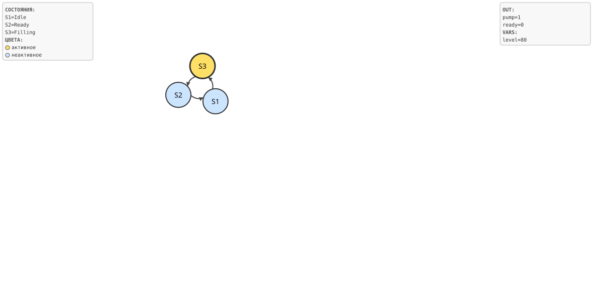

# Развёрнутый пример

Этот раздел на одном примере показывает возможности Takt в связке: **описание**
модели, **генерацию** кода под разные платформы, **симуляцию** с визуализацией,
**верификацию** темпоральных свойств и **инварианты** (guard'ы). Пример —
дозатор: наполняет ёмкость до целевого уровня, сигналит готовность и
сбрасывается.

## Модель

```takt
{{#include examples/dispenser.takt}}
```

Три состояния: `Idle` (сброс, безусловный переход в наполнение), `Filling`
(насос включён, уровень растёт до порога) и `Ready` (готовность, возврат к
началу). Строка `invariant SafeLevel = level <= TARGET;` задаёт **инвариант
безопасности** — свойство, которое обязано выполняться на каждом такте.

## Генерация кода

Одна и та же модель порождает код для любой из целей — без правок исходника:

```bash
taktc compile -t c    dispenser.takt -o out/   # прошивка МК (C)
taktc compile -t rust dispenser.takt -o out/   # no_std Rust
taktc compile -t sv   dispenser.takt -o out/   # SystemVerilog (FPGA/ASIC)
taktc compile -t plantuml dispenser.takt -o out/  # диаграмма состояний
```

```text
Скомпилировано: dispenser.takt → out/ (путей поиска: 0)
```

Фрагмент порождённого C: инвариант превращается в проверку `assert`, а такт — в
`switch` по состоянию:

```c
void Dispenser_tick(Dispenser *model) {
    assert(0 != model);
    assert(model->level <= CONST_DISPENSER_TARGET);   // ← инвариант SafeLevel
    ...
    switch (model->state) {
        case DISPENSER_FILLING: {
            model->level = model->level + CONST_DISPENSER_STEP;
            if (model->level >= CONST_DISPENSER_TARGET) {
                (*model->write_bit)(DISPENSER_PUMP, 0, model->userdata);
                (*model->write_bit)(DISPENSER_READY, 1, model->userdata);
                model->state = DISPENSER_READY;
            }
        }
        ...
    }
}
```

## Симуляция

Симулятор прогоняет модель по тактам и печатает трассу — состояние, выходы и
переменные на каждом шаге:

```bash
takt-sim dispenser.takt -n 7
```

```text
Шаг   1:  [Filling]  out:pump=1  ready=0  vars:level=0
Шаг   2:  [Filling]  out:pump=1  ready=0  vars:level=20
Шаг   3:  [Filling]  out:pump=1  ready=0  vars:level=40
Шаг   4:  [Filling]  out:pump=1  ready=0  vars:level=60
Шаг   5:  [Filling]  out:pump=1  ready=0  vars:level=80
Шаг   6:  [Ready]    out:pump=0  ready=1  vars:level=100
Шаг   7:  [Idle]     out:pump=0  ready=0  vars:level=0
```

С флагом `-o` симулятор рисует ход работы — кадр за кадром подсвечивая активное
состояние. Два кадра прогона: наполнение (шаг 3) и готовность (шаг 6):




## Верификация свойств

Свойство «автомат непременно доходит до наполнения» проверяется и **держится**:

```bash
taktc verify --property "F Filling" dispenser.takt
```

```text
СВОЙСТВО ДЕРЖИТСЯ: F Filling

Проверено свойств: 1; все держатся
```

Верификация работает над **управляющим графом** и абстрагирует условия переходов
от данных. Поэтому свойства, зависящие от значений (например, «уровень непременно
достигнет порога»), она честно отмечает как непроверенные — с контрпримером и
оговоркой:

```bash
taktc verify --property "F Ready" dispenser.takt
```

```text
СВОЙСТВО НАРУШЕНО: F Ready
  контрпример: Idle -> [ Filling ]*
  (абстракция управления: условия переходов не учитываются — контрпример может быть недостижим по данным)
```

Здесь контрпример «застрять в `Filling`» по данным недостижим (уровень растёт и
рано или поздно достигнет порога), но управляющая абстракция этого не знает.
Подробнее — в разделе «Верификация свойств».

## Инварианты (guard'ы)

Инвариант `SafeLevel = level <= TARGET` — это **guard-формула**: она обязана
выполняться на каждом такте. Симулятор проверяет её по ходу прогона и при
нарушении останавливается с диагностикой; в порождённом C она становится
`assert` (см. фрагмент выше). Так одно объявление в модели даёт и проверку при
симуляции, и защиту в целевом коде.

## Итог

Из **одного** описания на Takt получены: код под C, Rust, SystemVerilog и
диаграмма; потактовая симуляция с визуализацией; доказательство управляющего
свойства; проверяемый инвариант безопасности. Поведение модели одинаково во всех
целях и в симуляторе — оно задано семантикой языка, а не выбором платформы.
