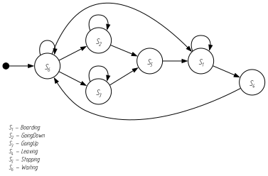
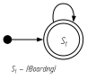
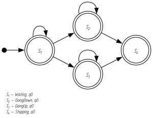

# Практический пример: групповое управление лифтами

Этот раздел на **одном** промышленном примере — управлении лифтами
многоэтажного дома — показывает возможности Takt в связке: **описание** модели,
**генерацию** кода под все платформы, **симуляцию** со сценарием входов,
**верификацию** темпоральных свойств с построением автоматов и **инварианты**
безопасности. Читатель видит, как из одной спецификации получаются прошивка,
RTL-описание, диаграмма и математическое доказательство свойств.

## Задача: групповое управление лифтами

Рассмотрим лифтовое хозяйство высотного дома. Дом разбит на **секции** по высоте:
на первом этаже стоят пять кабин; четыре из них обслуживают этажи 1–20, три
кабины подхватывают пассажиров с 20-го и идут до 40-го, а одна экспресс-кабина
ходит с 1-го до 30-го. На каждом этаже — датчик присутствия кабины и панель
вызова с индикатором: пассажир задаёт нужный этаж, а система собирает вызовы в
общую **очередь** и назначает на каждый вызов кабину так, чтобы суммарный ход был
наименьшим (система массового обслуживания). Отдельная кабина при этом обязана
соблюдать жёсткие правила безопасности: не трогаться с открытыми дверьми,
тормозить перед остановкой, выдерживать паузу на посадку.

Такая система в Takt — это **композиция**: каждая кабина описывается своим
конечным автоматом, а диспетчер секции — надстройкой, распределяющей вызовы.
Полный дом (40 этажей, пять кабин, очередь) складывается из этих частей. Ниже мы
разбираем **контроллер одной кабины** целиком — он и есть проверяемое ядро — и
показываем **диспетчер секции** отдельной функцией. Масштаб модели (число этажей)
взят небольшим, чтобы диаграммы и доказательства оставались наглядными; на язык
это не влияет — тот же текст описывает и дом на 40 этажей.

## Модель кабины

```takt
{{#include examples/lift.takt}}
```

Кабина живёт в шести состояниях. `Waiting` — покой: привод обесточен, тормоз
зажат, двери закрыты; отсюда по вызову кабина решает, что делать. `GoingUp` и
`GoingDown` — движение: каждый такт этаж меняется на единицу, а по достижении
цели кабина уходит в `Stopping`. `Stopping` — торможение: привод выключается,
тормоз зажимается. `Boarding` — посадка с открытыми дверьми и выдержкой. `Leaving`
— закрытие дверей и возврат в `Waiting`.

Связь с оборудованием — через **порты с адресами** (1): вызов приходит на входной
порт `call` по адресу `0x50000000`, а команды приводу и дверям кладутся в один
регистр `0x50000010` по отдельным битам (мотор вверх — бит 0, вниз — 1, тормоз —
2, двери — 3). Индикатор этажа — порт `display`. Часть сигналов дублируется во
**внутренних переменных** `moving` и `doors` (2): выходной порт читать нельзя (он
только для записи), а для проверки безопасности состояние привода и дверей нужно
знать. На этих переменных и стоит **инвариант** `SafeMove` (3) — «привод выключен
**или** двери закрыты», то есть кабина никогда не движется с открытыми дверьми;
это свойство проверяется на **каждом** такте.

Переходы из `Waiting` (4) разбирают вызов: `call` равен текущему этажу — сразу
`Boarding`; выше — `GoingUp`; ниже (и не ноль) — `GoingDown`. В движении тело
`always` (5) исполняется каждый такт и сдвигает `floor`, а сторожевое ребро `ref
Stopping` срабатывает по достижении цели. После торможения переход в `Boarding`
задан безусловным `next` (6) — тормоз уже отработал, ждать нечего. В `Boarding`
счётчик `dwell` (7) отмеряет время стоянки, и по достижении `DWELL` кабина
закрывает двери.

## Диспетчеризация секции

Над кабинами стоит диспетчер: он знает позиции кабин секции и на новый вызов
назначает **ближайшую**, минимизируя ход. Выбор выражается обычными функциями:

```takt
{{#include examples/dispatch.takt}}
```

Функция `dist` считает расстояние между этажами, а `pick` перебирает кабины и
возвращает номер той, чья дистанция до вызова наименьшая (демонстрация
**композиции функций** — `pick` опирается на `dist`). В полном доме диспетчер
секции держит вызовы в массивах `[bit; N]` (по биту на этаж), подмешивает
направление движения кабины и её загрузку, но принцип тот же — стоимость и выбор
минимума. Здесь кабин три; для секции из четырёх достаточно ещё одного сравнения.

## Генерация кода

Одна и та же модель кабины порождает код для любой цели — **без правок
исходника**:

```bash
taktc compile -t c      lift.takt -o out/   # прошивка МК (C + HAL-колбэки)
taktc compile -t c-hal  lift.takt -o out/   # прошивка с прямым доступом к регистрам
taktc compile -t rust   lift.takt -o out/   # no_std Rust
taktc compile -t st     lift.takt -o out/   # ПЛК (Structured Text, IEC 61131-3)
taktc compile -t sv     lift.takt -o out/   # SystemVerilog (FPGA/ASIC)
taktc compile -t plantuml lift.takt -o out/ # диаграмма состояний
```

Такт модели превращается в шаг целевого кода, а инвариант — в проверку. Фрагмент
порождённого **C**: тело `_tick` начинается с `assert` инварианта `SafeMove`, а
дальше идёт `switch` по состоянию с записью в порты через HAL-колбэки:

```c
void Lift_tick(Lift *model) {
    assert(0 != model);
    assert(model->moving == 0 || model->doors == 0);   // ← инвариант SafeMove
    ...
    switch (model->state) {
        case LIFT_GOING_UP: {
            model->floor = model->floor + 1;
            (*model->write_numeric)(LIFT_DISPLAY, model->floor, model->userdata);
            if (model->floor >= (*model->read_numeric)(LIFT_CALL, model->userdata)) {
                model->moving = 0;
                (*model->write_bit)(LIFT_BRAKE, 1, model->userdata);
                model->state = LIFT_STOPPING;
                break;
            }
            break;
        }
        ...
    }
}
```

Та же модель на цель **SystemVerilog** становится синтезируемым автоматом: такт —
это фронт `clk`, а защёлкивание состояния идёт в `always_ff` (сброс — синхронный,
служебный `en` разрешает шаг):

```systemverilog
always_ff @(posedge clk) begin
    if (!rst_n) begin
        state <= LIFT_WAITING;
        lift_floor <= 1;
        ...
    end else if (en) begin
        state <= state_next;
        lift_floor <= lift_floor_next;
        ...
    end
end
```

Полный порождённый код для **всех** целей приведён в приложении
[«Порождённый код примера»](../appendix-generated/index.md); здесь — лишь
показательные фрагменты, поясняющие принцип трансляции.

## Симуляция

Прежде прошивки поведение модели проверяют симулятором. Сценарий входов задаётся
JSON-файлом — на каждом такте значения входных портов (здесь единственный вход
`call`):

```json
{{#include examples/lift-sim.json}}
```

Прогон печатает трассу — состояние, выходы и переменные на каждом шаге (ниже
показаны ключевые столбцы):

```bash
takt-sim lift.takt -s lift-sim.json -n 7
```

```text
Шаг 1: [GoingUp]   call=3  motor_up=1 brake=0 display=1   floor=1 moving=1
Шаг 2: [GoingUp]   call=3  motor_up=1 brake=0 display=2   floor=2 moving=1
Шаг 3: [Stopping]  call=3  motor_up=0 brake=1 display=3   floor=3 moving=0
Шаг 4: [Boarding]  call=3  doors_open=1        display=3   doors=1 dwell=0
Шаг 5: [Boarding]  call=3  doors_open=1        display=3   doors=1 dwell=1
Шаг 6: [Leaving]   call=0  doors_open=0        display=3   doors=0 dwell=2
Шаг 7: [Waiting]   call=0  brake=1             display=3   floor=3
```

Вызван 3-й этаж — кабина трогается вверх (шаги 1–2, `display` следит за этажом),
на 3-м тормозит (шаг 3), открывает двери и держит паузу (`Boarding`, шаги 4–5),
затем закрывает двери (`Leaving`, шаг 6) и возвращается в покой (шаг 7). Ни на
одном шаге `moving` и `doors` не равны единице одновременно — инвариант держится.

## Верификация свойств

Симуляция проверяет **один** сценарий; верификация доказывает свойство для **всех**
прогонов сразу. Takt строит по модели структуру **Крипке** — граф управления, где
вершины суть состояния, а рёбра — переходы:



Проверим свойство «кабина непременно доходит до посадки» — `F Boarding`. Метод
такой: свойство **отрицают** и строят по отрицанию автомат **Бюхи**, язык которого
— все прогоны, **нарушающие** свойство. Для `F Boarding` отрицание есть
`G !Boarding` — «никогда не заходить в Boarding»; ему отвечает автомат с одним
принимающим состоянием и петлёй по `!Boarding`:



Затем строят **произведение** структуры Крипке и автомата: его принимающий цикл —
это прогон модели, который свойство нарушает. Такой цикл находится:



```bash
taktc verify --property "F Boarding" lift.takt
```

```text
СВОЙСТВО НАРУШЕНО: F Boarding
  контрпример: Waiting -> [ GoingDown ]*
  (абстракция управления: условия переходов не учитываются — контрпример может быть недостижим по данным)
```

Контрпример — «уехать вниз и не вернуться». Он существует **в абстракции**:
верификация работает над графом управления и **не учитывает данные** (условия
переходов), поэтому не знает, что этаж убывает и рано или поздно достигнет цели.
По данным этот прогон недостижим — потому и оговорка. Это осознанный компромисс:
«держится» надёжно, а «нарушено» может оказаться ложной тревогой.

Свойства, доказуемые в самой абстракции, проверяются надёжно. Например, «после
торможения кабина непременно откроет двери» — `G (Stopping -> F Boarding)` —
держится (из `Stopping` ведёт безусловный `next Boarding`):

```bash
taktc verify --property "G (Stopping -> F Boarding)" lift.takt
```

```text
СВОЙСТВО ДЕРЖИТСЯ: G (Stopping -> F Boarding)
```

Диаграммы Крипке и автомата Бюхи выше — не рисунки от руки, а вывод самого
компилятора (`taktc verify --emit-graph …`), поэтому они всегда соответствуют
проверяемой модели.

## Инварианты (guard'ы)

Инвариант `SafeMove` — это **guard-формула**: она обязана выполняться на каждом
такте. Симулятор проверяет её по ходу прогона и при нарушении останавливается с
диагностикой; в порождённом C она становится `assert` (см. фрагмент выше). Так
**одно** объявление в модели даёт и проверку при симуляции, и защиту в целевом
коде — правило безопасности «не двигаться с открытыми дверьми» записано один раз.

## Итог

Из **одного** описания кабины на Takt получены: код под C, C-HAL, Rust,
SystemVerilog и Structured Text, а также диаграмма; потактовая симуляция по
сценарию входов; доказательство управляющего свойства с построением автоматов;
проверяемый инвариант безопасности. Диспетчер секции выражен обычными функциями,
а полный дом складывается композицией кабин. Поведение модели одинаково во всех
целях и в симуляторе — оно задано семантикой языка, а не выбором платформы.
