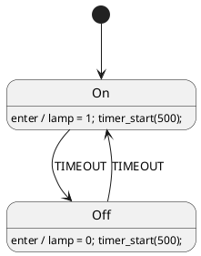

# DIFF.md — сравнительный анализ языка Takt с родственными языками

> Отчёт системного аналитика. Фича [0126](features/0126-language-comparison-diff.md).
> **Дата среза данных: 2026-07-27.** Все сведения о версиях, релизах и активности
> приведены на эту дату; источники перечислены в разделе 12.
>
> Документ отвечает на четыре вопроса заказчика: **что представляют собой
> родственные языки**, **чем от них отличается Takt**, **где Takt применим и кому
> он нужен**, **чего в нём нет из того, что у других есть и активно
> используется**.

---

## Содержание

1. [Резюме для руководства](#1-резюме-для-руководства)
2. [Методика сравнения](#2-методика-сравнения)
3. [Карточка языка Takt](#3-карточка-языка-takt)
4. [Семейство A. Синхронные языки реактивного управления](#4-семейство-a-синхронные-языки-реактивного-управления)
5. [Семейство B. Автоматные DSL и генераторы кода](#5-семейство-b-автоматные-dsl-и-генераторы-кода)
6. [Семейство C. Промышленные стандарты программирования контроллеров](#6-семейство-c-промышленные-стандарты-программирования-контроллеров)
7. [Семейство D. Языки формальной верификации](#7-семейство-d-языки-формальной-верификации)
8. [Семейство E. Языки описания и синтеза аппаратуры](#8-семейство-e-языки-описания-и-синтеза-аппаратуры)
9. [Индекс TIOBE и что он показывает для этой ниши](#9-индекс-tiobe-и-что-он-показывает-для-этой-ниши)
10. [Сводные таблицы сравнения](#10-сводные-таблицы-сравнения)
11. [Выводы](#11-выводы)
12. [Источники](#12-источники)

---

## 1. Резюме для руководства

**Ниша Takt существует и не занята целиком ни одним из рассмотренных языков.**
Уникальность Takt — в **пересечении трёх миров**, которые обычно разделены:

| Мир | Кто там живёт | Что Takt берёт оттуда |
|---|---|---|
| Промышленная автоматизация | IEC 61131-3 (ST/LD/SFC), IEC 61499, CODESYS | цели `st`/`st-at`, ориентация на ПЛК, порты и адреса |
| Встраиваемое ПО | SCADE, Stateflow, QP/QM, StateSmith | цели `c`/`c-hal`/`rust` (`no_std`), потактовая модель |
| Аппаратура | SystemVerilog, Chisel, SpinalHDL, Amaranth | цели `sv`/`sv-mmio`, синтезируемый RTL |

Из рассмотренных языков **тот же охват целей даёт ровно один** — **Stateflow**
(C/C++ для микроконтроллера, VHDL/Verilog для ПЛИС, Structured Text для ПЛК). Но
он **проприетарен и дорог** (лицензии MATLAB + Simulink + Stateflow + Embedded
Coder + HDL Coder + PLC Coder), требует графического ввода и не порождает Rust.
Среди **открытых** языков сопоставимого охвата **нет ни одного**: открытые
генераторы автоматов (StateSmith, SMC, itemis CREATE в свободной редакции) не
выходят за пределы языков общего назначения — ни ST, ни HDL они не дают.
Второй по близости — **SCADE Suite**: он сильнее Takt по
сертификации (KCG квалифицирован для DO-178C TQL-1, ISO 26262 ASIL D, IEC 61508
SIL 3, EN 50128 SIL 3/4), но не порождает ни RTL, ни Structured Text.

**Главные преимущества Takt относительно поля:**

1. **Восемь целей из одного источника** с машинно проверяемой **потактовой
   эквивалентностью** цели и эталона-симулятора (`conformance_*`). У подавляющего
   большинства конкурентов генератор — «чёрный ящик, которому доверяют».
2. **Верификация LTL встроена в компилятор** (`taktc verify`), а не продаётся
   отдельным продуктом (у SCADE — Design Verifier, у Simulink — Design Verifier,
   оба платные и отдельные).
3. **Детерминированная кодогенерация** с гейтом воспроизводимости — редкость даже
   среди коммерческих генераторов.
4. **Fixed-point `q(m, n)` с побитово единой семантикой во всех целях** —
   редкость даже там, где fixed-point есть.
5. **Открытая лицензия MIT** против платных SCADE/Stateflow/итераций CODESYS.

**Главные пробелы Takt относительно поля** (детально — раздел 11.3):

1. **Нет модели времени.** У UPPAAL — временные автоматы, у IEC 61131-3 — блоки
   `TON`/`TOF`, у SCADE/Stateflow — `after(n, sec)`. У Takt время считают
   вручную тактами, что правило 27(е) свода прямо признаёт костылём.
2. **Нет сертификации кодогенератора.** Для авиации/железной дороги/атомной
   отрасли это отсекающий фактор: там нельзя применить неквалифицированный
   генератор, каким бы он ни был качественным.
3. **Нет графического ввода и диаграммного редактирования.** Отраслевой
   пользователь (инженер АСУ ТП) ожидает диаграмму, а не текст.
4. **Иерархия состояний беднее статчартов Харела** — нет истории (`H`/`H*`),
   нет наследования переходов от родителя, нет событий с очередью.
5. **Верификация данных — сверх-аппроксимация**, доказывать свойства над
   переменными Takt практически не умеет (nuXmv/SCADE DV/UPPAAL — умеют).
6. **Нет генерации тестов и метрик покрытия модели** (MC/DC), обязательных в
   сертифицируемых процессах.

---

## 2. Методика сравнения

### 2.1 Как отбирались языки

Takt — язык **спецификации и синтеза конечных автоматов промышленных систем
управления**. Родственным считается язык, у которого совпадает **хотя бы два** из
трёх признаков:

- **предмет** — конечный автомат / реактивная система управления;
- **способ применения** — описание не исполняется само, а **транслируется** в
  целевую платформу (или проверяется формально);
- **область** — промышленная автоматика, встраиваемые системы, аппаратура.

По этому фильтру отобрано **26 языков и инструментов**, разбитых на пять
семейств. Языки общего назначения (C, Rust, Python) в сравнение **не входят** —
они цели генерации, а не конкуренты.

### 2.2 Единая карточка языка

Чтобы языки можно было сравнивать **визуально, а не на слух**, каждый из
26 описан по **одному и тому же набору из 17 полей** — тому же, по которому
описан сам Takt (раздел 3):

| Поле | Что в нём |
|---|---|
| Назначение | какую задачу язык решает |
| Историческая справка | кто, когда и зачем создал; как развивался |
| Состав поставки | из чего состоит инструментарий (компилятор, среда, рантайм, библиотеки) |
| Парадигма | модель вычислений |
| Форма записи | текст / графика / XML / встраиваемый DSL |
| Система типов | какие типы данных доступны |
| Модель времени | как выражается длительность и тайм-аут |
| Композиция и иерархия | вложенность, параллелизм, история состояний |
| Верификация | что доказывается и чем |
| Целевые платформы | во что транслируется |
| Симуляция и отладка | чем проверяется поведение до железа |
| Применение | где реально используется |
| Сертификация | квалификация для критичных отраслей |
| Лицензия | условия использования |
| Активность | последняя версия и дата (срез 2026-07-27) |
| Пример | **одна и та же задача на всех языках** (см. 2.3) |
| Отличие от Takt | что сильнее, что слабее |

### 2.3 Сквозной пример: проблесковый маячок

Все примеры в разделах 3–8 решают **одну задачу**, чтобы синтаксис языков можно
было сопоставить построчно:

> **Проблесковый маячок.** Два состояния — `On` и `Off`. В `On` лампа горит и
> держится заданную выдержку, затем автомат переходит в `Off`, где лампа гаснет
> на такую же выдержку, и цикл повторяется.

Задача выбрана намеренно: она **минимальна**, но задействует всё, что отличает
языки друг от друга, — состояния, действия при входе, **измерение времени**
(именно здесь виден разрыв между языками с таймерами и языками со счётом тактов)
и условие перехода.

Примеры **иллюстративны**: они показывают форму записи и идиому языка, а не
являются готовыми к компиляции проектами (у графических инструментов показана
текстовая часть модели — код действий, объявления, аннотации переходов).

### 2.4 Оговорка о достоверности

Сведения об активности собраны из открытых источников (раздел 12) и отражают
**публично объявленное** состояние. Для закрытых коммерческих продуктов (SCADE,
Stateflow, CODESYS) внутренние детали недоступны, поэтому сравнение ведётся по
документированному поведению. Где данные неполны, это **указано явно** —
домысливание в отчёте не допускается.

---

## 3. Карточка языка Takt

- **Назначение.** Спецификация конечных автоматов промышленных систем управления
  и **синтез** из одного описания исполнимого кода для трёх классов целевых
  платформ: контроллеров (ПЛК), микроконтроллеров и программируемой логики.
- **Историческая справка.** Развивается по строгому жизненному циклу фич (более
  120 закрытых фич на дату среза, каждая с карточкой, ADR, анализом, тест-планом
  и отчётом). Язык дважды переименовывался (BuT → Lam → Takt, июль 2026). Версия
  языка — **0.5.0**; крейты `takt-lang` 0.11.0, `takt-sim` 0.6.0.
- **Состав поставки.** `taktc` (компилятор: `compile`, `fmt`, `verify`,
  `address-map`) · `takt-lsp` (языковой сервер) · `takt-sim` (симулятор с
  GIF/SVG-визуализацией) · `book/` (документ описания языка, mdBook → PDF,
  17 разделов) · плагины IntelliJ и Zed · `scripts/precheck.sh` (15+ машинных
  гейтов).
- **Парадигма.** Гибридная: **декларативное** описание автомата (состояния,
  рёбра `ref`/`next`, условия) плюс **императивные** блоки
  (`enter`/`exit`/`always`) и функции. Модель исполнения — **синхронная**: такт =
  один шаг логики, порядок внутри такта нормирован.
- **Форма записи.** Текст (собственный синтаксис), канонический форматтер.
- **Система типов.** `bit`, `bool`, целые `u8…u64`/`i8…i32`, упакованные векторы
  `[bit;N]`, массивы `[T;N]`, структуры, перечисления, **fixed-point `q(m, n)`**,
  прозрачный `float` (нативный либо понижаемый в q флагами генерации). Приведения
  `q ↔ int ↔ float` — только явные.
- **Модель времени.** **Отсутствует.** Время моделируется счётчиком тактов
  вручную; частота указывается комментарием (требование правила свода).
- **Композиция и иерархия.** `M1 | M2` — параллельная, `M1 + M2` —
  последовательная, вложенные модели, импорт файлов. **Истории состояний и
  наследования переходов нет.**
- **Верификация.** Встроена в компилятор: LTL (`G`, `F`, `X`, `U`, `R`) через
  автомат Бюхи (GPVW) + произведение со структурой Крипке + вложенный DFS;
  инварианты (`invariant`) и Guard-формулы проверяются потактово; экспорт графов
  в Graphviz.
- **Целевые платформы.** `c`, `c-hal`, `st`, `st-at` (IEC 61131-3), `rust`
  (`no_std`), `sv` (синтезируемый SystemVerilog), `sv-mmio`, `plantuml`.
- **Симуляция и отладка.** Потактовый симулятор, сценарии JSON,
  сохранение/загрузка состояния, GIF/SVG-визуализация; **потактовая сверка
  порождённого кода с симулятором** (`conformance_{c,rust,st,sv}`).
- **Применение.** Собственная разработка; промышленных внедрений на дату среза
  не зафиксировано.
- **Сертификация.** Нет.
- **Лицензия.** **MIT** (открытая).
- **Активность (на 2026-07-27).** Активная разработка одним автором; последняя
  закрытая фича — плагин IntelliJ (2026-07-27); 2176 тестов; CI на GitHub
  Actions.

**Пример: проблесковый маячок**

```takt
const ON_TICKS:  u8 := 2;    // выдержка фазы В ТАКТАХ (напр. ≈0.5 с при 4 Гц)
const OFF_TICKS: u8 := 2;
out lamp: bit;
var t: u8 := 0;

start On {
    enter  { lamp := 1; t := 0; }
    always { t := t + 1; }
    ref Off: t >= ON_TICKS;
}

state Off {
    enter  { lamp := 0; t := 0; }
    always { t := t + 1; }
    ref On: t >= OFF_TICKS;
}
```

- **Слабые места (сводно).** Нет модели времени; генератор не сертифицирован; нет
  графического ввода; иерархия беднее статчартов; верификация данных
  сверх-аппроксимативна; нет покрытия модели и генерации тестов; нет стандартной
  библиотеки и реестра пакетов; нет сообщества.

---

## 4. Семейство A. Синхронные языки реактивного управления

Ближайшие **идейные** родственники Takt: та же гипотеза синхронности («реакция
мгновенна относительно среды»), та же цель — детерминированное управление.

### 4.1 Esterel

- **Назначение.** Императивный синхронный язык программирования реактивных
  систем: параллельные потоки, сигналы, прерывания, ожидание событий.
- **Историческая справка.** Родился в 1983 году; разработан командой École des
  Mines de Paris и INRIA под руководством **Жерара Берри**. Версия v5 —
  академическая, **v7** — промышленная эволюция, ориентированная на синтез
  аппаратуры.
- **Состав поставки.** Компилятор (Esterel → C или RTL) · среда Esterel Studio
  (снята с продажи) · верификатор на основе булевых схем · библиотека времени
  исполнения.
- **Парадигма.** Императивная синхронная; ключевая идея — **конструктивная
  семантика**, строго определяющая одновременность и разрешающая причинные циклы.
- **Форма записи.** Текст.
- **Система типов.** Базовые скалярные типы + **сигналы** (чистые и значимые) как
  первоклассная сущность; сложные типы импортируются из host-языка (C).
- **Модель времени.** Логическое время в «мгновениях» (instants); физическое
  время моделируется внешним сигналом-тиком (`await 100 tick`).
- **Композиция и иерархия.** Вложенный параллелизм `||`, прерывания
  (`abort … when`), циклы `every`, обработка исключений `trap` — самая богатая
  структура управления в семействе.
- **Верификация.** Сильная: программа переводится в булеву схему, проверяется
  model checking’ом (в поставке Esterel Studio был верификатор).
- **Целевые платформы.** C, синтезируемый RTL (Esterel v7).
- **Симуляция и отладка.** Симулятор в составе Esterel Studio (недоступен).
- **Применение.** Авионика, ядерная энергетика, микросхемы (контроллеры в
  Texas Instruments, Intel).
- **Сертификация.** Отдельной квалификации генератора не заявлено.
- **Лицензия.** Академические компиляторы v5 — открыты; v7 — закрытый продукт.
- **Активность (на 2026-07-27).** Как **продукт** — прекращена (Esterel Studio не
  развивается); как **предмет исследований** — жива: в 2025 году опубликована
  работа о верификации цепочки семантик Esterel в Coq.

**Пример: проблесковый маячок**

```esterel
module Blinker:
input TICK;
output LAMP : boolean;
loop
    emit LAMP(true);
    await 2 TICK;          % выдержка — в тиках внешнего сигнала
    emit LAMP(false);
    await 2 TICK
end loop
end module
```

- **Отличие от Takt.** Esterel мощнее по выразительности управления (прерывания,
  вложенный параллелизм, сигналы), но **не даёт кода для ПЛК**, а его
  промышленный инструментарий мёртв. Takt проще, но живее и покрывает три
  платформы. Идею конструктивной семантики Takt не использует — у него нет
  мгновенных сигналов, только переменные и порты.

### 4.2 Lustre и SCADE Suite (язык Scade 6)

- **Назначение.** Декларативный **потоковый** (dataflow) синхронный язык: система
  описывается уравнениями над бесконечными потоками значений.
- **Историческая справка.** Lustre создан в лаборатории VERIMAG (Гренобль) Полем
  Каспи и Николя Альбваксом в 1980-х. На его основе построен коммерческий
  **SCADE**, применяемый в критичных отраслях более двадцати лет; текущий язык —
  **Scade 6**, продукт принадлежит **Ansys**. Новое поколение — **Scade One** с
  языком **Swan**.
- **Состав поставки.** SCADE Suite (графический и текстовый редактор) · **KCG**
  (генератор C и Ada) · SCADE Test · SCADE Design Verifier (формальная проверка) ·
  интеграции с DOORS, Simulink, AUTOSAR · симулятор.
- **Парадигма.** Синхронный dataflow + **безопасные автоматы состояний** (Scade 6
  объединил уравнения Lustre с иерархическими автоматами).
- **Форма записи.** Графика и эквивалентный текст (двунаправленно).
- **Система типов.** Строгая: скаляры, перечисления, массивы, структуры,
  **размеченные объединения** (добавлены в Swan в 2026 R1), полиморфные узлы.
- **Модель времени.** Такт = период цикла; время выражается счётчиками с **явно
  заданным периодом**, а также операторами задержки (`pre`, `fby`); физические
  единицы приходят из периода задачи.
- **Композиция и иерархия.** Иерархические узлы, автоматы с вложенными
  состояниями, история состояний, `when`/`merge` для тактовых доменов
  (multirate).
- **Верификация.** SCADE Design Verifier — доказательство свойств (наблюдатели,
  инварианты) на модели; отдельный платный компонент.
- **Целевые платформы.** **C и Ada**.
- **Симуляция и отладка.** Симулятор моделей, SCADE Test, отладка на цели.
- **Применение.** Авионика (Airbus A380/A400M), железные дороги, атомная
  энергетика, автомобилестроение.
- **Сертификация.** **Главное преимущество:** KCG **квалифицирован** как
  инструмент разработки для DO-178B уровня A и DO-178C/DO-330 на TQL-1,
  сертифицирован для IEC 61508 SIL 3 и EN 50128 SIL 3/4, квалифицирован для
  ISO 26262 до ASIL D. Практический смысл — **сгенерированный код можно не
  верифицировать заново**.
- **Лицензия.** Коммерческая, дорогая.
- **Активность (на 2026-07-27).** Высокая: выпуск **2026 R1** — подмодели,
  трассируемость требований в модели, импорт Simulink/Stateflow, интеграция
  SysML v2, поддержка AUTOSAR, C99-совместимый вывод, новые конструкции Swan.

**Пример: проблесковый маячок**

```scade
node Blinker (tick: bool) returns (lamp: bool)
var t: int;
let
    t = 0 -> (if pre t >= 2 then 0 else pre t + 1);
    automaton
        initial state On
            let lamp = true; tel
            until if t >= 2 restart Off;
        state Off
            let lamp = false; tel
            until if t >= 2 restart On;
    returns lamp;
tel
```

- **Отличие от Takt.** SCADE — прямой «старший брат» по нише и **основной
  ориентир качества**. Сильнее в сертификации, зрелости, тестировании,
  трассируемости требований, графическом вводе, поддержке. Takt сильнее в
  открытости и цене (MIT против дорогой лицензии), охвате целей (SCADE не даёт ни
  RTL, ни Structured Text) и прозрачности конвейера.

### 4.3 SIGNAL / Polychrony

- **Назначение.** Синхронный **полихронный** язык: в отличие от Lustre, где такт
  один, SIGNAL допускает **множество независимых часов** и выводит их отношения
  (clock calculus).
- **Историческая справка.** INRIA/IRISA (Ренн), с середины 1980-х; инструмент —
  открытая среда Polychrony; подход GALS (globally asynchronous, locally
  synchronous).
- **Состав поставки.** Компилятор SIGNAL · среда Polychrony (Eclipse) ·
  генератор C/Java · формальные анализаторы часов.
- **Парадигма.** Реляционный синхронный dataflow: программа — система уравнений
  над сигналами с частично определёнными часами.
- **Форма записи.** Текст (+ графический редактор в Polychrony).
- **Система типов.** Скаляры, массивы, кортежи; **типы дополняются «часами»**
  сигнала — центральное понятие языка.
- **Модель времени.** Логическое время, **несколько тактовых доменов**;
  соотношения часов выводятся компилятором и проверяются на непротиворечивость.
- **Композиция и иерархия.** Композиция процессов оператором `|`; иерархия
  процессов; распределение по узлам.
- **Верификация.** Формальный анализ часов + внешние проверщики (SIGALI).
- **Целевые платформы.** C, Java, распределённый код.
- **Симуляция и отладка.** Средства Polychrony.
- **Применение.** Академические и оборонные проекты, распределённые
  встраиваемые системы.
- **Сертификация.** Нет.
- **Лицензия.** Открытая (исследовательская).
- **Активность (на 2026-07-27).** Низкая: исследовательский инструмент,
  промышленной поддержки нет.

**Пример: проблесковый маячок**

```signal
process Blinker =
  ( ? event tick ! boolean lamp )
  (| t     := (0 when reset) default ((t$1 init 0) + 1) when tick
   | reset := when ((t$1 init 0) >= 2)
   | lamp  := (not (lamp$1 init false)) when reset
              default (lamp$1 init false)
   |)
where integer t; event reset;
end;
% каждый сигнал имеет СВОИ часы; компилятор выводит их соотношения
```

- **Отличие от Takt.** SIGNAL решает задачу, которой у Takt нет вовсе —
  **несколько тактовых доменов**. Для реальной системы управления (быстрый контур
  регулирования + медленный контур логики) это существенно; у Takt такт один на
  всю модель.

### 4.4 Céu

- **Назначение.** Синхронный язык для встраиваемых систем мягкого реального
  времени: «структурированное синхронное реактивное программирование».
- **Историческая справка.** Разработан в PUC-Rio (Бразилия); работы
  публиковались в ACM TECS и Science of Computer Programming.
- **Состав поставки.** Компилятор Céu → C · рантайм · привязки к Arduino и
  игровым библиотекам.
- **Парадигма.** Структурная синхронная: линии исполнения, ожидание событий,
  параллельные композиции `par/and`, `par/or`.
- **Форма записи.** Текст (синтаксис в духе Lua).
- **Система типов.** Скалярные типы C + собственные события; **статическое
  управление памятью по лексической области, без сборщика мусора**.
- **Модель времени.** **Есть встроенное физическое время**: `await 1s`,
  `await 500ms` — язык знает единицы времени, а рантайм отсчитывает их по
  системному таймеру.
- **Композиция и иерархия.** Вложенные параллельные линии, прерывание по событию,
  доказанные **ограниченность памяти и завершаемость реакции**.
- **Верификация.** Статические гарантии компилятора (память, терминируемость);
  model checking’а в поставке нет.
- **Целевые платформы.** C (и через него — микроконтроллеры).
- **Симуляция и отладка.** Отладочный рантайм, трассировка.
- **Применение.** Исследовательские и учебные проекты, датчиковые сети,
  Arduino-проекты; промышленных внедрений не обнаружено.
- **Сертификация.** Нет.
- **Лицензия.** Открытая.
- **Активность (на 2026-07-27).** **Остановлена**: стабильный выпуск v0.30 от
  марта 2018 года.

**Пример: проблесковый маячок**

```ceu
output high/low LED;
loop do
    emit LED(high);
    await 500ms;          // время — в физических единицах, а не в тактах
    emit LED(low);
    await 500ms;
end
```

- **Отличие от Takt.** Céu — про **параллельные линии исполнения** внутри одного
  устройства (близко к Esterel), а не про синтез в разные платформы. Но в одном
  месте он прямо сильнее Takt: **время в языке выражено в физических единицах**
  (`await 500ms`), а не счётом тактов.

---

## 5. Семейство B. Автоматные DSL и генераторы кода

Прямые функциональные конкуренты: «опиши автомат — получи код».

### 5.1 SCXML (W3C State Chart XML)

- **Назначение.** Стандартная **нотация** статчартов Харела в виде XML — формат
  обмена и исполнения, а не язык программирования.
- **Историческая справка.** Работа начата рабочей группой W3C Voice Browser в
  2005 году; **статус W3C Recommendation получен в 2015 году**.
- **Состав поставки.** Спецификация (синтаксис + алгоритм интерпретации) · модель
  данных (ECMAScript, XPath) · набор тестов соответствия; реализации сторонние
  (Apache Commons SCXML, uscxml, Qt SCXML).
- **Парадигма.** Событийно-управляемые иерархические статчарты: микрошаги и
  макрошаги, внутренняя очередь событий.
- **Форма записи.** XML.
- **Система типов.** Собственных типов нет — данные живут в модели данных
  (ECMAScript/XPath).
- **Модель времени.** Через элемент `<send delay="500ms">` — отложенное событие
  самому себе; **единицы физические**.
- **Композиция и иерархия.** Полный набор статчартов: составные состояния,
  ортогональные регионы `<parallel>`, **история** `<history type="deep">`,
  `onentry`/`onexit`, внутренние переходы.
- **Верификация.** В стандарте нет; сторонние инструменты переводят SCXML в
  Promela/NuSMV.
- **Целевые платформы.** Определяются реализацией (интерпретация; генераторы
  сторонние).
- **Симуляция и отладка.** В реализациях.
- **Применение.** Голосовые диалоговые системы, мультимодальные интерфейсы, HMI;
  формат обмена между инструментами.
- **Сертификация.** Нет.
- **Лицензия.** Открытый стандарт W3C.
- **Активность (на 2026-07-27).** Спецификация стабильна и не развивается
  (Recommendation 2015); реализации живы.

**Пример: проблесковый маячок**

```xml
<scxml initial="on" datamodel="ecmascript">
  <state id="on">
    <onentry>
      <assign location="lamp" expr="1"/>
      <send id="w" event="timeout" delay="500ms"/>
    </onentry>
    <transition event="timeout" target="off"/>
  </state>
  <state id="off">
    <onentry>
      <assign location="lamp" expr="0"/>
      <send id="w" event="timeout" delay="500ms"/>
    </onentry>
    <transition event="timeout" target="on"/>
  </state>
</scxml>
```

- **Отличие от Takt.** SCXML богаче по **структуре автомата** (история,
  ортогональные регионы, очередь событий) и знает физическое время, но **не
  синтезирует** код для ПЛК/МК/ПЛИС и не имеет верификации. Для Takt SCXML —
  источник требований к иерархии и **возможная точка входа в чужую экосистему**
  (импорт).

### 5.2 itemis CREATE (ранее YAKINDU Statechart Tools)

- **Назначение.** Промышленный инструмент разработки реактивных систем на
  статчартах: графическое редактирование, валидация, симуляция, генерация кода.
- **Историческая справка.** Разработка компании itemis (Германия) на платформе
  Eclipse; переименован из YAKINDU SCT в itemis CREATE.
- **Состав поставки.** Графический редактор · текстовый язык интерфейса и
  действий · валидатор · симулятор · генераторы кода · интеграция с Eclipse и
  системами сборки.
- **Парадигма.** Статчарты Харела, событийно-управляемые.
- **Форма записи.** Графика + встроенный текстовый DSL (интерфейсы, охраны,
  действия).
- **Система типов.** `boolean`, `integer`, `real`, `string`, перечисления,
  пользовательские типы через host-язык.
- **Модель времени.** **Есть:** события по времени `after 500 ms`, `every 1 s` —
  транслируются в таймерную службу целевой платформы.
- **Композиция и иерархия.** Составные состояния, ортогональные регионы,
  история, внутренние переходы, приоритеты переходов.
- **Верификация.** **Нет формальной проверки** — только валидация модели
  (недостижимые состояния, конфликты) и симуляция.
- **Целевые платформы.** Стабильные генераторы **C, C++, Java, Python**; C#
  доведён до полноты в версии 5.4.0; заявлена пригодность для bare-metal.
- **Симуляция и отладка.** Интерактивная симуляция с подсветкой активных
  состояний.
- **Применение.** Автомобилестроение, медтехника, промышленное оборудование.
- **Сертификация.** Отдельной квалификации генератора не заявлено.
- **Лицензия.** Коммерческая (есть бесплатная редакция).
- **Активность (на 2026-07-27).** Продукт поддерживается; актуальная линейка 5.4.x.

**Пример: проблесковый маячок**

```
interface:
    out var lamp: integer

// состояния и переходы задаются графически; текстовая часть модели:
state On
    entry / lamp = 1
    // переход: after 500 ms -> Off

state Off
    entry / lamp = 0
    // переход: after 500 ms -> On
```

- **Отличие от Takt.** Сильные стороны — графика, зрелость, интеграции, **время
  в физических единицах**. Слабые относительно Takt — нет генерации в ST, HDL и
  Rust, **нет формальной верификации**, проприетарность.

### 5.3 StateSmith

- **Назначение.** Свободный генератор кода конечных автоматов из диаграмм
  (draw.io/PlantUML) и текстового описания.
- **Историческая справка.** Проект Adam Fraser-Kruck; ориентирован на
  bare-metal-разработчиков, активно развивается последние годы.
- **Состав поставки.** Кроссплатформенный инструмент (.NET) · генераторы кода ·
  интеграция с draw.io и PlantUML · примеры и шаблоны проектов.
- **Парадигма.** Иерархические автоматы (подмножество статчартов), генерация
  «человекочитаемого» кода.
- **Форма записи.** Диаграмма (draw.io/PlantUML) с текстовыми метками, где
  действия пишутся на **целевом языке**.
- **Система типов.** Собственных типов нет — переменные и выражения на целевом
  языке.
- **Модель времени.** **Нет своей**: время выражается вызовами пользовательского
  кода (`after_ms(500)` — функция, которую пишет разработчик).
- **Композиция и иерархия.** Вложенные состояния, история, `entry`/`exit`,
  внутренние переходы.
- **Верификация.** Нет.
- **Целевые платформы.** **C, C++, C#, Java, Python, JavaScript, TypeScript.**
- **Симуляция и отладка.** Генерация интерактивной веб-симуляции модели.
- **Применение.** Встраиваемые устройства, игры, приложения.
- **Сертификация.** Нет.
- **Лицензия.** Открытая.
- **Активность (на 2026-07-27).** **Высокая:** непрерывные выпуски, кодовая база
  на .NET 9, свежие возможности (настройка `extern "C"` для C99, вывод имени
  автомата из имени файла PlantUML). Код **без зависимостей и динамической
  памяти**; экземпляр автомата — один байт ОЗУ.

**Пример: проблесковый маячок**



- **Отличие от Takt.** Ближайший **открытый** конкурент по духу («один источник →
  много языков»), но: нет ST, нет HDL, нет fixed-point, **нет верификации**, нет
  потактовой сверки поведения. Зато есть то, чего нет у Takt: **вход из
  диаграммы** и семь целевых языков общего назначения.

### 5.4 SMC (State Machine Compiler)

- **Назначение.** Генератор реализации паттерна State из текстового описания
  автомата — разгрузить прикладной код от `switch`-ов.
- **Историческая справка.** Проект на SourceForge, ведётся с начала 2000-х;
  актуальная ветка — 7.4.0.
- **Состав поставки.** Компилятор `smc.jar` · библиотеки времени исполнения для
  целевых языков · генератор диаграмм (GraphViz).
- **Парадигма.** Плоские и вложенные (через «карты») автоматы, объектный подход.
- **Форма записи.** Текст (`.sm`-файл с секциями `%class`, `%map`).
- **Система типов.** Своих нет — контекст и переменные на целевом языке.
- **Модель времени.** Нет.
- **Композиция и иерархия.** Карты (`%map`) и стек состояний (push/pop) —
  ограниченная иерархия.
- **Верификация.** Нет.
- **Целевые платформы.** Java, C++, C#, Python, Ruby, Lua, PHP, Tcl, Scala,
  VB и др.
- **Симуляция и отладка.** Отладочный режим с трассировкой переходов.
- **Применение.** Прикладное ПО, серверная логика.
- **Сертификация.** Нет.
- **Лицензия.** Открытая (Mozilla Public License).
- **Активность (на 2026-07-27).** Низкая (поддерживающая: правки ошибок).

**Пример: проблесковый маячок**

```smc
%class Blinker
%start BlinkMap::On
%map BlinkMap
%%
On
{
    Tick [ctxt.elapsed() >= 500] Off { lampOff(); resetTimer(); }
}
Off
{
    Tick [ctxt.elapsed() >= 500] On  { lampOn();  resetTimer(); }
}
%%
```

- **Отличие от Takt.** Узкая задача: ни встраиваемых целей, ни верификации, ни
  физической модели (портов, адресов). Пересечение — только форма «текстовое
  описание автомата → код».

### 5.5 Ragel

- **Назначение.** Компилятор конечных автоматов **из регулярных языков** — разбор
  протоколов и лексический анализ, а не управление.
- **Историческая справка.** Автор Adrian Thurston; стабильная версия 6.10 (2017),
  развитие перенесено в состав colm-suite; выпуск 6.11 в 2026 году.
- **Состав поставки.** Компилятор `ragel` · генератор диаграмм · библиотека
  примеров грамматик.
- **Парадигма.** Регулярные выражения с встроенными действиями; автомат строится
  компилятором и оптимизируется.
- **Форма записи.** Текст, встраиваемый в исходник целевого языка (`%%{ … }%%`).
- **Система типов.** Своих нет.
- **Модель времени.** Нет (автомат управляется потоком входных символов).
- **Композиция и иерархия.** Операции над машинами (конкатенация, объединение,
  пересечение, вычитание) — алгебра автоматов, уникальная для семейства.
- **Верификация.** Нет (но есть визуализация и минимизация автомата).
- **Целевые платформы.** C, C++, ассемблер (исторически D, Java, Ruby, Go).
- **Симуляция и отладка.** Экспорт диаграммы автомата в Graphviz.
- **Применение.** Разбор HTTP, JSON, протоколов; лексеры (использовался в
  Mongrel, Hpricot).
- **Сертификация.** Нет.
- **Лицензия.** Открытая (GPL/MIT в разных ветках).
- **Активность (на 2026-07-27).** Низкая.

**Пример (задача иная — распознавание, а не управление)**

```ragel
%%{
    machine blink_protocol;
    action lamp_on  { lamp = 1; }
    action lamp_off { lamp = 0; }
    main := ( 'ON' @lamp_on | 'OFF' @lamp_off )*;
}%%
```

- **Отличие от Takt.** Другая задача: вход — регулярное выражение, выход —
  распознаватель. Полезная идея — **алгебра автоматов** и агрессивная оптимизация
  таблиц переходов.

### 5.6 QP/QM (Quantum Leaps)

- **Назначение.** Событийно-ориентированный фреймворк реального времени на
  **активных объектах (акторах)** с иерархическими автоматами плюс графический
  инструмент моделирования QM с генерацией кода.
- **Историческая справка.** Разработка Miro Samek (автор книги «Practical UML
  Statecharts in C/C++»); линейка развивается с 2000-х.
- **Состав поставки.** QP/C, QP/C++, QP-nano (фреймворки-RTOS) · **QM**
  (графический моделлер, freeware, не открытый) · QSpy (трассировка) · QView ·
  порты под десятки МК и ОС.
- **Парадигма.** UML-статчарты + модель акторов; вытесняет классическую RTOS с
  разделяемыми данными.
- **Форма записи.** Графика (QM) → генерация C/C++; можно писать статчарты
  вручную на C.
- **Система типов.** Типы целевого языка (C/C++); события — структуры с
  сигнатурой.
- **Модель времени.** **Есть:** события-таймеры `QTimeEvt_armX(…)` в тиках
  системного таймера с известной частотой (`BSP_TICKS_PER_SEC`).
- **Композиция и иерархия.** Полная иерархия UML-статчартов: вложенность,
  наследование поведения, история, `entry`/`exit`, оркестрация акторами.
- **Верификация.** Нет формальной; есть трассировка QSpy и модульное
  тестирование.
- **Целевые платформы.** C, C++ (bare-metal, RTOS, POSIX).
- **Симуляция и отладка.** Прогон на хосте, трассировка QSpy/QView, юнит-тесты.
- **Применение.** Промышленные и медицинские встраиваемые устройства на
  ARM Cortex-M и подобных.
- **Сертификация.** Есть коммерческие пакеты соответствия для функциональной
  безопасности (по заявлению вендора).
- **Лицензия.** Двойная: GPL + коммерческая.
- **Активность (на 2026-07-27).** Поддерживается; обширное сообщество и обучающие
  материалы.

**Пример: проблесковый маячок**

```c
QState Blinker_on(Blinker * const me, QEvt const * const e) {
    switch (e->sig) {
        case Q_ENTRY_SIG:
            BSP_ledOn();
            QTimeEvt_armX(&me->timeEvt, BSP_TICKS_PER_SEC/2U, 0U);  /* 500 мс */
            return Q_HANDLED();
        case TIMEOUT_SIG:
            return Q_TRAN(&Blinker_off);
    }
    return Q_SUPER(&QHsm_top);
}
```

- **Отличие от Takt.** QP даёт **рантайм** (планировщик, очереди событий,
  таймеры), которого у Takt нет и по замыслу не должно быть. Зато у QP нет ни
  формальной верификации, ни целей ST/HDL. Заимствуемая идея — **таймеры как
  события**: время выражено явно, а не счётом тактов.

### 5.7 XState

- **Назначение.** Библиотека конечных автоматов и статчартов для
  JavaScript/TypeScript; де-факто стандарт статчартов в вебе.
- **Историческая справка.** Проект Дэвида Хосьера (Stately); **v5 выпущена в
  декабре 2023 года**.
- **Состав поставки.** Библиотека (zero-dependency) · визуальный редактор Stately
  Studio · инспектор исполнения · генерация тестов по модели · интеграции с
  React/Vue/Svelte.
- **Парадигма.** Статчарты по SCXML + модель акторов.
- **Форма записи.** Код на TypeScript/JavaScript (объектный литерал) +
  двусторонний визуальный редактор.
- **Система типов.** **Типы TypeScript** — сильная сторона: контекст, события и
  переходы типизированы статически.
- **Модель времени.** **Есть:** `after: { 500: 'off' }` — задержки в
  миллисекундах, отложенные переходы.
- **Композиция и иерархия.** Полный набор статчартов: вложенность, параллельные
  регионы, история, акторы, оркестрация (`invoke`, `spawn`).
- **Верификация.** Формальной нет; есть **генерация тестовых путей по модели**
  (model-based testing).
- **Целевые платформы.** Исполняется в JS/TS (браузер, Node); кода для встраиваемых
  платформ не порождает.
- **Симуляция и отладка.** Живая инспекция автомата, визуализация состояния в
  реальном времени — **лучший в поле пользовательский опыт**.
- **Применение.** Веб-приложения, интерфейсы, оркестрация процессов.
- **Сертификация.** Нет.
- **Лицензия.** **MIT.**
- **Активность (на 2026-07-27).** **Очень высокая:** версия 5.32.x, выпуск за
  считанные дни до даты среза.

**Пример: проблесковый маячок**

```ts
const blinker = createMachine({
  initial: 'on',
  states: {
    on:  { entry: 'lampOn',  after: { 500: 'off' } },
    off: { entry: 'lampOff', after: { 500: 'on'  } },
  },
});
```

- **Отличие от Takt.** Другая платформа (браузер/Node), но **эталон
  пользовательского опыта**: визуализация, живая инспекция, генерация тестов из
  модели, типобезопасность. Ничего из этого у Takt нет.

### 5.8 Sismic

- **Назначение.** Библиотека Python для определения, симуляции, исполнения и
  **тестирования** статчартов.
- **Историческая справка.** Разработана Александром Деканом (Университет Монса),
  опубликована в SoftwareX; актуальная ветка 1.6.x.
- **Состав поставки.** Интерпретатор статчартов · формат описания YAML ·
  инструменты тестирования (сценарии, поведенческое тестирование в стиле BDD) ·
  проверка контрактов.
- **Парадигма.** Статчарты UML 2, интерпретируемые; семантика основана на SCXML.
- **Форма записи.** **YAML** + выражения на Python.
- **Система типов.** Типы Python (динамические).
- **Модель времени.** Модельное время интерпретатора (`interpreter.time += 0.5`)
  и обёртки реального времени; **единицы — секунды**.
- **Композиция и иерархия.** Простые, составные, ортогональные, начальные и
  конечные состояния, **поверхностная и глубокая история**.
- **Верификация.** **Контракты** (предусловия, постусловия, инварианты) на
  состояниях и переходах, проверяемые во время исполнения; формального
  доказательства нет.
- **Целевые платформы.** Исполнение в Python; кодогенерации нет.
- **Симуляция и отладка.** Пошаговая симуляция, трассировка, интеграция с
  pytest/behave.
- **Применение.** Исследования, обучение, прототипирование.
- **Сертификация.** Нет.
- **Лицензия.** Открытая (LGPL).
- **Активность (на 2026-07-27).** Поддерживается (ветка 1.6.x).

**Пример: проблесковый маячок**

```yaml
statechart:
  name: Blinker
  root state:
    name: root
    initial: on
    states:
      - name: on
        on entry: lamp = 1
        transitions:
          - event: timeout
            target: off
      - name: off
        on entry: lamp = 0
        transitions:
          - event: timeout
            target: on
```

- **Отличие от Takt.** Исследовательский инструмент без кодогенерации во
  встраиваемые цели. Ценные идеи — **контракты на состояниях и переходах**
  (у Takt есть `invariant`, но нет пред/постусловий переходов) и **тестирование
  сценариями как первоклассная функция**.

### 5.9 MATLAB Stateflow (+ Simulink, Embedded Coder)

- **Назначение.** Графическое моделирование логики управления (статчарты, таблицы
  истинности, диаграммы потоков) внутри среды Simulink.
- **Историческая справка.** MathWorks, с 1990-х; де-факто отраслевой стандарт в
  автомобильной и аэрокосмической разработке.
- **Состав поставки.** Stateflow (редактор и семантика) · Simulink (модель
  системы) · Embedded Coder (C/C++) · HDL Coder (VHDL/Verilog) · PLC Coder
  (Structured Text) · Simulink Design Verifier · Simulink Test · IEC
  Certification Kit.
- **Парадигма.** Статчарты Харела + потоковые диаграммы, встроенные в
  модель-симуляцию физической системы.
- **Форма записи.** Графика + язык действий MATLAB/C.
- **Система типов.** Богатейшая в поле: целые всех разрядностей, с плавающей
  точкой, **fixed-point** (с автоматическим подбором масштаба), шины, перечисления,
  матрицы.
- **Модель времени.** **Есть, в физических единицах:** `after(500, msec)`,
  `every(1, sec)`, темпоральные операторы, привязанные к шагу решателя.
- **Композиция и иерархия.** Полный набор статчартов: иерархия, параллельные
  состояния, история, функции-графы, подсистемы Simulink.
- **Верификация.** **Simulink Design Verifier** — доказательство свойств,
  обнаружение мёртвой логики, генерация тестов; покрытие модели, включая **MC/DC**.
- **Целевые платформы.** **C, C++, VHDL, Verilog, Structured Text для ПЛК** —
  единственный из рассмотренных, чей охват целей сопоставим с Takt.
- **Симуляция и отладка.** Полная: симуляция с физической моделью, SIL/PIL/HIL,
  пошаговая отладка статчарта.
- **Применение.** Автомобилестроение, авиация, робототехника, энергетика.
- **Сертификация.** IEC Certification Kit (DO-178C, ISO 26262, IEC 61508).
- **Лицензия.** Коммерческая; полный набор нужных тулбоксов — десятки тысяч
  долларов.
- **Активность (на 2026-07-27).** Очень высокая; **R2026a** содержит новые
  возможности Embedded Coder (контекстные меню генерации, замена операторов
  деления пользовательской реализацией).

**Пример: проблесковый маячок**

```
%% Stateflow: состояния задаются графически, метки — текстом
On
entry: lamp = 1;
% переход:  [after(500, msec)]  -->  Off

Off
entry: lamp = 0;
% переход:  [after(500, msec)]  -->  On
```

- **Отличие от Takt.** Ближайший конкурент **по охвату целей**. Слабые стороны —
  стоимость, закрытость, тяжеловесность, только графический ввод (модель нельзя
  осмысленно ревьюить в pull request). Takt даёт то же направление бесплатно и в
  текстовом виде — **но без сертификации, покрытия, тест-генерации и модели
  времени**.

---

## 6. Семейство C. Промышленные стандарты программирования контроллеров

Это не конкуренты Takt, а его **целевая среда** — и одновременно источник
требований: то, что умеет ST, пользователь ждёт и от Takt.

### 6.1 IEC 61131-3 (ST, LD, FBD, IL, SFC)

- **Назначение.** Международный стандарт языков программирования программируемых
  логических контроллеров.
- **Историческая справка.** Первая редакция — 1993; **третья редакция
  (IEC 61131-3:2013)** добавила объектно-ориентированные расширения (классы,
  методы, интерфейсы, наследование функциональных блоков); язык IL объявлен
  устаревшим.
- **Состав поставки.** Стандарт определяет **пять языков** — ST (текстовый),
  LD (релейные схемы), FBD (функциональные блоки), IL (список инструкций,
  deprecated), SFC (последовательные функциональные схемы) — плюс общие элементы:
  типы, POU, конфигурацию, задачи. Реализация — за средой разработки.
- **Парадигма.** Циклическое исполнение: чтение входов → выполнение программы →
  запись выходов; SFC — прямая автоматная нотация.
- **Форма записи.** Текст (ST, IL) и графика (LD, FBD, SFC).
- **Система типов.** `BOOL`, `BYTE…LWORD`, `SINT…LINT`, `USINT…ULINT`, `REAL`,
  `LREAL`, **`TIME`**, `DATE`, `STRING`, массивы, структуры, перечисления,
  пользовательские типы; в 3-й редакции — классы и интерфейсы.
- **Модель времени.** **Первоклассная:** тип `TIME` с литералами `T#500ms` и
  штатные таймеры **`TON`, `TOF`, `TP`**.
- **Композиция и иерархия.** POU (программы, функции, функциональные блоки),
  вызовы, экземпляры ФБ; иерархия шагов в SFC.
- **Верификация.** В стандарте нет; отдельные среды предлагают статический анализ.
- **Целевые платформы.** Исполняется на ПЛК; переносимость между вендорами
  ограничена (полностью переносим только ST, и то с оговорками).
- **Симуляция и отладка.** Симуляторы ПЛК, онлайн-отладка, форсирование
  переменных, трассировка.
- **Применение.** Практически вся дискретная и непрерывная автоматизация:
  конвейеры, станки, энергетика, водоочистка, HVAC.
- **Сертификация.** Отдельные среды (например, для функциональной безопасности)
  сертифицируются по IEC 61508.
- **Лицензия.** Стандарт платный; реализации — от бесплатных (Beremiz/MatIEC) до
  коммерческих (CODESYS, TwinCAT, ABB, Bosch ctrlX, WAGO, PLCnext, Festo, Eaton).
- **Активность (на 2026-07-27).** Максимальная в отрасли; **ST — единственный
  текстовый язык стандарта** и потому основной кандидат на переносимость.

**Пример: проблесковый маячок**

```st
FUNCTION_BLOCK Blinker
VAR_OUTPUT lamp : BOOL; END_VAR
VAR
    tmr : TON;
END_VAR
    tmr(IN := NOT tmr.Q, PT := T#500ms);   (* время — в физических единицах *)
    IF tmr.Q THEN
        lamp := NOT lamp;
    END_IF;
END_FUNCTION_BLOCK
```

- **Отличие от Takt.** Takt **порождает** ST — то есть встраивается в этот мир как
  источник. Два следствия: ограничения ПЛК становятся ограничениями Takt, и
  **пользователь ждёт таймеров `TON`** — их отсутствие заметно именно на этом
  фоне.

### 6.2 IEC 61499 (Eclipse 4diac)

- **Назначение.** Стандарт **распределённых** систем управления: событийно
  управляемые функциональные блоки, распределяемые по нескольким устройствам.
- **Историческая справка.** Принят в 2005 году как развитие 61131-3 в сторону
  распределённости и переносимости; продвигается организацией
  UniversalAutomation.org.
- **Состав поставки (открытая реализация Eclipse 4diac).** **4diac IDE** (среда) ·
  **4diac FORTE** (портируемая среда исполнения реального времени) · 4diac LIB
  (библиотеки блоков) · 4diac FBE (развёртывание на несколько целей).
- **Парадигма.** Функциональные блоки с **раздельными потоками событий и
  данных**; поведение блока задаётся **ECC** — картой состояний, то есть
  автоматом.
- **Форма записи.** Графика (сеть блоков + ECC); сериализация — XML (`.fbt`);
  алгоритмы внутри блоков пишутся на ST.
- **Система типов.** Типы IEC 61131-3 (включая `TIME`) + типы событий и адаптеров.
- **Модель времени.** Через служебные блоки (`E_CYCLE`, `E_DELAY`) с параметром
  типа `TIME` — **физические единицы**.
- **Композиция и иерархия.** Составные блоки, подприложения, распределение
  приложения по устройствам и сегментам сети.
- **Верификация.** В стандарте нет; исследовательские работы переводят модели в
  UPPAAL/NuSMV.
- **Целевые платформы.** Исполнение на FORTE (C++) под Linux/RTOS/МК; развёртывание
  на несколько устройств.
- **Симуляция и отладка.** Онлайн-отладка, мониторинг, **отладка с
  воспроизведением** (появилась в обновлениях 2026 года).
- **Применение.** Распределённые системы управления, гибкие производственные
  ячейки, исследования Industry 4.0.
- **Сертификация.** Нет (для открытой реализации).
- **Лицензия.** Eclipse Public License (открытая).
- **Активность (на 2026-07-27).** **Высокая:** выпуск 4diac 3.0 (переработанные
  редакторы ST, модернизированный FORTE, среда 4diac FBE), обновления мая–июня
  2026 (отладка с воспроизведением, слой OPC UA на open62541 1.5).

**Пример: проблесковый маячок**

```
(* ECC функционального блока Blinker — карта состояний *)
STATE On:
    ALGORITHM LampOn;        (* lamp := TRUE; *)
    -> Off  WHEN EI_TIMEOUT  (* событие от блока E_DELAY с DT := T#500ms *)
STATE Off:
    ALGORITHM LampOff;       (* lamp := FALSE; *)
    -> On   WHEN EI_TIMEOUT
```

- **Отличие от Takt.** 61499 решает задачу, которой у Takt нет: **распределение
  логики по устройствам и событийное взаимодействие**. Готовая модель и открытая
  инфраструктура — в том числе как потенциальная **цель генерации** (`.fbt`).

---

## 7. Семейство D. Языки формальной верификации

Takt содержит верификатор LTL, поэтому эти инструменты — прямые ориентиры **по
силе доказательства**.

### 7.1 SPIN / Promela

- **Назначение.** Верификация моделей **параллельных и распределённых** систем;
  свойства задаются формулами LTL.
- **Историческая справка.** Разработан Джерардом Хольцманном (Bell Labs), свободно
  доступен **с 1991 года**; отмечен премией ACM Software System Award.
- **Состав поставки.** Верификатор `spin` (генерирует проверяющую программу на C)
  · графическая оболочка iSpin · библиотека моделей и учебных примеров.
- **Парадигма.** Асинхронные процессы, обменивающиеся через каналы; чередующаяся
  (interleaving) семантика.
- **Форма записи.** Текст (Promela — Process Meta Language).
- **Система типов.** `bit`, `byte`, `short`, `int`, массивы, записи, каналы;
  **конечные домены обязательны** (иначе пространство состояний бесконечно).
- **Модель времени.** **Нет** физического времени: используется чередование и
  логическая справедливость (fairness).
- **Композиция и иерархия.** Процессы (`proctype`), динамическое порождение,
  каналы; иерархии состояний нет.
- **Верификация.** **Главное назначение:** LTL, инварианты, недостижимость,
  взаимоблокировки; редукция частичных порядков, сжатие состояний (bitstate
  hashing).
- **Целевые платформы.** Кода для целевых устройств **не порождает** (порождает
  верификатор на C).
- **Симуляция и отладка.** Случайная и интерактивная симуляция, воспроизведение
  контрпримера.
- **Применение.** Протоколы связи, ПО NASA (в том числе бортовое), драйверы,
  алгоритмы согласования.
- **Сертификация.** Нет (инструмент анализа).
- **Лицензия.** Открытая.
- **Активность (на 2026-07-27).** Зрелый, поддерживаемый инструмент; развивается
  медленно (эталонный статус).

**Пример: проблесковый маячок**

```promela
bool lamp = false;
active proctype blinker() {
    do
    :: lamp  -> lamp = false
    :: !lamp -> lamp = true
    od
}
ltl alternates { []<> lamp && []<> !lamp }
```

- **Отличие от Takt.** SPIN проверяет **произвольные модели с данными и
  каналами**, применяя редукции; Takt — управляющий граф автомата плюс грубая
  абстракция данных. Заимствуемое — **приёмы редукции пространства состояний**,
  без которых верификация над данными не масштабируется.

### 7.2 NuSMV / nuXmv

- **Назначение.** Символьная проверка моделей (BDD и SAT/SMT) для конечных и
  бесконечных систем.
- **Историческая справка.** NuSMV — переработка оригинального SMV (CMU) силами
  FBK-IRST и университетов Тренто и Генуи; nuXmv (2014) добавил проверку систем с
  бесконечным состоянием через SMT и IC3.
- **Состав поставки.** Интерактивная оболочка · движки BDD/SAT/SMT · трансляторы
  свойств · библиотека примеров.
- **Парадигма.** Синхронные и асинхронные конечные автоматы, заданные
  присваиваниями `init`/`next` над переменными.
- **Форма записи.** Текст (язык SMV: модули, `VAR`, `ASSIGN`, `TRANS`).
- **Система типов.** `boolean`, перечисления, ограниченные целые (`0..255`),
  массивы, слова фиксированной разрядности; в nuXmv — неограниченные целые и
  вещественные.
- **Модель времени.** Дискретные шаги; физического времени нет (в nuXmv есть
  гибридные расширения).
- **Композиция и иерархия.** Модули с параметрами, синхронная и асинхронная
  композиция.
- **Верификация.** **CTL, LTL, PSL, инварианты, ограниченная проверка (BMC),
  индукция, IC3** — самый широкий арсенал в списке.
- **Целевые платформы.** Кода не порождает.
- **Симуляция и отладка.** Интерактивная симуляция, воспроизведение контрпримеров.
- **Применение.** Верификация аппаратуры, протоколов, железнодорожной
  сигнализации, космических систем.
- **Сертификация.** Нет.
- **Лицензия.** NuSMV — открытая (LGPL); nuXmv — бесплатен для некоммерческого
  использования.
- **Активность (на 2026-07-27).** NuSMV 2.7.0 (25 октября 2024); nuXmv
  развивается, применяется в исследованиях 2026 года.

**Пример: проблесковый маячок**

```smv
MODULE main
VAR
    state : {on, off};
    t     : 0..2;
ASSIGN
    init(state) := on;
    init(t) := 0;
    next(t) := (t >= 2) ? 0 : t + 1;
    next(state) := case
        t >= 2 & state = on  : off;
        t >= 2 & state = off : on;
        TRUE                 : state;
    esac;
LTLSPEC G F (state = on)
```

- **Отличие от Takt.** nuXmv умеет главное, чего Takt не умеет: **доказывать
  свойства над данными** без огрубления. Реалистичный ход для Takt — **экспорт
  модели в формат SMV** и делегирование тяжёлой верификации внешнему движку (тот
  же приём, что уже применён для экспорта графов в Graphviz).

### 7.3 UPPAAL

- **Назначение.** Моделирование и верификация систем **реального времени** как
  сетей **временных автоматов** (timed automata).
- **Историческая справка.** Совместная разработка Уппсальского (Швеция) и
  Ольборгского (Дания) университетов, с 1995 года.
- **Состав поставки.** Графический редактор · симулятор · верификатор ·
  расширения (UPPAAL SMC — статистический model checking, Tiga — синтез
  контроллеров, Stratego — стратегии).
- **Парадигма.** Сети временных автоматов, синхронизирующихся по каналам.
- **Форма записи.** Графика + текстовые объявления и аннотации; сериализация —
  XML.
- **Система типов.** `int` с ограниченным диапазоном, `bool`, массивы, структуры,
  каналы, **`clock` — часы как первоклассный тип**.
- **Модель времени.** **Эталонная:** непрерывные часы, инварианты локаций
  (`x <= 500`), охраны переходов (`x >= 500`), сброс часов (`x := 0`); проверка —
  зоновая абстракция (DBM).
- **Композиция и иерархия.** Сеть параллельных автоматов-шаблонов с
  параметрами; иерархии состояний нет.
- **Верификация.** TCTL: достижимость, безопасность, живость, ограничения на
  время отклика.
- **Целевые платформы.** Production-кода не порождает (UPPAAL Tiga синтезирует
  стратегии).
- **Симуляция и отладка.** Интерактивный симулятор с временными диаграммами.
- **Применение.** Протоколы реального времени, транспортные и медицинские
  системы, цифровые двойники.
- **Сертификация.** Нет.
- **Лицензия.** Бесплатно для академического использования; коммерческая — платно.
- **Активность (на 2026-07-27).** Стабильная версия 5.0.0 (14 июля 2023), ветка
  5.1 в статусе предварительной; репозитории обновлялись в 2026 году.

**Пример: проблесковый маячок**

```
// объявления
clock x;
bool lamp;

// локация On:  инвариант  x <= 500
//   переход On -> Off:  guard x >= 500,  update  x := 0, lamp := false
// локация Off: инвариант  x <= 500
//   переход Off -> On:   guard x >= 500,  update  x := 0, lamp := true
```

- **Отличие от Takt.** UPPAAL — **эталон того, как в автоматах выражают время**;
  для будущей фичи «абстракция времени» это первоисточник требований. При этом
  UPPAAL не порождает production-код — он про доказательство, а не про синтез.

### 7.4 TLA+

- **Назначение.** Формальная спецификация систем (преимущественно параллельных и
  распределённых) на языке темпоральной логики действий.
- **Историческая справка.** Автор — Лесли Лэмпорт (премия Тьюринга); язык
  развивается с 1990-х.
- **Состав поставки.** Язык TLA+ · PlusCal (псевдокод-надстройка) · **TLC**
  (явный проверщик) · **Apalache** (символьный, на SMT) · TLA+ Toolbox ·
  расширение для VS Code · TLAPS (система доказательств).
- **Парадигма.** Спецификация через инварианты и отношения переходов над
  состоянием; математическая нотация (теория множеств + темпоральная логика).
- **Форма записи.** Текст (математическая нотация, в том числе печатная форма).
- **Система типов.** **Бестиповый** язык (значения — множества, функции, записи);
  типы проверяются инвариантами (Apalache требует аннотаций типов).
- **Модель времени.** Явного времени нет; реальное время моделируется явными
  переменными-часами.
- **Композиция и иерархия.** Модули, инстанцирование, **уточнение (refinement)** —
  доказательство, что реализация уточняет спецификацию.
- **Верификация.** Проверка инвариантов и темпоральных свойств; символьная
  проверка (Apalache); машинные доказательства (TLAPS).
- **Целевые платформы.** Кода не порождает **принципиально**.
- **Симуляция и отладка.** Пошаговое воспроизведение контрпримера в Toolbox.
- **Применение.** Amazon (S3, DynamoDB), Microsoft (Cosmos DB), Intel; канон
  обучения распределённым протоколам.
- **Сертификация.** Нет.
- **Лицензия.** Открытая.
- **Активность (на 2026-07-27).** Высокая: живое сообщество, развитие Apalache и
  инструментов.

**Пример: проблесковый маячок**

```tla
VARIABLES lamp, t
Init == lamp = "on" /\ t = 0
Tick == /\ t' = IF t >= 2 THEN 0 ELSE t + 1
        /\ lamp' = IF t >= 2 THEN (IF lamp = "on" THEN "off" ELSE "on") ELSE lamp
Spec == Init /\ [][Tick]_<<lamp, t>>
Alternates == []<>(lamp = "on") /\ []<>(lamp = "off")
```

- **Отличие от Takt.** TLA+ — про **проектную корректность**; кода он не
  порождает вовсе. Заимствуемое — культура **спецификации отдельно от
  реализации** и понятие **уточнения**.

### 7.5 P

- **Назначение.** Язык **на основе взаимодействующих конечных автоматов** для
  моделирования, спецификации и верификации распределённых систем.
- **Историческая справка.** Разработан в Microsoft (Ankush Desai, Vivek Gupta,
  Ethan Jackson, Shaz Qadeer, Sriram Rajamani), первое появление — 2012.
- **Состав поставки.** Компилятор P · движок систематического исследования
  состояний (PChecker) · генераторы кода C/C# · обширные учебные материалы и
  примеры (в том числе курс SOSP).
- **Парадигма.** Асинхронные акторы-автоматы, обменивающиеся событиями; **машины
  и спецификации пишутся на одном языке** (мониторы-спецификации).
- **Форма записи.** Текст (синтаксис в духе C#).
- **Система типов.** Статическая: `int`, `bool`, `string`, кортежи, последовательности,
  отображения, пользовательские события с полезной нагрузкой.
- **Модель времени.** Явного времени нет (асинхронная модель); тайм-ауты
  моделируются событиями таймера.
- **Композиция и иерархия.** Иерархия состояний (`push`/`pop`), группы машин,
  модули, **мониторы** как отдельный вид машин.
- **Верификация.** Систематическое исследование чередований, поиск контрпримеров,
  проверка мониторов безопасности и живости.
- **Целевые платформы.** **C и C#** (одна и та же модель и проверяется, и
  исполняется).
- **Симуляция и отладка.** Воспроизведение найденного контрпримера, трассировка.
- **Применение.** **Промышленное и массовое:** команды **AWS** применяют P для
  обоснования корректности S3, EBS, DynamoDB, MemoryDB, Aurora, EC2, IoT;
  исторически — драйверы устройств Windows.
- **Сертификация.** Нет.
- **Лицензия.** **MIT.**
- **Активность (на 2026-07-27).** Стабильная версия 2.3.5 (19 февраля 2025);
  поддерживается, применяется в производстве.

**Пример: проблесковый маячок**

```p
machine Blinker {
    var lamp: bool;
    start state On {
        entry { lamp = true; send this, eTimeout; }
        on eTimeout goto Off;
    }
    state Off {
        entry { lamp = false; send this, eTimeout; }
        on eTimeout goto On;
    }
}
```

- **Отличие от Takt.** Самый близкий по **форме** язык из семейства верификации:
  тоже «программа = автоматы», тоже MIT, тоже с генерацией кода. Но P нацелен на
  **асинхронные распределённые** системы (события, очереди, отказы сети), а Takt —
  на **синхронное детерминированное** управление железом. Заимствуемое:
  **мониторы-спецификации как конструкция языка**.

---

## 8. Семейство E. Языки описания и синтеза аппаратуры

Takt порождает SystemVerilog, поэтому HDL — одновременно цель и конкуренты
(инженер ПЛИС может написать автомат прямо на HDL).

### 8.1 VHDL

- **Назначение.** Описание цифровой аппаратуры для моделирования и синтеза.
- **Историческая справка.** Заказ Министерства обороны США; стандарт **IEEE 1076
  (1987)**, последующие редакции — 1993, 2002, 2008, 2019.
- **Состав поставки.** Стандарт языка; инструменты сторонние (симуляторы
  ModelSim/GHDL, синтезаторы Vivado/Quartus/Yosys).
- **Парадигма.** Параллельные процессы, чувствительные к сигналам; строгая
  типизация в духе Ada.
- **Форма записи.** Текст (многословный, «инженерный»).
- **Система типов.** **Самая строгая среди HDL:** `std_logic` (9 значений),
  `signed`/`unsigned`, перечисления, записи, массивы, физические типы (в том
  числе `time`), пользовательские подтипы с диапазонами.
- **Модель времени.** В симуляции — физическое (`wait for 10 ns`); **в синтезе
  времени нет** — только такт `rising_edge(clk)`.
- **Композиция и иерархия.** Entity/architecture, компоненты, generate,
  конфигурации, пакеты.
- **Верификация.** Тестбенчи; формальные средства — сторонние (PSL, SymbiYosys).
- **Целевые платформы.** ПЛИС и СБИС через синтез.
- **Симуляция и отладка.** Событийная симуляция, осциллограммы (VCD).
- **Применение.** Аэрокосмическая и оборонная электроника, промышленные ПЛИС,
  европейская школа проектирования.
- **Сертификация.** Инструменты синтеза сертифицируются отдельно (DO-254).
- **Лицензия.** Стандарт IEEE (платный); инструменты — от открытых до дорогих.
- **Активность (на 2026-07-27).** Стандарт живой; **позиция 42 в TIOBE (0.34%)**.

**Пример: проблесковый маячок**

```vhdl
process(clk) begin
  if rising_edge(clk) then
    if rst = '1' then st <= ON_S; t <= 0; lamp <= '1';
    elsif t >= ON_TICKS then
      t <= 0;
      st   <= OFF_S when st = ON_S else ON_S;
      lamp <= '0'   when st = ON_S else '1';
    else t <= t + 1;
    end if;
  end if;
end process;
```

- **Отличие от Takt.** Автомат на VHDL пишется вручную; Takt порождает
  эквивалентный SystemVerilog из той же спецификации, что и прошивку. VHDL при
  этом строже типизирован и имеет промышленную верификационную экосистему.

### 8.2 SystemVerilog

- **Назначение.** Описание, синтез **и верификация** цифровой аппаратуры.
- **Историческая справка.** Развитие Verilog (1984, IEEE 1364); стандарт
  **IEEE 1800** с 2005 года — добавлены классы, ограниченная случайная генерация,
  функциональное покрытие, **assertions (SVA)**.
- **Состав поставки.** Стандарт; инструменты — симуляторы (VCS, Questa,
  Verilator), синтезаторы (Vivado, Quartus, Yosys), методология UVM.
- **Парадигма.** Параллельные блоки (`always_ff`, `always_comb`) + объектная
  верификационная надстройка.
- **Форма записи.** Текст.
- **Система типов.** `logic`, `bit`, целые со знаком и без, `enum`, `struct`,
  `union`, массивы (в том числе динамические и ассоциативные), классы (не
  синтезируемы).
- **Модель времени.** В симуляции — задержки `#10ns`; **в синтезе — только
  тактовые фронты**.
- **Композиция и иерархия.** Модули, интерфейсы, пакеты, параметризация,
  `generate`.
- **Верификация.** **Сильнейшая в поле:** SVA (свойства прямо в RTL),
  функциональное покрытие, ограниченная случайная генерация, UVM;
  формальные инструменты понимают то же подмножество.
- **Целевые платформы.** ПЛИС и СБИС.
- **Симуляция и отладка.** Событийная симуляция, осциллограммы, покрытие.
- **Применение.** Практически вся современная разработка микросхем.
- **Сертификация.** DO-254 — на уровне процесса и инструментов.
- **Лицензия.** Стандарт IEEE; инструменты — от открытых (Verilator, Yosys) до
  дорогих.
- **Активность (на 2026-07-27).** Максимальная в своей отрасли; в выдаче индекса
  TIOBE **не обнаружен** (см. раздел 9).

**Пример: проблесковый маячок**

```systemverilog
typedef enum logic {ON_S, OFF_S} state_t;
state_t st, nx;
always_comb begin
    nx = st;
    if (t >= ON_TICKS) nx = (st == ON_S) ? OFF_S : ON_S;
end
always_ff @(posedge clk)
    if (!rst_n) begin st <= ON_S; t <= '0; end
    else begin st <= nx; t <= (t >= ON_TICKS) ? '0 : t + 1'b1; end
assign lamp = (st == ON_S);
```

- **Отличие от Takt.** Именно этот шаблон Takt и порождает (two-process FSM).
  Ценность Takt для инженера ПЛИС — **одна спецификация на RTL и на прошивку**.
  ⚠️ Обратная сторона: SystemVerilog даёт **SVA** и полноценную верификационную
  среду (UVM) — у Takt нет ни того, ни другого (инварианты в RTL не эмитируются).

### 8.3 Chisel

- **Назначение.** Генерация аппаратуры конструкциями Scala; промежуточное
  представление FIRRTL, вывод — Verilog.
- **Историческая справка.** Университет Беркли; применён в RISC-V ядрах (Rocket
  Chip, BOOM); развивается в рамках CHIPS Alliance.
- **Состав поставки.** Библиотека Chisel · компилятор FIRRTL (CIRCT) ·
  инфраструктура тестирования (ChiselTest) · библиотеки IP.
- **Парадигма.** **Генератор схем**: программа на Scala строит граф аппаратуры
  (метапрограммирование).
- **Форма записи.** Код на Scala (embedded DSL).
- **Система типов.** Типы Scala + аппаратные (`UInt`, `SInt`, `Bool`, `Bundle`,
  `Vec`); ширины выводятся.
- **Модель времени.** Тактовые домены (`withClock`), физического времени нет.
- **Композиция и иерархия.** Модули, параметризованные генераторы, наследование
  Scala — самая мощная параметризация в семействе.
- **Верификация.** ChiselTest; формальные средства — сторонние.
- **Целевые платформы.** Verilog/SystemVerilog → ПЛИС и СБИС.
- **Симуляция и отладка.** Через Verilator/Treadle, осциллограммы.
- **Применение.** Процессорные ядра RISC-V, ускорители, исследовательские чипы.
- **Сертификация.** Нет.
- **Лицензия.** Открытая (Apache 2.0).
- **Активность (на 2026-07-27).** **Высокая:** стабильный выпуск 7.6.0
  (20 декабря 2025).

**Пример: проблесковый маячок**

```scala
val st = RegInit(sOn)
val t  = RegInit(0.U(8.W))
t := Mux(t >= onTicks.U, 0.U, t + 1.U)
switch (st) {
  is (sOn)  { when (t >= onTicks.U) { st := sOff } }
  is (sOff) { when (t >= onTicks.U) { st := sOn  } }
}
io.lamp := (st === sOn)
```

- **Отличие от Takt.** Chisel — про **генеративное** описание аппаратуры, а не
  про спецификацию поведения автомата; верификации свойств в поставке нет, целей
  вне аппаратуры тоже.

### 8.4 SpinalHDL

- **Назначение.** То же семейство (Scala → Verilog/VHDL), но с более богатой
  библиотекой абстракций (шины, автоматы, потоки).
- **Историческая справка.** Проект Charles Papon; известен по ядрам VexRiscv;
  поддерживается сообществом (Open Collective).
- **Состав поставки.** Библиотека SpinalHDL · `spinal.lib` (шины AXI/APB/
  Wishbone, `StateMachine`, `Stream`/`Flow`) · генераторы Verilog и VHDL ·
  средства симуляции.
- **Парадигма.** Генератор схем с сильной библиотекой готовых абстракций.
- **Форма записи.** Код на Scala.
- **Система типов.** `Bits`, `UInt`, `SInt`, `Bool`, `Bundle`, `Vec`, enum.
- **Модель времени.** Тактовые домены (`ClockDomain`), физического времени нет.
- **Композиция и иерархия.** Компоненты, области тактирования, **штатный DSL
  конечных автоматов**.
- **Верификация.** Симуляция (SpinalSim поверх Verilator); формальные средства —
  сторонние.
- **Целевые платформы.** Verilog, VHDL → ПЛИС и СБИС.
- **Симуляция и отладка.** SpinalSim, осциллограммы.
- **Применение.** Открытые процессорные ядра, SoC, образовательные проекты.
- **Сертификация.** Нет.
- **Лицензия.** Открытая (MIT/LGPL).
- **Активность (на 2026-07-27).** **Высокая:** обновления в мае и июле 2026 года.

**Пример: проблесковый маячок**

```scala
val fsm = new StateMachine {
  val on  = new State with EntryPoint
  val off = new State
  on.whenIsActive  { lamp := True;  when(t >= onTicks) { goto(off) } }
  off.whenIsActive { lamp := False; when(t >= onTicks) { goto(on)  } }
}
```

- **Отличие от Takt.** У SpinalHDL есть **штатная библиотека автоматов** — но
  только для аппаратуры: ни ПЛК, ни прошивки, ни верификации свойств.

### 8.5 Amaranth HDL (ранее nMigen)

- **Назначение.** Описание синхронной цифровой логики на Python с полным
  маршрутом до ПЛИС.
- **Историческая справка.** Развитие проекта Migen/nMigen (Whitequark);
  поддержан фондом NLnet.
- **Состав поставки.** Язык (Python-библиотека) · стандартная библиотека ·
  **симулятор** · **система сборки под ПЛИС** (интеграция с yosys/nextpnr).
- **Парадигма.** Построение схемы кодом на Python; явные домены (`m.d.sync`,
  `m.d.comb`).
- **Форма записи.** Код на Python (embedded DSL).
- **Система типов.** `Signal` с указанием ширины и знаковости, `Array`, `Record`,
  перечисления Python.
- **Модель времени.** Тактовые домены; физического времени нет.
- **Композиция и иерархия.** Элаборируемые модули, **штатная конструкция
  `with m.FSM()`**.
- **Верификация.** Симулятор + формальная проверка через yosys/SymbiYosys
  (`Assert`, `Assume`, `Cover`).
- **Целевые платформы.** Verilog → ПЛИС (включая прошивку платы).
- **Симуляция и отладка.** Встроенный симулятор, VCD.
- **Применение.** Открытая аппаратура, любительские и исследовательские ПЛИС-проекты.
- **Сертификация.** Нет.
- **Лицензия.** Открытая (BSD-2).
- **Активность (на 2026-07-27).** **Высокая:** основной репозиторий обновлён в мае
  2026, пакет `amaranth-yosys` выпущен 30 июня 2026.

**Пример: проблесковый маячок**

```python
with m.FSM(reset="ON"):
    with m.State("ON"):
        m.d.comb += lamp.eq(1)
        with m.If(t >= ON_TICKS):
            m.d.sync += t.eq(0)
            m.next = "OFF"
    with m.State("OFF"):
        m.d.comb += lamp.eq(0)
        with m.If(t >= ON_TICKS):
            m.d.sync += t.eq(0)
            m.next = "ON"
```

- **Отличие от Takt.** Amaranth ведёт маршрут **до битстрима**, чего Takt не
  делает вовсе (он отдаёт исходник RTL). Зато у Amaranth нет ни ПЛК-целей, ни
  прошивки, ни верификации LTL уровня модели.

### 8.6 Bluespec (BSV) и Clash

- **Назначение.** Функциональное описание аппаратуры высокого уровня.
- **Историческая справка.** **Bluespec** — Arvind (MIT), коммерциализирован, затем
  открыт; **Clash** — Университет Твенте, компилятор подмножества Haskell в HDL.
- **Состав поставки.** Bluespec: компилятор `bsc` (написан на Haskell, ~70 тыс.
  строк) · симулятор Bluesim · библиотеки. Clash: компилятор · библиотеки
  `clash-prelude` · интеграция с GHC.
- **Парадигма.** Bluespec — **охраняемые атомарные правила** (guarded atomic
  actions); Clash — чистые функции над потоками сигналов.
- **Форма записи.** Текст: BSV (синтаксис на стыке SystemVerilog и Haskell) /
  Haskell.
- **Система типов.** Очень сильная (система типов Haskell / зависимая от
  разрядностей в BSV).
- **Модель времени.** Такты; физического времени нет.
- **Композиция и иерархия.** Модули и интерфейсы; композиция правил.
- **Верификация.** Типовые гарантии; формальные средства — сторонние.
- **Целевые платформы.** Verilog/SystemVerilog/VHDL.
- **Симуляция и отладка.** Bluesim / симуляция через GHC.
- **Применение.** Исследовательские процессоры, ускорители, обучение.
- **Сертификация.** Нет.
- **Лицензия.** Открытые.
- **Активность (на 2026-07-27).** Умеренная: последний стабильный выпуск
  Bluespec — 2022.01 (январь 2022); Clash — нишевое применение.

**Пример: проблесковый маячок (Clash)**

```haskell
blinker :: (St, Word8) -> Bit -> ((St, Word8), Bit)
blinker (On,  t) _ | t >= onTicks = ((Off, 0), 1)
                   | otherwise    = ((On, t+1), 1)
blinker (Off, t) _ | t >= onTicks = ((On,  0), 0)
                   | otherwise    = ((Off, t+1), 0)
```

- **Отличие от Takt.** Оба — про **описание схем функциональным способом**; ни
  промышленной автоматики, ни ПЛК, ни верификации LTL в поставке.

## 9. Индекс TIOBE и что он показывает для этой ниши

**Данные индекса за июль 2026** (индекс отметил 25-летие):

| Позиция | Язык | Рейтинг | Отношение к нише |
|---|---|---|---|
| 1 | Python | 18.94% | язык инструментов и моделирования |
| 2 | C | 10.86% | **цель генерации Takt** |
| 3 | C++ | 9.12% | цель конкурентов (QP, StateSmith) |
| 10 | **Rust** | 1.34% | **цель генерации Takt**; впервые вошёл в топ-10 (год назад — 18-е место) |
| 16 | **Ada** | 0.91% | язык критичных систем; цель генерации SCADE KCG |
| 18 | MATLAB | 0.74% | среда Simulink/Stateflow |
| 24 | Prolog | 0.68% | — |
| 26 | **LabVIEW** | 0.65% | графическое программирование измерений и управления |
| 42 | **VHDL** | 0.34% | соседняя ниша (аппаратура) |
| 43 | **Ladder Logic** | 0.31% | **основной язык ПЛК** — прямая целевая аудитория |
| — | **Structured Text** | присутствует в списке 51–100 | **цель генерации Takt** |

**Что из этого следует для Takt — четыре вывода.**

1. **Целевая ниша в TIOBE мала, но реальна и измерима.** Ladder Logic (0.31%) и
   Structured Text попадают в индекс — то есть промышленное программирование
   существует в публичном поле, но по массовости уступает мейнстриму в
   30–60 раз. Рассчитывать на «массовое сообщество» у языка для ПЛК не следует
   ни при каких обстоятельствах: это отраслевой, а не популярный сегмент.
2. **Ставка на Rust как цель — попадание в тренд.** Rust впервые вошёл в топ-10
   (позиция 10, 1.34%), поднявшись с 18-го места за год. Цель `rust` (`no_std`)
   становится всё более осмысленной, а не экзотической.
3. **Ada (16-е место, 0.91%) — заметный пробел в целях Takt.** Ada популярнее
   Ladder Logic втрое и остаётся языком авиационных и оборонных проектов;
   SCADE KCG порождает именно C **и Ada**. Отсутствие цели `ada` у Takt закрывает
   для него весь сертифицируемый авиационный сегмент.
4. **Сам индекс к этой нише применим ограниченно.** TIOBE измеряет **упоминания
   в поисковой выдаче**, а не применение: он не видит внутренние DSL, не видит
   Verilog/SystemVerilog вовсе (в выдаче индекса они не обнаружены), не видит
   SCADE, Esterel, Lustre, IEC 61499 — при том что на SCADE летают самолёты.
   **Вывод для планирования: TIOBE годится как индикатор кадрового рынка
   (сколько людей знает язык), но не как мера промышленной значимости.**

---

## 10. Сводные таблицы сравнения

### 10.1 Назначение, парадигма, форма

| Язык / инструмент | Класс | Парадигма | Форма записи | Лицензия |
|---|---|---|---|---|
| **Takt** | синтез FSM управления | автомат + императивные блоки, синхронный такт | текст | MIT |
| Esterel | реактивное управление | императивная синхронная | текст | академ./закрытая |
| Lustre / Scade 6 | реактивное управление | синхронный dataflow + автоматы | текст + графика | коммерческая |
| SIGNAL | GALS-системы | полихронный dataflow | текст | открытая (исслед.) |
| Céu | встраиваемые реактивные | структурная синхронная | текст | открытая |
| SCXML | нотация статчартов | событийные статчарты | XML | стандарт W3C |
| itemis CREATE | инструмент статчартов | статчарты | графика + текст | коммерческая |
| StateSmith | генератор FSM | плоские/иерарх. автоматы | диаграмма + текст | открытая |
| SMC | генератор FSM | паттерн State | текст | открытая |
| Ragel | распознаватели | регулярные языки | текст | открытая |
| QP/QM | фреймворк + моделлер | акторы + статчарты | графика | двойная |
| XState | библиотека статчартов | статчарты + акторы | код TS/JS | MIT |
| Sismic | библиотека статчартов | статчарты UML 2 | YAML | открытая |
| Stateflow | моделирование логики | статчарты + потоки | графика | коммерческая |
| IEC 61131-3 ST | программирование ПЛК | императивная | текст | стандарт |
| IEC 61499 / 4diac | распределённое управление | событийные ФБ | графика | открытая (EPL) |
| SPIN / Promela | верификация | процессы + каналы | текст | открытая |
| NuSMV / nuXmv | верификация | символьные модели | текст | открытая/бесплатная |
| UPPAAL | верификация реального времени | временные автоматы | графика + текст | бесплатно (акад.) |
| TLA+ | спецификация | темпоральная логика действий | текст | открытая |
| P | моделирование + верификация | взаимодействующие автоматы | текст | MIT |
| VHDL / SystemVerilog | описание аппаратуры | параллельные процессы | текст | стандарт IEEE |
| Chisel / SpinalHDL | генерация аппаратуры | embedded DSL (Scala) | код Scala | открытая |
| Amaranth | генерация аппаратуры | embedded DSL (Python) | код Python | открытая |
| Bluespec / Clash | генерация аппаратуры | правила / функциональная | текст | открытая |

### 10.2 Целевые платформы генерации

| Язык | C | C++ | Rust | Ada | ST (ПЛК) | HDL | Прочее |
|---|---|---|---|---|---|---|---|
| **Takt** | **✅ (+ HAL)** | — | **✅ no_std** | — | **✅ (+ адреса)** | **✅ SV + MMIO** | PlantUML |
| SCADE KCG | ✅ | — | — | **✅** | — | — | — |
| Stateflow | ✅ | ✅ | — | — | **✅** | **✅ VHDL/Verilog** | — |
| itemis CREATE | ✅ | ✅ | — | — | — | — | Java, Python, C# |
| StateSmith | ✅ | ✅ | — | — | — | — | C#, Java, Python, JS, TS |
| SMC | — | ✅ | — | — | — | — | Java, C#, Python, Ruby, … |
| QM (QP) | ✅ | ✅ | — | — | — | — | — |
| XState | — | — | — | — | — | — | JS/TS (исполнение) |
| P | ✅ | — | — | — | — | — | C# |
| SpinalHDL / Chisel | — | — | — | — | — | **✅** | — |
| SPIN, TLA+, UPPAAL, nuXmv | — | — | — | — | — | — | кода не порождают |

> **Наблюдение.** Строка Takt — единственная, где одновременно заполнены столбцы
> **ST**, **Rust** и **HDL**. Ближайший — Stateflow (нет Rust, платный,
> графический).

### 10.3 Верификация и качество

| Язык | Формальная проверка в поставке | Логика свойств | Симуляция | Сверка «модель ↔ код» | Метрики покрытия модели | Генерация тестов |
|---|---|---|---|---|---|---|
| **Takt** | **✅ встроена** (`taktc verify`) | LTL + инварианты | ✅ потактовая | **✅ машинная (`conformance_*`)** | ❌ | ❌ |
| SCADE | ✅ Design Verifier (платно) | инварианты, наблюдатели | ✅ | доверие к KCG (квалифицирован) | ✅ | ✅ SCADE Test |
| Stateflow | ✅ Design Verifier (платно) | доказательство свойств | ✅ | SIL/PIL/эквивалентность | ✅ MC/DC | ✅ |
| itemis CREATE | ❌ (валидация + симуляция) | — | ✅ | ❌ | частично | ❌ |
| StateSmith | ❌ | — | ❌ | ❌ | ❌ | ❌ |
| QP/QM | ❌ (трассировка QSpy) | — | ✅ | ❌ | ❌ | ❌ |
| XState | ❌ | — | ✅ | ❌ | ✅ (по модели) | ✅ (по модели) |
| Sismic | контракты | pre/post/invariant | ✅ | ❌ | ❌ | ✅ поведенческие |
| SPIN | ✅ | LTL | ✅ | ❌ | — | контрпримеры |
| nuXmv | ✅ | CTL, LTL, PSL, BMC | ✅ | ❌ | — | контрпримеры |
| UPPAAL | ✅ | TCTL (реальное время) | ✅ | ❌ | — | контрпримеры |
| P | ✅ | мониторы-спецификации | ✅ | генерация C/C# | — | контрпримеры |

### 10.4 Модель времени

| Язык | Как выражается время | Физические единицы |
|---|---|---|
| **Takt** | **счётчик тактов вручную** (`always { t := t + 1; }`) | **нет** (комментарий о частоте — по правилу свода) |
| IEC 61131-3 | блоки `TON`/`TOF`/`TP`, тип `TIME`, литералы `T#500ms` | ✅ |
| Stateflow | `after(5, sec)`, `every(…)`, темпоральная логика | ✅ |
| SCADE | таймерные операторы, счётчики тактов с явным периодом | ✅ (через период цикла) |
| UPPAAL | часы `clock`, инварианты локаций, ограничения переходов | ✅ (модельное время) |
| QP | события-таймеры `QTimeEvt` в тиках системного таймера | ✅ (через частоту тика) |
| XState | `after: { 1000: … }` (миллисекунды) | ✅ |
| Esterel / Céu | ожидание сигналов; время — внешнее событие | частично |
| HDL (SV/VHDL) | такт `posedge clk` + счётчики; `#delay` не синтезируем | нет (в синтезе) |

> **Вывод.** Takt — **единственный** в таблице, где физического времени нет
> вовсе. Это не «недоделка ради простоты»: правило 27(е) свода вынуждает автора
> комментарием сообщать частоту, то есть требование уже сформулировано, а
> языкового средства под него нет.

### 10.5 Структура автомата

| Возможность | Takt | SCXML / XState / Sismic | Stateflow | SCADE | StateSmith | QP |
|---|---|---|---|---|---|---|
| Иерархия (вложенность) | через вложенные модели | ✅ составные состояния | ✅ | ✅ | ✅ | ✅ |
| Параллельные регионы | ✅ (`M1 \| M2`) | ✅ ортогональные | ✅ | ✅ | ограниченно | ✅ |
| Последовательная композиция | ✅ (`M1 + M2`) | через состояния | ✅ | ✅ | — | — |
| История (`H` / `H*`) | **❌** | ✅ | ✅ | ✅ | ✅ | ✅ |
| Наследование переходов от родителя | **❌** | ✅ | ✅ | ✅ | ✅ | ✅ |
| События с очередью | **❌** (опрос портов) | ✅ | ✅ | — | ✅ | ✅ |
| Действия на переходе | через `enter`/`exit` | ✅ | ✅ | ✅ | ✅ | ✅ |
| Внутренние переходы (без выхода) | **❌** | ✅ | ✅ | ✅ | ✅ | ✅ |
| Приоритет конфликтующих переходов | порядок рёбер + диагностика недетерминизма | по глубине | по порядку | явный | по порядку | по глубине |

### 10.6 Активность и зрелость (на 2026-07-27)

| Язык / инструмент | Последняя активность | Оценка |
|---|---|---|
| **Takt** | фича 0125 (2026-07-27) | активная разработка, один разработчик |
| SCADE / Scade One | выпуск **2026 R1** | очень высокая, промышленная |
| Stateflow / Simulink | **R2026a** | очень высокая, промышленная |
| Eclipse 4diac | 3.0 + обновления май–июнь 2026 | высокая |
| XState | 5.32.x, выпуск за дни до среза | очень высокая |
| StateSmith | непрерывные выпуски, .NET 9 | высокая |
| Chisel | 7.6.0 (20.12.2025) | высокая |
| SpinalHDL | обновления май и июль 2026 | высокая |
| Amaranth | май–июнь 2026 | высокая |
| P | 2.3.5 (19.02.2025) | средняя, применение в AWS |
| NuSMV | 2.7.0 (25.10.2024) | средняя |
| UPPAAL | 5.0.0 (14.07.2023), ветка 5.1 beta | средняя |
| itemis CREATE | 5.4.x, поддерживается | средняя |
| SMC | 7.4.0, правки ошибок | низкая |
| Ragel | 6.10 (2017), 6.11 (2026) в составе colm-suite | низкая |
| Bluespec | 2022.01 | низкая |
| Céu | v0.30 (21.03.2018) | **остановлена** |
| Esterel | продукт остановлен; исследования 2025 | как продукт — нет |
| SCXML | Recommendation 2015, стабилен | спецификация закрыта |

### 10.7 Состав поставки

Что входит в комплект «из коробки» (✅ — входит, ◐ — частично или отдельным
платным компонентом, ❌ — нет, ~ — обеспечивается сторонними инструментами).

| Язык / инструмент | Компилятор / генератор | Редактор или IDE | Симулятор | Верификатор | Рантайм / библиотеки | LSP / плагины редакторов | Форматтер |
|---|---|---|---|---|---|---|---|
| **Takt** | ✅ `taktc` (8 целей) | ❌ (только плагины) | ✅ `takt-sim` + GIF/SVG | ✅ `taktc verify` | ❌ | ✅ `takt-lsp`, IntelliJ, Zed | ✅ `taktc fmt` |
| Esterel | ✅ (C, RTL) | ◐ Esterel Studio (снята) | ◐ | ✅ (в Studio) | ✅ | ❌ | ❌ |
| Lustre / SCADE | ✅ KCG (C, Ada) | ✅ SCADE Suite | ✅ | ◐ Design Verifier (платно) | ✅ | ◐ | ✅ |
| SIGNAL | ✅ (C, Java) | ✅ Polychrony | ✅ | ◐ SIGALI | ✅ | ❌ | ❌ |
| Céu | ✅ (в C) | ❌ | ◐ | ❌ | ✅ | ❌ | ❌ |
| SCXML | ❌ (только спецификация) | ~ | ~ | ~ | ~ | ~ | ❌ |
| itemis CREATE | ✅ (C/C++/Java/Python/C#) | ✅ графический | ✅ | ❌ | ✅ | ✅ Eclipse | ❌ |
| StateSmith | ✅ (7 языков) | ~ draw.io / PlantUML | ✅ веб-симуляция | ❌ | ❌ (код без зависимостей) | ❌ | ❌ |
| SMC | ✅ (10+ языков) | ❌ | ◐ трассировка | ❌ | ✅ | ❌ | ❌ |
| Ragel | ✅ (C/C++/asm) | ❌ | ❌ | ❌ | ❌ | ❌ | ❌ |
| QP / QM | ✅ QM (C/C++) | ✅ QM графический | ✅ хост-прогон | ❌ | ✅ QP/C, QP/C++ | ❌ | ❌ |
| XState | ❌ (исполняется) | ✅ Stately Studio | ✅ живой инспектор | ❌ | ✅ | ✅ | ~ |
| Sismic | ❌ (интерпретация) | ❌ | ✅ | ◐ контракты | ✅ | ❌ | ❌ |
| Stateflow | ✅ C/C++/HDL/ST | ✅ графический | ✅ + SIL/PIL/HIL | ◐ Design Verifier (платно) | ✅ | ❌ | ❌ |
| IEC 61131-3 (CODESYS) | ✅ (в код ПЛК) | ✅ | ✅ | ◐ статанализ | ✅ стандартные ФБ | ◐ | ◐ |
| IEC 61499 (4diac) | ✅ FORTE | ✅ 4diac IDE | ✅ + отладка воспроизведением | ❌ | ✅ 4diac LIB | ❌ | ❌ |
| SPIN / Promela | ◐ (верификатор на C) | ◐ iSpin | ✅ | ✅ | ❌ | ❌ | ❌ |
| NuSMV / nuXmv | ❌ | ❌ | ✅ | ✅ (BDD/SAT/SMT) | ❌ | ❌ | ❌ |
| UPPAAL | ❌ (Tiga — стратегии) | ✅ графический | ✅ + временные диаграммы | ✅ TCTL | ❌ | ❌ | ❌ |
| TLA+ | ❌ принципиально | ✅ Toolbox / VS Code | ✅ | ✅ TLC, Apalache, TLAPS | ❌ | ✅ | ✅ |
| P | ✅ (C, C#) | ❌ | ✅ | ✅ PChecker | ✅ | ◐ | ❌ |
| VHDL / SystemVerilog | ~ (синтезаторы) | ~ | ~ | ~ SVA, PSL | ✅ стандартные пакеты | ✅ | ~ |
| Chisel | ✅ (Verilog) | ~ IDE Scala | ✅ ChiselTest | ~ | ✅ | ✅ (через Scala) | ✅ (scalafmt) |
| SpinalHDL | ✅ (Verilog, VHDL) | ~ IDE Scala | ✅ SpinalSim | ~ | ✅ `spinal.lib` | ✅ (через Scala) | ✅ (scalafmt) |
| Amaranth | ✅ (Verilog) + сборка ПЛИС | ~ | ✅ встроенный | ◐ через yosys | ✅ stdlib | ✅ (через Python) | ✅ (black) |
| Bluespec / Clash | ✅ (Verilog/VHDL) | ~ | ✅ Bluesim / GHC | ~ | ✅ | ~ | ~ |

> **Наблюдение по составу.** У Takt заполнены все ключевые ячейки, кроме двух:
> **редактор** (есть только плагины к чужим IDE — как у Chisel/Amaranth, но в
> отличие от Stateflow/SCADE/4diac/UPPAAL, где среда и есть продукт) и
> **рантайм/библиотеки** (порождаемый код самодостаточен, но и стандартной
> библиотеки готовых блоков — фильтров, дебаунсеров, таймеров — нет, в отличие от
> IEC 61131-3, QP и SpinalHDL). Зато Takt — **единственный** в таблице, у кого
> **все пять** ячеек «кодогенератор + симулятор + верификатор + языковой сервер +
> форматтер» заполнены безоговорочно. Ближайшие: **P** (нет форматтера, плагины
> частичны), **SCADE** (верификатор — отдельный платный компонент), **TLA+**
> (полный набор инструментов анализа, но кодогенератора нет принципиально).

---

## 11. Выводы

### 11.1 Где Takt применим сегодня

**Уверенно применим:**

1. **Логика управления оборудованием, которую нужно реализовать сразу на
   нескольких платформах.** Классический сценарий: прототип на микроконтроллере,
   серийное изделие на ПЛК, ускоренный контур на ПЛИС. Сегодня это три ручные
   реализации одного автомата, расходящиеся при первой же правке; Takt заменяет
   их одним источником с машинной сверкой поведения.
2. **Замена рукописных `switch`-автоматов во встраиваемом C/Rust.** Порождаемый
   код детерминирован, компилируется под `-D warnings`, не требует
   динамической памяти.
3. **Спецификация логики как артефакт code review.** Текстовый формат под Git,
   канонический форматтер, диагностики с кодами — то, чего принципиально не даёт
   графический ввод (Stateflow, QM, 4diac): двоичную или XML-модель нельзя
   осмысленно ревьюить в pull request.
4. **Обучение и исследования по автоматному управлению.** Открытая лицензия,
   читаемый конвейер, встроенная верификация LTL, визуализация графов Крипке и
   Бюхи — сочетание, редкое даже среди академических инструментов.

**Не применим (без дополнительной работы):**

1. **Сертифицируемые системы** (DO-178C, ISO 26262, IEC 61508, EN 50128) —
   генератор не квалифицирован, метрик покрытия модели нет.
2. **Системы жёсткого реального времени с требованиями по времени реакции** —
   времени в языке нет.
3. **Распределённые системы управления** — нет модели узлов, событий и отказов
   (территория IEC 61499 и P).
4. **Проекты, где заказчик требует графическую модель** как основной артефакт.

### 11.2 Кто может пользоваться Takt

| Роль | Что получает | Что мешает |
|---|---|---|
| Разработчик встраиваемого ПО (C/Rust) | автомат без рукописных `switch`, сверенный с симулятором | нет таймеров, нет графики |
| Инженер АСУ ТП (ПЛК) | генерация ST + карта адресов; логика в Git | привык к LD/FBD и `TON`; текстовый ввод непривычен |
| Инженер ПЛИС | одна спецификация на RTL и прошивку | нет SVA/UVM, нет маршрута до битстрима |
| Системный инженер / архитектор | LTL-проверка свойств до реализации | верификация данных слаба |
| Исследователь и преподаватель | открытый, полный, читаемый конвейер | нет сообщества и учебных материалов вне `book/` |
| Отрасли с сертификацией | — | отсекается отсутствием квалификации генератора |

### 11.3 Чего в Takt нет, а у других есть и активно используется

Список отсортирован по **отношению «ценность / стоимость реализации»**;
столбец «У кого есть» показывает, что это не гипотеза, а работающая практика.

| № | Чего нет | У кого есть и работает | Почему это важно | Оценка объёма |
|---|---|---|---|---|
| 1 | **Модель времени** (длительности, таймеры, тайм-ауты) | IEC 61131-3 (`TON`), Stateflow (`after`), UPPAAL (часы), QP (`QTimeEvt`), XState (`after`) | Управление без времени неполно: выдержки, тайм-ауты и антидребезг — половина промышленной логики. Сегодня они считаются тактами, что ломается при смене частоты | большая фича, нормативный ADR по четырём целям |
| 2 | **История состояний (`H`/`H*`) и наследование переходов** | SCXML, XState, Stateflow, SCADE, StateSmith, QP | Базовый словарь статчартов Харела. Без него «вернуться туда, где были» и «общий выход из группы состояний» пишутся вручную и с ошибками | средняя |
| 3 | **Метрики покрытия модели и генерация тестов** | SCADE Test, Simulink Design Verifier, XState, Sismic | Без покрытия нельзя ответить «проверили ли мы автомат целиком» — а это обязательное условие любой сертификации | средняя |
| 4 | **Верификация свойств над данными без огрубления** | nuXmv (SMT/IC3), SCADE DV, UPPAAL | Сегодня свойства над переменными почти всегда дают «нарушено (возможно, ложно)» — то есть верификация данных практически не работает | большая; реалистично — экспорт в SMV/SMT и делегирование |
| 5 | **События и внутренние переходы** | SCXML, XState, QP, P, IEC 61499 | Полностью синхронный опрос портов вынуждает моделировать «однократные» воздействия флагами вручную | средняя, требует решения о семантике |
| 6 | **Графический ввод / двусторонняя связь с диаграммой** | Stateflow, itemis CREATE, QM, 4diac, StateSmith (draw.io), Stately Studio | Отраслевой инженер ожидает диаграмму. Экспорт в PlantUML есть — импорта нет | средняя (импорт PlantUML/SCXML дешевле редактора) |
| 7 | **Насыщение (saturation) арифметики** | Stateflow, SCADE, DSP-практика | Для регуляторов перенос при перегрузке — авария, а насыщение — штатное поведение. Уже зафиксировано отдельным кандидатом | малая |
| 8 | **Цель `Ada`** | SCADE KCG | Ada — 16-е место TIOBE и язык авиационных проектов; без неё сегмент закрыт | средняя |
| 9 | **Квалификация генератора** (DO-330 TQL, ISO 26262, IEC 61508) | SCADE KCG, MathWorks IEC Certification Kit | Отсекающий фактор для критичных отраслей; фундамент — уже имеющиеся потактовые сверки и детерминизм | очень большая, организационная |
| 10 | **Несколько тактовых доменов** | SIGNAL, Scade (multirate), Stateflow | Реальная система: быстрый контур регулирования + медленный контур логики. Сегодня такт один на всю модель | большая |
| 11 | **Распределённость** | IEC 61499 / 4diac, P | Современная промышленная архитектура — сеть контроллеров, а не один. Возможный ход — генерация блоков IEC 61499 | большая |
| 12 | **Трассируемость требований** | SCADE (DOORS/ReqIF), Stateflow | Обязательна в сертифицируемых процессах; дёшево реализуется аннотациями в исходнике | малая–средняя |
| 13 | **Assertions в порождаемом RTL (SVA)** | SystemVerilog, Bluespec | Инварианты Takt проверяются только в симуляторе; в RTL их можно было бы эмитировать как `assert property` | малая |
| 14 | **Библиотеки и повторное использование** | все зрелые (IEC 61131-3 стандартные ФБ, QP, XState) | Нет ни стандартной библиотеки (фильтры, дебаунсеры, регуляторы), ни реестра — каждый проект начинается с нуля | средняя |
| 15 | **Сообщество, обучение, кадры** | все мейнстримные | Даже идеальный язык без обучающих материалов и людей не внедряется | организационная |

### 11.4 Рекомендуемая последовательность (взгляд аналитика)

1. **Ближайший горизонт (снимает основную критику).** Модель времени (№ 1) —
   она же закрывает часть проблемы переполнения счётчиков; насыщение (№ 7);
   assertions в RTL (№ 13); трассируемость требований (№ 12).
2. **Средний горизонт (доводит язык до отраслевого словаря).** История состояний
   и наследование переходов (№ 2); события и внутренние переходы (№ 5); импорт
   диаграмм (№ 6); стандартная библиотека (№ 14).
3. **Дальний горизонт (открывает новые рынки).** Покрытие и генерация тестов
   (№ 3); делегированная верификация данных (№ 4); цель Ada (№ 8);
   многодоменность (№ 10); распределённость (№ 11); квалификация генератора
   (№ 9).

### 11.5 Итоговая формулировка позиционирования

> **Takt — открытый текстовый язык спецификации автоматов управления, который
> из одного описания даёт проверенный код для контроллера, микроконтроллера и
> программируемой логики, а корректность управляющей логики доказывает
> встроенной проверкой LTL.**
>
> Его конкурентное преимущество — **охват целей и машинная проверяемость
> эквивалентности**, чего нет ни у одного открытого аналога и что у платных
> аналогов достигается только покупкой нескольких продуктов сразу.
>
> Его главный разрыв с отраслью — **отсутствие модели времени** и
> **несертифицированность генератора**: первое мешает писать реальную
> промышленную логику, второе закрывает доступ в критичные отрасли.

---

## 12. Источники

**Индекс TIOBE**

- [TIOBE Index (официальный сайт, июль 2026)](https://www.tiobe.com/tiobe-index/)
- [TIOBE Index for July 2026: Top 10 Most Popular Programming Languages — TechRepublic](https://www.techrepublic.com/article/news-tiobe-index-language-rankings/)
- [TIOBE Index July 2026: Rust Enters Top 10 — TechRepublic](https://www.techrepublic.com/article/news-tiobe-july-2026-rust-enters-top-10/)

**Синхронные языки**

- [Esterel — Wikipedia](https://en.wikipedia.org/wiki/Esterel)
- [Esterel v7: From Verified Formal Specification to Efficient Industrial Designs — Springer](https://link.springer.com/chapter/10.1007/978-3-540-31984-9_1)
- [Towards a Coq-verified Chain of Esterel Semantics — DROPS/LITES](https://drops.dagstuhl.de/entities/document/10.4230/LITES.10.1.2)
- [An overview of Scade, a synchronous language for safety-critical software — ACM](https://dl.acm.org/doi/10.1145/3427763.3432350)
- [Ansys SCADE Suite — Model-Based Design](https://www.ansys.com/products/embedded-software/ansys-scade-suite)
- [Advancing Embedded Software With 2026 R1 SCADE and Scade One Solutions — Ansys](https://www.ansys.com/blog/2026-r1-scade-scade-one-solutions)
- [Efficient Development of Safe Avionics Software with DO-178C Objectives Using SCADE Suite — Ansys Knowledge](https://innovationspace.ansys.com/knowledge/forums/topic/efficient-development-of-safe-avionics-software-with-do-178c-objectives-using-scade-suite/)
- [Céu — The Programming Language](https://ceu-lang.org/)
- [The Design and Implementation of the Synchronous Language CÉU — ACM TECS](https://dl.acm.org/doi/10.1145/3035544)

**Автоматные DSL и инструменты**

- [State Chart XML (SCXML) — W3C Recommendation](https://www.w3.org/TR/scxml/)
- [SCXML is a W3C Recommendation (2015) — W3C News](https://www.w3.org/news/2015/state-chart-xml-scxml-state-machine-notation-for-control-abstraction-is-a-w3c-recommendation)
- [YAKINDU Statechart Tools / itemis CREATE — Wikipedia](https://en.wikipedia.org/wiki/YAKINDU_Statechart_Tools)
- [StateSmith — GitHub](https://github.com/StateSmith/StateSmith)
- [StateSmith Releases](https://github.com/StateSmith/StateSmith/releases)
- [SMC: The State Machine Compiler](https://smc.sourceforge.net/)
- [Ragel State Machine Compiler — Colm Networks](http://www.colm.net/open-source/ragel/)
- [Quantum Leaps — Modern Embedded Software and Tools](https://www.state-machine.com/)
- [QM — Graphical modeling and code generation tool (GitHub)](https://github.com/QuantumLeaps/qm)
- [XState — GitHub](https://github.com/statelyai/xstate)
- [XState v5 is here — Stately](https://stately.ai/blog/2023-12-01-xstate-v5)
- [Sismic — GitHub](https://github.com/AlexandreDecan/sismic)
- [Sismic — A Python library for statechart execution and testing (SoftwareX)](https://www.sciencedirect.com/science/article/pii/S2352711020303034)
- [Stateflow — MathWorks](https://www.mathworks.com/products/stateflow.html)
- [Embedded Coder Release Notes R2026a — MathWorks](https://www.mathworks.com/help/ecoder/release-notes.md)

**Промышленные стандарты**

- [IEC 61131-3 Standard Complete Guide](https://plcprogramming.io/pillar/iec-61131-3-standards)
- [CODESYS Development System](https://us.codesys.com/products/engineering/development-system/)
- [What Is Eclipse 4diac — Eclipse Foundation](https://eclipse.dev/4diac/index.html)
- [Eclipse 4diac 3.0 Released — Advancing IEC 61499 for Distributed Automation](https://universalautomation.org/eclipse-4diac-3-0-released/)

**Верификация**

- [SPIN model checker — Wikipedia](https://en.wikipedia.org/wiki/SPIN_model_checker)
- [NuSMV — Wikipedia](https://en.wikipedia.org/wiki/NuSMV)
- [The nuXmv Symbolic Model Checker — CAV 2014](https://dl.acm.org/doi/10.1007/978-3-319-08867-9_22)
- [Uppaal Model Checker — Wikipedia](https://en.wikipedia.org/wiki/Uppaal_Model_Checker)
- [UPPAAL — GitHub](https://github.com/UPPAALModelChecker)
- [P — официальный сайт](https://p-org.github.io/P/)
- [P (programming language) — Wikipedia](https://en.wikipedia.org/wiki/P_(programming_language))
- [TLA+ Model Checking Made Symbolic (Apalache) — PACMPL](https://dl.acm.org/doi/10.1145/3360549)

**Аппаратура**

- [Chisel (programming language) — Wikipedia](https://en.wikipedia.org/wiki/Chisel_(programming_language))
- [Chisel Releases — GitHub](https://github.com/freechipsproject/chisel3/releases)
- [SpinalHDL — GitHub](https://github.com/spinalhdl/spinalhdl)
- [Amaranth HDL — GitHub](https://github.com/amaranth-lang/amaranth)
- [Bluespec — Wikipedia](https://en.wikipedia.org/wiki/Bluespec)
