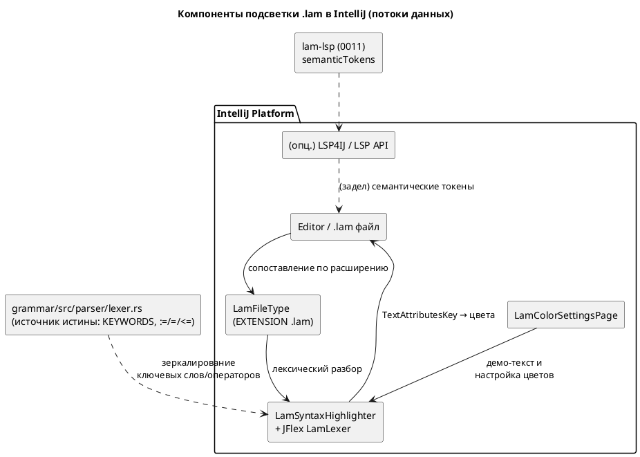

# ADR 0022: Плагин IntelliJ IDEA — подсветка синтаксиса Lam

- **Status:** Accepted
- **Date:** 2026-07-13
- **Authors:** Архитектор + дизайнер языков + лид разработки
- **Related issues:** [Фича 0022](../features/0022-intellij-syntax-highlight.md);
  переиспользует токены языка из фичи [0021](../features/0021-swap-assign-compare.md)
  (операторы `:=`/`=`/`<=`) и опционально сервер [0011](../features/0011-lsp-server.md) `lam-lsp`

## Context

У языка Lam уже есть редакторная оснастка: LSP-сервер `lam-lsp`
([0011](../features/0011-lsp-server.md); `textDocument/semanticTokens`,
`hover`, `completion`) и Zed-расширение (`extensions/zed-lam`), которое **делегирует
подсветку целиком в LSP** (в его `languages/lam/` нет tree-sitter/`highlights.scm`).
Самая массовая среда промышленной разработки — JetBrains IntelliJ IDEA — оснастки
для Lam не имеет: файлы `.lam` открываются как plain text, без подсветки.

Заказчик просит **плагин для IntelliJ IDEA с подсветкой синтаксиса** `.lam`.

**Что есть как источник истины по лексике (важно для выбора).**

- **Ключевые слова** — таблица `KEYWORDS` в `grammar/src/parser/lexer.rs`
  (`model`, `state`, `start`, `ref`, `next`, `cond`, `var`, `const`, `fn`, `type`,
  `enum`, `struct`, `import`, `from`, `as`, `if`/`else`/`match`/`for`/`while`/`loop`/
  `break`/`continue`/`return`, `in`/`out`/`inout`, `true`/`false`, `X`/`F`/`G`/`U`/`R`
  и `LTL`/`Guard` для верификации, и т. д.).
- **Операторы** после фичи [0021](../features/0021-swap-assign-compare.md):
  присваивание/инициализация `:=`, сравнение на равенство `=`, реляционный `<=`;
  `==` **выведен** из языка.
- **Комментарии** — строчные `//` и doc `///` (см. `extensions/zed-lam/languages/lam/config.toml`).
- **Категории семантических токенов** LSP — `grammar::lsp::SEMANTIC_TOKEN_TYPES`
  (keyword, variable, function, type, enum_member, string, number, comment,
  operator, class).

**Силы, действующие на решение.**

1. **«Подсветка синтаксиса» ≠ полный парсер.** Для раскраски достаточно
   лексического уровня (токены), PSI-дерево и парсер Grammar-Kit не обязательны.
2. **Community vs Ultimate.** Платформенный LSP API IntelliJ доступен только в
   Ultimate; в Community LSP подключается лишь сторонним LSP4IJ. Базовая подсветка
   не должна зависеть от редакции IDE и от установленного `lam-lsp`.
3. **Дрейф лексики.** Любой отдельный лексер (JFlex/TextMate) дублирует
   `parser/lexer.rs` и может разойтись с ним — нужен явный «источник истины» и
   регресс-проверка ключевых слов/операторов (особенно новых `:=`/`=` из 0021).
4. **Целевая аудитория (правило 12)** — инженеры АСУ ТП на IntelliJ; ценят
   офлайн-подсветку «из коробки», настраиваемые цвета и работу в Community.
5. **Обратная совместимость (правило 11)** — фича **аддитивна**: новый
   подпроект `extensions/intellij-lam/`, язык и компилятор не затрагиваются,
   версия языка не меняется (правило 22 не применяется).

## Decision Drivers

1. **Автономность базовой подсветки** — работает офлайн, в Community, без `lam-lsp`.
2. **Полноценный плагин** — установка через Marketplace/диск, страница настройки
   цветов, парные скобки, комментирование (а не только tmLanguage-раскраска).
3. **Единый источник истины лексики** — совпадение ключевых слов/операторов с
   `grammar/src/parser/lexer.rs` (включая `:=`/`=`/`<=` из 0021), защищённое тестом.
4. **Аддитивность (правило 11)** — не трогать язык, компилятор, версию языка.
5. **Задел под семантику** — не закрывать путь к LSP-подсветке `lam-lsp` в будущем.

## Considered Options

### Option A. Нативный плагин IntelliJ Platform: `SyntaxHighlighter` + JFlex-лексер

Kotlin-плагин на Gradle IntelliJ Platform Plugin: `LamFileType` (расширение `.lam`,
иконка), JFlex-лексер `LamLexer` (зеркалит `KEYWORDS` и операторы `:=`/`=`/`<=`),
`LamSyntaxHighlighter` (маппинг токен → `TextAttributesKey`), `LamColorSettingsPage`,
`Commenter` (`//`), `PairedBraceMatcher`.

**Pros:**
- Полноценный плагин: страница настройки цветов, работает в Community и офлайн.
- Лексер достаточно мал (подсветка не требует полного парсера/PSI).
- Явный источник истины (`parser/lexer.rs`) + возможность юнит-теста лексера
  на платформе (`LexerTestCase`).
- Стандартный, наиболее ожидаемый для IntelliJ путь; расширяется до PSI/инспекций.

**Cons:**
- Дублирование таблицы ключевых слов/операторов из Rust-лексера (риск дрейфа) —
  снимается регресс-тестом и комментарием-ссылкой на источник.
- Нужен toolchain JVM/Gradle/JFlex рядом с Rust-workspace.

### Option B. TextMate Bundle (`.tmLanguage`) без кода плагина

Грамматика TextMate, подхватываемая встроенным в JetBrains движком TextMate Bundles.

**Pros:**
- Минимум кода; переиспользуется и в VS Code.
- Быстрый старт.

**Cons:**
- Формально **это не плагин** — заказчик просил именно плагин IntelliJ IDEA;
  нет страницы настройки цветов, слабая интеграция (нет brace matcher/commenter
  как компонентов плагина).
- Регэксп-грамматика TextMate тоже дублирует лексику и хуже тестируется.

### Option C. Только LSP: подсветка через `lam-lsp` semantic tokens (LSP4IJ / LSP API)

Плагин-обёртка, запускающая `lam-lsp` и раскрашивающая по `semanticTokens`.

**Pros:**
- Переиспользует готовую семантику 0011 (типы/переменные/состояния различаются
  по смыслу, а не только лексически).
- Нет дублирования лексики — источник один (`grammar`).

**Cons:**
- Платформенный LSP API — **Ultimate-only**; Community требует сторонний LSP4IJ
  (внешняя зависимость плагина).
- Требует собранный и установленный бинарник `lam-lsp` — нет офлайн-подсветки
  «из коробки», хуже для быстрого чтения `.lam`.
- Медленнее и тяжелее для простой задачи «подсветить синтаксис».

## Decision

Принимается **Option A** — нативный плагин IntelliJ Platform (`SyntaxHighlighter`
+ JFlex-лексер).

**Обоснование.** Запрошена именно **подсветка синтаксиса в виде плагина
IntelliJ IDEA**. Option A даёт полноценный плагин, работающий офлайн и в
Community, со страницей настройки цветов и стандартной эргономикой редактора, и
не зависит от установки `lam-lsp`. Задача подсветки лексическая — полный
парсер/PSI не нужен, поэтому объём умеренный. Дублирование лексики (главный
минус) снимается явной привязкой к источнику истины `grammar/src/parser/lexer.rs`
и регресс-тестом соответствия ключевых слов/операторов.

**Option B** отвергнут: TextMate-бандл — не плагин по существу запроса и лишён
настройки цветов. **Option C** отложен: LSP-подсветка ценна семантически, но
Ultimate-зависимость/сторонний LSP4IJ и требование запущенного сервера
несоразмерны базовой подсветке; выносится в **задел** — *семантическая*
надстройка над лексической (см. Action items и `FEATURES.md` → бэклог).

## Consequences

### Положительные

- Пользователи IntelliJ IDEA (в т.ч. Community) получают офлайн-подсветку `.lam`
  «из коробки», с настройкой цветов и парными скобками.
- Оснастка языка единообразна: Zed (LSP) + IntelliJ (нативная лексика) + LSP-сервер.
- Аддитивно: язык/компилятор/версия языка не затрагиваются (правило 22 неприменим).

### Отрицательные / Action items

- **Новый JVM/Gradle-подпроект** `extensions/intellij-lam/` (Kotlin, Gradle IntelliJ
  Platform Plugin) — отдельный toolchain, не входит в `cargo`-сборку/CI Rust; в CI
  добавляется отдельным шагом (Gradle) — вынести настройку CI в задел, если не в объёме.
- **Дублирование лексики** — обязательный регресс-тест соответствия набора
  ключевых слов/операторов таблице `KEYWORDS` (`parser/lexer.rs`) и операторам
  0021; комментарий-ссылка на источник в `LamLexer`.
- **Задел (бэклог):** семантическая подсветка через `lam-lsp` (Option C) как
  надстройка; расширение плагина до PSI/навигации/инспекций (отдельные фичи).
- README проекта (правило 15) дополняется разделом об оснастке IDE (Zed + IntelliJ).

### Acceptance criteria

1. Файлы `.lam` в IntelliJ IDEA распознаются как язык Lam (свой `FileType`, иконка).
2. Подсвечиваются: ключевые слова, операторы (`:=`, `=`, `<=`, `>=`, `<`, `>`,
   арифметика/логика), числовые и строковые литералы, `//`/`///`-комментарии,
   идентификаторы; `==` **не** трактуется как валидный оператор (лексемы 0021).
3. Есть страница настройки цветов (`ColorSettingsPage`) с демо-текстом Lam.
4. Набор ключевых слов/операторов лексера **совпадает** с `parser/lexer.rs`
   (регресс-тест); при добавлении ключевого слова в язык тест краснеет.
5. Плагин собирается (`gradle buildPlugin`) и проходит юнит-тесты лексера
   (`LexerTestCase`) и highlighter-тесты; verifyPlugin — без ошибок совместимости.
6. Язык, компилятор и версия языка не изменены (аддитивность, правило 11).
