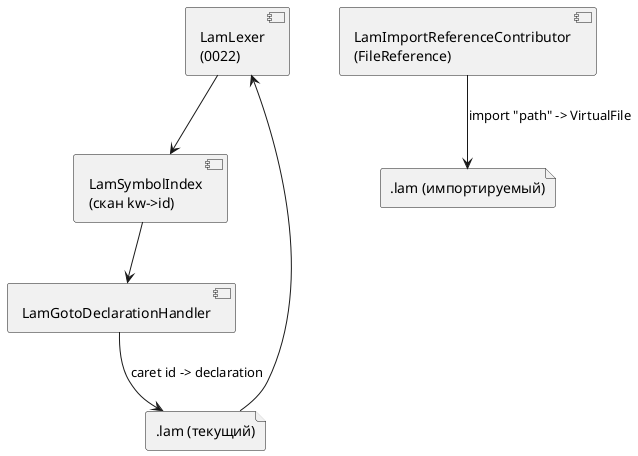

# ADR 0023: Плагин IntelliJ IDEA — навигация к декларации и include

- **Status:** Accepted
- **Date:** 2026-07-13
- **Authors:** Архитектор + Лид разработки
- **Related issues:** [Фича 0023](../features/0023-intellij-navigation-include.md); развивает
  [ADR 0022](0022-intellij-syntax-highlight.md)

## Context

Плагин 0022 даёт **лексическую** подсветку `.lam`: рукописный `LexerBase`
(`LamLexer`), `SyntaxHighlighter`, эргономику редактора. **PSI-парсера нет** —
дерева синтаксических узлов, на которые опираются штатные `Reference`/`resolve`,
не существует. Заказчик просит две навигационные возможности:

- **Go to Declaration** — от использования имени к его объявлению
  (`model`/`state`/`type`/`enum`/`cond`/`var`/`const`/`fn`, импортированные имена);
- **обработка `import`** — переход от строки-пути к файлу `.lam`.

Обе стоят в бэклоге как «PSI-парсер поверх лексера 0022». Вопрос ADR: **строить ли
полноценный PSI-парсер** ради этих двух возможностей, или обойтись более лёгким
механизмом платформы. Источник истины по декларациям — грамматика
`grammar/src/grammar.lalrpop` (формы `kw <Id>`), по импортам — правило `Import`.

## Decision Drivers

1. **Самодостаточность сборки.** 0022 сознательно отказался от JFlex/grammar-kit,
   чтобы плагин собирался без внешних кодогенераторов. Хочется сохранить это.
2. **Минимум дублирования грамматики.** Полный парсер на Kotlin — это второе,
   ручное зеркало `grammar.lalrpop`, которое рассинхронизируется при эволюции языка.
3. **Ровно запрошенный объём.** Нужны две конкретные возможности, а не полный
   IDE-стек (find usages/rename/структура) — их можно добавить позже отдельной фичей.
4. **Совместимость API.** Использовать только давно стабильные точки расширения
   платформы (как в 0022), чтобы диапазон IDE оставался открытым.

## Considered Options

### Option A. Лёгкий путь: `GotoDeclarationHandler` + `PsiReferenceContributor` поверх лексера

Скан деклараций на основе `LamLexer` строит индекс `имя → диапазон` в файле.
`GotoDeclarationHandler` по идентификатору под кареткой отдаёт целевой элемент.
Пути `import` разрешаются через `FileReference`/собственную `PsiReference` на
токене-строке.

**Pros:**
- Без парсер-генератора и без второго ручного парсера грамматики.
- Малый объём, только стабильные API; открытый диапазон IDE сохраняется.
- Точно покрывает две запрошенные возможности.

**Cons:**
- Нет настоящего PSI ⇒ find usages/rename/структура — отдельная будущая работа.
- Разрешение имён — эвристика по токенам (без областей видимости/типов).

### Option B. Полноценный PSI-парсер (`ParserDefinition` + рекурсивный парсер)

Ручной RD-парсер на Kotlin, зеркалящий `grammar.lalrpop`, строит PSI-дерево;
навигация — штатными `PsiReference`.

**Pros:**
- Нативная навигация; задел под find usages/rename/структуру/инспекции.

**Cons:**
- Крупная трудоёмкость; второй ручной парсер языка — источник рассинхронизации
  (правило 2 — декомпозиция; такой объём тянет на отдельную многозадачную фичу).
- Риск ошибок разбора там, где подсветка уже работает.

### Option C. LSP `textDocument/definition` через `lam-lsp`

Навигацию отдаёт LSP-сервер (0011) через LSP4IJ/платформенный LSP API.

**Pros:**
- Единый источник семантики (сервер), переиспользование логики компилятора.

**Cons:**
- Платформенный LSP API — Ultimate-only / сторонний LSP4IJ (как отмечено в ADR 0022);
  зависимость от установленного и запущенного `lam-lsp`. Ломает автономность плагина.

## Decision

Принимается **Option A**. Он даёт ровно две запрошенные возможности при
минимальном объёме и сохраняет самодостаточность и открытый диапазон IDE плагина
0022. Полный PSI (Option B) и LSP-навигация (Option C) остаются отдельными
будущими фичами в бэклоге (find usages/rename/структура; семантическая навигация
через `lam-lsp`) и не блокируются данным решением.

## Consequences

### Положительные

- Ctrl/⌘+Click работает и для деклараций, и для путей `import`, офлайн, в Community.
- Никаких новых кодогенераторов и второго парсера грамматики.
- Индекс символов — переиспользуемый строительный блок для будущей структуры файла.

### Отрицательные / Action items

- Разрешение имён — токенная эвристика (без областей видимости): возможны
  ложные срабатывания при совпадении имён; фиксируется в анализе как известное
  ограничение и покрывается тестами на реальные примеры.
- find usages/rename/структура/инспекции — вынести отдельной фичей (бэклог).
- Кросс-файловое разрешение имён (объявление в импортированном файле) — вне
  объёма 0023 (переход к самому файлу `import` — в объёме); отметить в бэклоге.

### Acceptance criteria

1. `Ctrl/⌘+B`/Click на использовании `model`/`state`/`type`/`enum`/`cond`/`var`/
   `const`/`fn`/импортированного имени ведёт к его объявлению в том же файле.
2. `Ctrl/⌘+B`/Click на строке-пути в `import "…";` и `import { … } from "…";`
   открывает соответствующий файл `.lam` (при его наличии на диске/в корнях).
3. Плагин собирается `./gradlew buildPlugin` и проходит все тесты (включая новые
   для навигации/импорта); диапазон IDE остаётся открытым (only-stable API).
