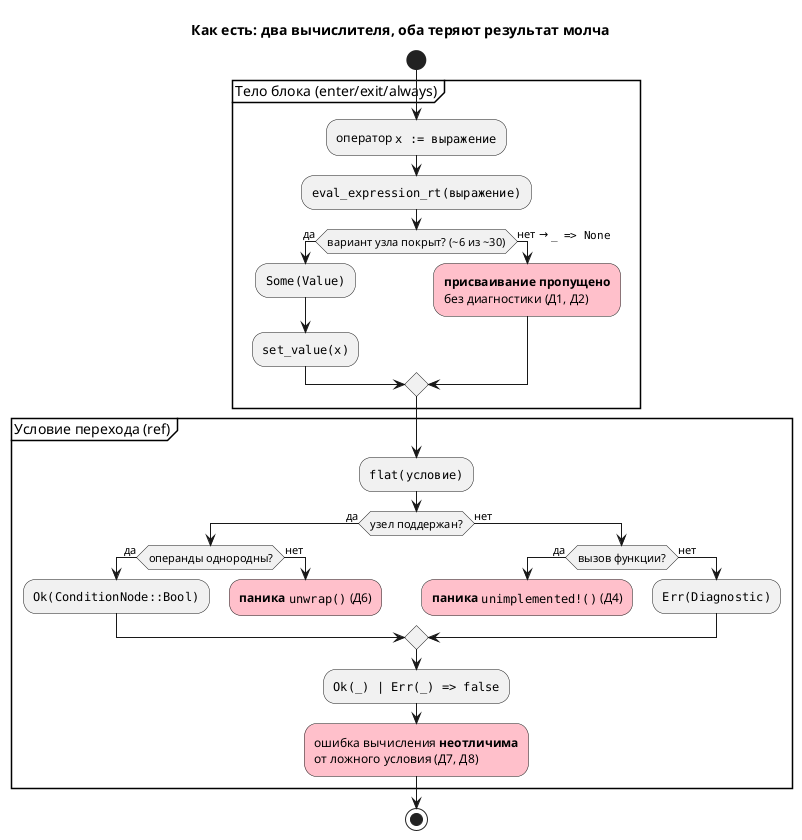
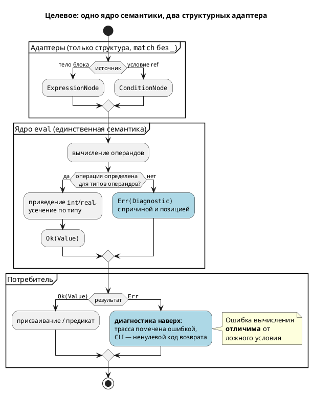

# ADR 0025: Починка вычислителя выражений симулятора

- **Status:** Accepted
- **Date:** 2026-07-14
- **Authors:** Архитектор + системный аналитик
- **Related issues:** [Фича 0025](../features/0025-simulator-expression-eval.md);
  связь с [ADR 0019](0019-condition-expression-unification.md) (дублирование
  `Condition`/`Expression` — то же явление, но на уровне грамматики)

## Context

Крейт `simulation` вычисляет модели неверно и **бесшумно**. Обзор 2026-07-14
выявил восемь дефектов; все воспроизведены пробами. Существенно, что они **не
независимы** — это симптомы одной архитектурной причины.

В симуляторе **два вычислителя**, выросших порознь и разошедшихся:

| Вычислитель | Вход | Возвращает | Состояние |
|---|---|---|---|
| `unit/builder.rs::eval_expression_rt` | `ExpressionNode` (тела `enter`/`exit`/`always`) | `Option<Value>` | покрывает ~6 из ~30 вариантов; остальное → `_ => None` |
| `predicate.rs::flat` | `ConditionNode` (условия переходов) | `Result<ConditionNode, Diagnostic>` | арифметику умеет, но использует **узлы AST как значения** и делает `unwrap` |

Ни один не является подмножеством другого: `ConditionNode` содержит `Model`,
`State`, `EnumVariant`, которых нет в `ExpressionNode`; `ExpressionNode` содержит
`Assign`, `Multiply`/`Divide`/`Modulo`/`Power`, сдвиги, побитовые операции,
`CodeBlock`, которых нет в `ConditionNode`. Поэтому расхождение не заметил ни
компилятор, ни тесты.

### Инвентарь дефектов

| № | Дефект | Место | Проявление |
|---|---|---|---|
| Д1 | `eval_expression_rt` покрывает ~6 из ~30 вариантов `ExpressionNode` | `unit/builder.rs:135` | `c := a + 1` → `c` не меняется |
| Д2 | Невычислимое выражение → **тихий** пропуск присваивания (нет ветки `else`) | `unit/builder.rs:220` | ни ошибки, ни предупреждения |
| Д3 | `compile_expression` обрабатывает только `Assign` | `unit/builder.rs:218` | голый вызов `log_temp(x);` выпадает |
| Д4 | `ConditionNode::Function` → `unimplemented!()` | `predicate.rs:111` | **паника** |
| Д5 | `enter` стартового состояния не исполняется | `unit/mod.rs:185` | начальная инициализация теряется |
| Д6 | Смешанная арифметика `int`+`real` → `unwrap()` на `None` | `predicate.rs:130` | **паника** |
| Д7 | `Parenthesis` возвращает внутренний узел **невычисленным** (`Ok(*cond.clone())` вместо `flat(cond)`) | `predicate.rs:78` | `(t + 1) > 2` при `t=5` → условие ложно |
| Д8 | `EnumVariant`, `State`, `Model`, `ArraySubscript` → `Err` | `predicate.rs:~242` | `mode = Manual` при `mode=Manual` → ложно; `S(Ping) = End` не работает |

Д7 и Д8 молчаливы вдвойне: `create_predicate` (`predicate.rs:11`) сводит и `Err`,
и невычислимый результат к `false` (`Ok(_) | Err(_) => false`), поэтому ошибка
вычисления неотличима от честно ложного условия.

### Поток «как есть»

### Корневая причина

Дефект — **не** «забыли дописать варианты». Забыть стало возможно, потому что
архитектура это позволяет и не сигнализирует:

1. **`_ => None`** — подстановочная ветка гасит любой невычисленный узел. Добавление
   варианта в `ExpressionNode` не ломает сборку `simulation` — новый узел молча
   становится «невычислимым».
2. **`Option` вместо `Result`** — «нет значения» не несёт причины, и вызывающий не
   обязан её обрабатывать; естественный код — `if let Some(v) = … {}` — и есть Д2.
3. **AST как значение** (`flat` возвращает `ConditionNode`) — смешивает частичную
   нормализацию с вычислением; отсюда `unwrap` (Д6) и невычисленные скобки (Д7).

Пока эти три свойства сохраняются, любая точечная починка восстановит паритет
сегодня и потеряет его на следующем добавленном узле.

### Почему это важно

Симуляция — способ проверить автоматную модель **до** синтеза в C (правило 12).
Симулятор, молча выдающий неверную трассу, хуже отсутствующего: он даёт ложную
уверенность. Дефекты видны в собственных примерах проекта: `comprehensive.lam`
навсегда висит в `Idle`, у `stacker.lam` `eta=0` на каждом шаге. Полный прогон
тестов при этом **зелёный** (1484 passed) — тесты проверяют факт переходов, но не
вычисленные значения.

## Decision Drivers

1. **Закрыть класс дефекта, а не восемь дефектов.** Главный критерий решения — чтобы
   девятый такой дефект не мог появиться молча. Всё остальное вторично.
2. **Достоверность симуляции.** Наблюдаемое поведение симулятора обязано совпадать с
   поведением синтезированного C — иначе проверка модели бессмысленна (правило 12).
3. **Никаких паник.** Ни одна корректно скомпилированная модель не должна ронять
   симулятор: паника — это отказ инструмента проверки.
4. **Язык не меняется.** Правила 11 и 22: чинится исполнение уже
   специфицированного поведения; версия языка не растёт. Инвариант «условия рёбер
   `ref` не разрешаются» (`CLAUDE.md`) — неприкосновенен.
5. **Соразмерность.** `simulation` — не горячий код; читаемость и проверяемость
   важнее микрооптимизации (`docs/CODE.md`).

## Considered Options

### Option A. Точечная починка обоих вычислителей

Дописать недостающие варианты в `eval_expression_rt`, убрать `unimplemented!()` и
`unwrap` из `flat`, исправить `Parenthesis`, `EnumVariant`, `enter`.

**Pros:**
- Минимальный диф; все восемь дефектов закрываются быстро.
- Нулевой риск задеть смежные подсистемы.

**Cons:**
- **Не устраняет причину** (драйвер 1): `_ => None`, `Option` и AST-как-значение
  остаются. Расхождение вернётся на следующем варианте `ExpressionNode` — ровно
  так оно и возникло.
- Дублирование семантики сохраняется: правила переполнения, приведения `int`/`real`
  и деления на ноль придётся реализовать **дважды** и держать синхронными вручную.
  Д1 против Д6/Д7 — прямое доказательство, что вручную не удерживается.

### Option B. Общее ядро вычисления над `Value` + два исчерпывающих адаптера

Семантика значений выносится в единый модуль (`simulation/src/eval/`): тип `Value`,
типизированные унарные/бинарные операции, правила приведения и усечения, приведение
к `bool`. Два тонких адаптера — `ConditionNode → Value` и `ExpressionNode → Value` —
не содержат семантики, только структурный разбор, и пишутся **исчерпывающим `match`
без `_`**, возвращая `Result<Value, Diagnostic>`.

**Pros:**
- Устраняет причину (драйвер 1): новый вариант `ExpressionNode`/`ConditionNode`
  **ломает сборку** `simulation`, а не тихо возвращает `None`. Компилятор берёт на
  себя то, что не удержали тесты и ревью.
- Семантика (переполнение, `int`/`real`, деление на ноль) существует в **одном**
  месте → расхождение вычислителей структурно невозможно (драйвер 2).
- `Result` вместо `Option` делает диагностику обязательной по типу, а не по
  дисциплине: Д2 не пишется случайно.
- `flat` перестаёт быть частичным нормализатором → `unwrap` (Д6) и невычисленные
  скобки (Д7) исчезают как класс.

**Cons:**
- Объём больше A: новый модуль + переписывание `flat`, а не правка веток.
- Асимметрия узлов остаётся: `Model`/`State` (только `Condition`) и
  `Assign`/`CodeBlock` (только `Expression`) обрабатываются в своих адаптерах.
- Требует доступа к типу переменной (`TypeNode`) при записи — `Value` ширины не несёт.

### Option C. Понижение `ConditionNode` → `ExpressionNode`, один вычислитель

Привести условия к выражениям и оставить единственный `eval`.

**Pros:**
- Максимальное устранение дублирования: один тип, один вычислитель.
- Хорошо сочетается с идеей фичи 0019.

**Cons:**
- **Понижение лоссивое:** `Model`, `State`, `EnumVariant` не имеют аналогов в
  `ExpressionNode`; для них пришлось бы расширять `ExpressionNode` — то есть менять
  семантические типы крейта `grammar` ради симулятора.
- `Condition::And`/`Or` документированы как **побитовые**, а `flat` вычисляет их
  логически (`to_bool`) — при слиянии эту неоднозначность пришлось бы разрешать,
  что затрагивает семантику языка (драйвер 4).
- Ставит починку дефекта в зависимость от рефактора грамматики, тогда как ADR 0019
  полное слияние `Condition`/`Expression` **уже отверг** (ломает инвариант `=`/`==`
  и совместимость). Воскрешать отвергнутое решение внутри фикса — неверный масштаб.

## Decision

Принимается **Option B**.

Решающий довод — драйвер 1. Option A закрывает восемь дефектов и оставляет
механизм, который их породил: подстановочная ветка `_ => None` означает, что
корректность держится на памяти разработчика, а не на компиляторе. Проект уже
проверил этот механизм на прочность и проиграл — два вычислителя разошлись
настолько, что один умеет арифметику, а другой нет, и оба при этом «работают».
Option B переносит инвариант «все узлы обработаны» из области дисциплины в область
типов: исчерпывающий `match` делает пропуск ошибкой сборки, `Result` делает
диагностику обязательной.

Option C отвергается по масштабу: он лечит симптом уровня грамматики ради дефекта
уровня симулятора и наступает на решение, уже отвергнутое ADR 0019.

### Целевой поток

### Принятые решения по составу

| Вопрос | Решение |
|---|---|
| Д1 | Полное покрытие `ExpressionNode` в адаптере; `match` **без** `_`. |
| Д2, Д3 | `Result<Value, Diagnostic>`; невычислимое выражение и неподдержанный оператор → диагностика, не пропуск. Операторы-выражения (вызовы) исполняются. |
| Д4, Д6 | `unimplemented!()`/`unwrap` удаляются; в `eval` и адаптерах паника **запрещена** — только `Err`. |
| Д5 | `enter` стартового состояния исполняется при инициализации (до первого `tick`), ровно один раз. |
| Д7 | `Parenthesis` вычисляется рекурсивно (следствие отказа от AST-как-значения). |
| Д8 | `EnumVariant` → `Value::Number(значение варианта)` — согласовано с C (enum → int); `ArraySubscript`/`ArraySlice`/`BitAccess` поддерживаются. `State`/`Model` — см. ниже. |
| Сравнение `State`/`Model` (`S(Ping) = End`) | Требует расширения `Context` доступом к текущему состоянию под-модели — **отдельная задача внутри 0025**. До её реализации — **явная диагностика**, а не тихое `false`. |
| Числовая семантика | Принцип: для поведения, **определённого** в C, симулятор обязан совпадать с синтезированным C (усечение по объявленному типу: `u8` + 1 при 255 → 0); для **неопределённого** в C (деление на ноль) — симулятор выдаёт диагностику, а не воспроизводит UB и не паникует. Конкретную таблицу правил (приведение `int`/`real`, сдвиги, знаковое переполнение) составляет анализ и подтверждает сверочными тестами против `lamc -t c`. |
| `extern fn` | Тела нет. Процедура (без возвращаемого типа) — no-op. Функция с возвращаемым типом — **диагностика** (симуляция невозможна), а не тихий ноль; подстановка значений через `--sim-file` — кандидат в отдельную фичу, не в 0025. |
| `fn` с телом (`Local`) | Интерпретируется. Это достаточно для приёмки: `travel_time` в `stacker.lam` (строка 116) — локальная функция. |
| Рекурсия в `fn` | Ограничение глубины с диагностикой (симулятор не должен переполнять стек). |

### Механизм удержания решения

Запрет `_ =>` в `eval`/адаптерах — не пожелание, а проверяемое условие: включить
`#![deny(clippy::wildcard_enum_match_arm)]` на модуле `eval`. Без этого решение
деградирует до Option A при первом же добавленном варианте.

## Consequences

### Положительные

- Класс дефекта закрыт **компилятором**: новый вариант `ExpressionNode`/`ConditionNode`
  не может молча стать невычислимым.
- Семантика вычислений существует в одном месте → симуляция и синтезированный C не
  расходятся по построению.
- Ошибка вычисления отличима от ложного условия — исчезает главное свойство,
  делавшее дефект незаметным.
- Симулятор перестаёт паниковать (Д4, Д6): отказ инструмента проверки заменяется
  диагностикой.
- `predicate.rs` упрощается: частичная нормализация не нужна — предикату требуется
  `bool`, а `create_predicate` и так сводил всё к нему.

### Отрицательные / Action items

- **Результаты симуляции изменятся** — в сторону спецификации. Пересмотреть
  `examples/simulations/*.json`: проверки могли быть подогнаны под дефектное
  поведение (кандидат №1 — `eta=0`). Это не слом совместимости, а исправление
  эталона (правило 11).
- **Объём больше Option A** → декомпозировать на задачи `0025-YY` (правило 2);
  предложение анализу: 01 — ядро `eval` + `Value`; 02 — адаптер `ExpressionNode`
  (Д1–Д3); 03 — адаптер `ConditionNode`, переписывание `flat` (Д4, Д6–Д8);
  04 — `enter` при инициализации (Д5); 05 — сверочные тесты против `lamc -t c`.
- **`Value` не несёт ширину типа** — ядру нужен доступ к `TypeNode` переменной при
  записи; уточнить контракт `Context` (сейчас `get_value`/`set_value` — только по
  имени).
- **Канал диагностики времени выполнения отсутствует**: `TickResult` — `pub(crate)`
  и не имеет варианта ошибки. Нужен путь «ошибка вычисления → `runner` → CLI
  (ненулевой код возврата)». Пересекается с кандидатом «предупреждения
  `private_interfaces`» из `FEATURES.md`.
- **`Local`-функции требуют интерпретации тела** (`StatementNode`) — это шаг от
  вычислителя выражений к интерпретатору; ограничить глубину рекурсии.
- **Сравнение `State`/`Model`** остаётся неподдержанным до отдельной задачи —
  зафиксировать как диагностику и внести в тест-план как контрпример.
- **Правило кода.** Запрет подстановочных веток в разборе семантических узлов —
  кандидат в `docs/CODE.md` (сейчас такого правила нет). Внести в процессный
  бэклог `FEATURES.md` (правило 7).

### Acceptance criteria

1. `examples/comprehensive.lam` проходит заявленный сценарий `Idle → Heating →
   Cooling → Done` (сейчас — вечный `Idle`).
2. `examples/stacker.lam` на сценарии `examples/simulations/stacker_loading.json`
   даёт `eta ≠ 0` (`travel_time` — локальная `fn`, интерпретируется).
3. Пробы Д1–Д8 из карточки фичи зелёные; **ни одна не паникует**. В частности:
   `c := a + 1` → `c = 6` при `a = 5`; `(t + 1) > 2` при `t = 5` → истинно;
   `mode = Manual` при `mode = Manual` → истинно.
4. В модуле `eval` и адаптерах **нет ни одной ветки `_ =>`** по вариантам
   `ExpressionNode`/`ConditionNode`; включён
   `deny(clippy::wildcard_enum_match_arm)`; `./scripts/precheck.sh` зелёный.
5. Невычислимое выражение приводит к **диагностике** с позицией в исходнике и
   ненулевому коду возврата CLI — проверяется контрпримером (правило 16).
6. Тесты симуляции сверяют **вычисленные значения переменных**, а не только факт
   перехода; добавлен тест, падающий на текущем коде (защита от регресса класса).
7. Сверочный тест: для набора моделей результат симуляции совпадает с поведением
   кода, порождённого `lamc -t c` (включая усечение `u8` при переполнении).
8. Инвариант `ref`-условий не затронут: тест `syntax_simple` зелёный.
9. `cargo test --all-features -- --test-threads=1` зелёный; `examples/simulations/*.json`
   пересмотрены и актуальны.
