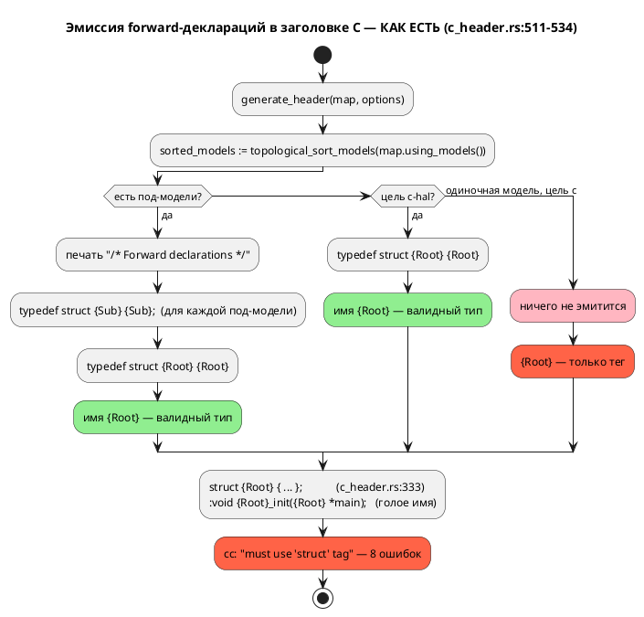
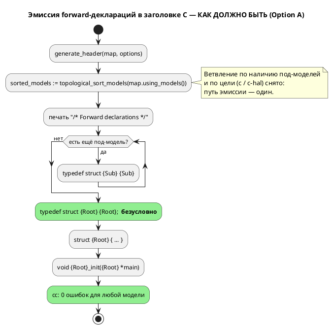

# ADR 0026: Генератор C: typedef корневой структуры для одиночной модели

- **Status:** Accepted
- **Date:** 2026-07-15
- **Authors:** Архитектор + Аналитик
- **Related issues:** [Фича 0026](../features/0026-c-root-typedef.md); наследует
  локальную правку задачи [0020-05](../development/0020-05-c-consumption.md)
  (цель `c-hal`, [ADR 0020](0020-port-address-decl.md))

## Context

Цель `c` порождает **некомпилируемый** код для модели **без под-моделей**. Факты
собраны чтением кода и пробами на текущей ветке `v2`.

**Как устроена эмиссия сейчас** (`grammar/src/generator/c/c_header.rs:511–534`):

```rust
if !sorted_models.is_empty() {          // есть под-модели
    printer.print("/* Forward declarations */").nl();
    for element in &sorted_models { … typedef struct {Sub} {Sub}; … }
    typedef struct {Root} {Root};
} else if options.hal {                  // под-моделей нет, но цель c-hal
    typedef struct {Root} {Root};
}                                        // под-моделей нет, цель c → НИЧЕГО
```

Третья ветка (одиночная модель, цель `c`) не эмитит ничего. При этом:

- Определение структуры печатается **тегом без typedef**:
  `struct {Root} {` (`c_header.rs:333`), закрывается `};` (`c_header.rs:483`) —
  то есть имя `{Root}` само по себе типом **не становится**.
- Прототипы объявлены через **голое** имя: `void {Root}_init({Root} *main);`.

В C это противоречие: `{Root}` — тег структуры, а не имя типа, и обращаться к
нему без `struct` нельзя. Единственное, что делало голое имя типом в остальных
ветках, — как раз forward-`typedef`.

**Проба** (цель `c`, файл без под-моделей
`grammar/tests/data/semantic/valid/deterministic_transitions.lam`):

```c
struct DeterministicTransitions { … };                              /* тег, без typedef */
void DeterministicTransitions_init(DeterministicTransitions *main); /* ← ошибка */
```

```
$ cc -fsyntax-only deterministic_transitions.c
error: must use 'struct' tag to refer to type 'DeterministicTransitions'
… всего 8 ошибок (4 в .h + 4 в .c)
```

**Существенное уточнение к формулировке кандидата.** Кандидат в `FEATURES.md`
описывает симптом как «прототипы невалидны **как отдельный C**», что читается как
дефект оформления заголовка. На деле не компилируется **вся единица трансляции**:
`.c` включает свой `.h` и падает на тех же прототипах — цель `c` для одиночной
модели не даёт рабочего результата вообще.

**Почему дефект дожил до сих пор.** `precheck.sh` собирает порождённый C через
cmake/ninja, но **все пять** `examples/*.lam` содержат под-модели и попадают в
первую (рабочую) ветку. Фича 0025 упёрлась в дефект и **обошла** его: фикстура
`simulation/tests/data/eval/conformance_u8.lam` обёрнута в `model Conf { … }` +
`start Entry = Conf;` с комментарием в самой фикстуре — «для одиночной корневой
модели генератор не эмитит `typedef`, и порождённый C не компилируется (дефект
генератора, бэклог)».

Поток «как есть» — с ветвлением, породившим дефект:



## Decision Drivers

1. **Порождённый C обязан компилироваться.** Профиль проекта (правило 12) —
   синтез C из автоматной модели; некомпилируемый выход обесценивает цель `c`
   на целом классе входов.
2. **Устранить причину, а не симптом.** Дефект родился из того, что фикс 0020-05
   применили к **одной** цели (`c-hal`), оставив вторую ветку. Пока путей два,
   расхождение воспроизведётся при следующей правке.
3. **Обратная совместимость (правило 11).** Работающий сегодня вывод (модели с
   под-моделями) меняться не должен; правка для одиночных моделей — аддитивная.
4. **Язык не затрагивается (правило 22).** Правка внутри генератора; синтаксис и
   семантика неизменны → версия языка **не растёт**.
5. **Пропорциональность.** Дефект стоит одной ветки условия; решение не должно
   переписывать генератор.

## Considered Options

### Option A. Эмитировать typedef корня безусловно (слить ветки `c` и `c-hal`)

Ветвление убирается: секция forward-деклараций печатается **всегда**, под-модели
добавляются в неё, если есть; typedef корня эмитится в любом случае.

**Pros:**
- Устраняет дефект в его причине: путь эмиссии остаётся **один**, расхождение
  целей `c`/`c-hal` исчезает как класс (драйвер 2).
- Решение уже **проверено в бою**: та же строка работает в `c-hal` (проба —
  `cc -fsyntax-only` даёт **0 ошибок** на том же файле, что в `c` даёт 8).
- Минимальный диф (~10 строк), нулевой риск для multi-model: та ветка уже
  печатала typedef корня — её поведение сохраняется.
- Аддитивно для потребителей: `typedef struct X X;` не конфликтует с кодом,
  пишущим `struct X`.

**Cons:**
- Вывод `c` для одиночных моделей меняется (+2 строки) — требует пересмотра
  ожиданий в тестах (проверено: сегодня таких ожиданий нет).
- Вывод `c-hal` для одиночной модели получит строку `/* Forward declarations */`
  (косметика; существующие проверки `contains` не ломаются).

### Option B. Печатать самотипизированные определения `typedef struct X { … } X;`

Отказаться от forward-деклараций, печатая определение сразу с typedef — как уже
делается для пользовательских структур (`c_header.rs:544`).

**Pros:**
- Одна конструкция вместо двух; для пользовательских структур форма уже принята.

**Cons:**
- **Ломает взаимные ссылки** — ровно то, ради чего forward-декларации введены
  (`c_header.rs:509–511`: «важно при взаимных ссылках»). Под-модель, ссылающаяся
  на тип, объявленный ниже, перестанет компилироваться.
- Меняет **работающий** вывод multi-model — против драйвера 3, риск несоразмерен
  масштабу дефекта.

### Option C. Объявлять прототипы через тег: `void {Root}_init(struct {Root} *)`

Оставить отсутствие typedef, но всюду в прототипах и определениях писать `struct`.

**Pros:**
- Формально корректный C без единого typedef.

**Cons:**
- Меняет **публичный API** порождённого C для **всех** моделей, включая
  работающие сегодня: код потребителя `Root m; Root_init(&m);` перестаёт
  собираться. Это слом обратной совместимости (правило 11) ради дефекта, который
  чинится аддитивно.
- Противоречит уже закреплённой в `c-hal` конвенции (typedef + голое имя) —
  расхождение целей не исчезнет, а закрепится.
- Диф — по всему генератору (прототипы, определения, HAL), а не в одной ветке.

### Option D. Ничего не менять, задокументировать ограничение

Признать одиночную модель неподдерживаемой для цели `c`, требуя обёртки в
`model` (как это сделала 0025).

**Pros:**
- Нулевой диф.

**Cons:**
- Оставляет цель `c` неработоспособной на простейшем классе входов и вынуждает
  каждого пользователя писать обёртку-ритуал без всякой семантической причины.
- Обход уже пришлось встроить в фикстуру 0025 — цена ограничения растёт с каждым
  новым потребителем.

## Decision

Принимается **Option A** — эмитировать `typedef struct {Root} {Root};`
**безусловно**, слив ветку цели `c` и локальную правку `c-hal` в один путь.

Обоснование: это единственный вариант, который чинит дефект **в его причине**
(два пути эмиссии вместо одного), не трогает работающий вывод multi-model
(драйвер 3), аддитивен для потребителей и уже подтверждён работой `c-hal`
(драйвер 1). Option B и C переписывают работающий вывод ради узкого дефекта
(против драйверов 3 и 5), Option D оставляет цель `c` сломанной.

Целевая структура ветки (`c_header.rs:511–534`): условие снимается, секция
печатается всегда, цикл по под-моделям исполняется столько раз, сколько их есть
(в том числе ноль), typedef корня печатается следом.

Поток «как должно быть»:



## Consequences

### Положительные

- Цель `c` даёт компилируемый код для **любой** модели, включая одиночную.
- Расхождение целей `c`/`c-hal` устранено: один путь эмиссии, фикс невозможно
  применить «к половине».
- Фикстуры сверки «симулятор ↔ C» перестают нуждаться в обёртке-обходе (0025).
- Совместимость сохранена: multi-model вывод неизменен, правка аддитивна, версия
  языка остаётся **0.2.0**.

### Отрицательные / Action items

- Вывод `c` для одиночных моделей меняется (+2 строки) — ожидаемо и желаемо;
  проверить, что ни один существующий тест не завязан на отсутствие typedef
  (проверено на стадии анализа: не завязан).
- Вывод `c-hal` для одиночной модели получит строку `/* Forward declarations */`
  — косметика, проверки `contains` не ломаются.
- **Закрыть класс дефекта тестом, а не глазами:** добавить проверку, которая
  **компилирует** порождённый C настоящим `cc` (по образцу
  `simulation/tests/conformance_c_tests.rs:141`, с гейтом на доступность `cc` —
  `cc_available()`, там же строка 65). Именно отсутствие такой проверки для
  одиночных моделей дало дефекту дожить.
- **Вне области ADR (передано в бэклог):** генерация C **недетерминирована** —
  порядок вариантов `enum` состояний и веток `switch` меняется от запуска к
  запуску (`states: HashMap<String, StateNode>`, `semantic/mod.rs:101`). Поэтому
  побайтовая сверка codegen-снапшотов, предложенная кандидатом, невозможна;
  проверки этого ADR — структурные.

### Acceptance criteria

1. Для модели **без под-моделей** цель `c` эмитит `typedef struct {Root} {Root};`
   ровно **один** раз.
2. Порождённый целью `c` код для одиночной модели **компилируется**:
   `cc -std=c11 -fsyntax-only {root}.c` → 0 ошибок (сегодня — 8).
3. Вывод цели `c` для модели **с** под-моделями не изменился (структурный
   регресс: секция forward-деклараций и оба typedef на месте).
4. Цель `c-hal` не регрессирует: typedef корня по-прежнему ровно один, таблица
   адресов и дефолтный HAL на месте.
5. Путь эмиссии typedef корня в коде **один** (нет ветки, зависящей от
   `options.hal` или от наличия под-моделей).
6. Версия языка не изменилась (**0.2.0**): правка не затрагивает синтаксис и
   семантику (правило 22).
