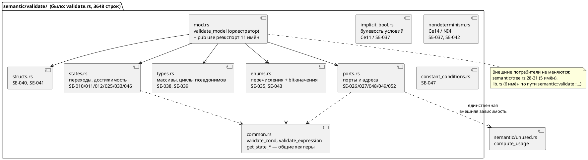

# ADR 0027: Разделение переросших модулей (validate.rs, lsp.rs, c_expr.rs)

- **Status:** Accepted
- **Date:** 2026-07-15
- **Authors:** Архитектор + Аналитик
- **Related issues:** [Фича 0027](../features/0027-module-size-split.md); по духу
  продолжает фичу-рефакторинг
  [0018](../features/0018-code-guidelines.md) («Приведение кода к требованиям
  `docs/CODE.md`», [анализ](../analyze/0018-code-guidelines.md)). ADR у 0018
  отсутствует — стадия 2 тогда не оформлялась, поэтому образцом структуры служит
  [ADR 0024](0024-lam-formatter.md)

## Context

Проект держит правило: **«Размер модуля — не больше ~1000 строк (вместе с
тестами); дели по логике»** (`CLAUDE.md`, строка 128, раздел «Технические
подводные камни»). Правило нарушено массово — замер `wc -l` на 2026-07-15
(ветка `v2`, коммит `6984471`):

| Модуль | Строк | Превышение |
|---|---:|---:|
| `grammar/src/semantic/validate.rs` | **3648** | ×3,6 |
| `grammar/src/lsp.rs` | **2163** | ×2,2 |
| `grammar/src/generator/c/c_expr.rs` | **1736** | ×1,7 |
| `grammar/src/semantic/mod.rs` | 1708 | ×1,7 |
| `grammar/src/semantic/tree.rs` | 1591 | ×1,6 |
| `grammar/src/semantic/index.rs` | 1543 | ×1,5 |
| `simulation/src/unit/viewport.rs` | 1460 | ×1,5 |
| `grammar/src/semantic/expression.rs` | 1360 | ×1,4 |
| `simulation/src/unit/mod.rs` | 1257 | ×1,3 |
| `grammar/src/parser/ast.rs` | 1182 | ×1,2 |
| `grammar/src/semantic/type_inference.rs` | 1162 | ×1,2 |
| `grammar/src/parser/lexer.rs` | 1150 | ×1,2 |
| `grammar/src/bin/lamc.rs` | 1149 | ×1,1 |
| `grammar/src/generator/c/c_source.rs` | 1086 | ×1,1 |
| `grammar/src/generator/c/c_header.rs` | 1070 | ×1,1 |

Плюс интеграционные тесты, на которые правило распространяется тем же текстом:
`grammar/tests/semantic_tests.rs` — **4766** строк (крупнее любого модуля `src`),
`parser_tests.rs` 1893, `codegen_tests.rs` 1203, `lsp_tests.rs` 1187,
`lexer_tests.rs` 1081. **Итого 20 файлов-нарушителей.**

Действуют три силы:

1. **Правило существует, но не проверяется.** `scripts/precheck.sh` и
   `.github/workflows/ci.yml` не содержат ни одной проверки размера — правило
   держится на внимании автора и потому не работает. Разовое разделение
   «худших трёх» без механизма контроля повторит историю: сегодняшний
   `validate.rs` тоже когда-то был меньше 1000 строк.
2. **Разделение бесплатно только для внутренних модулей.** Внешние контракты
   трёх целевых модулей различны:
   - `semantic::validate` объявлен `pub(crate) mod validate;`
     (`grammar/src/semantic/mod.rs:39`) — вне крейта невидим; потребители внутри
     крейта: `semantic/tree.rs:28-31` (5 имён) и `lib.rs` (6 имён по полному
     пути `semantic::validate::…`).
   - `grammar::lsp` — **публичный API крейта**: `pub mod lsp;` под
     `#[cfg(feature = "lsp")]` (`grammar/src/lib.rs:46-48`), 16 `pub`-элементов;
     потребители — бинарник `grammar/src/bin/lam_lsp.rs` и
     `grammar/tests/lsp_tests.rs`. Здесь действует правило 11: ломать нельзя.
   - `generator::c::c_expr` — приватный `mod c_expr;`
     (`grammar/src/generator/c/mod.rs:34`), все элементы `pub(super)`;
     потребители — `c_decl.rs:6`, `c_model.rs:8`, `c_source.rs:38`.
3. **Объём и риск несимметричны.** Три худших модуля дают 7547 строк — половину
   всего превышения; остальные 12 модулей `src` превышают лимит в 1,1–1,7 раза,
   и их деление даёт всё меньше пользы при той же цене регрессии.

Существенная деталь для планирования (проверено): в `validate.rs` тесты
**не в конце файла**, а вклиниваются в середину — `mod tests` (1450–2420),
`mod tests_ce4_declarations` (2424–2609), `mod tests_ce15_array_size`
(2613–2692), после чего продуктивный код продолжается со строки 2694. Поэтому
несколько групп проверок разорваны на два куска (например, перечисления: 847–877
и 2947–3296). В `lsp.rs` тесты в конце одним модулем (1583–2163). В `c_expr.rs`
тестов **нет вообще** — все 1736 строк продуктивные (тесты C-генератора живут в
`generator/c/mod.rs:228`).

## Decision Drivers

1. **Устойчивость результата.** Разделение без механизма контроля деградирует
   обратно. Правило, которое нельзя проверить командой, — не правило.
2. **Сохранение внешнего контракта (правило 11).** Публичный API `grammar::lsp::*`
   обязан остаться прежним; поведение компилятора, тексты и коды диагностик
   (SE-0xx/Ce-xx) — байт-в-байт.
3. **Деление по логике, а не по строкам.** `CLAUDE.md` требует буквально «дели по
   логике»: границы модулей должны совпадать с границами ответственности
   (группа проверок, возможность LSP, фаза печати), иначе читаемость не растёт.
4. **Пропорциональность риска.** Рефакторинг без тестов на новую функциональность
   несёт только риск регрессии; его цена растёт линейно с объёмом переложенного
   кода, а польза — падает. Брать надо худших, а не всех.
5. **Отсутствие семантического сдвига.** Язык не меняется → версия языка не
   растёт (правило 22).

## Considered Options

### Option A. Деление по логике + механическая проверка размера с храповиком

Каждый из трёх модулей превращается в каталог-модуль (`validate/`, `lsp/`,
`c_expr/`) с `mod.rs`, который реэкспортирует прежние имена (`pub use` /
`pub(super) use`) — внешние пути импорта не меняются. Подмодули нарезаются по
логическим группам. Дополнительно вводится `scripts/check-module-size.sh`
(POSIX `sh`, без зависимостей — как `scripts/new-feature.sh`) и реестр-baseline
`scripts/module-size-baseline.txt`: файл из baseline **не имеет права расти**
выше зафиксированного значения, а любой файл вне baseline обязан укладываться в
1000 строк. Скрипт включается в `precheck.sh` и CI.

**Pros:**
- Границы модулей совпадают с границами ответственности → читаемость реально
  растёт, а не «файлов стало больше».
- Реэкспорт из `mod.rs` делает внешний контракт неизменным — правило 11
  выполняется конструктивно, а не проверками постфактум.
- Храповик закрывает корень проблемы: остальные 17 файлов **заморожены** (расти
  не могут), новые нарушители невозможны, а фича перестаёт быть разовой уборкой.
- Разделение снимает и сопутствующий дефект: три тест-модуля `validate.rs`
  разъезжаются по своим темам, продуктивный код перестаёт быть разорванным.
- Объём работ ограничен тремя файлами → риск регрессии контролируем.

**Cons:**
- Требуется аккуратность с `pub(crate)`-элементами, у которых теперь появляется
  «внутренняя» видимость (`pub(super)`), и с intra-doc-ссылкой
  `semantic/mod.rs:122` на `validate::check_port_addresses`.
- Baseline — это узаконенный долг: 17 файлов остаются нарушителями (правда,
  явно перечисленными и замороженными).
- Появляется новый скрипт, который надо сопровождать.

### Option B. Механическое деление по размеру (part1/part2/part3)

Резать каждый файл по строкам на куски ≤1000 (`validate_part1.rs`,
`validate_part2.rs`, …), не вникая в группы.

**Pros:**
- Быстро и почти без риска: код переносится буквально, `wc -l` сразу зелёный.

**Cons:**
- **Прямо противоречит формулировке правила** («дели по логике»): границы
  проходят посреди связанных проверок.
- Читаемость **падает**: чтобы найти проверку, надо помнить, в какой «части» она
  лежит; связанные функции разъезжаются, несвязанные — соседствуют.
- Тест-модули `validate.rs` (1450–2692) при резке по строкам оторвутся от
  тестируемого кода произвольным образом.
- Формально закрывает метрику, не решая проблему → чистая имитация.

### Option C. Поднять/убрать лимит в `CLAUDE.md`

Признать, что 1000 строк — недостижимая для этого кода планка, и поднять её
(например, до 4000) либо снять правило.

**Pros:**
- Ноль работы и ноль риска регрессии.
- Честно фиксирует фактическое состояние: правило нарушено в 20 файлах, то есть
  де-факто уже не действует.

**Cons:**
- `validate.rs` (3648) труден для чтения **объективно**, а не потому, что так
  написано в правиле: 20+ функций проверок девяти разных тем, продуктивный код
  разорван тестами посередине. Поднятие планки этого не лечит.
- Правило продиктовано практикой сессий с AI-инструментами (`CLAUDE.md` —
  контекст для них): крупный модуль плохо помещается в рабочий контекст.
- Отмена правила из-за его нарушения — плохой прецедент для процесса
  (правило 7 требует обратного: заводить фичу на исправление).

## Decision

Принимается **Option A** — деление по логике с реэкспортом из `mod.rs` плюс
механическая проверка размера с baseline-храповиком.

Option B отвергнут как имитация: он удовлетворяет метрике, нарушая явное
требование «дели по логике», и ухудшает то, ради чего правило существует.
Option C отвергнут потому, что проблема `validate.rs` — не в числе строк, а в
девяти несвязанных темах в одном файле; но **частично учтён**: baseline
Option A и есть честное признание, что 17 файлов остаются за планкой — с той
разницей, что их долг зафиксирован и не может расти.

**Объём фичи — три модуля, а не двадцать.** Порог включения в работу — превышение
**более чем в 1,5 раза** (>1500 строк). Ему удовлетворяют шесть модулей `src`,
из них берутся три худших (`validate.rs`, `lsp.rs`, `c_expr.rs` — 7547 строк, то
есть половина суммарного превышения). Оставшиеся — `semantic/mod.rs` (1708),
`semantic/tree.rs` (1591), `semantic/index.rs` (1543) — и 12 прочих файлов
попадают в baseline и оформляются кандидатом в бэклоге: деление `tree.rs` задевает
семь семантических проходов и охраняемый инвариант `Condition::Unresolved`
(`CLAUDE.md`), а `semantic_tests.rs` (4766) — отдельная тема (нарезка
интеграционных тестов по темам), в фичу о модулях `src` не входит.

**Целевая декомпозиция** (`validate.rs`, группы и объёмы — по факту замера):

Аналогично: `lsp.rs` → `lsp/` (`position.rs`, `diagnostics.rs`, `formatting.rs`,
`completion.rs`, `hover.rs`, `symbols.rs`, `goto.rs`, `semantic_tokens.rs`) с
обязательным `pub use` всех 16 публичных имён в `lsp/mod.rs`;
`c_expr.rs` → `c_expr/` (`names.rs`, `resolve.rs`, `precedence.rs`,
`condition.rs`, `call.rs`, `expr.rs`, `stmt.rs`) с `pub(super) use` шести имён,
которые импортируют `c_decl.rs`/`c_model.rs`/`c_source.rs`. Взаимные вызовы
между `expr.rs` ↔ `call.rs` ↔ `condition.rs` допустимы: Rust не запрещает циклы
между модулями одного дерева, разрывать их не требуется.

Порядок подзадач: **сначала проверка** (0027-01), затем разделения
(0027-02…04) — так каждое разделение сразу измеряется объективным критерием, а
baseline монотонно уменьшается.

## Consequences

### Положительные

- Три худших модуля становятся навигируемыми: файл = одна тема; в `validate/`
  тесты переезжают к своим проверкам, продуктивный код перестаёт быть разорванным.
- Правило `CLAUDE.md` о размере модуля становится **исполнимым**: нарушение
  валит `precheck.sh` и CI, а не остаётся на внимании автора.
- Долг по остальным 17 файлам зафиксирован явным реестром и **не может расти**.
- Публичный API и поведение не меняются → потребители (`lam-lsp`, IntelliJ-плагин,
  тесты) не затрагиваются.
- Снижается конфликтность будущих фич: 0028/0029 (генератор C), 0035, 0038/0039
  будут править небольшие тематические файлы, а не «тяжеловесов».

### Отрицательные / Action items

- **Baseline — узаконенный долг.** Завести кандидата в `FEATURES.md` на
  оставшихся нарушителей (12 модулей `src` + 5 тест-файлов, в первую очередь
  `semantic_tests.rs` 4766 и `semantic/mod.rs` 1708) — **действие координатора**.
- Определить политику baseline: запись, опустившаяся ≤1000, обязана быть удалена
  из реестра (иначе храповик «проворачивается» обратно) — реализовать в
  0027-01 как ошибку скрипта.
- Проверить intra-doc-ссылку `semantic/mod.rs:122` на
  `validate::check_port_addresses` — при переносе функции в подмодуль путь
  меняется (`cargo doc` не должен дать новых предупреждений).
- Понизить видимость: `pub`-элементы `validate.rs`, не используемые вне модуля
  (`check_duplicate_struct_fields:3321`, `check_struct_field_types:3379`,
  `MAX_ARRAY_SIZE:891`), и `pub(super)`-элементы `c_expr.rs`, не используемые вне
  файла (`field_name_in_parent`, `resolve_variable_c_expr`,
  `resolve_simple_var_in_context`, `condition_macro_name`, `expr_precedence`) —
  сузить до `pub(super)`/`pub(in …)` внутри нового дерева. Это **не** правка
  публичного API: оба модуля вне крейта невидимы.
- Версия языка **не растёт** (правило 22): синтаксис и семантика не затронуты.
  Версия крейта `grammar` (0.2.0) — при закрытии повышается максимум до `0.2.1`
  (patch), так как публичный API не меняется.

### Acceptance criteria

1. `wc -l` каждого из трёх целевых модулей после разделения — **≤1000 строк**;
   ни один новый файл каталогов `validate/`, `lsp/`, `c_expr/` не превышает 1000.
2. Публичный API не изменён: `grammar/src/bin/lam_lsp.rs` и
   `grammar/tests/lsp_tests.rs` компилируются и проходят **без единой правки**
   (пути `grammar::lsp::*` сохранены реэкспортом).
3. Поведение не изменилось: полный набор тестов
   (`cargo test --features lsp -- --test-threads=1`) зелёный, число пройденных
   тестов **не меньше**, чем до фичи; `git diff` по `grammar/tests/`,
   `simulation/tests/`, `examples/` **пуст**.
4. `scripts/check-module-size.sh` существует, включён в `precheck.sh` и CI,
   возвращает 0 на текущем дереве и ≠0 при (а) появлении файла >1000 строк вне
   baseline и (б) росте файла из baseline выше зафиксированного значения.
5. Записи `validate.rs`, `lsp.rs`, `c_expr.rs` в baseline **отсутствуют** (они
   уложились в лимит); остальные 17 файлов перечислены с фактическими размерами.
6. `cargo clippy --all-targets --all-features` не даёт новых предупреждений;
   `cargo doc` не даёт новых предупреждений о битых intra-doc-ссылках.
