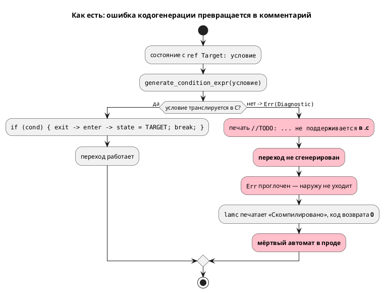
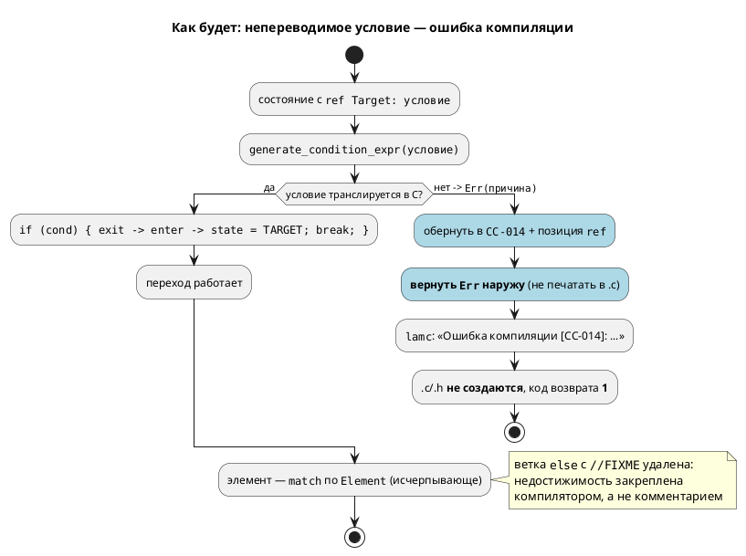

# ADR 0028: Заглушки генератора C: диагностика вместо тихого пропуска

- **Status:** Accepted
- **Date:** 2026-07-15
- **Authors:** Архитектор + системный аналитик
- **Related issues:** [Фича 0028](../features/0028-c-generator-stubs.md);
  связь с [ADR 0025](0025-simulator-expression-eval.md) — **тот же класс дефекта**
  («тихий пропуск»), но в генераторе C, а не в симуляторе; пересечение по коду с
  [0027](0027-module-size-split.md) (делит `c_expr.rs`) и
  [0029](0029-c-type-mapping.md) (правит `generator/c/`)

## Context

Генератор C содержит две текстовые заглушки, попадающие **в порождаемый C-код**.
Обзор 2026-07-14 зафиксировал их как кандидата в фичу, но не установил
достижимость. Достижимость установлена в рамках этой проработки — **ответ разный
для двух заглушек**, и это определяет решение.

### Заглушка №1 — `//TODO: условный переход … не поддерживается` — **ДОСТИЖИМА**

`grammar/src/generator/c/c_model.rs:312-321`, функция
`generate_state_transitions`. Если `generate_condition_expr`
(`generator/c/c_expr.rs:428`) возвращает `Err`, переход **не генерируется**, а
вместо него в `.c` печатается комментарий:

```rust
Err(di) => {
    // Условие не поддерживается — оставляем комментарий
    printer
        .ident(&format!(
            "//TODO: условный переход в {} не поддерживается. Причина: {}",
            target.local(),
            di.message
        ))
        .nl();
}
```

`Err` **проглатывается**: наружу не уходит ни ошибка, ни предупреждение, а
`lamc` завершается с кодом `0` и печатает «Скомпилировано». Диагностика есть —
она уже сформирована в `di` — но её единственный потребитель это комментарий в
выходном файле, который никто не читает.

Достижимость доказана пробой (`CC-001`, `c_expr.rs:726` — `BitAccess` на
`float`-порт). Результат: **автомат мёртв** — из `START` нет ни одного перехода,
модель навсегда стоит в стартовом состоянии, C при этом компилируется без
единого замечания.

Существенно, что порождаемый C **синтаксически корректен**: комментарий не
ломает сборку. Дефект не проявится ни в компиляторе C, ни в линковке — только в
поведении изделия. Для языка синтеза автоматов промышленных систем управления
(правило 12) это худший из возможных режимов отказа.

### Заглушка №2 — `//FIXME: Пока не реализовано` — **НЕДОСТИЖИМА (мёртвый код)**

`grammar/src/generator/c/c_model.rs:768-771`. Ветка `else` в цепочке разбора
элемента. Она **статически недостижима**, доказательство — цепочка из четырёх
звеньев:

| # | Факт | Место |
|---|---|---|
| 1 | `let Some(state) = map.state_at(name) else { continue; };` | `c_model.rs:655` |
| 2 | `state_at` возвращает `Some` **только** при `element.is_state()` | `c_map.rs:106-114` |
| 3 | `is_state()` = `matches!(self, Element::State{..} \| Element::StateExtend{..})` | `minimap.rs:137` |
| 4 | `enum Element` имеет **ровно три** варианта: `Model`, `StateExtend`, `State` | `minimap.rs:108-134` |

Из (1)–(4): `state` ∈ {`State`, `StateExtend`}. Ветки `if let Element::State`
(`c_model.rs:673`) и `else if let Element::StateExtend` (`c_model.rs:686`)
покрывают оба варианта **исчерпывающе**, поэтому `else` (768) не может
выполниться никогда. Заглушка №2 — не дефект поведения, а **мёртвый код**,
маскирующийся под незавершённую работу.

Компилятор Rust этого не видит: цепочка `if let / else if let / else`
непрозрачна для проверки исчерпывающности — ровно то, от чего защищает
`deny(clippy::wildcard_enum_match_arm)` в модуле `eval` (фича 0025).

### Третий (не заявленный) путь — `StateExtend::None`

В той же функции цепочка `if let StateExtend::Model` (`c_model.rs:687`) /
`else if Parallel` (732) / `else if Concatenation` (751) **не имеет ветки для
`StateExtend::None`** (`minimap.rs:93`). Такое состояние молча не порождает
ничего — даже комментария. Это тише заглушки №1. `StateExtend::None` строится
из `Extend::None` и `Extend::Unresolved` (`minimap.rs:435-436`); проба через
`Extend::Unresolved` отклоняется семантикой раньше кодогенерации, поэтому
достижимость **не установлена**. Путь закрывается тем же решением, что и
заглушка №2 (исчерпывающее сопоставление), без отдельного обоснования.

### Поток «как есть»



## Decision Drivers

1. **Тихий отказ недопустим (правило 12).** Проект синтезирует автоматы
   промышленных систем управления. Молча выданный мёртвый автомат, который
   собирается без замечаний, — угроза безопасности, а не косметика.
2. **Диагностика уже существует — потерян только канал.** `Diagnostic` с кодом и
   текстом причины формируется (`c_expr.rs:726` и др.), но выбрасывается в
   комментарий. Чинится **маршрутизация**, а не анализ.
3. **Класс дефекта уже разобран в 0025.** Решение должно быть согласовано с
   принятым там принципом: невычислимое/непереводимое — это диагностика, а не
   молчание.
4. **Дефект латентен.** Ни один файл `examples/` не задевает заглушки (проверено
   прогоном корпуса). Значит, цена ужесточения поведения близка к нулю, а
   «сломать рабочую сборку» решение не может.
5. **Мёртвый код и живой дефект — разные задачи.** Смешивать их в одном решении
   нельзя: №1 требует поведения, №2 требует удаления.

## Considered Options

### Option A. Реализовать недостающую генерацию

Дописать трансляцию для случаев, где `generate_condition_expr` возвращает `Err`
(прежде всего `CC-001` — `BitAccess` на `float`-порт).

**Pros:**
- Пользователь получает работающий C для более широкого подмножества языка.
- Не ужесточает поведение — ничего не начинает падать.

**Cons:**
- **Решает не ту задачу.** Заглушка — это симптом «неизвестно что делать»;
  реализовав один случай (`CC-001`), мы оставим канал потери для остальных
  (`CC-002`, `CC-003`, `CC-006`, `CC-011`, `CC-012`, `CC-013`). Следующий
  непереведённый узел снова уйдёт в комментарий молча.
- **`BitAccess` на `float` не имеет корректной семантики в C** без type punning;
  «реализация» была бы выдумыванием семантики языка в генераторе — это работа
  стадии семантики (`SE-…`), а не кодогенератора.
- Не закрывает заглушку №2 (мёртвый код) и путь `StateExtend::None`.
- Объём непредсказуем и упирается в фичу 0029 (отображение типов).

### Option B. Жёсткая ошибка компиляции + удаление мёртвой ветки

Заглушка №1: `Err` из `generate_condition_expr` **пробрасывается** наружу как
ошибка компиляции с новым кодом `CC-014`, оборачивающим исходную причину и
позицию `ref` (`ReferenceNode.location`, `semantic/mod.rs:1455`). `lamc`
печатает ошибку и завершается с ненулевым кодом; `.c`/`.h` не пишутся.
Заглушка №2: ветка **удаляется**, цепочка `if let` заменяется исчерпывающим
`match` по `Element` и по `StateExtend` — недостижимость закрепляется
компилятором, а не рассуждением в документе.

**Pros:**
- Устраняет **класс** дефекта, а не один его случай: любой будущий
  непереводимый узел даёт ошибку, а не комментарий.
- Соответствует принципу 0025 и духу `deny(clippy::wildcard_enum_match_arm)`.
- Невозможно проигнорировать: код возврата ≠ 0 останавливает CI и сборку.
- Цена ужесточения **нулевая на текущем корпусе** (проверено): падать начнёт
  только то, что и так порождало мёртвый автомат.
- Позиция `ref` доступна → диагностика указывает на строку, а не на «Codegen».
- Мёртвый код исчезает вместе с ложным сигналом «здесь недоделка».

**Cons:**
- **Слом обратной совместимости поведения:** модель, которая раньше
  «компилировалась», теперь не компилируется. Требует обоснования по правилу 11
  (обоснование — в анализе: корректного C эти модели не порождали никогда).
- Требует смены сигнатуры `compile_to_c` при желании иметь канал
  предупреждений — либо отказа от такого канала.
- Пользователь лишается возможности «собрать хоть что-то» для отладки.

### Option C. Предупреждение + оставить заглушку в коде

`Err` превращается в `Diagnostic::warning`, пробрасывается в `lamc` и печатается
в `stderr`; комментарий `//TODO` в `.c` сохраняется; код возврата остаётся `0`.

**Pros:**
- Обратная совместимость полная: всё, что собиралось, собирается.
- Диагностика появляется — формально «тихий пропуск» устранён.
- Прецедент есть: `compile_to_c_hal` уже возвращает `Vec<Diagnostic>`
  (`lib.rs:258`).

**Cons:**
- **Сохраняет опасный режим отказа.** Предупреждение в `stderr` при коде
  возврата `0` в CI не читает никто; на выходе по-прежнему мёртвый автомат,
  который соберётся и уедет в изделие. Для промышленного управления (правило 12)
  это неприемлемо — ровно тот сценарий, ради которого заводилась фича.
- Оставляет `//TODO` в порождаемом артефакте: генератор продолжает выдавать
  заведомо неполный C как штатный результат.
- Полумера: через год заглушка снова будет кандидатом в фичу.

### Option D. Только чистка мёртвого кода (без диагностики)

Признать заявку ошибочной, удалить обе заглушки как недоделки-фантомы.

**Pros:**
- Минимальный объём.

**Cons:**
- **Опровергнуто фактами.** Заглушка №1 достижима — проба воспроизводит мёртвый
  автомат при коде возврата `0`. Удалить её без замены = потерять и комментарий,
  сделав пропуск абсолютно бесследным.
- Применимо **только** к заглушке №2; как решение фичи — несостоятельно.

## Decision

Принимается **Option B**, применяемая **раздельно** к двум заглушкам — потому
что установленные факты о них противоположны:

- **Заглушка №1 (достижима)** → жёсткая ошибка компиляции **`CC-014`**,
  оборачивающая исходный `Diagnostic` (причину и код) и позицию `ref`.
  Печать комментария в `.c` **прекращается**; `.c`/`.h` не создаются;
  `lamc` завершается с кодом `1`.
- **Заглушка №2 (недостижима)** → **удаление** ветки (по существу — Option D,
  но применённая только там, где она подтверждена доказательством) с заменой
  цепочек `if let` на исчерпывающий `match` по `Element` и `StateExtend`.
  Заодно закрывается путь `StateExtend::None`.

Option A отвергнута: она реализует один случай, оставляя канал потери открытым
для остальных, и требует выдумать в генераторе семантику, которой нет в языке.
Option C отвергнута как полумера: предупреждение при коде возврата `0`
сохраняет главный риск — мёртвый автомат, доехавший до изделия.

Выбор в пользу ошибки, а не предупреждения, опирается на драйвер 4:
дефект **латентен** (корпус `examples/` чист), поэтому ужесточение не ломает ни
одной работающей сборки — оно ломает ровно те сборки, которые были сломаны и
без него, просто молча.

### Целевой поток



## Consequences

### Положительные

- Класс «тихого пропуска» в генераторе C закрыт: непереводимое условие
  невозможно не заметить (код возврата ≠ 0).
- Порождаемый C перестаёт содержать `//TODO`/`//FIXME` как штатный результат —
  вывод генератора либо корректен, либо его нет.
- Диагностика указывает на строку `ref` в исходнике, а не на `Location::Codegen`.
- Недостижимость ветки №2 закрепляется типами: новый вариант `Element` или
  `StateExtend` теперь **не соберётся** без явной обработки — ровно тот приём,
  что уже принят в `eval` (0025).
- Снимается ложный сигнал «в генераторе есть недоделка» — два TODO из трёх
  оказались фантомами.

### Отрицательные / Action items

- **Слом обратной совместимости поведения** (правило 11): `.lam`, задевающие
  непереводимое условие, перестают компилироваться в C. Обосновано: корректного
  C они не порождали никогда. Версия языка **не меняется** — синтаксис и
  семантика `.lam` не тронуты, меняется поведение компилятора.
- **Изменение публичного API** при выборе канала предупреждений: `compile_to_c`
  сейчас `Result<(), Diagnostic>` (`lib.rs:209`). Для `CC-014` смена сигнатуры
  **не требуется** (ошибка идёт по существующему `Err`); решение о канале
  `Vec<Diagnostic>` по образцу `compile_to_c_hal` — отложить, чтобы не тащить
  слом API ради задачи, которая его не требует.
- **Action item:** `CC-001` (`BitAccess` на `float`-порт) по-хорошему должен
  отсекаться на стадии **семантики** (`SE-…`) для всех целей сразу, а не в
  генераторе C. Вынести в бэклог отдельной фичей — в рамках 0028 не делаем
  (иначе `-t plantuml` и симулятор останутся с той же дырой, но это их фича).
- **Action item:** согласовать очередь с 0027 (делит `c_expr.rs`) и 0029
  (правит `generator/c/`): 0028 мал и должен идти **раньше**, иначе его правки
  придётся переносить на разделённые модули.
- Пользователь теряет возможность получить частичный C для отладки. Признано
  приемлемым: частичный C здесь неотличим от полного и потому опаснее его
  отсутствия.

### Acceptance criteria

1. Проба `probe_float_bit.lam` (`BitAccess` на `float`-порт в условии перехода)
   компиляцией `lamc compile -t c` даёт **ошибку `CC-014`** с указанием причины
   (`CC-001`) и позиции `ref`; код возврата **≠ 0**; файлы `.c`/`.h` **не
   созданы**.
2. Контрпроба `probe_u8_bit.lam` (тот же автомат, порт `u8` вместо `float`)
   компилируется с кодом `0`, и порождённый `.c` содержит рабочие `if (…)`
   переходы — байт-в-байт как до изменения.
3. `grep -rn "FIXME\|TODO" grammar/src/generator/c/c_model.rs` не находит ни
   заглушки №1, ни заглушки №2.
4. Ни один порождённый из `examples/**/*.lam` `.c` не содержит `//TODO`/`//FIXME`
   (и до, и после изменения — вывод по корпусу не меняется).
5. Разбор `Element` и `StateExtend` в `generate_model_tick` — исчерпывающий
   `match` без ветки `_`; добавление варианта в любой из этих `enum` валит сборку.
6. `./scripts/precheck.sh` зелёный; `cargo test -- --test-threads=1` без
   регрессий.
