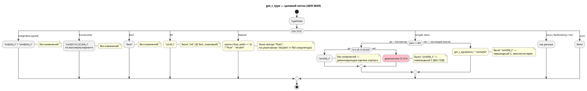

# ADR 0029: Генератор C: отображение типов Array/Bit/Rational

- **Status:** Accepted
- **Date:** 2026-07-15
- **Authors:** Архитектор + Системный аналитик + Дизайнер языка
- **Related issues:** [Фича 0029](../features/0029-c-type-mapping.md); опирается на
  [ADR 0025](0025-simulator-expression-eval.md) (раздел «Пригодность эталона C» —
  там дефект впервые зафиксирован и сузил критерий A8); пересекается с
  [ADR 0020](0020-port-address-decl.md) (цель `c-hal` потребляет C-тип порта для
  ширины доступа); заблокирован [фичей 0026](../features/0026-c-root-typedef.md)

## Context

Единственная точка отображения типов Lam в типы C — функция
`get_c_type(typ: &TypeNode, model: &ModelNode) -> Option<String>`
(`grammar/src/generator/c/mod.rs:150`) и её обёртка `get_typed_variable`
(там же, стр. 202). На трёх типах языка отображение неверно. Ниже — **факты,
перепроверенные пробами** на текущем `HEAD` (ветка `v2`), а не пересказ карточки
кандидата.

### Фактическое отображение (проба `types.lam`)

Модель со всеми интересующими типами (все переменные **используются**, иначе их
срезает фильтр неиспользуемых, см. ниже) даёт:

```c
struct Types {
    int fl;             // var fl: bit
    uint4_t arr8;       // var arr8: [u8; 4]     ← НЕВАЛИДНЫЙ C, массив потерян
    bool bo;            // var bo: bool
    uint8_t b;          // var b: Byte = [bit;8] ← корректно (совпадение)
    float fr[4];        // var fr: [float; 4]    ← корректная форма (спецслучай)
    float r;            // var r: float          ← f32 против f64 симулятора
    uint128_t big;      // var big: U128 = [bit;128] ← НЕВАЛИДНЫЙ C
    enum { … } state;
};
```

`cc -std=c11` на этом выводе: `error: unknown type name 'uint4_t'`,
`error: unknown type name 'uint128_t'`.

### Разбор трёх дефектов

1. **`Array(size, elem)` → `uint{size}_t`.** `size` — **число элементов**
   (`TypeNode::Array(u16, Box<TypeNode>)`, `semantic/type_node.rs:509`), но
   подставляется как **разрядность**. Совпадение спасает только идиому
   бит-вектора: `type Byte = [bit;8]` → `uint8_t` — «правильно» ровно потому, что
   для `[bit;N]` число элементов **и есть** разрядность. Вне этой идиомы:
   - `[u8;4]` → `uint4_t` — типа не существует; размерность массива исчезает;
     тело при этом эмитит `model->data[0] = 7;` — **индексация скаляра**;
   - `[bit;128]` → `uint128_t` — типа нет в стандартном C. Это не гипотетика:
     `examples/include/std.lam` **штатно объявляет** `type u128 = [bit; 128];`.
   - Исключение уже закодировано: `Array(_, Rational)` обрабатывается отдельно и
     даёт `float name[4]` (`get_typed_variable`, стр. 208–214) — **правильную
     форму массива**. То есть целевая форма `elem_t name[N]` в кодовой базе уже
     есть, просто применена к одному элементному типу из всех.
2. **`Bit` → `int`.** 32-битный **знаковый** тип для 1-битной величины.
3. **`Rational` → `float`.** f32 против f64 симулятора. Расхождение **уже
   задокументировано в коде** (`simulation/src/eval/mod.rs:73-75`): «S6: `bit` —
   один бит. Расходится с генератором C (`Bit` → `int`), но сверка по `Bit`
   анализом исключена: эталон C для него дефектен».

### Что в карточке кандидата было неточно

Кандидат утверждает, что переменная-массив «**молча исчезает** из структуры…
тот же класс „тихого пропуска“, что и фича 0025». **Проба это не подтверждает.**
Исчезновение вызвано **фильтром неиспользуемых переменных**
(`c_header.rs:344`: `if !map.usage().variables.contains(&name) { continue; }`),
который **не специфичен для массивов**: неиспользуемый **скаляр** `var ghost: u8`
исчезает ровно так же. Стоит массиву быть использованным — он появляется как
`uint4_t data;`. Это штатное устранение мёртвого кода, а не «тихий пропуск»
класса 0025, и **в предмет данной фичи не входит**. Реальный дефект — не
исчезновение, а **невалидный C и сломанная индексация**. Уточнение важно: иначе
0029 «чинила» бы работающий по замыслу механизм.

### Двойственность `Array`: бит-вектор или настоящий массив

Ключевая сила, определяющая решение. Тип `Array` в Lam несёт **две несводимые
роли**:

| Роль | Идиома | Инициализация в корпусе | Симулятор (`eval::coerce_array`) |
|---|---|---|---|
| **Бит-вектор** (машинное слово) | `type Byte = [bit;8]` | `const MAX: Byte := 0xFF;` — **скаляром** | требует `Value::Array` из 8 элементов |
| **Настоящий массив** | `var arr: [Byte;4]` | `:= { 0, 0, 0, 0 }` — списком | требует `Value::Array` из 4 элементов |

Отсюда — **расхождение, которое эта фича не закрывает и не может закрыть**:
генератор C считает `[bit;8]` скаляром `uint8_t`, а симулятор
(`eval/mod.rs:179`, `coerce_array`) — массивом из 8 значений; на скалярном
`0xFF` он вернул бы `NotCoercible`. Что есть `[bit;8]` — байт или восемь бит —
это **вопрос семантики языка**, а не генератора C, и он решается отдельной
фичей (см. Action items). ADR 0029 сознательно **консервирует** сегодняшнее
поведение C для бит-векторов и чинит всё остальное.

### Поток «как есть» и целевой (правило 18)

Отображение типов — семантика порождаемого кода, поэтому целевое решение
задано диаграммой активности:



## Decision Drivers

1. **Порождаемый C обязан компилироваться.** Генерация C — основная цель проекта
   (правило 12). Тип, который не существует в C (`uint4_t`, `uint128_t`), — не
   «неточность», а невыполнение назначения инструмента.
2. **Согласование с симулятором.** Симулятор — инструмент проверки моделей; его
   расхождение с C обесценивает обе стороны. Сужение критерия **A8** фичи 0025
   (сверка только по `Integer`/`Enum`/`Bool`) — прямое следствие этих дефектов.
3. **Неизменность вывода для работающих типов.** `Integer`, `Enum`, `Bool` и
   идиома `[bit;8|16|32]` отображаются корректно; корпус (`examples/`,
   `tests/data/`) держится на них. Правка не должна их шевелить.
4. **Целевая платформа — промышленные контроллеры** (правило 12). Ширина типа —
   не косметика: она определяет расход ОЗУ, стоимость операции без FPU и —
   через `c-hal` — **ширину доступа к регистру MMIO**.
5. **Явный отказ лучше молчаливой лжи.** Урок 0025. Там, где представление в C
   невозможно (`[bit;128]`), нужна диагностика, а не синтаксически похожий мусор.

## Considered Options

Решение распадается на три независимых выбора. Опции рассмотрены по каждому из
трёх типов.

### Отображение `Rational`

#### Option R-A. Оставить `float` (f32), симулятор округлять до f32

**Pros:**
- Вывод C не меняется; `c-hal` не трогается (ширина порта остаётся 4).
- Дёшево на МК без FPU двойной точности.

**Cons:**
- Правит **симулятор** ради дефекта **генератора** — чинит не ту сторону.
- Ломает `eval::Value::Real(f64)` — ядро, только что стабилизированное 0025;
  цена и риск несоизмеримы с задачей.
- Понижает точность вычислений там, где C-цель вообще не используется.

#### Option R-B. Всегда `double` (f64)

**Pros:**
- Совпадает с симулятором → A8 расширяется на `Rational` без оговорок.
- Одно правило, нечего конфигурировать.

**Cons:**
- **Меняет ширину порта в `c-hal` с 4 на 8** (проба: `Hal_In_RationalPort__ADDR`
  → `{ 0x1008u, -1, 4 }`). Для 32-битного регистра MMIO чтение 8 байт — **дефект
  на реальном железе**, а не смена типа.
- На МК без FPU двойной точности — заметная цена, навязанная всем.

#### Option R-C. `double` по умолчанию + опция `--float-width=32`

**Pros:**
- Верно по умолчанию (совпадает с f64 симулятора), а встраиваемый сценарий
  получает f32 **осознанно**.
- Точка расширения уже есть: `GenerateOptions` (фича 0018-02) — новый флаг
  ложится в существующий контракт, а не создаёт его.
- Позволяет закрыть риск R-B: у пострадавшего от ширины MMIO есть выход.

**Cons:**
- Ещё одна опция CLI: поверхность конфигурации и тестовая матрица растут.
- Смена умолчания всё равно ломает `c-hal` для тех, кто не задаст флаг.

### Отображение `Bit`

#### Option B-A. `bool` (`<stdbool.h>`)

**Pros:**
- Ширина 1; читается как «логическая величина».
- `stdbool.h` уже подключён генератором.

**Cons:**
- **Сливает `bit` и `Bool`** — в языке это **разные** типы (`TypeNode::Bit` vs
  `TypeNode::Bool`), и симулятор их различает: `Bit` → `Value::Number(n & 1)`
  (целое 0/1), `Bool` → `Value::Boolean`. Отображение обоих в `bool` стёрло бы
  в C различие, которое язык проводит намеренно.
- `bit` участвует в арифметике и в бит-векторах (`[bit;8]` → `uint8_t`); `bool`
  как элемент байта концептуально не стыкуется.

#### Option B-B. `uint8_t`

**Pros:**
- Целочисленная семантика 0/1 — ровно то, что даёт симулятор
  (`Number(n & 1)`).
- Ширина 1 → `c-hal` читает из регистра 1 байт вместо 4 (**исправление**
  доступа к MMIO, а не регресс).
- Согласуется с правилом бит-вектора: `[bit;8]` → `uint8_t` = восемь таких бит.
- Не сливает `bit` с `Bool`.

**Cons:**
- Меняет вывод C для очень частого типа (`int flag;` → `uint8_t flag;`).
- Формально всё ещё 8 бит на 1 бит информации (истинной упаковки нет).

#### Option B-C. Битовое поле `unsigned x : 1;`

**Pros:**
- Единственный вариант с **настоящей** 1-битной шириной; упаковка флагов.

**Cons:**
- **У битового поля нельзя взять адрес** → несовместимо с `*(volatile T*)addr`
  цели `c-hal` и с любым указательным доступом. Это дисквалифицирует опцию:
  порты типа `bit` — основной сценарий языка.
- Раскладка битовых полей **определяется компилятором** (порядок, выравнивание)
  → непереносимо, а генератор обязан давать предсказуемый ABI.

#### Option B-D. Оставить `int`

**Pros:**
- Ничего не меняется.

**Cons:**
- 32 бита **со знаком** на 1-битную величину; `c-hal` читает 4 байта из
  битового регистра.
- Консервирует расхождение с симулятором, зафиксированное в `eval/mod.rs:73-75`.

### Отображение `Array`

#### Option A-A. Всегда `elem_t name[N]`

**Pros:**
- Одно правило, никаких спецслучаев; полностью совпадает с `coerce_array`
  симулятора (массив из N элементов).

**Cons:**
- **Ломает идиому бит-вектора**: `[bit;8]` стало бы `uint8_t b[8]` (8 байт
  вместо 1), а `const MAX: Byte := 0xFF;` — скалярная инициализация массива —
  перестал бы иметь смысл. Это 45 из 46 вхождений массивов в корпусе.
- Де-факто меняет семантику языка через генератор — не полномочия ADR по
  генератору.

#### Option A-B. Всегда бит-вектор `uint{N}_t` (как сейчас)

**Pros:**
- Ничего не меняется.

**Cons:**
- Невалидный C для N ∉ {8,16,32,64} и для любого небитового элемента.
- Теряет размерность; эмитит индексацию скаляра.

#### Option A-C. Гибрид: `[bit;N]` — бит-вектор, прочее — настоящий массив

Правило: `Array(N, Bit)` при N ∈ {8,16,32,64} → `uint{N}_t`; `Array(N, Bit)`
при прочих N → диагностика `CC-014`; `Array(N, elem)` при `elem ≠ Bit` →
`get_c_type(elem) + " name[N]"`; невыразимый элемент → `CC-015`.

**Pros:**
- **Сохраняет ровно то, что работает** (все 45 бит-векторов корпуса), и чинит
  ровно то, что сломано.
- Обобщает уже существующий в коде спецслучай `Array(_, Rational)` →
  `float name[N]` до общего правила — не изобретает форму, а достраивает её.
- Невыразимое (`[bit;128]`) даёт **диагностику**, а не мусор (драйвер 5).
- Кодифицирует двойственность `Array` явно, в одном месте, вместо неявного
  совпадения чисел.

**Cons:**
- Спецслучай в отображении — правило перестаёт быть однострочным.
- `type u128 = [bit;128]` из `std.lam` становится **неэмитируемым в C** (сейчас
  «эмитируется» невалидным `uint128_t` — то есть не работает и так).
- Не устраняет расхождение с симулятором по `[bit;N]` — оно уходит в отдельную
  фичу.

## Decision

Принимается **Option R-C** (`double` по умолчанию, опция `--float-width=32`),
**Option B-B** (`Bit` → `uint8_t`), **Option A-C** (гибрид `Array`).

Обоснование связки:

- **A-C** — единственная опция, удовлетворяющая драйверам 1 и 3 одновременно:
  чинит невалидный C, не трогая идиому, на которой держится весь корпус. Она же
  честно очерчивает границу: генератор C не вправе решать, что есть `[bit;8]`, —
  он лишь фиксирует текущий ответ языка и отказывается там, где ответа нет.
- **B-B** — выбран **вопреки** интуитивному `bool` (B-A): симулятор моделирует
  `bit` как целое 0/1, а не как булево, и язык различает `Bit` и `Bool`. `uint8_t`
  сохраняет это различие, даёт правильную ширину MMIO и стыкуется с правилом
  бит-вектора. B-C дисквалифицирован технически (адрес битового поля).
- **R-C** — `double` по умолчанию требуется драйвером 2 (иначе A8 по `Rational`
  не расширить), а опция `--float-width=32` закрывает драйвер 4: без неё смена
  умолчания молча удваивает ширину доступа к вещественному регистру MMIO.

**Версия языка (правило 22).** Синтаксис и семантика Lam не меняются, но
**наблюдаемая семантика порождаемого кода** меняется: точность `float` (f32 →
f64) и ширина `bit` (32 → 8 бит). Это видно пользователю языка, поэтому версия
языка поднимается **0.2.0 → 0.3.0** (minor: поведение изменено, исходники
остаются валидными). Решение пограничное — вынесено на подтверждение заказчику
в [анализе](../analyze/0029-c-type-mapping.md), раздел «Открытые вопросы».

## Consequences

### Положительные

- Порождаемый C компилируется на всех типах языка, для которых представление в C
  определено; для остальных — диагностика вместо мусора.
- Снимается сужение критерия **A8** фичи 0025: сверка симулятора с C
  расширяется на `Rational` и на массивы небитовых элементов.
- `c-hal` начинает обращаться к битовому регистру на его настоящей ширине
  (1 байт вместо 4).
- Двойственность `Array` из неявного совпадения чисел становится явным,
  документированным и протестированным правилом.

### Отрицательные / Action items

- **Вывод C меняется** для `bit` (`int` → `uint8_t`), `float` (`float` →
  `double`) и массивов небитовых элементов. Обоснование нарушения обратной
  совместимости — правило 11 — в анализе, раздел «Особенности по обратной
  функциональности». Все эталоны C-тестов пересобрать зондом (CLAUDE.md: сперва
  зонд, затем assertions — не угадывать строки).
- **Цель `c-hal` меняется**: таблицы `*__ADDR` получат `width` 1 для `bit`
  (было 4) и 8 для `float` при `--float-width=64` (было 4). Проверено пробой.
  Это единственное место, где `get_c_type` потребляется **не** для объявления, —
  `width_from_ctype`/`port_ctype` (`c_header.rs:617-635`); его надо править
  согласованно, иначе `bool`/`uint8_t` попадёт в `_ => 4`.
- **Блокировка 0026.** Критерий «C компилируется» недостижим, пока корневая
  структура не получает `typedef` (проба: **ни один** порождённый заголовок не
  собирается как C11). 0029 не начинать до закрытия 0026.
- **`std.lam` теряет эмиссию `u128`** в C (`CC-014`). Сегодня она даёт невалидный
  `uint128_t`, то есть не работает и так; но факт зафиксировать в документации
  языка.
- **Остаётся расхождение по `[bit;N]`**: C видит скаляр, симулятор — массив из N
  бит. A8 на `[bit;N]` **не** расширяется. Требуется отдельная фича «семантика
  бит-вектора в языке и симуляторе» — предложена координатору в анализе.

### Acceptance criteria

1. Для каждого типа Lam с определённым отображением порождённый C
   **компилируется** `cc -std=c11 -Wall -Werror` (после 0026).
2. `[u8;4]` → `uint8_t data[4]`; индексация `data[0] := 7` — валидный доступ к
   элементу массива.
3. `[bit;8|16|32|64]` → `uint{N}_t` — вывод **байт-в-байт** как до правки.
4. `[bit;128]` → диагностика `CC-014` и ненулевой код возврата CLI; невалидного
   `uint128_t` в выводе нет.
5. `bit` → `uint8_t`; `float` → `double` (по умолчанию) и `float` при
   `--float-width=32`.
6. Вывод для `Integer`/`Enum`/`Bool`/`Struct` — **байт-в-байт** как до правки.
7. Таблицы `c-hal *__ADDR` содержат `width` 1 для `bit`-порта и 8 для
   `float`-порта при умолчании; проверено против зонда.
8. Значения `Rational` и массивов небитовых элементов сходятся между симулятором
   и порождённым C (расширение A8 фичи 0025).
