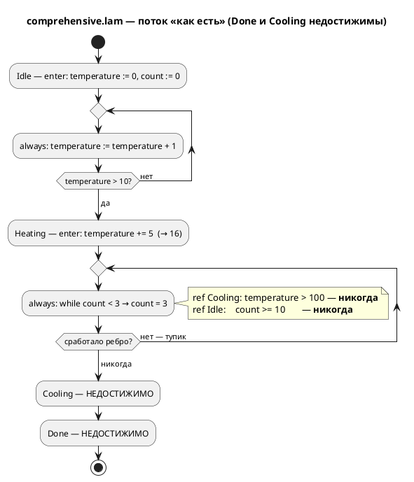
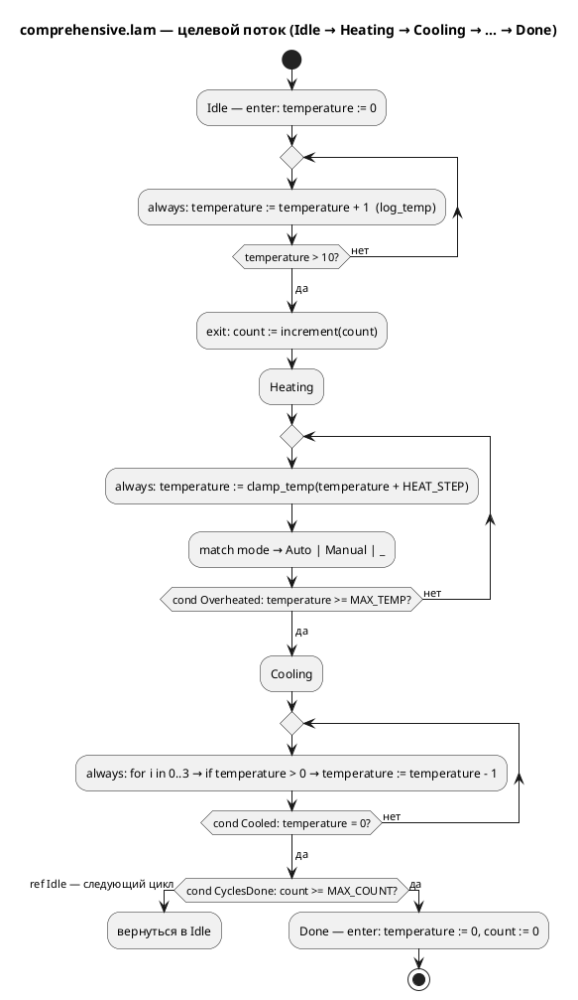

# ADR 0030: Исправление примера comprehensive.lam (недостижимый сценарий)

- **Status:** Accepted
- **Date:** 2026-07-15
- **Authors:** Архитектор + Аналитик
- **Related issues:** [Фича 0030](../features/0030-comprehensive-example-fix.md);
  вытекает из [ADR 0025](0025-simulator-expression-eval.md) (вычислитель
  симулятора — именно он сделал дефект видимым)

## Context

`examples/comprehensive.lam` — «витринный» пример языка: единственный файл в
`examples/`, чья задача — показать **все** конструкции Lam разом. Примеры входят
в документацию по языку (правила 15, 16), собираются в C через `precheck.sh` и
обязаны быть в каноне форматтера. Значит, пример — не иллюстрация, а
**спецификация в исполняемом виде**.

### Что заявлено

Модель `Controller` объявляет четыре состояния с говорящими комментариями:
`Idle` («начальное»), `Heating` («состояние нагрева»), `Cooling` («состояние
охлаждения») и `Done` («конечное состояние — работа завершена»). Между ними
объявлено шесть переходов `ref`. Читатель — и, как показала практика, аналитик —
достраивает из этого сценарий `Idle → Heating → Cooling → Done`.

**Уточнение факта (важно для формулировок).** Шапка примера этот сценарий
**дословно не обещает** — в ней нет строки `Idle → Heating → Cooling → Done`.
Обещание сделано **структурой**: именами состояний, их комментариями и
объявленными рёбрами `ref`. Поэтому дефект нельзя свести к «неточному
комментарию»: **мертвы сами рёбра**, а не текст рядом с ними. Именно из этой
структуры был выведен (и оказался неверным) критерий A6 фичи 0025.

### Что есть на самом деле (проверено прогоном)

```sh
cargo build --bin simulation
./target/debug/simulation examples/comprehensive.lam -n 30
```

```
Шаг   1..10:  [Idle]
Шаг  11..30:  [Heating]
Выполнено 30 шагов (лимит достигнут).
```

`Heating` — **тупик**. Разбор по логике самой модели:

| Ребро | Условие | Почему мертво |
|---|---|---|
| `Heating → Cooling` | `temperature > MAX_TEMP` (100) | в `Heating` температура **не меняется**: `enter` даёт +5 (11 → **16**), `always` её не трогает |
| `Heating → Idle` | `count >= MAX_COUNT` (10) | `while count < 3` упирает счётчик в **3**; `Idle.enter` его к тому же обнуляет |
| `Cooling → Done` | `temperature <= 0` | `Cooling` недостижим (следствие тупика) |
| `Cooling → Idle` | `temperature > 0` | то же |

Итог: **достижимы 2 состояния из 4** (`Idle`, `Heating`), **мертвы 4 ребра из
6**. Значение `temperature = 16` подтверждено пробой (во временную копию
добавлено `ref Done: temperature = 16;` — переход срабатывает на шаге 12).

### Ключевая находка: «минимальная правка» из бэклога недостаточна

Кандидат в `FEATURES.md` предлагал починить логику, «например, нагрев в `always`
состояния `Heating`». **Проверено пробой — этого мало.** С добавленным
`temperature := temperature + 10;` в `always` состояния `Heating`:

```
Шаг  11..19:  [Heating]
Шаг  20:      [Cooling]
Шаг  21..30:  [Idle]
```

`Done` по-прежнему **недостижим** — из-за **второго, независимого дефекта**: в
`Cooling` объявлены `ref Done: temperature <= 0;` и `ref Idle: temperature > 0;`,
а тело охлаждения снимает лишь 3 градуса за такт. Войдя в `Cooling` со 101,
модель на первом же такте имеет `temperature = 98 > 0` → уходит в `Idle`, где
`enter` обнуляет температуру. Ребро `Cooling → Done` мертво **при любом
нагреве**: чтобы оно сработало, вход в `Cooling` должен происходить при
`temperature <= 3`, а вход требует `temperature > 100`.

Вывод для решения: дефект **не один и не локальный**. Это ошибка проектирования
автомата в целом — `Cooling` спроектирован как «шаг охлаждения», а не как
«состояние охлаждения», и потому не удерживает управление до охлаждения.

### Третье расхождение: шапка обещает конструкции, которых нет

Шапка заявляет «условные операторы (**if/else**), циклы (**loop**, for, while),
… именованные условия (**cond**)». Подсчёт по телу примера (без шапки):

| Заявлено | Фактически в теле |
|---|---|
| `else` | **0** |
| `loop` | **0** |
| `cond` | **0** |
| `while` / `for` / `match` / `if` | 2 / 1 / 2 / 3 |

То есть «всесторонний» пример не покрывает три из заявленных им же конструкций.
Это тот же класс дефекта (документ обещает то, чего нет) и правится тем же
действием.

### Поток «как есть»



## Decision Drivers

1. **Пример — документация по языку (правила 15, 16).** Он обязан быть
   корректным: то, что он объявляет, должно исполняться. Мёртвое ребро в витрине
   языка — антипример.
2. **Правдоподобие модели управления (правило 12).** Профиль проекта —
   промышленные системы управления. Контроллер нагрева обязан читаться как
   контроллер нагрева: греет в `Heating`, охлаждает в `Cooling`, завершает в
   `Done`.
3. **Доказуемость, а не убеждение.** Заявленный сценарий обязан проверяться
   **прогоном симулятора** в тесте. Именно отсутствие такой проверки позволило
   дефекту дожить до критерия приёмки чужой фичи.
4. **Язык не меняется (правило 18/22).** Правка — в модели-примере. Ни
   грамматика, ни семантика, ни генераторы не затрагиваются; версия языка не
   растёт. Поэтому диаграмма здесь — **не** EBNF, а **активности целевого
   сценария**: она нужна, чтобы зафиксировать предмет договорённости (какой
   именно автомат считается починенным).
5. **Соразмерность.** Пример — 105 строк. Решение не должно превращаться в
   переписывание документации или в статический анализатор достижимости.

## Considered Options

### Option A. Починить логику модели

Изменить тела состояний и условия рёбер так, чтобы заявленный автомат
действительно проходился: нагрев — в `always` состояния `Heating`, охлаждение —
удерживающее управление в `Cooling`, `Done` — достижимое завершение. Шапка
приводится в соответствие; заявленные `else`/`loop`/`cond` **добавляются** в
модель (а не вычёркиваются из шапки).

**Pros:**
- Устраняет **причину**, а не её описание: мёртвых рёбер не остаётся.
- Единственный вариант, совместимый с драйвером 2: модель начинает быть
  правдоподобным контроллером нагрева, а не автоматом, застревающим в нагреве.
- Сохраняет ценность примера как «всестороннего»: покрытие конструкций не
  сокращается, а дорастает до заявленного.
- Делает возможным приёмочный тест на **достижение `Done`** — самый сильный из
  доступных (терминальное состояние, симуляция завершается сама).
- **Проверено на эскизе**: целевая модель существует и работает (см. Decision).

**Cons:**
- Диффа больше, чем в B: правятся тела `Heating`/`Cooling`, условия рёбер и
  константы.
- Требует прогнать `lamc fmt examples/` и пересобрать порождённый C
  (`precheck.sh`) — впрочем, это обязательная гигиена для любой правки примера.
- «Минимальной» правки не выйдет: как показано в Context, дефектов **два**.

### Option B. Привести комментарий в соответствие с фактическим поведением

Оставить модель как есть, переписав комментарии: `Heating` описать как тупик,
`Cooling`/`Done` — как недостижимые.

**Pros:**
- Минимальный дифф; нулевой риск для `precheck.sh` и генерации C.
- Формально устраняет расхождение «сказано ↔ сделано».

**Cons:**
- **Не устраняет дефект, а узаконивает его.** Мёртвые рёбра остаются в коде
  примера; витрина языка начинает демонстрировать мёртвый код как норму.
- **Противоречит драйверу 2.** Получается «контроллер нагрева, который никогда
  не прекращает нагрев» — модель, которую промышленный инженер обязан
  забраковать. Пример учил бы ровно тому классу ошибок, который Lam призван
  ловить.
- **Противоречит драйверу 3**: проверять прогоном будет **нечего** — тест
  зафиксирует «модель навсегда висит в `Heating`», то есть закрепит дефект
  тестом. Это ровно то, что уже сделано контрпримером T19a в тест-плане 0025 —
  как **констатация**, а не как цель.
- Состояния `Cooling`/`Done` и константа `MAX_COUNT` остаются недостижимым
  балластом: читатель не поймёт, зачем они написаны.
- Не решает третье расхождение (`else`/`loop`/`cond`) иначе как **сокращением**
  заявленного покрытия — «всесторонний» пример становится менее всесторонним.

### Option C. Переписать пример целиком

Спроектировать новую витринную модель с нуля (новый домен, новая структура),
попутно покрыв все конструкции языка.

**Pros:**
- Позволяет заодно выправить структуру примера и покрыть конструкции с запасом.
- Свобода выбрать более выразительный домен управления.

**Cons:**
- **Несоразмерно** (драйвер 5): дефекты локализованы в двух состояниях —
  переписывать 105 строк ради этого нет причин.
- Теряется история файла и узнаваемость примера; ссылки на него из `CHANGES.md`,
  тест-плана и отчёта 0025 перестают соотноситься с содержимым.
- Максимальный риск задеть смежные гейты (формат, генерация C, cmake/ninja) —
  при том, что задача фичи узкая.
- Скрывает урок: ценность в том, чтобы **починить именно этот** автомат, а не
  заменить его другим.

## Decision

Принимается **Option A — починить логику модели**.

Основание: только A удовлетворяет драйверам 1–3 одновременно. B и C отпадают по
разным причинам, но обе — принципиальные: **B закрепляет дефект** (мёртвые рёбра
остаются, а тест сможет проверять лишь факт тупика — то есть узаконит его), **C
несоразмерен** объёму дефекта и рвёт связь с историей файла.

Дополнительно постановляется: **правка не «минимальная», а полная**.
Предложенная бэклогом правка «нагрев в `always` состояния `Heating`» отвергнута
как **проверенно недостаточная** (Context): она чинит первый дефект и оставляет
второй, после чего `Done` остаётся недостижимым — то есть даёт **иллюзию**
починки, которую поймал бы только тест на достижение `Done`.

### Целевой автомат (термоциклирование)

Модель переосмысливается как **контроллер термоциклирования** — правдоподобный
промышленный сценарий (испытательная камера): прогреть объект до `MAX_TEMP`,
охладить до нуля, повторить `MAX_COUNT` раз, завершить работу. Такое прочтение
**даёт смысл всем** элементам, которые сегодня мертвы: `Cooling` удерживает
управление до конца охлаждения, `count`/`MAX_COUNT` считают выполненные циклы (а
не такты `while`), `Done` — завершение программы испытаний.



Ключевые отличия от нынешней модели — каждое закрывает конкретное мёртвое ребро:

| Что | Было | Стало | Какой дефект чинит |
|---|---|---|---|
| Нагрев | только `enter` (+5 → 16) | `always`: `temperature := clamp_temp(temperature + HEAT_STEP)` | `Heating → Cooling` |
| Порог выхода из нагрева | `temperature > MAX_TEMP` (недостижим) | `cond Overheated = temperature >= MAX_TEMP` (достижим) | `Heating → Cooling` |
| Счётчик циклов | `count` обнулялся в `Idle.enter`, упирался в 3 | считает **завершённые циклы** (`Idle.exit`), не обнуляется | `Heating → Idle` (ребро убрано как бессмысленное) |
| Выход из охлаждения | `ref Idle: temperature > 0` срывал охлаждение на первом такте | `ref Idle: Cooled & !CyclesDone` — только по завершении охлаждения | `Cooling → Done` |
| Завершение | `ref Done: temperature <= 0` (недостижим) | `ref Done: Cooled & CyclesDone` | `Cooling → Done` |
| `else`/`loop`/`cond` | заявлены в шапке, отсутствуют | присутствуют (`cond` — три штуки; `else` — в `clamp_temp`) | расхождение шапки |

**Эскиз проверен прогоном** (см. анализ, раздел «Проверка целевого эскиза»):
`Idle(10) → Heating(12) → Cooling(34) → Idle → … ×3 → Done`, завершение за
**172 шага**; `lamc compile -t c` — успешно. Эскиз — доказательство
осуществимости, а не финальный текст: окончательная модель формируется задачей
[0030-01](../development/0030-01-comprehensive-example-fix.md).

### Границы решения

- **Язык не меняется** (правило 22): версия остаётся **0.2.0**. Правится
  `.lam`-файл примера; грамматика, семантика, генераторы и симулятор — нет.
- **Симулятор не чинится этой фичей.** Найденный при анализе отказ
  `elevator_mini.lam` (`SIM-009`) — **дефект симулятора**, не примера, и лежит
  за границами 0030 (см. анализ, «Находки по остальным примерам»).
- **Статический анализ достижимости не вводится.** Соблазн «пусть компилятор
  сам ловит мёртвые рёбра» отклонён как отдельная крупная фича (и в общем виде
  неразрешимый при свободных входных портах). Здесь достижимость проверяется
  **прогоном** — эмпирически, но честно и дёшево.

## Consequences

### Положительные

- Витринный пример языка начинает демонстрировать **работающий** автомат:
  достижимы все 4 состояния, мёртвых рёбер — 0.
- Заявленный сценарий становится **проверяемым машиной** (правило 16), а не
  предметом веры. Класс дефекта, стоивший ошибки в критерии A6 фичи 0025, ловится
  автоматически.
- Пример начинает соответствовать профилю проекта (правило 12): термоциклирование
  — реальный промышленный сценарий, а `count`/`MAX_COUNT`/`Cooling`/`Done`
  получают смысл.
- Ловушка «`comprehensive.lam` дефектен» уходит из контекста проекта (`CLAUDE.md`,
  раздел про симулятор) — её больше не нужно помнить каждой сессии.
- Гейт `0030-02` распространяет защиту на **все** примеры каталога.

### Отрицательные / Action items

- **Меняются ожидания зафиксированных проверок 0025.** Тест-план 0025 содержит
  T19 («`Idle → Heating` на шаге 11») и контрпример T19a («`Heating` — тупик»);
  отчёт 0025 фиксирует находку Н1. После починки T19a **перестаёт
  воспроизводиться** — по замыслу. Артефакты закрытой фичи 0025 **не
  переписываются** (правило 21: они — история решения); расхождение снимается
  ссылкой из отчёта 0030. **Action item:** явно отметить это в отчёте 0030.
- **`examples/generated/c` требует перегенерации** — `precheck.sh` делает это
  сам, но дифф порождённого C попадёт в коммит.
- **Пример становится длиннее по трассе** (≈172 шага против 30) — тест обязан
  задавать бюджет шагов с запасом и проверять **факт завершения**, а не только
  цепочку.
- **Action item:** решить в `0030-02`, как гейт трактует примеры, не исполнимые
  симулятором (`elevator_mini` — `SIM-009`); без явного списка исключений с
  причинами гейт не включится.
- **Action item:** после реализации перенести пример (или его ключевой фрагмент)
  в документацию по языку — правило 16 требует, чтобы проверенные примеры
  попадали в README.

### Acceptance criteria

1. Прогон `./target/debug/simulation examples/comprehensive.lam -n <бюджет>`
   проходит `Idle → Heating → Cooling → … → Done` и **завершается** сообщением о
   достижении терминального состояния (а не «лимит достигнут»).
2. В `examples/comprehensive.lam` **нет мёртвых рёбер**: каждое объявленное `ref`
   срабатывает хотя бы раз в приёмочном прогоне; все 4 состояния достижимы.
3. Шапка примера соответствует телу: каждая заявленная конструкция
   (`if/else`, `loop`, `while`, `for`, `match`, `cond`, `enum`, `extern fn`,
   функции, состояния) **присутствует** — проверяется тестом/`grep`.
4. Сценарий закреплён **автоматическим тестом** в крейте `simulation`
   (прогон симулятора, сверка цепочки состояний и факта завершения), а не только
   документом.
5. Гейт достижимости покрывает **весь** каталог `examples/`: у каждого файла есть
   либо контракт сценария, либо исключение с указанной причиной; новый пример без
   того и другого **валит** тест.
6. `lamc fmt --check examples/` и `./scripts/precheck.sh` проходят (канон формата,
   генерация C, сборка cmake/ninja).
7. Язык не изменён: версия языка — **0.2.0** (правило 22); диффа в
   `grammar/src/`, кроме тестов, нет.
