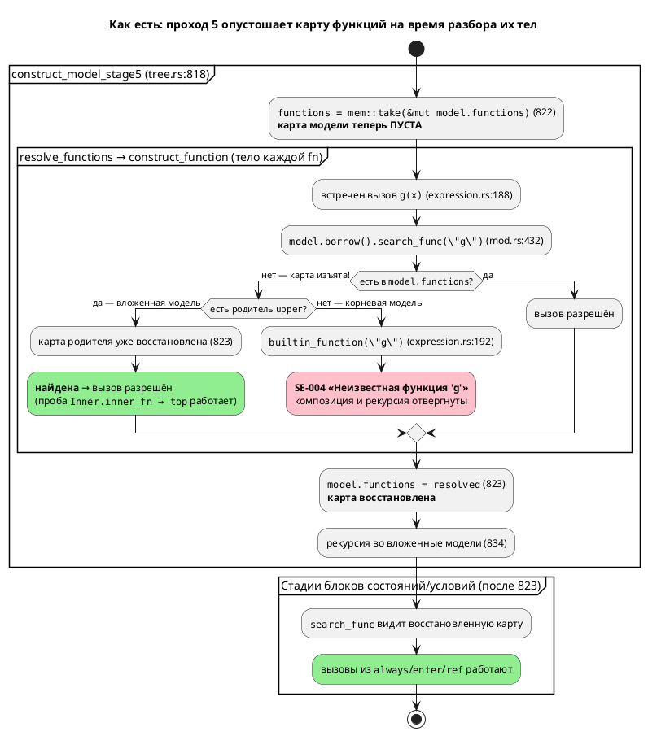
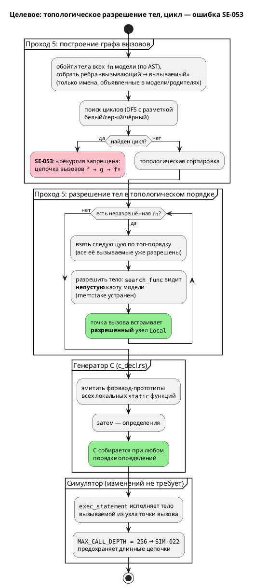
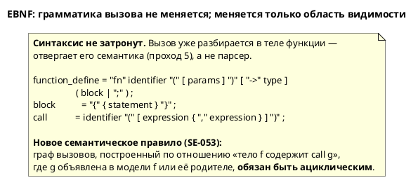

# ADR 0031: Вызов функции из тела функции — композиция без рекурсии

- **Status:** Accepted
- **Date:** 2026-07-15
- **Authors:** Архитектор + системный аналитик + дизайнер языка
- **Related issues:** [Фича 0031](../features/0031-fn-calls-fn.md); связь с
  [ADR 0025](0025-simulator-expression-eval.md) (дефект выявлен при реализации
  0025-02b-2; там же появился предохранитель `MAX_CALL_DEPTH`)

## Context

Семантика Lam отвергает вызов одной функции из тела другой. Обе пробы
воспроизведены (`cargo run --bin lamc -- compile -t c <файл>.lam -o <вывод>`):

| Проба | Исходник | Фактическое сообщение |
|---|---|---|
| Композиция | `fn g(x: u8) -> u8 { return x; }`<br>`fn f(x: u8) -> u8 { return g(x); }` | `Ошибка компиляции: Неизвестная функция 'g'` |
| Прямая рекурсия | `fn f(x: u8) -> u8 { return f(x); }` | `Ошибка компиляции: Неизвестная функция 'f'` |
| Вызов из `always` (контроль) | `start Main { always { y := g(1); } }` | **успех** — C сгенерирован |

Диагностика — `SE-004` (`semantic/builtin.rs:50`). Формулировка вводит в
заблуждение: функция `g` объявлена, но на момент разбора тела `f` **не видна**.

### Корневая причина

Проход 5 «Тела функций», `semantic/tree.rs:818-823`:

```rust
fn construct_model_stage5(model: Rc<RefCell<ModelNode>>) -> … {
    // Разрешаем функции на уровне текущей модели
    let functions = std::mem::take(&mut model.borrow_mut().functions);   // ← строка 822
    model.borrow_mut().functions = resolve_functions(functions, model.clone())?;  // ← 823
    …
    for (name, nested_model) in nested {          // ← 834: вложенные модели ПОСЛЕ восстановления
        models.insert(name, construct_model_stage5(nested_model)?);
    }
```

`std::mem::take` **изымает** карту функций из модели (оставляя `HashMap`
по умолчанию) и отдаёт её в `resolve_functions`, которая разрешает тела против
**той же самой** `model` — а её `functions` в этот момент пуста. Далее
`search_func` (`semantic/mod.rs:432-440`) не находит имя локально, поднимается по
цепочке `upper` (для корневой модели её нет) и возвращает `None`; точка вызова
`expression.rs:188-193` трактует ненайденное имя как **встроенную** функцию и
падает в `builtin_function` → `SE-004`.

`mem::take` здесь — обход двойного заимствования `RefCell` (нельзя держать
`borrow_mut()` на `model`, пока `resolve_functions` берёт `borrow()`), то есть
**артефакт дисциплины заимствования, а не решение о языке**.

**Ключевое доказательство, что запрет случаен.** Стадия 5 восстанавливает карту
родителя (строка 823) **до** рекурсии во вложенные модели (строка 834), поэтому
функция вложенной модели **уже сегодня успешно вызывает** функцию родительской —
проба скомпилирована, порождённый C собран `cc` без ошибок:

```lam
fn top(x: u8) -> u8 { return x; }
model Inner {
    fn inner_fn(x: u8) -> u8 { return top(x); }   // работает!
    …
}
```

Язык, таким образом, уже допускает `fn → fn` **между** уровнями моделей и
запрещает только **внутри** одного уровня. Такая асимметрия не может быть
осознанной семантикой.

### Поток «как есть»



### Что ещё вскрыл разбор (влияет на выбор варианта)

1. **Функции хранятся по значению.** `ModelNode.functions:
   HashMap<String, FunctionDefinitionNode>` (`mod.rs:77`), а `search_func`
   возвращает `Rc::new(RefCell::new(func.clone()))` (`mod.rs:434`) — **свежую
   копию** узла с телом (`body: StatementNode` лежит в узле по значению,
   `mod.rs:628`). Точка вызова `ExpressionNode::Function` встраивает **глубокий
   снимок** тела вызываемой функции. Следствие: **рекурсия структурно
   невыразима** — копия тела `f` обязана содержать копию тела `f`. Композиция же
   выражается штатно, если разрешать функции в **топологическом порядке** графа
   вызовов (сначала `g`, затем `f` встроит уже разрешённую копию `g`).
2. **Генератор C: прототипов нет, порядок алфавитный.** `c_decl.rs:211-216`
   печатает определения после `local_funcs.sort()` — сортировки **строк
   определений**, а не топологической. Проба: `fn zz`, `fn aa` → в C
   `Order_aa` перед `Order_zz`. Значит для `f → g` в одной модели генератор
   выдал бы `Compose_f` **до** `Compose_g`; такой C не собирается:
   `error: call to undeclared function 'Compose_g'` (проверено `cc -std=c99`).
   Тезис витрины «генератор C её, судя по всему, поддержал бы» подтверждён лишь
   **частично**: для **межмодельных** вызовов C корректен и собирается (проба
   `nested.lam`), для **внутримодельных** — требуется эмиссия форвард-прототипов.
3. **`SE-009` («Функция с именем … уже определена», `function.rs:43-47`) —
   мёртвый код и ловушка.** Проверка `model.borrow().functions.contains_key(&name)`
   проходит только потому, что карта изъята `mem::take`. Наивная правка
   «клонировать вместо take» заставит **каждую** функцию сообщить «уже
   определена». Сегодня же дубликат `fn f` принимается молча — побеждает
   последний (проба: две `fn f` → в C `return 2;`).
4. **Симулятор к вызову `fn → fn` уже готов.** `unit/statement.rs` разбирает
   вызываемую функцию из узла в точке вызова (ветки `Local`/`External`/
   `Builtin`/`Unresolved`, `statement.rs:395-421`), а не из карты модели; тело
   исполняет общий `exec_statement`. Предохранитель `MAX_CALL_DEPTH = 256`
   (`statement.rs:41`) со счётчиком `CALL_DEPTH` (`statement.rs:438-444`) и
   диагностикой `SIM-022` (`statement.rs:459-465`) уже на месте. Изменений кода
   симулятора фича не требует.

## Decision Drivers

1. **Композиция функций — базовое ожидание от языка.** Без неё `fn` вырождается
   в плоские, дублирующие друг друга тела; это бьёт по читаемости спецификаций.
2. **Запрет случаен, а не спроектирован.** Межмодельный `fn → fn` уже работает
   (доказано пробой). Закреплять асимметрию как правило языка нельзя.
3. **Домен — промышленные системы управления (правило 12).** Целевой C —
   встраиваемый: стек ограничен, требуется верифицируемость и оценка WCET.
   Рекурсия в этом классе систем запрещается отраслевыми стандартами: MISRA
   C:2012 Rule 17.2 («Functions shall not call themselves, either directly or
   indirectly»), IEC 61131-3 не допускает рекурсию в POU. Отсутствие рекурсии —
   **преимущество** языка автоматных моделей, а не пробел.
4. **Архитектура семантики.** Хранение функций по значению делает композицию
   дешёвой, а рекурсию — невыразимой. Решение не должно втягивать проект в
   рефакторинг модели владения ради возможности, противопоказанной домену.
5. **Честная диагностика.** Любой отвергнутый случай обязан объясняться по
   существу («рекурсия запрещена»), а не «Неизвестная функция».

## Considered Options

### Option A. Разрешить вызовы функций из функций, включая рекурсию

Перевести `ModelNode.functions` на разделяемые дескрипторы
(`HashMap<String, Rc<RefCell<FunctionDefinitionNode>>>`), `search_func` — на
возврат общего `Rc`, разрешение сделать двухфазным («объявить все → разрешить
тела»). В генераторе C эмитить форвард-прототипы; в симуляторе положиться на
`MAX_CALL_DEPTH`.

**Pros:**
- Композиция и рекурсия доступны; язык выразительнее.
- Устраняет снимочное копирование тел — точка вызова ссылается на определение
  (побочно экономит память и чинит класс «снимок устарел»).
- Симулятор готов: `MAX_CALL_DEPTH`/`SIM-022` дают диагностику вместо срыва стека.
- C-рекурсия компилируется штатно (при наличии прототипов).

**Cons:**
- **Противопоказано домену (правило 12).** Рекурсия на встраиваемой цели —
  неограниченный стек и неоценимый WCET; прямо запрещена MISRA C:2012 Rule 17.2
  и IEC 61131-3. Язык синтеза управляющих автоматов не должен порождать C,
  который заказчик обязан запретить у себя.
- **Крупный рефакторинг модели владения** — `functions` по значению читают
  семантика, оба генератора, симулятор, LSP и `unused.rs`; смена типа карты
  задевает всех потребителей и все снапшот-тесты codegen.
- **Глубокий `clone()` становится ловушкой:** `FunctionDefinitionNode: Clone`
  (`mod.rs:608`) — при рекурсии любое случайное значение-клонирование даёт
  зацикливание; инвариант «клонировать только `Rc`» ничем не охраняется.
- Верификация (LTL/Бюхи) и оценка завершимости моделей усложняются.
- `MAX_CALL_DEPTH = 256` превращается из предохранителя в **семантику языка**
  (предел рекурсии), причём в симуляторе он есть, а в порождённом C — нет:
  симулятор и C разойдутся на глубоких рекурсиях.

### Option B. Разрешить вызовы функций, запретив циклы в графе вызовов

Тело функции видит функции своей модели (и родительских — как уже сегодня).
Граф вызовов строится на стадии 5; **цикл** (`f→f`, `f→g→f`, любой длины) —
ошибка с новым кодом `SE-053`. Тела разрешаются в **топологическом** порядке.
В генераторе C эмитятся форвард-прототипы локальных функций.

**Pros:**
- Даёт ровно то, чего не хватает (композицию), и снимает случайную асимметрию
  «внутри модели нельзя, между моделями можно».
- **Ложится на текущую архитектуру:** топологический порядок разрешения — это
  именно то, что умеет модель хранения по значению; ацикличность и есть условие
  выразимости. Рефакторинг владения не нужен.
- **Соответствует домену и стандартам** (MISRA C:2012 Rule 17.2, IEC 61131-3):
  ограниченный стек, вычислимый WCET, верифицируемость.
- Граф вызовов ациклический ⇒ топологический порядок эмиссии/прототипы в C
  делаются тривиально и детерминированно.
- Рекурсия отвергается **по существу** (`SE-053` с цепочкой вызовов), а не
  «Неизвестная функция».
- `MAX_CALL_DEPTH` остаётся честным предохранителем: он **достижим** и без
  рекурсии — длинной нерекурсивной цепочкой `f1→f2→…→f257`.

**Cons:**
- Нужна реализация поиска циклов (обход в глубину с цветовой разметкой) и
  внятное сообщение с цепочкой.
- Рекурсивные алгоритмы (обход деревьев и т. п.) на Lam невыразимы — обходятся
  циклами `while`/`loop`, которые в языке есть.
- Порядок разрешения функций перестаёт быть произвольным — вводится зависимость
  от графа; при ошибке реализации возможен регресс уже работающих межмодельных
  вызовов (снимается тестами).

### Option C. Оставить запрет, зафиксировав диагностикой и документацией

Не менять семантику; заменить `SE-004` на явное «вызов функции из тела функции
не поддерживается» и записать ограничение в README.

**Pros:**
- Нулевой риск для кода; минимальные трудозатраты.
- Честнее нынешнего вводящего в заблуждение «Неизвестная функция 'g'».
- Сохраняет плоский, тривиально верифицируемый граф вызовов.

**Cons:**
- **Возводит дефект в ранг правила языка.** Запрет доказуемо случаен: он не
  распространяется на межмодельные вызовы, которые работают (проба `nested.lam`).
- Ставит перед выбором, каждый вариант которого плох: либо документировать
  асимметрию «внутри модели нельзя, между моделями можно» (несогласованная,
  необъяснимая семантика), либо **запретить и межмодельные вызовы** — то есть
  сломать обратную совместимость и уже работающую функциональность ради
  сохранения дефекта.
- Композиция — базовое ожидание; её отсутствие бьёт по главной цели проекта
  (правило 12) — спецификации промышленных автоматов дублируют логику.
- Не даёт ничего домену: безопасность обеспечивает запрет **рекурсии**, а не
  запрет вызовов; Option B даёт ту же безопасность без потери выразительности.

## Decision

Принимается **Option B** — вызовы функций из тел функций разрешаются, циклы в
графе вызовов запрещаются новой диагностикой `SE-053`.

Обоснование. Option C отвергнут: он закрепляет доказуемо случайный дефект и, если
доводить его до логической согласованности, требует сломать уже работающие
межмодельные вызовы. Option A отвергнут не из-за трудоёмкости, а по **существу
домена**: рекурсия на встраиваемой цели противопоказана и прямо запрещена
отраслевыми стандартами (MISRA C:2012 Rule 17.2, IEC 61131-3), поэтому платить за
неё сменой модели владения во всех потребителях — значит покупать возможность,
которую заказчик обязан запретить у себя. Option B закрывает реальную потребность
(композицию), совпадает с ограничением, которое отрасль вводит **намеренно**, и
ложится на существующую архитектуру: ацикличность графа вызовов — ровно то
условие, при котором хранение функций по значению корректно, а эмиссия C
детерминирована.

Запрет рекурсии тем самым перестаёт быть побочным эффектом дефекта и становится
**осознанным свойством языка**, зафиксированным диагностикой и документацией —
то есть выполняется и рекомендация исходного кандидата из витрины.

### Целевой поток



### Целевой EBNF (справочно — грамматика не меняется)



## Consequences

### Положительные

- Композиция функций работает внутри модели — как уже работает между моделями и
  из блоков `always`/`enter`/`exit`/`ref`.
- Запрет рекурсии становится осознанным и объяснённым: `SE-053` с цепочкой
  вызовов вместо `SE-004` «Неизвестная функция 'f'».
- Устраняется асимметрия уровней моделей — семантика становится объяснимой.
- Побочно чинится `SE-009`: дубликат `fn` перестаёт молча приниматься (сегодня
  побеждает последний).
- `MAX_CALL_DEPTH` (`statement.rs:41`) обретает смысл: он остаётся достижимым
  через длинные нерекурсивные цепочки и сохраняется как предохранитель.
- Генератор C становится устойчив к порядку определений (форвард-прототипы).

### Отрицательные / Action items

- **A1.** Устранить `mem::take` (`tree.rs:822`) — разрешать тела в топологическом
  порядке, не изымая карту. Осторожно: наивная замена на `clone()` **сломает**
  `SE-009` (`function.rs:43`) — проверка дубликата должна переехать к точке
  вставки (`tree.rs:458`), где сегодня `HashMap::insert` молча перетирает.
- **A2.** Реализовать построение графа вызовов и поиск циклов → `SE-053`
  (следующий свободный код: занято по `SE-052`).
- **A3.** Генератор C — эмиссия форвард-прототипов локальных функций
  (`c_decl.rs:211-216`); иначе `f → g` в одной модели даёт несобираемый C
  (проверено `cc`).
- **A4.** Рекурсивные алгоритмы невыразимы — задокументировать в README
  (раздел «Функции») с обходным путём через `while`/`loop`.
- **A5.** Версия языка **0.2.0 → 0.3.0** (правило 22): расширение аддитивно —
  ранее отвергавшиеся программы компилируются, ни одна валидная программа не
  меняет смысла.
- **A6.** `compute_usage` (`unused.rs:56-58`) уже обходит тела функций, поэтому
  транзитивно вызываемая `g` не будет отброшена фильтром `usage()` в
  `c_decl.rs:132`; проверить тестом (множество — надмножество нужного, ошибка
  безопасна).

### Acceptance criteria

1. `fn f(x: u8) -> u8 { return g(x); }` с объявленной `fn g` компилируется; в
   порождённом C `Model_f` вызывает `Model_g`, и вывод собирается `cc -std=c99`
   без ошибок и предупреждений о неявных объявлениях.
2. `fn f(x: u8) -> u8 { return f(x); }` отвергается с кодом `SE-053` и
   сообщением, называющим рекурсию и цепочку вызовов (не `SE-004`).
3. Взаимная рекурсия `f→g→f` отвергается тем же `SE-053` с полной цепочкой.
4. Вызов действительно неизвестного имени (`ghost()`) по-прежнему даёт `SE-004`.
5. Межмодельный вызов (`Inner.inner_fn → top`) продолжает работать — регресса нет.
6. Симулятор и порождённый C дают одинаковые значения на композиции функций
   (сверка `conformance_c_tests.rs` по установившимся значениям, `Integer`/`Bool`).
7. Версия языка в README — `0.3.0`, раздел «Функции» описывает композицию и
   явный запрет рекурсии; примеры и контрпримеры перенесены в документацию
   (правило 16).
