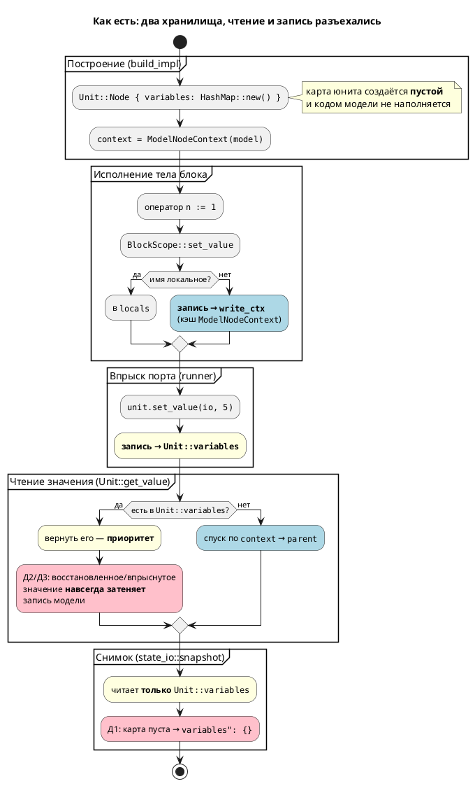
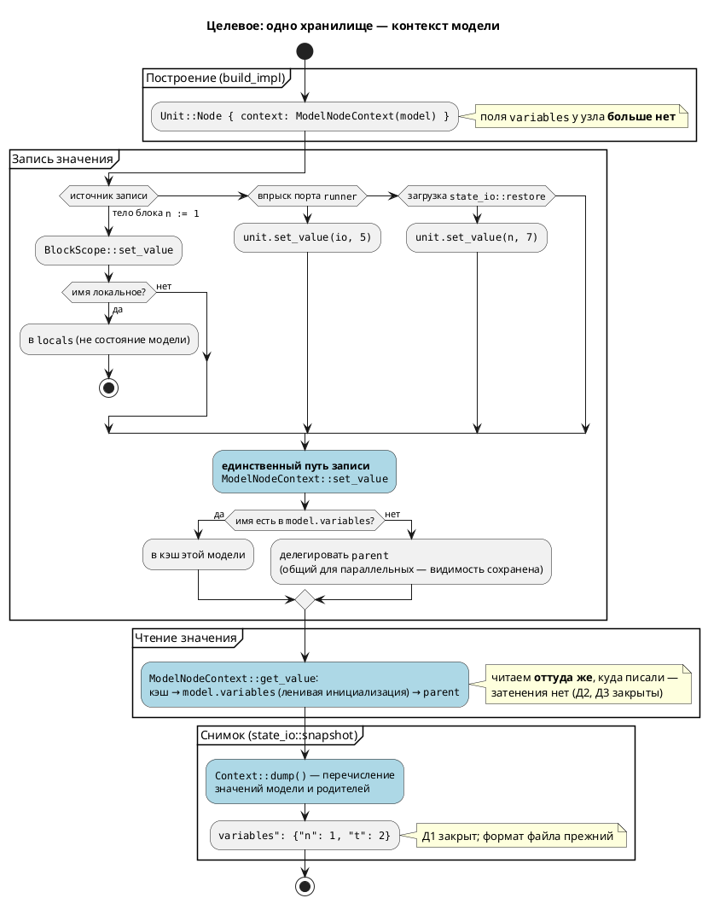

# ADR 0032: Единый источник истины для значений переменных симулятора

- **Status:** Accepted
- **Date:** 2026-07-15
- **Authors:** Архитектор + системный аналитик
- **Related issues:** [Фича 0032](../features/0032-state-io-variables.md);
  дефект на территории [фичи 0014](../features/0014-state-io.md) (`ГОТОВО`);
  связь с [ADR 0025](0025-simulator-expression-eval.md) — то же явление
  («два механизма там, где семантика одна»), но на уровне **хранения** значений,
  а не их **вычисления**.

## Context

`--save-state` записывает файл, в котором `"variables": {}`, хотя трасса того же
прогона показывает верные значения. Дефект **предсуществующий**: он не внесён
фичей 0025 (исходный код писал туда же), но до неё был незаметен — присваивания
не исполнялись вовсе, и save/load честно «сохранял пустоту» из пустоты. Починив
вычисление (0025), мы сделали видимой ошибку **хранения**.

### Два хранилища значений

В `simulation` значения переменной живут в **двух** независимых картах:

| Хранилище | Место | Кто пишет | Кто читает |
|---|---|---|---|
| `Unit::Node { variables: HashMap<String, Value> }` | `unit/mod.rs:94` | `runner::apply_step_inputs` (впрыск `in`/`inout`-портов, `runner.rs:257,267`); `state_io::restore` (`state_io.rs:93`) | `Unit::get_value` — **первым** (`unit/mod.rs:125`); `state_io::snapshot` — **только его** (`state_io.rs:57`) |
| `ModelNodeContext { cache: RefCell<HashMap<String, Value>> }` | `unit/builder.rs:32` | **весь код модели**: `BlockScope::set_value` → `write_ctx` (`unit/statement.rs:70`) | `Unit::get_value` — **вторым**, по цепочке `context` → `parent` (`unit/mod.rs:128`) |

Ключевой факт, снимающий все сомнения: `build_impl` создаёт узел **всегда** с
`variables: HashMap::new()` (`unit/builder.rs:258`). Для реальной модели карта
юнита пуста — код модели в неё **никогда не пишет**. Именно её и сериализует
`snapshot`. Отсюда `"variables": {}` — не «потеря» значений, а чтение карты,
которая никогда и не наполнялась.

Заявление кандидата про `Unit::get_value`, читающий оба хранилища,
**подтверждено** (`unit/mod.rs:119–139`): сначала `variables`, затем `context`.
Это и маскировало дефект — трасса (`Unit::variable` → `get_value`,
`unit/mod.rs:471`) выглядела правдоподобно.

### Инвентарь дефектов (все воспроизведены пробами)

| № | Дефект | Место | Проявление |
|---|---|---|---|
| Д1 | `snapshot` читает карту юнита, которая для реальной модели всегда пуста | `state_io.rs:57` | `--save-state` → `"variables": {}` при `n=1, t=2` в трассе |
| Д2 | `restore` пишет в карту юнита, а та имеет **приоритет чтения** над контекстом | `state_io.rs:93` + `unit/mod.rs:125` | после `--load-state` модель **заморожена**: `n := n + 1` не меняет `n` **никогда** |
| Д3 | Впрыск `inout`-порта пишет в ту же приоритетную карту | `runner.rs:267` | `io := 99` в модели **невидимо**: и трасса, и `guard` видят впрыснутое значение |

**Д2 и Д3 обнаружены при архитектурной проработке**, в кандидате их не было.
Они принципиальны для выбора решения: Д2 означает, что «починить только
`snapshot`» — победа мнимая (значения восстановятся, но модель после загрузки
мертва), а Д3 доказывает, что расщепление вредит **независимо** от save/load.

### Пробы (воспроизведение)

Каталог `$S` — временный; модель `probe.lam`: `var n, t: u8 := 0`, в `always`
`n := 1; t := 2;`.

```sh
cargo build --bin simulation
./target/debug/simulation $S/probe.lam -n 3 --save-state $S/state.json
cat $S/state.json
```

```
Шаг   1:  [Idle]  vars:n=1  t=2          ← трасса верна
{ "kind": "Node", "current_state": "Idle", "variables": {} }   ← Д1
```

Д2 — модель `probe_inc2.lam` (`always { n := n + 1; }`), файл состояния с `n=7`:

```
без --load-state:  Шаг 1: n=1 · Шаг 2: n=2 · Шаг 3: n=3 · Шаг 4: n=4   ← счётчик живёт
с  --load-state:   Шаг 1: n=7 · Шаг 2: n=7 · Шаг 3: n=7 · Шаг 4: n=7   ← заморожен
```

Д3 — модель с `inout io: u8`, впрыск `io=5`, в модели `io := 99`:

```
Шаг 1:  inout:io=5  vars:seen=5     ← запись io := 99 невидима
Шаг 2:  inout:io=5  vars:seen=5
```

Побочно проба **опровергает** часть кандидата: `restore` **работает** — файл
состояния, написанный вручную (`{"n": 7, "t": 9}`), загружается и виден в трассе.
Сломан только `snapshot`. Тезис кандидата «после `--load-state` → `n=0`» верен,
но по другой причине: `n=0` не потому, что загрузка не работает, а потому, что
**сохранять было нечего** (Д1).

### Поток «как есть»



### Корневая причина

Дефект — **не** «`snapshot` смотрит не туда». Смотреть не туда стало возможно,
потому что архитектура это позволяет и не сигнализирует:

1. **Два хранилища одной сущности.** У «значения переменной `n`» два законных
   адреса. Любой новый потребитель (снимок, отладчик, будущий `assert`) обязан
   угадать правильный — и ошибка угадывания **молчалива**.
2. **Асимметрия чтения и записи.** Читаем из двух мест с приоритетом, пишем — в
   одно. Это не симметричная пара, а воронка: записанное и прочитанное — разные
   вещи. Отсюда Д2 и Д3 буквально: пишем в кэш, читаем из юнита.
3. **Приоритет чтения задан «сверху» и навсегда.** `Unit::variables` выигрывает
   всегда. Для впрыска `in`-порта это верно (среда диктует значение), для
   восстановления и для `inout` — неверно. Одно правило обслуживает два
   несовместимых сценария.

Пока эти свойства сохраняются, точечная починка `snapshot` закроет Д1 и оставит
Д2/Д3 — а следующий потребитель значений заведёт Д4.

### Почему это важно

Симуляция — способ проверить модель **до** синтеза в C (правило 12).
`--save-state`/`--load-state` существуют, чтобы продолжить длинный прогон с
сохранённого места; сейчас продолженный прогон **гарантированно недостоверен** —
модель после загрузки не считает. Это ровно та ложная уверенность, против которой
принят ADR 0025. При этом полный прогон тестов **зелёный** — см. раздел «Почему
тесты этого не поймали» в [тест-плане](../tests/0032-state-io-variables.md).

## Decision Drivers

1. **Закрыть класс дефекта, а не одно его проявление.** Главный критерий: чтобы
   четвёртый потребитель значений не мог молча прочитать не то хранилище. Всё
   остальное вторично (тот же драйвер № 1, что в ADR 0025).
2. **Достоверность продолженного прогона.** Модель, восстановленная из файла,
   обязана вести себя так же, как непрерывно работавшая. Иначе save/load — не
   функция, а ловушка.
3. **Сохранить видимость переменных между параллельными моделями.** Общий
   родительский контекст (`ModelNodeContext`, `builder.rs:295–305`) — то, на чём
   держатся сценарии `stacker_*`. Любое решение обязано его сохранить; это
   явно зафиксировано в [`0025-02b-1`](../development/0025-02b-1-statement-interpreter.md).
4. **Не менять язык и не ломать формат файла состояния** (правила 11, 22).

## Considered Options

### Option A. `snapshot` читает через `Context`

`state_io::snapshot` перестаёт читать `Unit::variables` и запрашивает значения
через `Unit::get_value`/контекст модели. Хранилищ по-прежнему два.

**Pros:**
- Наименьшее изменение: правится один модуль.
- Закрывает Д1 — файл состояния наполняется.
- Формат файла не меняется.

**Cons:**
- **Не закрывает Д2** — и это дисквалифицирует опцию, а не просто ограничивает.
  `restore` продолжит писать в `Unit::variables`; круговой рейс станет
  «зелёным» по значениям (сохранили `n=7` → загрузили `n=7`), но загруженная
  модель останется **замороженной**. Тест кругового рейса это **не поймает**,
  если сверять только значения сразу после загрузки. Мы получили бы дефект,
  прикрытый тестом, — состояние хуже нынешнего.
- Не закрывает Д3 (`inout`) вовсе.
- Требует расширить контракт `Context`: у трейта есть только
  `get_value(name)`/`set_value(name, value)` (`context.rs:6,8`) и **нет
  перечисления имён**, а `Unit::Node.context` типизирован как
  `Rc<RefCell<dyn Context>>` (`unit/mod.rs:88`) — до `ModelNode` из снимка не
  дотянуться. То есть «малое» изменение всё равно трогает общий контракт.
- Оставляет два хранилища → корневая причина жива, драйвер № 1 не выполнен.

### Option B. Запись идёт в `Unit::variables`

`BlockScope::set_value` пишет не в `write_ctx`, а в юнит; `snapshot` тогда
читает верную карту без изменений.

**Pros:**
- `snapshot`/`restore` не трогаются вовсе.
- Симметрия «читаем и пишем в юнит» — на первый взгляд проще.

**Cons:**
- **Ломает видимость между параллельными моделями** — драйвер № 3. У каждого
  параллельного `Unit::Node` **своя** карта `variables`; общий родительский
  `ModelNodeContext` перестанет получать записи, и подмодели `stacker_*`
  перестанут видеть shared-переменные (`busy`, `tgt_*`, `lift_*`). Это не
  гипотеза: ровно эта ошибка была допущена и поймана до прогона в
  [`0025-02b-1`](../development/0025-02b-1-statement-interpreter.md) —
  «`Unit::set_value` пишет в `Unit::variables`, а не в кэш модели, и сценарии
  `stacker_*` (5 штук) сломались бы».
- `Unit::Parallel::set_value` **широковещателен** (`unit/mod.rs:147–151`): пишет
  имя во **все** дочерние юниты. Как механизм shared-переменных это заведомо
  неверно — локальная переменная одной подмодели затрёт одноимённую у соседней.
- Разрывает связь значения с типом: усечение по типу (S1/S6/S9 фичи 0025)
  опирается на `ModelNode::variables`, доступный из `ModelNodeContext`, но не из
  `Unit`.
- Два хранилища остаются → драйвер № 1 не выполнен.

### Option C. Одно хранилище: контекст модели — единственный источник истины

`Unit::Node.variables` **упраздняется**. Все значения живут в
`ModelNodeContext` (кэш поверх `ModelNode::variables`). Соответственно:

- `Unit::get_value`/`set_value` делегируют в `context` — без приоритетной карты.
- Впрыск портов (`runner::apply_step_inputs`) идёт тем же путём, что запись
  модели, → Д3 закрыт: последняя запись выигрывает, как и должно быть.
- `restore` пишет через `Context::set_value` — тем же путём, что присваивание,
  → Д2 закрыт: загруженная модель считает.
- `snapshot` читает через контекст → Д1 закрыт.
- Контракт `Context` расширяется перечислением значений (нужно и для A).

**Pros:**
- **Закрывает класс** (драйвер № 1): у значения остаётся один адрес, угадывать
  нечего. Четвёртый потребитель не может ошибиться.
- Закрывает Д1, Д2 **и** Д3 одной правкой.
- **Сохраняет** общий родительский контекст и видимость `stacker_*` (драйвер
  № 3) — механизм shared-переменных не трогается, а становится единственным.
- Устраняет широковещательный `Unit::Parallel::set_value` как побочный эффект.
- Формат файла состояния не меняется (драйвер № 4).

**Cons:**
- Крупнее A: затрагивает `unit/mod.rs`, `unit/builder.rs`, `runner.rs`,
  `state_io.rs`, `context.rs`.
- Требует переписать юнит-тесты, конструирующие `Unit::Node { variables }`
  вручную (`state_io.rs:153–200`) — но именно эта ручная конструкция и скрыла
  дефект (см. тест-план), так что переписать их **нужно** независимо.
- Меняет приоритет впрыска `in`-порта: сейчас впрыснутое значение «липкое» и
  выигрывает всегда, после — модель технически может его перезаписать. Риск
  теоретический: запись в `in`-порт запрещена семантикой; фиксируется как
  проверяемый пункт анализа.
- Снимок параллельных моделей продублирует shared-переменные родителя в снимок
  каждого ребёнка (восстановление идемпотентно — значения одинаковы). Плата за
  неизменность формата; разбор — в анализе.

## Decision

Принимается **Option C**.

Опция A отклонена не за «недостаточность», а потому, что она **опасна**: закрыв
Д1, она оставляет Д2 и при этом делает круговой рейс внешне исправным — дефект
получил бы зелёный тест в качестве прикрытия. Опция B отклонена как заведомо
ломающая драйвер № 3: этот путь уже проходили в `0025-02b-1` и развернули.

Опция C — единственная, где выполняется драйвер № 1. Наличие двух хранилищ
значений является **архитектурным дефектом само по себе**, а не деталью
реализации: Д1, Д2 и Д3 — три разных симптома одной причины, проявившиеся в трёх
несвязанных подсистемах (снимок, загрузка, порты). Чинить симптомы поочерёдно —
значит согласиться на Д4.

Решение прямо продолжает линию [ADR 0025](0025-simulator-expression-eval.md):
там «семантика вычисления живёт только в `eval/`», здесь — «значение переменной
живёт только в контексте модели».

### Целевой поток



## Consequences

### Положительные

- У значения переменной **один** адрес: `snapshot`, `restore`, впрыск портов и
  код модели ходят одним путём. Класс дефекта закрыт.
- Д1, Д2, Д3 закрываются одной правкой; `--load-state` даёт живую модель.
- `inout`-порты начинают работать (Д3) — побочная, но реальная починка
  симуляции, не связанная с save/load.
- Видимость shared-переменных между параллельными моделями сохранена и
  становится **единственным** механизмом (исчезает конкурирующая
  широковещательная запись `Unit::Parallel::set_value`).
- Формат файла состояния не меняется; ранее сохранённые файлы читаются.

### Отрицательные / Action items

- **Контракт `Context` расширяется** методом перечисления значений (`dump`) —
  трейт внутренний (`pub(crate)`, `context.rs:4`), публичный API крейта не
  затрагивается. Уточнить сигнатуру в анализе.
- **Юнит-тесты `state_io.rs`, конструирующие `Unit::Node` вручную, подлежат
  переписи** на построение через `build_unit` из `.lam`-фикстуры. Это не
  накладной расход, а устранение причины, по которой дефект прожил при зелёных
  тестах.
- **Снимок дублирует shared-переменные родителя** в снимок каждого параллельного
  ребёнка. Восстановление идемпотентно; альтернатива (отдельная секция `shared`
  в файле) сломала бы формат — отложена. Зафиксировать в анализе как осознанный
  размен.
- **Приоритет впрыска `in`-порта меняется** (перестаёт быть «липким»).
  Проверить, что ни один сценарий `stacker_*` на этом не держится.
- **Константы (`VariableNode::Const`) в снимок не включаются** — решение
  принимается в анализе; их значение задано исходником, восстанавливать его из
  файла опасно (исходник мог измениться).
- **Д3 (`inout`) закрывается попутно** и требует собственной проверки в
  тест-плане — иначе починка не наблюдаема.

### Acceptance criteria

1. **Единственность хранилища:** поля `Unit::Node { variables }` не существует;
   `grep -n "variables" simulation/src/unit/mod.rs` не показывает карту значений
   у узла. Ни один путь записи не минует `ModelNodeContext`.
2. **Д1 закрыт:** для модели с `n := 1; t := 2;` файл `--save-state` содержит
   `"variables": {"n": 1, "t": 2}` (не `{}`).
3. **Д2 закрыт (круговой рейс):** `--save-state` → `--load-state` → значения
   совпали **и модель продолжает считать** — `n := n + 1` после загрузки даёт
   `n+1`, а не замороженное `n`.
4. **Д3 закрыт:** после впрыска `inout io = 5` запись модели `io := 99` видна в
   трассе и в `guard`.
5. **Видимость не сломана:** `./scripts/run_simulations.sh` → 5 сценариев
   `stacker_*` проходят.
6. **Обратная совместимость формата:** файл состояния, сохранённый **до** фичи
   (со `"variables": {}`), читается новой версией без ошибки.
7. **Регрессия:** `cargo test --all-features -- --test-threads=1` — 0 провалов;
   `cargo clippy --all-targets --all-features` — 0 предупреждений.
