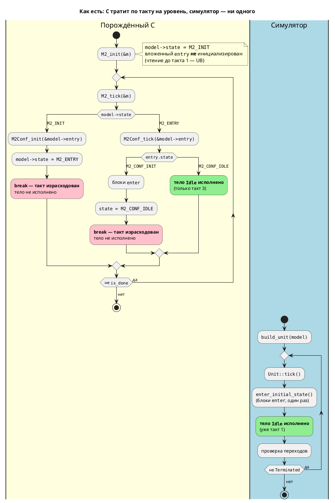

# ADR 0033: Согласование тактов симулятора и порождённого C (INIT-такты)

- **Status:** Accepted
- **Date:** 2026-07-15
- **Authors:** Архитектор + системный аналитик + дизайнер языка
- **Related issues:** [Фича 0033](../features/0033-init-tick-alignment.md); связь с
  [ADR 0025](0025-simulator-expression-eval.md) (сдвиг выявлен автосверкой
  `0025-07`, вынесен из объёма 0025) и с
  [ADR 0026](0026-c-root-typedef.md) (typedef корня — мешает сверять модели
  глубины 1)

## Context

Симулятор и порождённый C **исполняют одну модель в разные моменты времени**.
Расхождение нашла автосверка `0025-07` при первом же прогоне и была вынуждена
обойти его, сравнивая только **установившиеся** значения вместо потактовой
трассы.

### Причина: `INIT`-состояние стоит такта

Генератор C заводит синтетический вариант состояния `{PREFIX}_INIT` и **на
каждый уровень иерархии**: на модель (`c_header.rs:49`, `c_header.rs:181`), на
вложенную модель (`c_header.rs:102`), на параллель/конкатенацию
(`c_header.rs:153`). Стартовое значение поля `state` — всегда `_INIT`
(`c_model.rs:98–102`, `c_model.rs:362`).

Обработка `case {PREFIX}_INIT` (`c_model.rs:554–650`) делает полезную работу —
`_init` вложенных элементов, блоки `enter`, установка `state` в стартовое
состояние — и **завершается `break;`** (`c_model.rs:649`). `break` выходит из
`switch`, то есть **из всего такта**: тело стартового состояния в этот такт уже
не исполняется. Каждый уровень иерархии съедает такт.

Симулятор устроен иначе: `Unit::tick` первым делом зовёт `enter_initial_state()`
(вход в стартовое состояние), **и в том же такте** исполняет `always` и проверяет
переходы (см. [`0025-04`](../development/0025-04-initial-enter.md)). Синтетических
тактов у него нет ни одного.

### Проверено пробами (не со слов)

Пробы прогнаны на этой ветке: `lamc compile -t c`, сборка `cc -std=c11`,
потактовая печать против `simulation -n N`.

| Модель | Уровней | Тело исполняется в C | Тело исполняется в симуляторе | Сдвиг |
|---|---|---|---|---|
| `start Idle { always { v := 7; } }` (плоская) | 1 | **такт 2** | такт 1 | **1** |
| `model Conf {…} start Entry = Conf;` (фикстура `conformance_u8.lam`) | 2 | **такт 3** | такт 1 | **2** |
| `model Inner {…} model Mid { start S = Inner; } start Entry = Mid;` | 3 | **такт 4** | такт 1 | **3** |

Фактическая трасса C для трёхуровневой модели (`v` ожидается `7`):

```
такт 1: v=1 done=0      <- мусор: Inner_init ещё не вызван (см. ниже)
такт 2: v=0 done=0
такт 3: v=0 done=0
такт 4: v=7 done=1      <- тело наконец исполнено
```

Против симулятора: `Шаг 1: [Idle]` — и модель уже завершена за **1** шаг.

### Уточнение исходной формулировки: не «два такта», а «такт на уровень»

Кандидат в `FEATURES.md` говорил о **сдвиге на два такта**. Пробы показывают: два
такта — **частный случай** двухуровневой фикстуры `conformance_u8.lam`, на
которой сдвиг и был замечен. Общее правило:

> **Сдвиг = число уровней иерархии** от корня до исполняемого тела, по одному
> такту на уровень. Уровень дают и вложенная модель, и параллель, и
> конкатенация (проба `start Par = A | B;` → в заголовке есть и `M4_INIT`, и
> отдельный `M4_PAR_INIT`).

Это не косметическая поправка, а суть проблемы: величина сдвига **не константа**,
а функция формы модели (см. Decision Drivers 3).

### Побочная находка: чтение до первого такта — UB

`{Root}_init` **не** инициализирует вложенные элементы: их `_init` вызывается уже
внутри такта 1 (`case M2_INIT`). Между `M2_init(&m)` и первым `M2_tick(&m)` поле
`m.entry` — неинициализированная память. Проба печатает `conf_state=-171130792` и
`v=1` (мусор). Это следствие того же дефекта; отдельная фича не нужна — целевое
решение устраняет и его.

### Поток «как есть» (правило 18)



Итог «как есть»: **значения совпадают, моментность — нет**. Для профиля проекта
(правило 12 — язык задания и синтеза автоматных моделей промышленных систем
управления) это бьёт в основную ценность: симуляция служит проверкой модели
**до** синтеза, а сравнивать по тактам с тем, что реально исполнится, нельзя.
Страдают все потактовые свойства: время до первого воздействия на выход, проверки
из `--sim-file`, LTL-верификация, GIF-трассы.

## Decision Drivers

1. **Правило 12 — эталон моментности задаёт железо.** Симуляция ценна ровно
   настолько, насколько предсказывает поведение прошивки. Значит, расхождение
   обязано быть устранено, а не задокументировано.
2. **Модель — источник истины, а не кодогенератор.** В исходнике
   `start Idle { always { … } }` не написано «потратить N тактов на вход». Автор
   специфицировал: «на старте быть в `Idle` и исполнять его тело». `INIT`-такты —
   не семантика языка, а **бухгалтерия конкретного бэкенда**: способ переиспользовать
   ту же `switch`-машину для входа в стартовое состояние.
3. **Композиция не должна менять моментность (решающий довод).** Сдвиг равен
   глубине, поэтому чисто **структурный** рефакторинг — обернуть модель в
   `model Mid { start S = Inner; }` — сдвигает всю трассу на такт, не меняя ни
   одной строки поведения. Композиция (`+`, `|`, вложенные модели) — базовое
   средство языка; если она молча съедает такты, значит потактовые свойства
   модели **не композируемы**, и рассуждать о времени в языке нельзя.
4. **Такт промышленной системы — реальное время.** Такт = цикл сканирования
   (scan cycle). Синтетические `INIT`-такты — это dead time до первого
   воздействия на выходы, растущий с глубиной модели. На модели глубины 5 старт
   стоит 5 циклов, не запрошенных автором и ничего не делающих.
5. **Цена правки и радиус поражения.** Что именно ломается и у кого:
   существующие прошивки, кодогенерационные снапшоты, трассы симулятора,
   тесты — считаем честно по каждой опции.

## Considered Options

### Option A. Симулятор моделирует `INIT`-такты как генератор C

Симулятор заводит синтетический такт на уровень иерархии: `Unit` получает
предварительное состояние, тратит на вход по такту на уровень, повторяя форму
порождённого C.

**Pros:**
- Порождённый C **не меняется**: существующие прошивки и codegen-снапшоты
  байт-в-байт целы, пересборка не нужна.
- Потактовая сверка становится возможной — цель формально достигнута.
- Правка локализована в одном крейте (`simulation`).

**Cons:**
- **Возводит дефект бэкенда в ранг семантики языка.** `INIT`-такт существует
  ровно потому, что так проще генерировать C. Скопировав его в симулятор, мы
  объявляем артефакт реализации свойством языка — и **навсегда** лишаемся права
  его убрать: с этого момента его копируют все будущие бэкенды.
- **Заражает будущие бэкенды.** Фича 0041 (Structured Text, IEC 61131-3) обязана
  будет воспроизвести чужие `INIT`-такты, хотя в ST для них нет никаких причин.
  Цена решения платится не один раз, а каждым новым бэкендом.
- **Композиция продолжает менять моментность** (драйвер 3) — теперь ещё и в
  симуляторе, то есть узаконенно. Величина сдвига остаётся функцией глубины.
- **Dead time остаётся в прошивке** (драйвер 4): опция ничего не лечит на
  железе, лишь синхронизирует симулятор с потерями.
- **Ломает трассы симулятора** — все до единой: сдвигаются `--sim-file`-проверки,
  GIF-кадры, `-n N`, тесты `eval_tests.rs`. То есть совместимость **всё равно**
  ломается (правило 11), просто с другой стороны.
- **Противоречит только что принятому 0025-04**: хук `enter_initial_state`
  специально сделан так, чтобы вход в стартовое состояние **не** стоил такта.
  Опция откатывает это решение по существу.
- Не лечит UB-находку (чтение вложенных полей до такта 1).

### Option B. Генератор C не тратит такт на `INIT`

Вход в стартовое состояние перестаёт расходовать такт: работа `INIT`
(инициализация вложенных, блоки `enter`, установка `state`) выполняется **в том
же такте**, что и тело стартового состояния.

Форма правки — диспетчеризация `INIT` **до** `switch`, а не отдельным `case` с
`break`:

```c
static void M2Conf_tick(M2Conf *model, M2 *main) {
    if (model->state == M2_CONF_INIT) {   /* вход не стоит такта */
        /* _init вложенных; блоки enter */
        model->state = M2_CONF_IDLE;
    }
    switch (model->state) {               /* тело исполняется в этом же такте */
        case M2_CONF_IDLE: { … }
    }
}
```

**Pros:**
- **Устраняет причину, а не симптом.** `INIT` остаётся тем, чем и является, —
  внутренней меткой «ещё не входили», без наблюдаемой стоимости.
- **Восстанавливает композируемость моментности** (драйвер 3): сдвиг исчезает на
  **любой** глубине — каждый уровень входит в свой стартовый подрежим в том же
  такте, рекурсивно. Обёртывание модели больше не меняет трассу.
- **Убирает dead time из прошивки** (драйвер 4) — выигрыш на железе, а не только
  в сверке.
- **Сохраняет чистоту `_init`**: блоки `enter` (а они могут писать в порты)
  остаются **внутри** такта, не исполняясь вне цикла сканирования. Это ровно та
  форма, что уже реализована в симуляторе (`enter_initial_state` — хук в начале
  `tick`), то есть бэкенд приводится к существующей семантике, а не наоборот.
- **Попутно чинит UB**: вложенные элементы инициализируются на первом же обращении
  до чтения тела.
- Симулятор и его трассы **не трогаются**; результат 0025 остаётся в силе.

**Cons:**
- **Меняет порождённый C для каждой модели** → все codegen-снапшоты
  (`c_source.rs`, `c_header.rs`, `c_model.rs`) требуют пересмотра; прошивки при
  пересборке стартуют на `depth` тактов раньше.
- Это **изменение семантики языка** (что происходит на такте 1) → рост версии
  языка (правило 22) и правка README (правила 15, 16).
- Требует аккуратности с `is_done`: терминальность теперь достигается раньше;
  проверить, что цель `c-hal` и таблица адресов (фича 0020) не задеты.
- Смешивание «входа» и «тела» в одном такте нужно удержать корректным для
  параллели/конкатенации (вход в каждую ветку — в том же такте).

### Option C. Явная модель «такта запуска» в семантике языка

Ввести в язык понятие фазы запуска (startup/reset phase) как первоклассную
конструкцию: язык определяет, что происходит на такте 1, и оба потребителя
приводятся к ней. Возможен явный синтаксис (`reset { … }` / атрибут модели),
позволяющий автору **выбрать**, стоит ли вход такта.

**Pros:**
- Единственная опция, которая делает такт 1 **специфицированным**, а не
  вытекающим из реализации бэкенда. Сейчас ни один документ не отвечает на
  вопрос «что происходит на первом такте» — ответ приходится читать из
  генератора.
- Даёт автору выразить реальную потребность промышленных систем — фазу
  инициализации оборудования (продувка, самотест), которая **должна** занимать
  такты.
- Задаёт общий контракт для будущих бэкендов (0041 ST), а не прецедент.

**Cons:**
- **Не отменяет выбора между A и B, а откладывает его.** Определив фазу запуска,
  всё равно придётся сказать, чему равно поведение **по умолчанию** — и любой
  вменяемый ответ здесь совпадает с Option B (умолчание «вход бесплатен»).
  То есть C = B + синтаксис.
- Существенное расширение языка (грамматика, АСД, 7 проходов семантики, оба
  генератора, форматтер 0024, LSP, плагин IntelliJ) ради задачи, которая на
  сегодня — **дефект согласованности**, а не запрошенная функциональность.
  Заказчик фазу запуска не запрашивал.
- Мажорный рост версии языка и слом `.lam`-корпуса при введении ключевого слова.
- Риск спроектировать конструкцию «в пустоту»: реальных требований к фазе
  запуска пока не собрано, а неудачную языковую конструкцию нельзя убрать дёшево.

## Decision

Принимается **Option B** — генератор C перестаёт тратить такт на `INIT`;
эталоном моментности объявляется **модель**, а её нынешним верным исполнителем —
симулятор.

Обоснование:

1. **Вопрос «чей такт правильный» не решается ссылкой на железо** — это
   рассуждение по кругу: на железе исполнится то, что мы сами сгенерируем.
   Правильный вопрос — «что означает модель». В исходнике `INIT`-тактов нет: их
   ввёл генератор ради переиспользования `switch`-машины. Совпадение здесь
   должно достигаться приведением бэкенда к модели, а не модели к бэкенду.
2. **Решает драйвер 3 — единственная опция, устраняющая зависимость моментности
   от глубины.** Option A эту зависимость консервирует: сдвиг остаётся функцией
   формы модели, просто теперь одинаковый по обе стороны. Композируемость
   потактовых свойств — не удобство, а необходимое условие того, чтобы `+`, `|`
   и вложенные модели вообще были средствами проектирования.
3. **Совместимость ломается при любой опции** (правило 11), поэтому «A ничего не
   ломает» — ложное преимущество: A ломает **все** трассы симулятора. Выбор идёт
   не между «ломать / не ломать», а между тем, **что** сломать: у B ломается
   порождённый C (пересобирается из исходников, сдвиг — в сторону меньшей
   задержки), у A — трассы симулятора **и** дефект остаётся на железе навсегда.
4. **Option C отклонён как преждевременный**, но не как неверный: его ценное
   зерно — специфицировать такт 1 — берётся без языковых расширений (README,
   правила 15/16, задача `0033-03`). Если потребность в явной фазе запуска
   возникнет, она заводится отдельной фичей поверх B.
5. Option B **согласован с уже принятым 0025-04**: симулятор входит в стартовое
   состояние хуком в начале такта, не тратя такта. Генератор C приводится к той
   же форме — решение не изобретает семантику, а распространяет существующую.

**Версия языка (правило 22): `0.2.0` → `0.3.0`.** Меняется наблюдаемая семантика
такта 1, хотя синтаксис не тронут. В `0.x` минорный рост — сигнал ломающего
изменения поведения.

### Целевой поток (правило 18)

```plantuml
@startuml
title Целевой поток: вход не стоит такта — обе стороны совпадают потактово
|#LightYellow|Порождённый C (после 0033)|
start
:""M2_init(&m)"";
note right
  ""model->state = M2_INIT""
  ""INIT"" — внутренняя метка «ещё не входили»,
  наблюдаемой стоимости не имеет
end note
repeat
  :""M2_tick(&m)"";
  if (""model->state == M2_INIT""?) then (да)
    #LightGreen:""M2Conf_init(&model->entry)"";
    :""model->state = M2_ENTRY"";
    note right: **без break** — такт продолжается
  else (нет)
  endif
  switch (""model->state"")
  case (""M2_ENTRY"")
    :""M2Conf_tick(&model->entry)"";
    if (""entry.state == M2_CONF_INIT""?) then (да)
      #LightGreen:блоки ""enter"";
      :""state = M2_CONF_IDLE"";
      note right: рекурсивно, на каждом уровне
    else (нет)
    endif
    switch (""entry.state"")
    case (""M2_CONF_IDLE"")
      #LightGreen:**тело ""Idle"" исполнено — такт 1**;
    endswitch
  endswitch
repeat while (не ""is_done"") is (да)
->нет;
stop

|#LightBlue|Симулятор (без изменений)|
start
:""build_unit(model)"";
repeat
  :""Unit::tick()"";
  #LightGreen:""enter_initial_state()""
  (блоки ""enter"", один раз);
  #LightGreen:**тело ""Idle"" исполнено — такт 1**;
  :проверка переходов;
repeat while (не ""Terminated"") is (да)
->нет;
stop
note bottom
  Сдвиг = 0 на **любой** глубине вложенности:
  каждый уровень входит в свой стартовый подрежим
  в том же такте, рекурсивно.
end note
@enduml
```

## Consequences

### Положительные

- Потактовая сверка трасс симулятора и порождённого C становится возможной;
  сужение автосверки `0025-07` до установившихся значений снимается.
- Моментность модели перестаёт зависеть от глубины вложенности — потактовые
  свойства становятся композируемыми.
- Из прошивки уходит dead time (по такту на уровень) до первого воздействия на
  выходы.
- Устраняется UB: чтение вложенных полей между `_init` и первым `_tick`.
- Будущие бэкенды (0041 ST) получают контракт «вход в стартовое состояние не
  стоит такта», а не прецедент чужой бухгалтерии.

### Отрицательные / Action items

- **Порождённый C меняется для каждой модели** — пересмотреть codegen-снапшоты
  (`c_model.rs`, `c_header.rs`, `c_source.rs`). Каждое изменение снапшота
  осмыслить: снапшот, «починенный» подгонкой, перестаёт быть проверкой.
- **Прошивки, пересобранные после 0033, стартуют на `depth` тактов раньше** —
  зафиксировать в `CHANGES.md` и README как ломающее изменение поведения.
- **Версия языка `0.2.0` → `0.3.0`** (правило 22); README (правила 15, 16)
  дополняется разделом о семантике такта — сейчас такт 1 нигде не
  специфицирован.
- Проверить, что цель `c-hal` и таблица адресов (фича 0020) не задеты: инвариант
  «цель `c` байт-в-байт неизменна» **более не выполняется** — он и был основан
  на том, что 0020 не трогал тело `_tick`.
- Проверить `is_done`: терминальность достигается на `depth` тактов раньше;
  `MAX_TICKS` в автосверке и запас в `run_simulations.sh` пересмотреть.
- Модели глубины 1 нельзя собрать компилятором C до закрытия
  [0026](0026-c-root-typedef.md) (нет `typedef` корня) — потактовое покрытие
  базового случая откладывается до 0026 (см. анализ, «Зависимости фичи»).

### Acceptance criteria

1. Для моделей глубины 1, 2 и 3 тело стартового состояния исполняется в
   порождённом C на **такте 1** — как в симуляторе (пробы из Context дают
   такты 2, 3, 4 соответственно).
2. Автосверка `simulation/tests/conformance_c_tests.rs` сравнивает **потактовые**
   трассы (значение каждой проверяемой переменной на каждом такте), а не только
   установившиеся значения; комментарий модуля о сужении снят.
3. Сдвиг равен нулю на любой глубине: добавление обёртки
   `model Mid { start S = Inner; }` не меняет потактовую трассу.
4. `{Root}_init` оставляет вложенные элементы в определённом состоянии —
   чтение полей до первого `_tick` не является UB.
5. Версия языка поднята до `0.3.0`; README описывает семантику такта 1.
6. `./scripts/precheck.sh` зелёный; `./scripts/run_simulations.sh` — 5 из 5.
