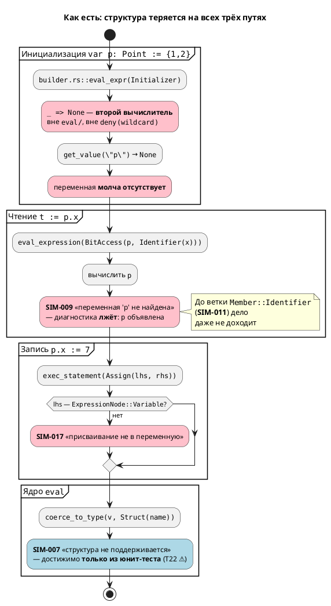
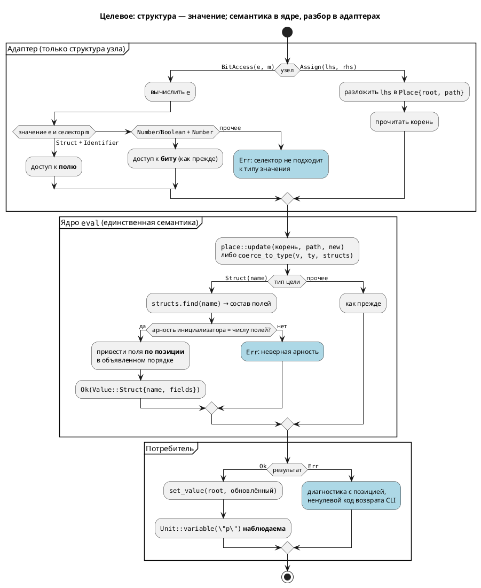

# ADR 0034: Структурное значение в симуляторе

- **Status:** Accepted
- **Date:** 2026-07-15
- **Authors:** Архитектор + системный аналитик
- **Related issues:** [Фича 0034](../features/0034-sim-struct-types.md); связь с
  [ADR 0025](0025-simulator-expression-eval.md) (ядро вычисления, инвариант
  «вся семантика — только в `eval/`»); фича [0006](../features/0006-structs.md)
  (структуры в языке и в генераторе C, `ГОТОВО`)

## Context

Структуры — существующая, закрытая возможность языка (фича 0006). Пробы
подтверждают, что **весь конвейер, кроме симулятора, их поддерживает**:

| Слой | Состояние | Доказательство |
|---|---|---|
| Лексер/парсер | `struct Имя { поле: Тип, … }` разбирается | `Token::Struct` (`lexer.rs:495`), `StructDefine` (`grammar.lalrpop:228`) |
| Семантика | `StructDefinitionNode` в `ModelNode.structs`; `search_struct` ищет вверх по родителям; тип — `TypeNode::Struct(имя)` | `semantic/struct_node.rs`, `semantic/mod.rs:408`, `tree.rs:529` |
| Генератор C | `typedef struct Point { uint8_t x; uint16_t y; } Point;`, поле модели `Point p;`, доступ `model->p.x = 7;` | проба: `cc -std=c11 -c` порождённого C — **чисто** |
| **Симулятор** | **структур нет вовсе** | `Value` = `Number`/`Real`/`Boolean`/`Array` (`eval/value.rs:14`) |

### Что делает симулятор сегодня (воспроизведено пробами)

| Конструкция | Наблюдаемое | Механизм |
|---|---|---|
| `var p: Point := {1, 2};` | исполняется **молча**, `p` отсутствует в переменных | `builder.rs::eval_expr` не знает `ExpressionNode::Initializer` → `_ => None` |
| `t := p.x;` | **SIM-009** «переменная 'p' не найдена» — **ложь**, `p` объявлена | `get_value("p")` → `None` (см. выше) → `expression.rs:50` |
| `p.x := 7;` | **SIM-017** «присваивание не в переменную» | `unit/statement.rs:247` требует `ExpressionNode::Variable` в левой части |
| `coerce_to_type(_, Struct)` | **SIM-007** `UnsupportedType` | `eval/mod.rs:104` — **достижимо только из юнит-теста** |

Отчёт фичи 0025 сам зафиксировал T22 как ⚠️: «юнит-тест `coerce_to_type(_, Struct)`
→ `SIM-007` ✅. **Сквозной путь не срабатывает**». Фикстура `struct_var.lam` из
тест-плана 0025 в репозитории **отсутствует**. То есть заявленная «явная
диагностика на структуры» — это тест ядра, а не наблюдаемое поведение
инструмента.

### Три силы, определяющие решение

**1. Узел `a.b` в АСД называется `BitAccess` и покрывает два разных смысла.**
Грамматика (`grammar.lalrpop:572`) даёт один узел:

```
Expression::BitAccess(loc, e, Member)   где  Member = Identifier | Number
```

`BTN.0` (бит порта) и `p.x` (поле структуры) — **один и тот же узел**. Симулятор
сегодня разбирает его только как доступ к биту и на `Member::Identifier` выдаёт
SIM-011 «доступ к биту возможен только по номеру». Генератор C, напротив, печатает
`.` буквально, поэтому обе трактовки у него «работают» — и `model->p.x`, и
`model->BTN.0` (последнее — уже его собственный дефект, вне объёма 0034).

**2. `TypeNode::Struct(имя)` несёт только имя — состава полей в нём нет.**
Поля живут в `ModelNode.structs` и достаются через `search_struct(name)`. Но
`coerce_to_type(value, ty)` — **свободная функция**, у которой на входе лишь
`&TypeNode`. Привести `{1, 2}` к `Point` она физически не может: ей неизвестно ни
число полей, ни их типы, ни их порядок. Это не недосмотр, а граница контракта,
которую фича обязана сдвинуть.

**3. Инициализатор `{1, 2}` — позиционный.** Синтаксиса `{x: 1, y: 2}` в языке
нет: `grammar.lalrpop:535` даёт `Expression::Initializer(loc, Vec<Expression>)` —
просто список выражений. Значит **объявленный порядок полей семантически значим**:
сопоставление `{1, 2}` с `Point{x, y}` идёт по позиции. Любое представление,
теряющее порядок объявления, будет молча путать поля.

### Поток «как есть»



## Decision Drivers

1. **Молчание недопустимо.** Главный урок 0025: ошибка, неотличимая от нормальной
   работы, хуже отказа. Сегодня `var p: Point := {1,2}` — именно такой случай:
   состояние модели теряется без следа. Любое принятое решение обязано либо
   поддержать структуру, либо отказать **громко**.
2. **Семантика — только в `eval/`** (инвариант ADR 0025). Представление значения и
   правила приведения обязаны жить в ядре под
   `deny(clippy::wildcard_enum_match_arm)`; адаптеры несут только структурный разбор.
3. **Достоверность относительно C** (правило 12). Эталон C для структур с полями
   `Integer`/`Enum`/`Bool` **пригоден** (проба: компилируется, поле присваивается),
   значит симулятор обязан ему соответствовать — и там, где C **запрещает**
   операцию (сравнение структур через `==`), симулятор обязан отказать, а не
   выдумывать семантику.
4. **Язык не меняется** (правила 11, 22). Реализуется уже специфицированное
   поведение: `.lam`-исходники, грамматика и АСД не трогаются; версия языка не
   растёт.
5. **Порядок полей значим.** Позиционный `{1, 2}` делает объявленный порядок
   частью семантики. Представление, не сохраняющее порядок, — источник тихой порчи
   данных, то есть прямое нарушение драйвера 1.

## Considered Options

### Option A. `Value::Struct(BTreeMap<String, Value>)`

Структурное значение — отображение «имя поля → значение».

**Pros:**
- Поиск поля O(log n), код чтения `p.x` тривиален.
- `BTreeMap` даёт детерминированный обход (в отличие от `HashMap`) — `Debug` и
  сравнение значений воспроизводимы.
- Структура остаётся **единым значением**: `q := p`, передача в `fn`,
  `Unit::variable("p")` работают без спецслучаев.

**Cons:**
- **Теряет объявленный порядок полей** — прямое нарушение драйвера 5. `BTreeMap`
  упорядочивает по имени, а `{1, 2}` сопоставляется по позиции. Для
  `struct S { b: u8, a: u8 }` инициализатор `{1, 2}` дал бы `a=1, b=2` вместо
  `b=1, a=2` — **тихая порча данных**, ровно тот класс, что закрывала 0025.
  Порядок пришлось бы каждый раз отдельно доставать из `StructDefinitionNode`,
  то есть хранить его всё равно, но **не** в значении.
- Имя типа не хранится → диагностика «структура 'Point'» и проверка совместимости
  при `q := p` требуют внешнего контекста.

### Option B. Плоское разворачивание полей в отдельные переменные

`var p: Point` регистрирует переменные с синтетическими именами `"p.x"`, `"p.y"`;
`Value` не меняется.

**Pros:**
- Минимальный диф: `Value`, `Context` и все `match` по `Value` остаются как есть.
- `Context::get_value`/`set_value` работают по имени без изменений — SIM-017
  снимается почти даром.
- Коллизия имён невозможна: `.` не входит в идентификаторы Lam.

**Cons:**
- **Структура перестаёт быть значением.** `q := p` (валидное присваивание в C!) и
  передача структуры в `fn` становятся невыразимы — их пришлось бы разворачивать
  в пофайловое копирование в адаптере.
- **Семантика структуры уезжает из `eval/`** в слой разрешения имён
  (`builder.rs`/`statement.rs`) — прямое нарушение драйвера 2. «Структурность»
  размазывается по адаптерам, которым ADR 0025 запретил нести семантику.
- `TypeNode::Struct` в `coerce_to_type` так и остаётся `UnsupportedType` (SIM-007):
  приводить нечего, ведь структурного значения нет. Заявленная цель фичи не
  достигается — снимается симптом, а не пробел.
- Наблюдаемость деградирует: `state_io` и JSON-сценарии получают синтетические
  имена `"p.x"`, которых в исходнике нет; вложенные структуры дают `"p.a.b"` —
  строковый разбор пути вместо типа.

### Option C. `Value::Struct { name: String, fields: Vec<(String, Value)> }`

Структурное значение хранит **имя типа** и поля **в объявленном порядке**.

**Pros:**
- **Сохраняет порядок объявления** (драйвер 5) — позиционный `{1, 2}`
  сопоставляется корректно и по построению, а не за счёт дисциплины.
- Имя типа при значении: диагностики точны («ожидалась структура 'Point',
  получена 'Coord'»), совместимость при `q := p` проверяема локально.
- Структура — единое значение (как в C): `q := p` — обычное присваивание,
  `Unit::variable("p")` наблюдаема целиком, `state_io` сохраняет её как есть.
- Новый вариант `Value` **ломает сборку** всех `match` в `eval/` — механизм
  удержания ADR 0025 срабатывает ровно так, как задуман: ни одна операция не
  сможет молча «забыть» структуру.
- `Vec` на 2–8 полей быстрее и проще `BTreeMap`; линейный поиск поля здесь не
  горячий код (драйвер соразмерности, `docs/CODE.md`).

**Cons:**
- Поиск поля O(n) — теоретически хуже A (практически несущественно).
- Больший диф, чем B: затрагиваются все `match` по `Value` в `eval/ops.rs`,
  `eval/mod.rs`, `expression.rs`, `error.rs::value_kind`.
- Требует сдвинуть контракт `coerce_to_type` (доступ к реестру структур) — см.
  ниже.

## Decision

Принимается **Option C**.

Решает драйвер 5 в связке с драйвером 1. Option A выглядит каноничнее (карта —
естественная модель записи), но `BTreeMap` **упорядочивает поля по имени**, тогда
как язык сопоставляет инициализатор **по позиции**. Это не теоретическое
неудобство: `struct S { b: u8, a: u8 }` с `{1, 2}` дал бы перепутанные поля —
тихо, без диагностики, то есть воспроизвёл бы ровно тот дефект, ради искоренения
которого писалась 0025. Порядок всё равно пришлось бы носить рядом со значением,
и карта превратилась бы в `Vec` с лишним шагом.

Option B отвергается по драйверу 2: он не столько поддерживает структуры, сколько
**прячет** их отсутствие. `Value` не растёт → компилятор ничего не проверяет →
«структурность» расползается по адаптерам, которым ADR 0025 прямо запретил нести
семантику. И главное, он не достигает цели фичи: `coerce_to_type(TypeNode::Struct)`
остаётся `UnsupportedType`, потому что приводить по-прежнему нечего.

### Сопутствующие решения

| Вопрос | Решение |
|---|---|
| **Реестр структур в ядре** | `coerce_to_type` получает третий параметр — `&dyn StructRegistry` (метод `find(name) -> Option<&StructDefinitionNode>`). Реализуется поверх `ModelNode::search_struct` (учитывает поиск по родительским моделям). Затрагивает 5 мест вызова: `expression.rs:204`, `unit/statement.rs:204, 259, 471, 483`. Альтернатива — обогатить `TypeNode::Struct` составом полей — отвергнута: это правка **семантических типов крейта `grammar` ради симулятора**, ровно тот перекос масштаба, который ADR 0025 отверг в своей Option C. |
| **Неоднозначность `a.b`** (`BitAccess`) | Различать по **вычисленному значению левой части**, а не по имени узла: `Value::Struct` + `Member::Identifier` → доступ к полю; `Value::Number`/`Boolean` + `Member::Number` → доступ к биту (как сейчас). Остальные сочетания (`Value::Struct` + `Member::Number`, число + `Member::Identifier`) → **диагностика**, а не догадка. Узел АСД **не переименовывается**: это правка грамматики ради читаемости, вне объёма фичи (кандидат в бэклог). |
| **Запись в поле** (SIM-017) | Вводится понятие «места» (lvalue): адаптер `statement.rs` **структурно** раскладывает левую часть в `Place { root: String, path: Vec<Selector> }`, а **семантику** обновления (`заменить поле k в структуре`) выполняет ядро — `eval::place::update(value, &path, new) -> Result<Value, EvalError>`. `Context` остаётся с двумя методами (`get_value`/`set_value`): цикл «прочитать корень → обновить по пути → записать корень». Так семантика не утекает в адаптер (драйвер 2), а вложенность `p.a.b` получается рекурсией, а не строковым разбором. |
| **Сравнение структур** | `p = q` → **диагностика**. Обоснование — драйвер 3: C **запрещает** `==` на структурах (ошибка компиляции). Выдумывать здесь почленное сравнение значило бы разойтись с эталоном в сторону «симулятор умеет больше, чем прошивка» — то есть дать ложную уверенность. |
| **Присваивание структуры целиком** | `q := p` — **поддерживается**: в C это законная операция (копирование по значению). `coerce_to_type` проверяет совпадение имени типа. |
| **`Value` и `#[non_exhaustive]`** | `Value` (`pub use eval::value::Value`) **не** помечается `#[non_exhaustive]`, хотя `docs/CODE.md` это допускает. Атрибут заставил бы внешние крейты писать `_`, а внутри — сохранил бы проверку; но прецедент уже есть и он отрицательный: `TypeNode` помечен `#[non_exhaustive]`, из-за чего `coerce_to_type` **вынужден** держать ветку `_` (`eval/mod.rs:132-136`) — ровно ту дыру, которую закрывала 0025. Крейт `simulation` не публикуется и потребителей вне workspace не имеет, поэтому цена атрибута — реальная потеря гарантии, а выгода — гипотетическая. |
| **Второй вычислитель** | `builder.rs::eval_expr` (вычислитель инициализаторов, `_ => None`, вне `eval/`) — **устраняется**: инициализаторы вычисляются тем же адаптером `expression.rs::eval_expression`. Это не побочная уборка, а причина обманчивой SIM-009 и прямой рецидив корневой причины 0025. |
| **Поля типов `[T;N]`/`bit`/`float`** | Приводятся имеющимся `coerce_to_type` рекурсивно, но **сверка с C по ним не ведётся** — эталон на этих типах дефектен (фича 0029). То же сужение, что у критерия A8 фичи 0025. |

### Целевой поток



## Consequences

### Положительные

- Молчаливая потеря состояния (`var p: Point := {1,2}` → `p` исчезает) исчезает
  как класс: структура либо представлена, либо отказ с диагностикой.
- SIM-009 перестаёт лгать: «переменная не найдена» больше не выдаётся для
  объявленной переменной, чей инициализатор просто не умели вычислить.
- Пробел **T22** фичи 0025 закрывается сквозным путём, а не юнит-тестом ядра;
  фикстура `struct_var.lam` наконец заводится.
- Устраняется **остаточное дублирование вычислителей** — `builder.rs::eval_expr`
  был последним местом с `_ => None` вне `eval/`; после фичи инвариант ADR 0025
  («один вычислитель, ветка `_` запрещена») выполняется буквально, а не почти.
- Новый вариант `Value::Struct` включает механизм 0025 на полную: любая операция,
  забывшая про структуры, **не соберётся**.

### Отрицательные / Action items

- **Контракт `coerce_to_type` меняется** (третий параметр) — 5 мест вызова плюс
  юнит-тесты ядра. Внутренний API крейта `simulation`; наружу не виден.
- **`Value` растёт** → все `match` по `Value` в `eval/ops.rs`, `eval/mod.rs`,
  `expression.rs`, `error.rs::value_kind` требуют новой ветки. Это по замыслу
  (компилятор перечислит места), но объём задачи 0034-01 определяется именно им.
- **`state_io` и JSON-сценарии**: `Value::Struct` нужно уметь сохранять/читать.
  Пересекается с фичей **0032** (`--save-state` не сохраняет переменные вовсе) —
  зависимости не образует (0032 чинит другой слой), но задача 0034-05 обязана не
  углубить дефект 0032.
- **Обнаружены попутные дефекты — не входят в 0034, требуют регистрации**
  (правило 7):
  1. Генератор C печатает `model->p = {1, 2};` для `var p: Point := {1,2}` —
     **невалидный C** (`error: expected expression`; brace-инициализатор в позиции
     присваивания вместо составного литерала `(Point){1, 2}`). Проверено `cc`.
  2. `const c: Coord := {0,0,0};` (`examples/extend_complex.lam`) **молча исчезает**
     из порождённого C — эмитится только `typedef`. Тот же класс, что и пропажа
     переменной-массива (уже в бэклоге).
  3. Семантика **не проверяет существование поля**: `p.NOSUCHFIELD` компилируется
     без диагностики и даёт невалидный C `model->p.NOSUCHFIELD`. Нужна
     диагностика `SE-0xx` в `grammar` — отдельная фича.
  4. Узел АСД `BitAccess` покрывает и бит, и поле — кандидат на переименование
     (`Member`/`Access`) в `grammar`.
- **Переменная без инициализатора не регистрируется вовсе** — `var q: u8;` (без
  структур!) уже даёт SIM-009. Контрольная проба показала, что дефект **не
  структурный**; 0034 его не чинит, но задача 0034-04 обязана не выдать
  структурам «особое» поведение там, где сломано общее. Кандидат в бэклог.

### Acceptance criteria

1. `var p: Point := {1, 2};` — `Unit::variable("p")` возвращает
   `Value::Struct{name: "Point", fields: [("x", Number(1)), ("y", Number(2))]}`;
   поля — **в объявленном порядке**.
2. Чтение `t := p.x;` даёт `t = 1`; запись `p.x := 7;` — `Unit::variable("p")`
   содержит `x = 7`, а `y` **не тронуто**. Ни SIM-009, ни SIM-011, ни SIM-017.
3. `struct S { b: u8, a: u8 }` с `{1, 2}` даёт `b = 1, a = 2` (по позиции, не по
   алфавиту) — тест, падающий на представлении Option A.
4. `coerce_to_type(_, TypeNode::Struct("Point"), registry)` возвращает `Ok`;
   `EvalError::UnsupportedType` для структур **не выдаётся** ни на одном пути.
5. Неверная арность инициализатора, неизвестное поле, `Member::Number` по
   структуре и `p = q` (сравнение) → **диагностика** с позицией в исходнике и
   ненулевой код возврата CLI (правило 16 — контрпримеры).
6. `q := p` (копирование структуры целиком) работает; присваивание структуры
   другого типа → диагностика.
7. В `simulation/src/` **не остаётся** ветки `_ => None` по вариантам
   `ExpressionNode`: `builder.rs::eval_expr` удалён, инициализаторы идут через
   `expression.rs::eval_expression`. Проверяется `grep`.
8. Сверочный тест с C: модель со структурой (поля `Integer`/`Enum`/`Bool`,
   обёрнутая в `model` — обход дефекта 0026, как в `conformance_u8.lam`)
   компилируется `cc -std=c11`, запускается, и финальные значения полей совпадают
   с симулятором.
9. `Value` **не** помечен `#[non_exhaustive]`; `deny(clippy::wildcard_enum_match_arm)`
   в `eval/` сохранён; `./scripts/precheck.sh` зелёный.
10. Язык не изменился: грамматика, АСД и `.lam`-корпус не тронуты; версия языка не
    выросла (правила 11, 22); тест `syntax_simple` зелёный.
