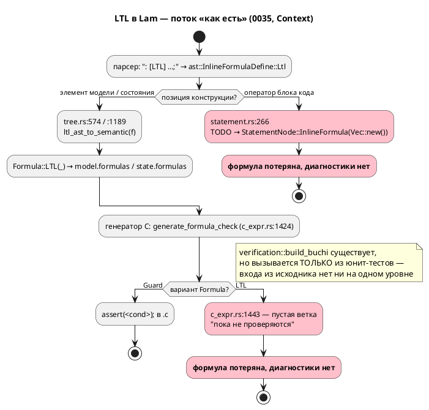
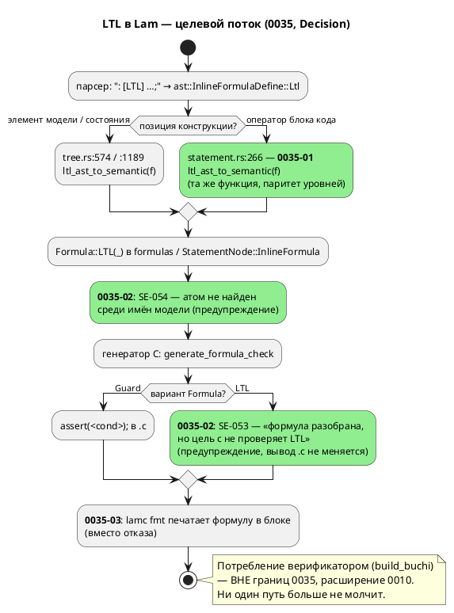

# ADR 0035: LTL в блоках кода — разбор с явной диагностикой вместо тихой потери

- **Status:** Accepted
- **Date:** 2026-07-15
- **Authors:** Архитектор + Системный аналитик + Дизайнер языка
- **Related issues:** [Фича 0035](../features/0035-ltl-in-blocks.md); опирается на
  [фичу 0010](../features/0010-verification-ltl.md) (`ГОТОВО`); пересекается с
  [фичей 0044](../features/0044-sim-assert-invariant.md); наследует принцип
  «громкий отказ вместо тихого пропуска» из
  [ADR 0025](0025-simulator-expression-eval.md) и
  [ADR 0024](0024-lam-formatter.md)

## Context

Язык Lam допускает встроенную формулу `: [LTL] …;` в **трёх** синтаксических
позициях (все три уже есть в `grammar.lalrpop`):

| Позиция | Правило грамматики | Пример |
|---|---|---|
| Элемент модели | `grammar.lalrpop:47` (`ModelElement::InlineFormula`) | `: [LTL] G (a -> F b);` в теле модели |
| Элемент состояния | `grammar.lalrpop:80` (`StateElement::InlineFormula`) | `start S { : [LTL] F b; }` |
| **Оператор блока кода** | `grammar.lalrpop:733` (`Statement::InlineFormula`) | `always { : [LTL] G a; }` |

Синтаксис конструкции (правило 18, EBNF — фактический, вычитан из
`grammar.lalrpop:285-336`):

```ebnf
@startebnf
(* EBNF встроенной формулы языка Lam — как есть, grammar.lalrpop:285-336. *)
(* Заглавные X F G U R и true/false — терминалы; identifier — атом-идентификатор. *)
InlineFormulaDefine =
    ( ":" , Condition , { "," , Condition } , ";" )                (* краткий Guard *)
  | ( ":" , "[" , "Guard" , "]" , Condition , { "," , Condition } , ";" )
  | ( ":" , "[" , "LTL" , "]" , LtlExpr , { "," , LtlExpr } , ";" );

LtlExpr    = LtlImplies;
LtlImplies = LtlOr , [ "->" , LtlImplies ];                        (* правоассоц. *)
LtlOr      = LtlAnd , { "|" , LtlAnd };
LtlAnd     = LtlUntilRelease , { "&" , LtlUntilRelease };
LtlUntilRelease = LtlUnary , { ( "U" | "R" ) , LtlUnary };
LtlUnary   = ( "!" | "X" | "F" | "G" ) , LtlUnary | LtlPrimary;
LtlPrimary = "true" | "false" | identifier | ( "(" , LtlExpr , ")" );
@endebnf
```

Приоритеты (от сильного к слабому): `!`/`X`/`F`/`G` → `U`/`R` → `&` → `|` → `->`.
Атом — **голый идентификатор**: вызовы функций в атоме грамматикой **не
поддерживаются** (проверено пробой, см. ниже).

### Проблема: где формула умирает

Разбор в семантику расходится по позициям. Для модели и состояния
`semantic/tree.rs` вызывает готовую тотальную функцию
`semantic/formula.rs::ltl_ast_to_semantic` и кладёт `Formula::LTL(_)` в
`model.formulas` / `state.formulas`. Для блока кода
`semantic/statement.rs:266-269` делает обратное:

```rust
ast::InlineFormulaDefine::Ltl { .. } => {
    // TODO: Реализовать поддержку LTL в блоках кода
    Ok(StatementNode::InlineFormula(Vec::new()))
}
```

Формула отбрасывается **молча**: без диагностики, без следа, с кодом возврата `0`.
Соседняя ветка `Guard` в том же `match` разбирается полноценно — асимметрия видна
в одном экране кода.

Однако проба (`start S { always { a := a + 1; : a = 0; : [LTL] G (a -> F a); } }`,
цель `c`) показала, что проблема **шире блока**:

```c
case P8_S: {
    model->a = model->a + 1;      // обычный оператор  — есть
    assert(model->a == 0);        // : [Guard] в блоке — есть
    /* : [LTL] G (a -> F a);      — НЕТ НИЧЕГО, без предупреждения */
```

Причина второго уровня — `generator/c/c_expr.rs:1443`:

```rust
Formula::LTL(_) => {
    // LTL-формулы в C-коде пока не проверяются
}
```

Эта пустая ветка гасит LTL на **всех трёх** уровнях, а не только в блоке. Проба с
формулой на уровне модели подтвердила: `: a = 0;` даёт `assert(model->a == 0);`,
а `: [LTL] G (a -> F b);` рядом — не даёт ничего. Иными словами, **починка одного
только `statement.rs` перенесла бы тихую потерю из семантики в кодогенератор**,
не устранив класс дефекта.

### Что уже умеет верификатор (определяет цену Option A)

- `verification/ltl.rs` — тип `Ltl` и **отдельный строковый** парсер
  `parse_ltl(&str) -> Ltl` (рекурсивный спуск; **паникует** при ошибке).
- `verification/buchi.rs` — `build_buchi(&Ltl) -> BuchiAutomaton` (алгоритм GPVW).
- **Вход из исходника отсутствует.** `grep` по репозиторию: `build_buchi` и
  `parse_ltl` вызываются **только из юнит-тестов** (`buchi.rs`, mod `tests`) и
  `grammar/tests/ltl_tests.rs`. У `lamc` нет подкоманды `verify`; `lib.rs`
  экспортирует лишь `pub mod verification;` — публичной точки входа «модель +
  формула → вердикт» нет.
- Нет и **модели Крипке** (`ModelNode` → структура переходов), произведения
  автоматов и проверки пустоты — то есть отсутствует вся середина конвейера
  верификации.

Следствие: LTL из `.lam` **никогда** не достигает верификатора — ни из блока, ни
из модели, ни из состояния. `Formula::LTL` сегодня — терминальная свалка.

### Сопутствующие факты (проверены пробами)

1. **Форматтер отказывает на блочных формулах.** `format/expr.rs:319`
   (`inline_formula`) печатает **обе** формы и вызывается из `format/mod.rs:354`
   (модель) и `:470` (состояние), но `Statement::InlineFormula` в `format/stmt.rs`
   **не покрыт**. `lamc fmt --stdin` на `always { : [LTL] G a; }` (и даже на
   `always { : a = 0; }`) выдаёт `печать узла '…' пока не поддерживается
   форматтером`. Здесь форматтер ведёт себя **правильно** (громкий отказ по
   замыслу 0024) — на его фоне молчание семантики особенно заметно.
2. **Корпус LTL не использует.** `grep -rn "LTL" examples/ grammar/tests/data/` —
   **0 вхождений**. Поэтому корпусный тест `format_tests.rs` дефект и не ловил, а
   риск регрессии примеров нулевой.
3. **Атомы LTL ни с чем не связываются.** `ltl_ast_to_semantic` отображает
   `Atom(id) → Ltl::Atom(id.name)` — голая строка. Проба
   `: [LTL] G(active -> F done), X next_state;` компилируется успешно, хотя ни
   `active`, ни `done`, ни `next_state` в модели **не объявлены**. Опечатка в
   формуле проходит молча.
4. **Пример LTL в `README.md:1054` не разбирается.** Дословный
   `: [LTL] G(active() -> F done()), X next_state ;` даёт
   `Ошибка компиляции: нераспознанный токен '(', ожидалось ")", "|", "&", "->", "U", "R"`
   — грамматика не допускает вызов функции в атоме. Документация описывает
   несуществующий синтаксис (правило 15).

### Поток «как есть»



## Decision Drivers

1. **Тихая потеря недопустима (принцип проекта).** ADR 0025 и 0024 закрепили:
   молча потерять кусок спецификации хуже, чем громко отказать. `Vec::new()` с
   `TODO` — прямое нарушение этого принципа в семантике.
2. **Стоимость против ценности.** Разбор в блоке стоит одну строку
   (`ltl_ast_to_semantic` уже написана и тотальна по `LtlExpr`); полноценная
   верификация — отдельный крупный конвейер (модель Крипке, произведение,
   проверка пустоты, CLI). Смешивать их в одной фиче нельзя (правило 2).
3. **Класс дефекта, а не одна точка.** Починка `statement.rs` без диагностики в
   `generate_formula_check` лишь передвинет молчание на уровень ниже. Критерий
   успеха — чтобы **ни один** путь LTL не заканчивался тишиной.
4. **Обратная совместимость (правило 11).** Синтаксис уже принимается; корпус LTL
   не использует. Решение обязано остаться аддитивным и не тронуть байты вывода
   цели `c` для существующих примеров.
5. **Симметрия уровней.** Одна и та же конструкция не должна вести себя
   по-разному в зависимости от позиции — это ловушка для пользователя и источник
   будущих багов.
6. **Разблокировка соседей.** Фича 0044 (assert/invariant для симуляции)
   упирается в тот же `StatementNode::InlineFormula` в блоке.

## Considered Options

### Option A. Реализовать разбор **и потребление** LTL, связав с верификатором 0010

Разобрать формулу в блоке и довести её до `build_buchi`: построить модель Крипке
из `ModelNode`, произведение с автоматом Бюхи, проверку пустоты, подкоманду
`lamc verify` и формат вердикта/контрпримера.

**Pros:**
- Даёт **настоящую** заявленную возможность: LTL начинает работать, а не храниться.
- Оправдывает существование `verification/` в продуктовом контуре (сейчас модуль
  живёт только ради собственных юнит-тестов).
- Снимает вопрос «зачем разбирать то, что никто не читает».

**Cons:**
- **Объём несоразмерен фиче.** Отсутствует вся середина конвейера: модели Крипке
  нет, произведения нет, проверки пустоты нет, CLI-входа нет. Это не «доделка
  блока», а новая крупная фича уровня 0025.
- Требует языковых решений, которых **ещё нет**: что такое атом LTL (переменная?
  состояние? `cond`?), как связывать имена, каков алфавит пропозиций. Без этого
  разбор в блоке всё равно останется несвязанным (факт 3 выше).
- `parse_ltl` **паникует** на ошибке — для продуктового пути его пришлось бы
  переписать на диагностики.
- Не устраняет дефект **сейчас**: до конца работ `Vec::new()` продолжает молча
  терять формулы.
- Смешивает исправление дефекта с новой возможностью → нарушает правило 2.

### Option B. Явная диагностика «LTL в блоке не поддерживается» вместо `Vec::new()`

Оставить `Formula::LTL` неразобранной в блоке, но выдавать явную ошибку или
предупреждение вместо тихого отбрасывания.

**Pros:**
- **Дёшево и немедленно** устраняет класс дефекта: пользователь узнаёт, что его
  спецификация не учтена.
- Соответствует принципу «громкий отказ» (0024/0025) и поведению форматтера.
- Нулевой риск для корпуса (LTL в нём нет).

**Cons:**
- В формулировке «в **блоке** не поддерживается» — **неправда и асимметрия**:
  на уровне модели и состояния конструкция разбирается, и пользователь резонно
  спросит, чем блок хуже. Диагностика зафиксировала бы случайную дыру как
  «фичу языка».
- Не устраняет главную тишину — пустую ветку `Formula::LTL(_)` в
  `generate_formula_check`, из-за которой молчат **все три** уровня. Дефект
  остался бы жив на двух из трёх путей.
- Отказ там, где починка стоит одну строку и функция уже написана, — это
  консервация `TODO`, а не решение.

### Option C. Убрать конструкцию `: [LTL] …;` из грамматики

**Pros:**
- Радикально: нет конструкции — нет тихой потери.
- Минус один неиспользуемый путь в грамматике, семантике и форматтере.

**Cons:**
- **Слом обратной совместимости** (правило 11) ради устранения `TODO` — цена
  несоразмерна.
- Конструкция **документирована** (`README.md:194`, `:1051-1054`) и закреплена
  тестом `grammar/tests/ltl_tests.rs`; она — часть заявленного результата
  закрытой фичи 0010.
- Удаление потребовало бы роста версии языка (правило 22) и обесценило бы уже
  работающие уровни модели/состояния и печать в форматтере.
- Противоречит цели проекта (правило 12): формальная спецификация свойств —
  профильная функциональность для промышленных систем управления, а не balласт.

## Decision

Принимается **комбинация: Option A в части разбора + Option B в части
диагностики, с этапностью.** Полное потребление (Option A целиком) выносится **за
границы 0035** в расширение фичи 0010. Option C отвергается.

Обоснование. Ни один вариант в чистом виде не подходит: A целиком несоразмерен
фиче и упирается в неготовые языковые решения; B в предложенной формулировке
закрепил бы случайную асимметрию как правило языка и оставил бы тишину на двух
уровнях из трёх; C ломает совместимость ради `TODO`. Пробы показали, что дефект
имеет **две** точки, и лечить надо обе, но разными средствами:

1. **Там, где потребитель есть, — разбирать** (берём от A). В блоке недостающего
   ничего нет: `ltl_ast_to_semantic` тотальна по `LtlExpr` и уже вызывается из
   `tree.rs` дважды. `Vec::new()` заменяется на неё → блок приходит к паритету с
   моделью и состоянием. Это не новая возможность, а **устранение дыры**.
2. **Там, где потребителя нет, — говорить об этом вслух** (берём от B, но в
   правильной точке). Диагностика ставится не в `statement.rs` («в блоке нельзя»),
   а в `generate_formula_check` («цель `c` не проверяет LTL») — и потому
   покрывает **все три** уровня одинаково. Формулировка честная: формула принята
   и разобрана, но данная цель её не проверяет.
3. **Полная верификация — отдельная фича.** Требует модели Крипке, произведения,
   проверки пустоты, `lamc verify` и языкового решения об атомах. Регистрируется
   как кандидат «LTL-верификация моделей: вход `lamc verify` (расширение 0010)».

Дополнительно в границы 0035 включается печать `Statement::InlineFormula` в
форматтере: 0035 делает блочную формулу осмысленной, и оставить `lamc fmt`
падающим на ней нельзя (правило «добавляешь узел — добавь печать», `CLAUDE.md`).

### Целевой поток



## Consequences

### Положительные

- Класс дефекта «тихая потеря LTL» устранён **целиком**, а не в одной точке:
  каждый путь заканчивается либо разбором, либо явной диагностикой.
- Устранена асимметрия: конструкция ведёт себя одинаково во всех трёх позициях.
- `TODO` из `semantic/statement.rs` снят; ветка-заглушка в `c_expr.rs:1443`
  превращена из немой в говорящую.
- `lamc fmt` перестаёт отказывать на блочных формулах (в т.ч. на `: [Guard]`,
  который сегодня тоже роняет форматтер).
- Фича 0044 разблокирована: `StatementNode::InlineFormula` в блоке становится
  непустым и пригодным для потребления симулятором.
- Ошибочный атом в формуле (`F undefined_thing`) перестаёт проходить молча.

### Отрицательные / Action items

- **LTL по-прежнему не верифицируется.** 0035 честно сообщает об этом
  предупреждением, но возможности не даёт. Action: зарегистрировать кандидата
  «LTL-верификация моделей: вход `lamc verify` (расширение 0010)» — вне границ
  0035, вносит координатор (правило 7).
- **Новое предупреждение SE-053 на каждой LTL-формуле** может восприниматься как
  шум. Смягчение: в корпусе LTL нет (0 вхождений) → сегодня шума не будет; текст
  диагностики указывает, что формула принята и сохранена.
- **`README.md:1054` документирует неразбираемый пример** (`active()` в атоме).
  Action: исправить в 0035-04 (правила 15, 16) — пример заменяется на
  проверенный. Правку README вносит разработчик на стадии 4.
- **Атомы LTL остаются несвязанными** (`Ltl::Atom(String)`); SE-054 — лишь
  проверка имени, а не связывание. Полноценная семантика атома — вопрос
  расширения 0010.
- Обнаружены **смежные дефекты вне границ 0035**, требующие отдельных кандидатов:
  (1) тело `always` на уровне **модели** (вне состояния) целиком не эмитится в C —
  проба `always { a := 1; }` не дала в `tick` ничего; (2) `semantic/unused.rs` не
  обходит `formulas` вовсе → переменная, используемая только в формуле, считается
  неиспользуемой; (3) `lamc` не печатает предупреждения `unused_variable_warnings`
  / `nondeterministic_transition_warnings` вообще.

### Acceptance criteria

1. `: [LTL] …;` в блоке кода даёт **непустой** `StatementNode::InlineFormula`,
   содержащий `Formula::LTL` по одному на формулу; тест падает при возврате
   `Vec::new()`.
2. Разбор в блоке даёт `Ltl`, **структурно равный** разбору той же формулы на
   уровне модели (паритет уровней).
3. Компиляция модели с LTL в цель `c` выдаёт предупреждение **SE-053**; байты
   `.c`/`.h` для моделей **без** LTL не меняются (сверка с эталоном).
4. Неизвестный атом в формуле даёт предупреждение **SE-054**; известный — не даёт.
5. `lamc fmt --check` проходит на фикстуре с `: [LTL] …;` и `: [Guard] …;` внутри
   блока; идемпотентность печати подтверждена.
6. `TODO`-комментарий и `Vec::new()` отсутствуют в `semantic/statement.rs`
   (проверяется `grep`).
7. Версия языка остаётся **0.2.0** (правило 22): синтаксис не изменён; изменение
   касается неспецифицированного поведения и диагностик — прецедент ADR 0025.
8. `./scripts/precheck.sh` зелёный; `cargo test -- --test-threads=1` без регрессий.
