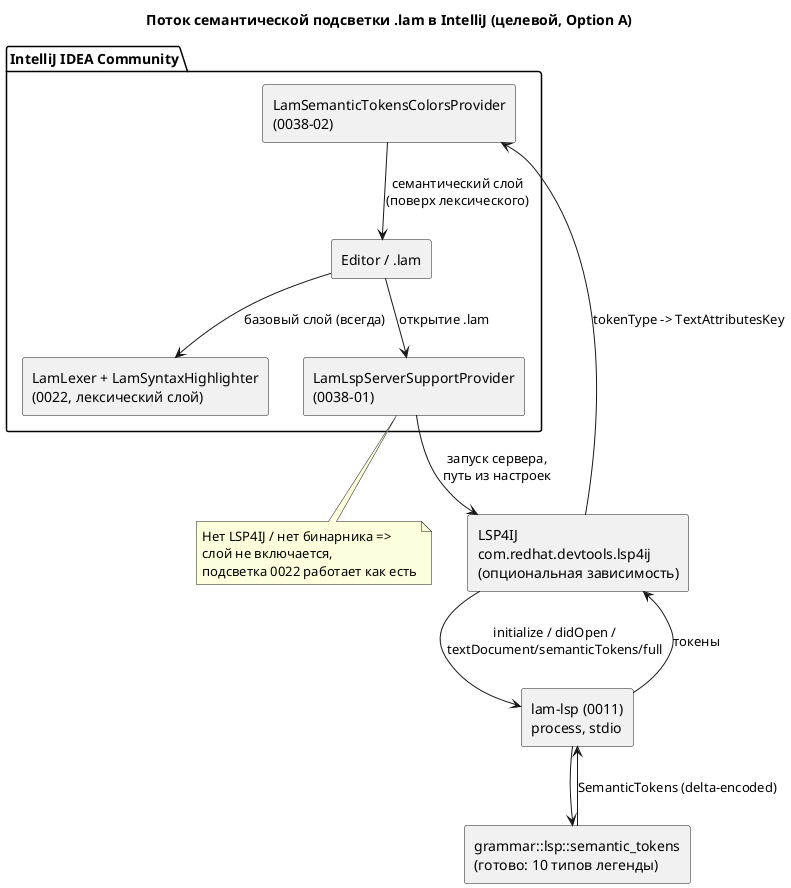

# ADR 0038: Семантическая подсветка Lam в IntelliJ через lam-lsp

- **Status:** Accepted
- **Date:** 2026-07-15
- **Authors:** Архитектор + дизайнер инструментов разработки + лид разработки
- **Related issues:** [Фича 0038](../features/0038-intellij-semantic-tokens.md);
  реализует **отложенный Option C** из [ADR 0022](0022-intellij-syntax-highlight.md);
  наследует ограничения плагина из [ADR 0023](0023-intellij-navigation-include.md);
  потребляет `lam-lsp` из фичи [0011](../features/0011-lsp-server.md)

## Context

Плагин `extensions/intellij-lam` (фичи [0022](../features/0022-intellij-syntax-highlight.md),
[0023](../features/0023-intellij-navigation-include.md), обе `ГОТОВО`, версия
плагина `0.4.0`) даёт **лексическую** подсветку: рукописный `LexerBase`
(`LamLexer`), `LamSyntaxHighlighter`, `LamColorSettingsPage`, эргономику
редактора, плоский PSI и навигацию. Его потолок структурен: лексер видит
**только форму токена**. Любое имя — `IDENTIFIER`, и `process` (функция),
`Celsius` (тип), `RED` (вариант `enum`), `Idle` (состояние) и `counter`
(переменная) окрашены **одинаково**. Различить их можно лишь имея семантическую
модель, которой у плагина нет и не будет без второго парсера языка.

**Ключевой факт (перепроверен при заведении фичи).** Серверная часть
**существует и работает** — это меняет объём решения радикально:

- `grammar/src/lsp.rs:17` — легенда `SEMANTIC_TOKEN_TYPES`: 10 типов
  (`KEYWORD`, `VARIABLE`, `FUNCTION`, `TYPE`, `ENUM_MEMBER`, `STRING`, `NUMBER`,
  `COMMENT`, `OPERATOR`, `CLASS` — последний для состояний и моделей);
- `grammar/src/lsp.rs:1412` — `pub fn semantic_tokens(source: &str) -> SemanticTokens`:
  токенизирует лексером, **обогащает идентификаторы семантической моделью**
  (`search_func` → `FUNCTION`, `types`/`enums` → `TYPE`, `search_enum_variant` →
  `ENUM_MEMBER`, `search_state`/`models` → `CLASS`, иначе `VARIABLE`), добавляет
  комментарии, сортирует и кодирует в дельта-формат LSP; длина считается в
  **кодовых единицах UTF-16** (кириллица учтена);
- `grammar/src/bin/lam_lsp.rs:51` — `semantic_tokens_provider` в
  `ServerCapabilities` (`full: true`, без `range`, без модификаторов);
  `lam_lsp.rs:200` — обработчик `textDocument/semanticTokens/full`.

Сервер деградирует мягко: если файл не парсится, `semantic_tokens` строит модель
через `.ok()` и при неудаче красит идентификаторы как `VARIABLE` — токены есть
всегда, подсветка «худеет», но не исчезает.

Итого решаемая задача — **не «сделать семантическую подсветку»**, а **«подключить
готовый источник токенов к IntelliJ»**. Вопрос ADR: каким транспортом.

**Силы, действующие на решение.**

1. **Редакция IDE.** Плагин собирается под `platformType = IC`
   (`gradle.properties`) — IntelliJ IDEA **Community**. Платформенный LSP API
   (`com.intellij.platform.lsp`) — **Ultimate-only** (требует
   `com.intellij.modules.ultimate`); в Community он недоступен. Это зафиксировано
   ещё в [ADR 0022](0022-intellij-syntax-highlight.md) (Option C, Cons) и
   [ADR 0023](0023-intellij-navigation-include.md) (Option C, Cons).
2. **Автономность 0022 — инвариант, а не пожелание.** Базовая подсветка обязана
   работать офлайн, в Community, без `lam-lsp`. Семантика может быть только
   **надстройкой**, включающейся при наличии сервера, и не вправе ломать
   лексический слой при его отсутствии.
3. **Никакого дублирования семантики.** Второе (Kotlin-) зеркало семантической
   модели немыслимо: ADR 0022/0023 отвергли даже дублирование **грамматики**.
   Единственный законный источник классификации имён — крейт `grammar`.
4. **Общая инфраструктура с 0039.** Фича [0039](../features/0039-intellij-reformat.md)
   (Reformat Code) рассматривает тот же LSP4IJ-путь: `textDocument/formatting`
   пришёл бы «бесплатно» поверх той же интеграции. Решение 0038 предопределяет
   объём 0039 — это учитывается в Decision, но не делает 0038 зависимой.
5. **Проверяемость.** `runIde` требует GUI, собрать/прогнать плагин в CI-среде
   нельзя (остаточные пункты 0022/0023). Решение обязано максимизировать долю
   автоматически проверяемого — то есть по возможности переносить проверяемую
   логику на **сторону сервера** (Rust-тесты в CI).

## Decision Drivers

1. **Работа в Community** — плагин собран под IC; решение, требующее Ultimate,
   не решает задачу для целевой аудитории (правило 12).
2. **Единый источник семантики** — классификация имён только из `grammar`,
   никаких вторых реализаций.
3. **Неломающая надстройка** — при отсутствии сервера поведение плагина
   **байт-в-байт** прежнее (правило 11).
4. **Максимум автопроверок** — проверяемая логика по возможности на стороне
   Rust (CI), а не за GUI.
5. **Учёт 0039** — не закрывать, а по возможности удешевить путь к
   `textDocument/formatting`.

## Considered Options

### Option A. LSP4IJ + `textDocument/semanticTokens` из `lam-lsp`

Опциональная зависимость плагина на LSP4IJ (`com.redhat.devtools.lsp4ij`),
`LamLspServerSupportProvider` (дескриптор сервера: команда запуска `lam-lsp`,
маппинг языка Lam), `SemanticTokensColorsProvider` — маппинг 10 типов легенды в
`TextAttributesKey` (переиспользуя ключи `LamHighlighterColors` из 0022).
Путь к бинарнику — настройка плагина + автопоиск в `PATH`.

**Pros:**
- **Работает в Community** — LSP4IJ ставится из Marketplace в IC (в этом весь
  смысл проекта LSP4IJ от Red Hat).
- Переиспользует **готовую** серверную реализацию (0011) целиком — объём фичи
  сводится к клиентскому связыванию; дублирования семантики нет.
- Надстройка: при отсутствии LSP4IJ/бинарника лексический слой 0022 не тронут
  (`<depends optional="true">` не срывает загрузку плагина).
- Открывает 0039 (`textDocument/formatting` — та же интеграция, ~одна точка
  расширения) и будущую LSP-навигацию/hover/completion — сервер уже всё это умеет.
- Заметная часть проверок уходит в Rust-тесты `semantic_tokens` (CI), где нет
  проблемы GUI.

**Cons:**
- **Внешняя зависимость плагина** от стороннего LSP4IJ: пользователь ставит два
  плагина; API LSP4IJ моложе платформенных и может меняться между версиями.
- Требует собранный `lam-lsp` (`cargo build --features lsp --bin lam-lsp`) —
  нужны UI настройки пути, диагностика отсутствия бинарника, документация.
- LSP4IJ тянет собственный `sinceBuild`; **открытый `until-build`** плагина
  (фикс [0023-01](../fixes/0023-01-verifyplugin-descriptor.md)) придётся
  сверить с диапазоном LSP4IJ через `verifyPlugin`.
- Оптиональная зависимость усложняет тесты: часть путей исполняется только при
  наличии LSP4IJ в тестовом classpath.

### Option B. Нативный LSP API платформы IntelliJ (`com.intellij.platform.lsp`)

`LspServerSupportProvider` из платформы + `LspSemanticTokensSupport`.

**Pros:**
- API «от первоисточника», без сторонних плагинов; лучше интегрирован в
  платформу и стабильнее по контракту.
- Нет второго плагина в установке пользователя.

**Cons:**
- **Ultimate-only — дисквалифицирующий минус.** `com.intellij.platform.lsp`
  требует `com.intellij.modules.ultimate`; плагин собирается под
  `platformType = IC` (`gradle.properties`) и заявляет
  `<depends>com.intellij.modules.platform</depends>`. Переход означал бы либо
  отказ от Community-аудитории, либо раздвоение плагина на IC/IU-редакции.
- Ломает драйвер 1 (правило 12: инженеры АСУ ТП, массово — Community/RustRover).
- Сборочная платформа (IC 2024.1.7, JDK 17) сменилась бы на IU — новый
  toolchain, новый диапазон, перепроверка всего `verifyPlugin`.

### Option C. Семантическая подсветка через собственный PSI/аннотатор без LSP

`Annotator`/`HighlightVisitor` поверх полноценного PSI-парсера (фича
[0040](../features/0040-intellij-psi-parser.md)), классифицирующий имена
собственными средствами плагина.

**Pros:**
- Полная автономность: ни LSP4IJ, ни бинарника `lam-lsp`, ни внешних процессов.
- Мгновенный отклик (без IPC), нативная интеграция с инспекциями/подсказками.
- Тестируется штатным `BasePlatformTestCase` (в пределах ограничения GUI).

**Cons:**
- **Требует третьей реализации семантики языка на Kotlin** — разрешение имён,
  области видимости, импорты, псевдонимы типов, варианты `enum`. Это ровно то
  дублирование, которое ADR 0022 и 0023 отвергли **дважды** (там речь шла лишь о
  грамматике; здесь — о семантической модели, которая много сложнее).
- Гарантированный дрейф от `grammar`: подсветка начнёт врать при эволюции языка,
  причём **молча** (тот же класс «тихого расхождения», что дал восемь дефектов в
  фиче 0025).
- Блокируется фичей 0040 (полный PSI) — сама по себе крупная многозадачная фича;
  объём несоразмерен задаче раскраски.
- Не переиспользует ничего из готовых 0011/`semantic_tokens`.

## Decision

Принимается **Option A** — LSP4IJ + `textDocument/semanticTokens` из `lam-lsp`.

**Обоснование.**

1. **Option B отпадает по факту, а не по вкусу:** платформенный LSP API —
   Ultimate-only, плагин собран и заявлен под Community (`platformType = IC`).
   Выбрать B — значит либо потерять целевую аудиторию (правило 12), либо
   раздвоить плагин; цена несоразмерна выигрышу «нет второго плагина».
2. **Option C отпадает по стоимости и по риску:** он требует третьего зеркала
   семантики языка на Kotlin — то самое дублирование, которое проект отвергал
   дважды (ADR 0022, ADR 0023), причём здесь дублируется не грамматика, а
   семантическая модель. Расхождение с `grammar` было бы **тихим**, а подсветка,
   которая врёт, хуже подсветки, которой нет.
3. **Option A почти ничего не строит заново.** Сервер готов: легенда, обогащение
   идентификаторов моделью, дельта-кодирование, UTF-16 — всё в
   `grammar/src/lsp.rs`. Остаётся клиентское связывание. Это единственный
   вариант, где семантика имеет **ровно один** источник — крейт `grammar`.
4. **Драйвер 3 соблюдён:** зависимость от LSP4IJ — `optional="true"`, слой
   включается при наличии сервера; иначе плагин ведёт себя как сегодня.
5. **Драйвер 5 соблюдён:** ограничение GUI не обойти, но его удаётся **обойти по
   касательной** — классификация токенов (то, что фича реально утверждает)
   проверяется Rust-тестами в CI; за GUI остаётся только «цвета доехали».

**Про 0039.** Решение 0038 делает LSP4IJ-путь для 0039 практически бесплатным
(`textDocument/formatting` сервер уже реализует — `lam_lsp.rs:50`,
`document_formatting_provider`). Но 0038 **не зависит** от 0039: инфраструктура
LSP4IJ входит в объём 0038 целиком (задача 0038-01) и строится независимо от
того, какой путь выберет ADR 0039. Направление зависимости — обратное
(0039 → 0038), и только если ADR 0039 выберет LSP4IJ; подробности — в
[анализе](../analyze/0038-intellij-semantic-tokens.md).

## Consequences

### Положительные

- Идентификаторы `.lam` в IntelliJ различаются **по смыслу**: функции, типы,
  варианты `enum`, состояния/модели, переменные — каждый своим цветом.
- Семантика имеет один источник (`grammar`); дрейфа между IDE и компилятором
  нет по построению.
- Готовая интеграция LSP4IJ открывает 0039 (formatting) и будущие
  hover/completion/definition от `lam-lsp` — сервер их уже отдаёт.
- Плагин остаётся автономным в базовом режиме: 0022/0023 работают без сервера.
- Rust-тесты `semantic_tokens` усиливаются и закрывают реальную дыру: сейчас
  проверяется только «не паникует», а не корректность классификации.

### Отрицательные / Action items

- **Внешняя зависимость LSP4IJ** — документировать установку (README плагина,
  правило 15); `<depends optional="true" config-file="lam-lsp4ij.xml">`, чтобы
  отсутствие LSP4IJ не срывало загрузку плагина.
- **Требуется бинарник `lam-lsp`** (`cargo build --features lsp --bin lam-lsp`) —
  нужны настройка пути, автопоиск в `PATH`, тихая деградация при отсутствии
  (без модальных ошибок при каждом открытии файла).
- **Диапазон совместимости** — сверить открытый `until-build` плагина с
  `sinceBuild` LSP4IJ через `verifyPlugin`; при конфликте зафиксировать нижнюю
  границу в `gradle.properties` и отразить в README.
- **Ограничение проверяемости сохраняется** (остаточные пункты 0022/0023):
  фактическая раскраска в редакторе проверяется только визуально в среде с GUI
  (`runIde`); в CI — Rust-тесты токенов + Gradle-тесты чистой логики.
- **Сервер не отдаёт `range`-токены и модификаторы** (`full: true`, `range: None`,
  `token_modifiers: vec![]`) — для больших файлов возможна перерисовка целиком;
  если проявится, вынести `semanticTokens/range` и модификаторы
  (`declaration`/`readonly` для `const`) в бэклог отдельной фичей.
- **Версия плагина** `0.4.0 → 0.5.0` (аддитивная функциональность, SemVer,
  правило 22 к **языку** неприменим — язык не меняется).

### Acceptance criteria

1. При установленном LSP4IJ и доступном `lam-lsp` открытие `.lam` в IntelliJ IDEA
   **Community** поднимает сервер, а идентификаторы окрашиваются по семантике:
   имя `fn` — как функция, имя `type`/`enum` — как тип, вариант `enum` — как
   константа перечисления, `state`/`model` — как класс, прочие — как переменная.
2. Без LSP4IJ **или** без бинарника `lam-lsp` плагин загружается и работает ровно
   как версия `0.4.0` (лексическая подсветка, навигация, эргономика), без
   исключений и модальных ошибок; регресс-тесты 0022/0023 зелёные.
3. Все 10 типов легенды `grammar::lsp::SEMANTIC_TOKEN_TYPES` имеют маппинг в
   `TextAttributesKey`; несопоставленных типов нет (проверяется тестом).
4. Rust-тесты подтверждают **классификацию** (не только отсутствие паники):
   для эталонного `.lam` имя функции приходит с типом `FUNCTION`, тип — `TYPE`,
   вариант `enum` — `ENUM_MEMBER`, состояние/модель — `CLASS`, переменная —
   `VARIABLE`; на непарсящемся исходнике токены отдаются (деградация без паники).
5. `./gradlew buildPlugin test` — BUILD SUCCESSFUL, все тесты зелёные;
   `verifyPlugin` — Compatible для заявленного диапазона IDE.
6. Язык, его синтаксис/семантика и версия языка не изменены; изменения в
   `grammar` ограничены тестами (аддитивность, правило 11).
