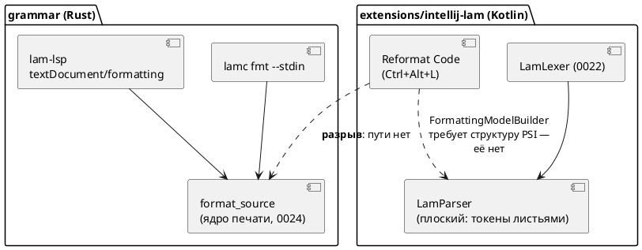
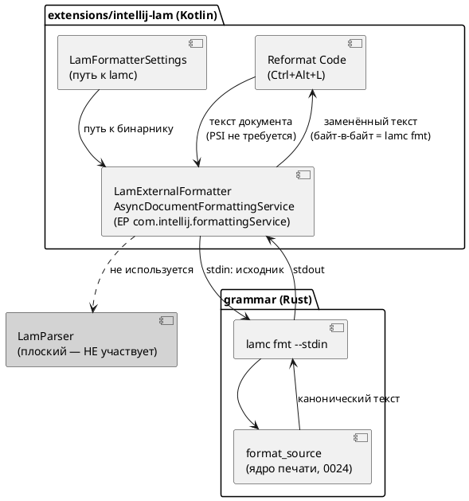

# ADR 0039: Действие Reformat Code в плагине IntelliJ

- **Status:** Accepted
- **Date:** 2026-07-15
- **Authors:** Архитектор + Системный аналитик
- **Related issues:** [Фича 0039](../features/0039-intellij-reformat.md); развивает
  [ADR 0024](0024-lam-formatter.md) (ядро форматтера) и наследует принципы
  [ADR 0022](0022-intellij-syntax-highlight.md) / [ADR 0023](0023-intellij-navigation-include.md)
  (самодостаточность плагина); смежные фичи — [0038](../features/0038-intellij-semantic-tokens.md),
  [0040](../features/0040-intellij-psi-parser.md)

## Context

Фича [0024](../features/0024-lam-formatter.md) дала **каноническое ядро печати**
`grammar/src/format/` (`format_source`) и двух потребителей:

- `lamc fmt` (`--check` / `--stdin`) — CLI;
- `lam-lsp` `textDocument/formatting` — редакторы по LSP.

Третий заявленный потребитель — действие **«Reformat Code»** плагина
`extensions/intellij-lam` — в 0024 **не был сделан**. Задача
[0024-04](../development/0024-04-lsp-formatting.md) зафиксировала находку:
плагину «нечем дотянуться до ядра», потому что `LamParser` — **плоский**
разборщик (`LamParser.kt:15–24`: все токены листьями под корень; осознанное
решение ADR 0023, Option A), а `FormattingModelBuilder` форматирует **по
структуре PSI**. Вопрос был вынесен в `FEATURES.md` как **решение заказчика**
между тремя путями.

### Проверка посылки: «нужен PSI» — неверно

Настоящий ADR **опровергает** посылку, на которой держалась постановка вопроса.
`FormattingModelBuilder` — не единственный способ форматирования в платформе.
Существует точка расширения **`com.intellij.formattingService`**, предназначенная
ровно для **внешних** форматтеров (по ней работают Prettier, rustfmt, shfmt) и
**не требующая ни PSI-структуры, ни `FormattingModelBuilder`**.

Проверено **на той самой платформе, против которой собирается плагин**
(`ideaIC-2024.1.7`, `gradle.properties: platformVersion`):

```
lib/app-client.jar :: META-INF/CodeStyle.xml
  <extensionPoint name="formattingService"
                  interface="com.intellij.formatting.service.FormattingService"
                  dynamic="true"/>
lib/app-client.jar :: com/intellij/formatting/service/AsyncDocumentFormattingService.class
```

Тот же класс присутствует и в `ideaIC-2025.1` — то есть открытый `until-build`
плагина не ставится под угрозу. `AsyncDocumentFormattingService` получает **текст
документа**, отдаёт его внешнему процессу и возвращает результат; штатное
`Reformat Code` (`Ctrl+Alt+L`) маршрутизируется через него.

**Следствие:** путь «внешний процесс» не блокируется ни фичей 0040 (PSI-парсер),
ни фичей 0038 (LSP4IJ). Он реализуем **сегодня**, на текущей платформе.

### Что уже готово в ядре (проверено)

| Факт | Где | Статус |
|---|---|---|
| `format_source` — каноническая печать | `grammar/src/format/` | готово (0024) |
| `lamc fmt --stdin` — stdin → stdout | `grammar/src/bin/lamc.rs:322–345` | **готово, проверено пробой** |
| `lamc fmt --check` — код 0/≠0 | `grammar/src/bin/lamc.rs` | **готово, проверено пробой** |
| LSP `textDocument/formatting` | `lam_lsp.rs:50, 144–162`; `lsp.rs:146` | готово (0024-04) |
| LSP `textDocument/semanticTokens` (full) | `lam_lsp.rs:51–61, 201–204` | **готово** (серверная часть 0038) |
| `LamParser` — плоский, структуры нет | `LamParser.kt:15–24` | подтверждено |

Проба `lamc fmt --stdin` (реальный прогон, `examples/extend_complex.lam`):
вывод из stdin **байт-в-байт** совпал и с файловым режимом, и с каноническим
оригиналом; `--check --stdin` дал код `0` на каноничном и `1` на изменённом
входе.



## Decision Drivers

1. **Единое ядро — фактом, а не договорённостью.** Критерий A6 фичи 0024:
   расхождение стиля между CLI и редактором должно быть невозможно **по
   построению**. Любой путь, где стиль печатается вторым кодом, — отвергается.
2. **Самодостаточность плагина.** ADR 0022 и ADR 0023 **дважды** отвергли
   LSP-путь именно потому, что он ломает автономность (платформенный LSP API —
   Ultimate-only; в Community нужен сторонний LSP4IJ). Разворот этого принципа —
   отдельное решение заказчика, а не деталь реализации 0039.
3. **Минимум дублирования грамматики.** Второй парсер/принтер языка на Kotlin —
   источник рассинхронизации с `grammar.lalrpop` (тот же довод, что в ADR 0023).
4. **Проверяемость.** Решение должно оставлять как можно больше **автоматически**
   проверяемого: `runIde` требует GUI, и всё, что проверяется только глазами,
   рискует остаться непроверенным.
5. **Деградация без внешнего компонента.** Отсутствие внешнего бинарника/плагина
   не должно ломать уже работающие подсветку и навигацию (0022/0023).

## Considered Options

Три опции ниже — ровно те, что витрина `FEATURES.md` вынесла на решение
заказчика; четвёртая добавлена как честная «нулевая» альтернатива.

### Option A. Полноценный PSI-парсер плагина + `FormattingModelBuilder` (путь 1 витрины)

Фича [0040](../features/0040-intellij-psi-parser.md) строит настоящее PSI-дерево;
форматирование описывается штатной моделью блоков/отступов/интервалов.

**Pros:**
- Нативное для платформы форматирование; заодно приходят find usages, rename,
  структура файла, инспекции.
- Не нужен внешний бинарник: всё внутри плагина, офлайн.

**Cons:**
- **Нарушает драйвер 1.** Стиль пришлось бы описать **второй раз** — правилами
  `Block`/`Indent`/`Spacing` на Kotlin. Это не «то же ядро», а его ручное
  зеркало: расхождение с `lamc fmt` становится вопросом времени, а критерий
  «байт-в-байт» — недостижимым по построению.
- Самая крупная трудоёмкость из всех опций; блокируется фичей 0040.
- Второй парсер языка — рассинхронизация с `grammar.lalrpop` (довод ADR 0023).

### Option B. Интеграция LSP4IJ: `textDocument/formatting` от `lam-lsp` (путь 2 витрины)

Плагин объявляет зависимость от стороннего LSP4IJ (Red Hat) и регистрирует
`lam-lsp` как сервер; форматирование приходит от уже готового
`textDocument/formatting`.

Проверено по документации LSP4IJ (в этой среде плагин **не установлен**, поэтому
проверка — документарная, не рантаймовая):

- id для `<depends>` — `com.redhat.devtools.lsp4ij`; вендор — Red Hat;
- `textDocument/formatting` — **поддержан полностью** (через тот же EP
  `formattingService`);
- `textDocument/semanticTokens` — **экспериментальный**, только
  `semanticTokens/full` (что совпадает с тем, как объявляет себя `lam-lsp`:
  `full: Some(Bool(true))`);
- совместим со всеми редакциями IntelliJ, включая Community.

**Pros:**
- Форматирование — **бесплатно**: ядро уже отдаёт правки по LSP (0024-04),
  писать код форматирования не нужно вовсе.
- Драйвер 1 соблюдён: то же `format_source`.
- Одной инфраструктурой закрывается и фича [0038](../features/0038-intellij-semantic-tokens.md):
  серверная часть semantic tokens в `lam-lsp` **уже написана** — не хватает
  только клиента.

**Cons:**
- **Нарушает драйвер 2 сильнее всех.** `<depends>com.redhat.devtools.lsp4ij</depends>` —
  **жёсткая** зависимость: без установленного из Marketplace стороннего плагина
  наш плагин **не загрузится вообще**, вместе с уже работающими подсветкой и
  навигацией. Драйвер 5 нарушен.
- Разворачивает решения **двух** принятых ADR (0022 Option C, 0023 Option C),
  отвергших LSP ровно по этой причине. Такой разворот — предмет отдельного
  решения (фича 0038), а не побочный эффект фичи про реформат.
- Требует установленного и настроенного `lam-lsp` + управление процессом сервера
  — нагрузка на пользователя **не меньше**, чем у Option C (там нужен один
  `lamc`, здесь — сторонний плагин **и** сервер).
- Проверяемость (драйвер 4): в этой среде не проверить ничего — ни LSP4IJ, ни
  связку. Непроверяемо и в CI.

### Option C. Внешний форматтер: `AsyncDocumentFormattingService` + `lamc fmt --stdin` (путь 3 витрины)

Плагин реализует `com.intellij.formattingService` через
`AsyncDocumentFormattingService`: отдаёт текст документа процессу
`lamc fmt --stdin`, применяет полученный текст. PSI не нужен (см. Context).

**Pros:**
- **Драйвер 1 выполнен предельно:** это не «то же ядро», это **буквально
  `lamc fmt`**. Критерий «байт-в-байт равно выводу `lamc fmt`» выполняется
  тавтологически, а не проверкой.
- **Драйвер 2 сохранён:** ни новых плагинов-зависимостей, ни разворота ADR
  0022/0023. Плагин остаётся самодостаточным.
- **Драйвер 5 выполнен:** нет `lamc` → деградирует **только** реформат
  (сообщение об ошибке), подсветка и навигация работают.
- **Драйвер 4 — лучший из опций:** EP присутствует на платформе сборки
  (проверено локально), а `lamc` собирается тем же `cargo` в этом же
  репозитории — значит связку можно прогнать **headless-тестом**, а не глазами.
- Не блокируется ничем: ни 0038, ни 0040. Реализуема немедленно.
- Малый объём: один класс формата + настройка пути + тесты.

**Cons:**
- Требует установленного `lamc` и UI настройки пути; нужна внятная диагностика
  отсутствия бинарника (это и есть основной объём фичи).
- Запуск процесса на каждое форматирование — накладные расходы (для файла
  масштаба `stacker.lam`, 16.9K, несущественно; EP асинхронный by design).
- Если заказчик впоследствии примет LSP4IJ (фича 0038), два механизма
  **столкнутся на одном и том же EP** `formattingService` — потребуется снять
  один. См. Consequences.

### Option D. Ничего не делать: пользоваться `lamc fmt` / LSP

Форматирование уже доступно из CLI и из любого LSP-редактора.

**Pros:**
- Ноль затрат и рисков; функциональность в проекте уже есть.

**Cons:**
- Пользователь IntelliJ не получает штатного `Ctrl+Alt+L` — ради этого фича и
  заведена; заказчик спрашивает не «есть ли форматтер», а «работает ли реформат
  в IDE».

## Decision

Принимается **Option C** — внешний форматтер через
`com.intellij.formattingService` / `AsyncDocumentFormattingService`, вызывающий
`lamc fmt --stdin`.

Обоснование:

1. **Посылка, из-за которой опция считалась слабой, оказалась ложной.** Витрина
   предлагала выбирать между «PSI» и «LSP» потому, что реформат якобы требует
   структуры PSI. Это неверно: платформа имеет EP ровно для внешних форматтеров,
   и он **есть на платформе сборки плагина** (проверено в
   `ideaIC-2024.1.7/lib/app-client.jar`). Как только посылка снята, Option C
   перестаёт быть «костылём» и становится штатным механизмом платформы — тем
   самым, которым в IDE работают Prettier и rustfmt.
2. **Только Option C даёт «байт-в-байт» по построению.** Option A печатает стиль
   вторым кодом (расхождение неизбежно). Option B даёт то же ядро, но через две
   внешние сущности. Option C **является** `lamc fmt` — сверять нечего.
3. **Не разворачивает принятые ADR.** Отказ от LSP ради самодостаточности принят
   дважды (0022, 0023). Фича «про реформат» — неподходящее место, чтобы отменить
   это решение мимоходом: цена (плагин не грузится без стороннего LSP4IJ) платится
   всеми пользователями, включая тех, кому реформат не нужен.
4. **Максимум автоматической проверки** в среде, где `runIde` недоступен.

**Явная развилка для заказчика.** Рекомендация не отменяет права выбрать Option B:
он выгоднее, **если** заказчик независимо решает принять LSP4IJ ради фичи 0038
(серверная часть semantic tokens уже готова, не хватает только клиента). Тогда
форматирование приходит бесплатно, и фичу 0039 следует **пересобрать в
приёмочные тесты** поверх 0038, а не реализовывать Option C. Это решение
принимается **в фиче 0038**; 0039 — его следствие, а не причина. Порядок,
рекомендуемый аналитиком: сначала решение по 0038, затем 0039 (см.
[анализ](../analyze/0039-intellij-reformat.md), «Зависимости фичи»).



## Consequences

### Положительные

- `Ctrl+Alt+L` форматирует `.lam` тем же ядром, что и CI (`lamc fmt --check`):
  локальный реформат не может «разойтись» с проверкой в CI.
- Плагин остаётся самодостаточным: без `lamc` теряется только реформат.
- Ни PSI-парсер (0040), ни LSP4IJ (0038) не становятся блокерами — фича
  автономна и берётся в работу немедленно.
- Появляется механика вызова `lamc` из плагина — переиспользуемый строительный
  блок для будущих действий (например, `lamc compile` из IDE).
- **Проверяемость улучшена против ожиданий витрины** — см. ниже.

### Отрицательные / Action items

- **Внешний бинарник.** Нужны: настройка пути к `lamc`, автоопределение в `PATH`,
  внятное сообщение при отсутствии/несовместимости. Это основной объём фичи
  (подзадача `0039-02`), а не побочная мелочь.
- **Конфликт с Option B в будущем.** LSP4IJ регистрирует форматирование через
  **тот же** EP `formattingService`. Если фича 0038 примет LSP4IJ, два механизма
  окажутся на одном EP: тогда `LamExternalFormatter` следует **снять** (или
  явно уступать при активном LSP-сервере). Зафиксировать как риск в анализе.
- **Ошибки не молчат.** Если `lamc fmt` вернул ненулевой код (файл не
  разбирается / непечатаемый узел), реформат обязан **отказать** с сообщением, а
  не подставить мусор — тот же принцип, что уже принят для LSP в 0024-04 (молча
  «отформатировать во что-то» хуже, чем не форматировать).
- **Версия плагина** — минорный рост `0.4.0 → 0.5.0` (аддитивно, SemVer,
  правило 22). **Версия языка не меняется**: ADR не трогает ни синтаксис, ни
  семантику.

### Уточнение проверяемости (исправление посылки витрины)

Витрина утверждает: «собрать плагин в CI-среде нельзя (`runIde` требует GUI)».
Утверждение **неточно** и проверено фактом в этой среде:

| Действие | Факт |
|---|---|
| `./gradlew buildPlugin --offline` | **BUILD SUCCESSFUL** (артефакт `intellij-lam-0.4.0.zip`) |
| `./gradlew cleanTest test --offline --no-build-cache` | **BUILD SUCCESSFUL**, 53 теста, ~8 с |
| `./gradlew runIde` | **требует GUI** — здесь недоступно |

То есть **сборка и headless-тесты плагина работают**; GUI нужен **только**
`runIde`. Следовательно, ключевую проверку фичи — «результат реформата
байт-в-байт равен выводу `lamc fmt`» — можно и **должно** закрыть автотестом
(эталон вычисляется прогоном настоящего `lamc` прямо в тесте, без рукописных
golden-файлов), а не «визуальной проверкой». Подробности — в
[тест-плане](../tests/0039-intellij-reformat.md).

### Acceptance criteria

1. `Ctrl+Alt+L` (Reformat Code) на файле `.lam` в IDE приводит текст к канону;
   результат **байт-в-байт** равен выводу `lamc fmt` на том же исходнике.
2. Форматирование выполняется **без** участия `LamParser`/PSI-структуры: плагин
   не приобретает второго описания стиля языка.
3. При отсутствии/неработоспособности `lamc` реформат **отказывает** с внятным
   сообщением; подсветка (0022) и навигация (0023) продолжают работать.
4. Если `lamc fmt` не может отформатировать исходник (ошибка разбора,
   непечатаемый узел) — документ **не изменяется**, пользователь видит причину.
5. Плагин собирается `./gradlew buildPlugin` и проходит все тесты (включая новые
   для форматирования); `verifyPlugin` остаётся Compatible для заявленного
   списка IDE; диапазон IDE остаётся открытым (EP `formattingService` —
   `dynamic="true"`, присутствует и в 2024.1.7, и в 2025.1).
6. Версия языка не изменена; версия плагина — `0.5.0`.
