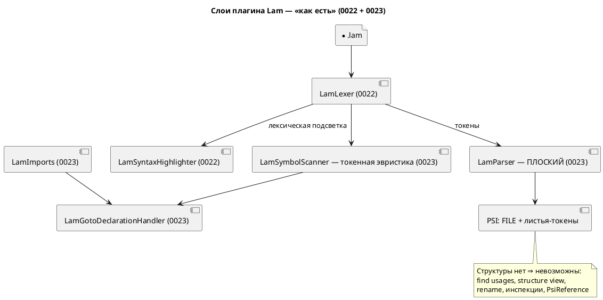
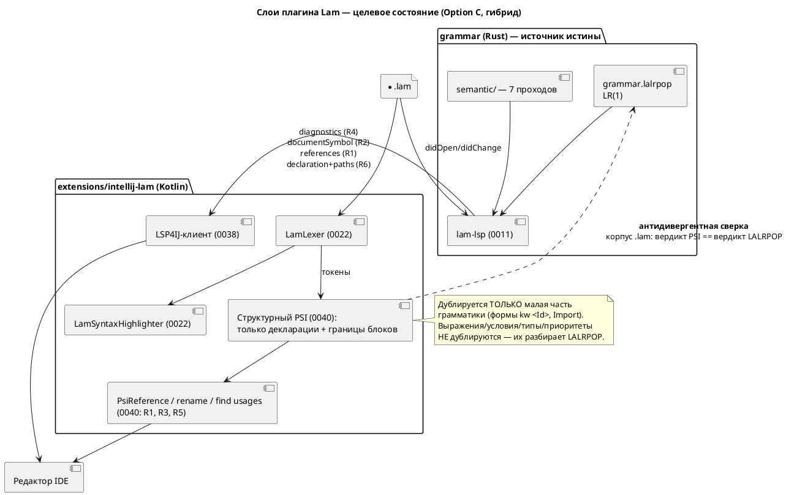

# ADR 0040: Полноценный PSI-парсер плагина IntelliJ — собственный PSI, LSP4IJ или гибрид

- **Status:** Accepted
- **Date:** 2026-07-15
- **Authors:** Архитектор + Системный аналитик
- **Related issues:** [Фича 0040](../features/0040-intellij-psi-parser.md); развивает
  [ADR 0023](0023-intellij-navigation-include.md) (плоский `LamParser`) и
  [ADR 0022](0022-intellij-syntax-highlight.md) (лексер, автономность плагина);
  пересекается с фичами [0038](../features/0038-intellij-semantic-tokens.md)
  (LSP4IJ / семантическая подсветка) и [0039](../features/0039-intellij-reformat.md)
  (Reformat Code — путь 1 = данная фича)

## Context

### Что есть сегодня (проверено по коду, 2026-07-15)

Плагин `extensions/intellij-lam` (версия `0.4.0`, Kotlin + Gradle IntelliJ
Platform Plugin 2.1.0, платформа IC `2024.1.7`, JDK 17) состоит из:

- **0022** — рукописный `LamLexer` (`lexer/LamLexer.kt`, 224 строки, `LexerBase`,
  без JFlex), `SyntaxHighlighter`, `Commenter`, `BraceMatcher`, `ColorSettingsPage`.
- **0023** — **плоский разбор**: `parser/LamParser.kt` (24 строки) в цикле
  `while (!builder.eof()) builder.advanceLexer()` кладёт **все токены листьями
  под единственный корень** `FILE`; `LamParserDefinition.createElement` помечен
  как фактически не вызываемый («в плоском дереве составных узлов (кроме FILE)
  нет»). **Факт подтверждён: синтаксической структуры нет.**
- **0023** — навигация: `LamSymbolScanner` (167 строк) — токенная эвристика
  `kw <Id>` (индекс `имя → TextRange`, без областей видимости);
  `LamGotoDeclarationHandler` (51 строка) — Go to Declaration в пределах **одного
  файла**; `LamImports` (70 строк) — резолв строки-пути `import` в файл.
  **Факт подтверждён: Go to Declaration и переход к файлу `import` уже работают.**
  `PsiReferenceContributor` в `plugin.xml` **не зарегистрирован** — итог 0023
  честно фиксирует: «ссылки не привязываются к листовым токенам».

Потолок плоского пути прямо назван в ADR 0023 (Option A, Cons) и в отчёте 0023:
find usages, структура файла, rename, инспекции, настоящие `PsiReference`,
кросс-файловое разрешение имён — **вне досягаемости**, потому что все они в
платформе строятся **по структуре PSI** (`PsiNamedElement`, `PsiReference`,
`PsiElement.getUseScope`, `StructureViewModel`, `FormattingModelBuilder`).

### Неудобный вопрос: не поглощается ли фича путём LSP4IJ?

У языка **уже есть** сервер `lam-lsp` (фича 0011), и его возможности проверены
по коду `grammar/src/bin/lam_lsp.rs` (280 строк) и `grammar/src/lsp.rs`
(2163 строки). Сервер **сегодня** объявляет и обслуживает:

| Возможность LSP | Статус в `lam-lsp` | Что закрывает из объёма 0040 |
|---|---|---|
| `publishDiagnostics` (`didOpen`/`didChange`/`didClose`) | **есть** (`collect_diagnostics`) | **инспекции/диагностики — полностью** |
| `textDocument/documentSymbol` | **есть** (`document_symbols`, `symbols_from_model`) | **структура файла — полностью** |
| `textDocument/formatting` | **есть** (`formatting_edits`, ядро 0024) | объём фичи **0039** |
| `textDocument/semanticTokens/full` | **есть** (`SEMANTIC_TOKEN_TYPES`) | объём фичи **0038** |
| `textDocument/hover` | **есть** (`hover_info`) | сверх объёма 0040 (бонус) |
| `textDocument/declaration` | **есть** (`goto_declaration`) | уже сделано в 0023 (плоским путём) |
| `textDocument/completion` | **есть** (`completion_items`) | сверх объёма 0040 (бонус) |
| `textDocument/references` (find usages) | **НЕТ** | R1 не закрыт |
| `textDocument/rename` / `prepareRename` | **НЕТ** | R3 не закрыт |
| `textDocument/documentLink` (путь `import` → файл) | **НЕТ** | R5 не закрыт |
| кросс-файловое разрешение в **сервере** | **НЕТ** (но ядро умеет — см. ниже) | R6 не закрыт |

Существенная деталь, проверенная в коде: `grammar/src/lsp.rs:508`
`goto_declaration_with_paths(source, position, search_paths) -> Option<Location>`
**уже реализует кросс-файловый переход** (строит семантику импортированного
файла, ищет декларацию в его `SemanticIndex`, возвращает `Location` с URI
другого файла). Сервер (`lam_lsp.rs:174`) её **не вызывает** — он использует
однофайловую `goto_declaration` и подставляет URI текущего документа. То есть R6
для LSP-пути — это **подключение уже написанной функции**, а не новая разработка.

### Главная сила: где живёт истина о языке

Разбор Lam — это `grammar/src/grammar.lalrpop` (LALRPOP, LR(1)), а смысл имён —
**семь семантических проходов** (`semantic/tree.rs`, `type_inference.rs`, …).
Собственный PSI-парсер на Kotlin — это:

1. **вторая реализация грамматики** рядом с LALRPOP (обязана не разойтись);
2. для find usages/rename с областями видимости и для инспекций — ещё и
   **вторая реализация семантики** (импорты, составные состояния `M1 + M2`,
   вывод типов, `Condition::Unresolved` у `ref`-рёбер). Это заведомо
   невыполнимый объём.

Проект уже имеет **болезненный прецедент молчаливого расхождения двух
реализаций**: фича 0025 — вычислитель выражений симулятора разошёлся со
спецификацией/генератором C, дав **восемь дефектов при полностью зелёных
тестах**; лечение потребовало вынести семантику в единственное место
(`simulation/src/eval/`) и запретить дублирование. `CLAUDE.md` прямо
предупреждает: «Добавляешь узел АСД — добавь и его печать в `format/`» —
проект сознательно строит инварианты против второй реализации.

## Decision Drivers

1. **Единственный источник истины по языку.** Всё, что знает о синтаксисе, —
   `grammar.lalrpop`; всё, что знает о смысле, — `semantic/`. Любая вторая
   реализация обязана быть механически сверяема, иначе повторится 0025.
2. **Автономность плагина (наследие 0022/0023).** Базовая подсветка и навигация
   работают офлайн, в Community, без установленного `lam-lsp` и без
   кодогенераторов. Это завоёванное свойство — терять его нельзя.
3. **Стоимость против ценности.** Шесть возможностей фичи имеют **очень разную**
   цену по разным путям; решение должно исходить из остаточного объёма после
   0038, а не из «сделаем всё нативно».
4. **Открытый диапазон IDE.** 0022/0023 держат пустой `until-build` и только
   давно стабильные API (подтверждено Plugin Verifier для IC 2024.3/2025.1/2025.2).
5. **Проверяемость.** Плагин **не собирается в CI** (`.github/workflows/ci.yml` —
   только `cargo`), `runIde` требует GUI. Любое решение должно максимально
   ложиться на автоматизируемые тесты (`BasePlatformTestCase`).
6. **Отсутствие изменений языка.** Фича редакторная: синтаксис/семантика и версия
   языка не трогаются (правило 22 неприменим; схема слоёв приведена по правилу 18
   как строго необходимая для понимания решения).

## Considered Options

### Option A. Собственный полноценный PSI-парсер на Kotlin

Рекурсивно-нисходящий (или grammar-kit) парсер, зеркалящий `grammar.lalrpop`,
строит настоящее PSI-дерево: `PsiNamedElement`, `PsiReference`, области
видимости; поверх него — штатные find usages, Structure View, rename, инспекции,
`FormattingModelBuilder` (закрывает и путь 1 фичи 0039).

**Pros:**
- Нативный IDE-опыт: все шесть возможностей — штатными механизмами платформы,
  без внешних процессов; работает офлайн, в Community, без `lam-lsp`.
- Разблокирует 0039 путём 1 (`FormattingModelBuilder`) и даёт задел под
  intention actions/quick fixes, недоступные LSP-пути в полном объёме.
- Не зависит от стороннего плагина LSP4IJ и его совместимости.

**Cons:**
- **Вторая реализация грамматики Lam.** Обязана не разойтись с LALRPOP при
  каждой эволюции языка (0020 `address`, 0021 `:=`/`=`, будущие) — ровно тот
  класс дефектов, который дал восемь молчаливых ошибок в 0025.
- **Инспекции нативно неосуществимы честно.** Диагностики Lam (SE-0xx, AM-0xx,
  Ce13/Ce14, вывод типов, импорты) рождаются семью семантическими проходами на
  Rust. Их «нативная» версия = третья реализация — или инспекции всё равно
  придётся брать из `lam-lsp`/`lamc`.
- **Кросс-файловое разрешение** требует своей индексации проекта (стабы,
  `FileBasedIndex`) — дорого и снова дублирует `semantic/tree.rs` (импорты,
  `import … as`, составные состояния).
- Крупнейший объём среди опций; риск сломать уже работающие 0022/0023
  (`createElement` перестанет быть заглушкой, изменится форма дерева).
- grammar-kit/JFlex вернёт кодогенератор в сборку — отказ от осознанного решения
  0022 о самодостаточности.

### Option B. LSP4IJ: всё через `lam-lsp` (объём фичи 0038)

Плагин подключает LSP4IJ (Community-совместим, в отличие от платформенного
LSP API — Ultimate-only, см. ADR 0022, Drivers п.2) и запускает `lam-lsp`.
Возможности приходят по протоколу; недостающие методы (`references`, `rename`,
`documentLink`) дописываются **в Rust**, поверх готового `SemanticIndex`.

**Pros:**
- **Структура файла (R2) и инспекции (R4) — бесплатно, уже сегодня**
  (`documentSymbol` и `publishDiagnostics` реализованы и обслуживаются сервером).
- Ноль дублирования грамматики: разбор и смысл — единственные, на LALRPOP +
  `semantic/`. Эволюция языка автоматически доезжает до IDE.
- Недостающее дописывается один раз на Rust и **достаётся всем клиентам сразу**
  (Zed, VS Code, IntelliJ) — а не только IntelliJ.
- R6 (кросс-файловое) — почти готов: `goto_declaration_with_paths` написана,
  нужно лишь подключить её в сервере и передать корни проекта.
- Заодно закрывает 0038 (semantic tokens) и 0039 (`textDocument/formatting`).
- Диагностики в IDE — **настоящие диагностики компилятора**, а не их имитация.

**Cons:**
- **Ломает автономность:** требуется установленный/собранный бинарник `lam-lsp`
  и работающий процесс; без него всё гаснет (базовая подсветка 0022 останется —
  она лексическая и от LSP не зависит).
- Зависимость от стороннего плагина LSP4IJ (его версии/совместимость), которую
  ADR 0022 и 0023 сознательно отклоняли.
- **Rename по LSP слабее нативного:** переименование через `WorkspaceEdit`
  не интегрируется с рефакторингом IDEA в полном объёме (превью, конфликты,
  «переименовать файл вместе с символом»).
- `PsiReference` для `import` (R5) по LSP заменяется на `documentLink` — это
  Ctrl+Click, но **не** ссылка: автообновление пути при перемещении/переименовании
  файла средствами IDEA не работает.
- Find usages по `references` работает, но не даёт группировки/скоупов уровня
  нативного `UsageType`.

### Option C. Гибрид: PSI — для структуры, LSP — для семантики

Плагин получает **структурный (неглубокий) PSI**: узлы деклараций верхнего
уровня и границы блоков (`model`/`state`/`type`/`enum`/`cond`/`var`/`const`/`fn`/
`import`, тела — непрозрачные блоки) — **без** выражений, условий, приоритетов
операторов и типов. На нём стоят `PsiNamedElement`/`PsiReference` (R5), rename
внутри файла (R3), find usages (R1). Всё, что требует **смысла** — инспекции
(R4), кросс-файловое разрешение (R6), структура файла (R2, `documentSymbol`) —
берётся у `lam-lsp` через LSP4IJ (фича 0038).

**Pros:**
- Дублируется **малая и самая стабильная** часть грамматики (формы `kw <Id>`,
  правило `Import`) — та, что уже фактически продублирована сканером 0023 и
  редко меняется; риск расхождения на порядок ниже, чем в Option A.
- Настоящие `PsiReference`/rename с интеграцией в рефакторинг IDEA — то, чего
  LSP-путь дать не может.
- Семантика не дублируется вовсе: инспекции и кросс-файловость — из компилятора.
- Деградация мягкая: нет `lam-lsp` — остаются подсветка, навигация, rename,
  find usages в файле; есть — добавляются инспекции и кросс-файловость.

**Cons:**
- **Два механизма в одном плагине** — сложность интеграции и риск конфликта
  (двойная подсветка/двойные цели навигации от PSI и LSP4IJ; нужен явный арбитраж).
- Зависимость от 0038: без LSP4IJ гибрид не собирается в целевом виде ⇒
  **`ЗАБЛОКИРОВАНА`**.
- Всё равно требует антидивергентной сверки с LALRPOP (пусть и узкой).

## Decision

Принимается **Option C (гибрид)** — с прямой и обязательной фиксацией того, что
**значительная часть исходного объёма фичи 0040 поглощается фичей 0038 (LSP4IJ)**.

Разбор по возможностям (это и есть главный результат проработки):

| # | Возможность | Кто закрывает | Остаток для 0040 |
|---|---|---|---|
| R1 | find usages | 0038 + `references` в `lam-lsp` **или** PSI | частично (нативный `UsageType`, группировка) |
| R2 | структура файла | **0038 — полностью и бесплатно** (`documentSymbol` уже есть) | **нет** |
| R3 | rename | только PSI даёт нативный рефакторинг | **да — ядро остатка** |
| R4 | инспекции/диагностики | **0038 — полностью и бесплатно** (`publishDiagnostics` уже есть) | **нет** (нативно = третья реализация семантики — отвергнуто) |
| R5 | `PsiReference` для `import` | только PSI (LSP даёт лишь `documentLink`) | **да — ядро остатка** |
| R6 | кросс-файловое разрешение | 0038 + подключение готовой `goto_declaration_with_paths` | **нет** |

Итог: **из шести возможностей две (R2, R4) поглощаются фичей 0038 целиком, ещё
две (R1, R6) — в основном; собственную ценность сохраняют только R3 и R5.**

Поэтому:

1. **Фича 0040 `ЗАБЛОКИРОВАНА` зависимостью 0038.** Пока LSP4IJ не подключён,
   невозможно измерить остаточное покрытие — а строить PSI «на всякий случай»
   значит платить дублированием грамматики за то, что, возможно, уже работает.
2. **Объём 0040 сокращается** до структурного PSI + R3 + R5 (+ нативный слой R1
   поверх него, если после 0038 `references` окажется недостаточным).
3. **Аналитик выносит заказчику предложение об `ОТМЕНЕ` фичи 0040** (правило 17 —
   отмена есть решение заказчика; аналитик вправе лишь предложить, обосновав)
   на контрольной точке **после закрытия 0038**: если LSP-путь в живой проверке
   даст приемлемые find usages/rename/навигацию, остаточная ценность (нативный
   rename и ссылки на файлы `import`) не оправдает второй реализации грамматики.
4. **Option A отвергается** как несущий главный риск проекта (вторая реализация
   грамматики + неизбежная третья реализация семантики ради инспекций) при
   ценности, большая часть которой достаётся дешевле путём 0038.
5. **Option B в чистом виде отвергается** только по двум пунктам (нативный
   rename и `PsiReference` для путей); во всём остальном он принимается —
   гибрид и означает «Option B плюс тонкий структурный PSI».

### Риск дублирования грамматики — как удерживается

Собственный PSI-парсер — это **вторая реализация грамматики Lam рядом с
LALRPOP**, и проект уже знает цену молчаливому расхождению (0025: два
вычислителя разошлись, восемь дефектов при зелёных тестах). Меры, обязательные
к реализации в рамках 0040:

1. **Сузить площадь дублирования.** PSI разбирает только формы деклараций и
   границы блоков; выражения/условия/приоритеты (`Chain<Atom>`, `:=`/`=`,
   `Condition` vs `Expression` — инварианты `CLAUDE.md`) **не дублируются**:
   тело блока — непрозрачный узел из токенов. Всё, что не разобрано структурно,
   не может разойтись по смыслу.
2. **Механическая антидивергентная сверка** (аналог `format_tests.rs`, гоняющего
   форматтер по всему корпусу): тест плагина проходит по **всем** `.lam`
   репозитория (`examples/`, `grammar/tests/data/**`) и требует
   (а) round-trip: текст, собранный обратно из PSI, **байт-в-байт** равен
   исходному (потеря куска исходника невозможна по построению);
   (б) сверку **синтаксического** вердикта с оракулом, порождённым LALRPOP
   (`lamc` на том же корпусе): где LALRPOP разобрал — PSI не даёт
   `PsiErrorElement`. Семантически невалидные файлы (`tests/data/semantic/invalid/`)
   входят в сверку как **синтаксически валидные** — различие «ошибка разбора»
   vs «ошибка семантики» обязано соблюдаться.
3. **Отказ вместо тихой потери.** Незнакомая конструкция ⇒ явный
   `PsiErrorElement`/провал теста корпуса, а не молчаливое проглатывание — тот
   же принцип, что закреплён у форматтера 0024 («молча потерять кусок исходника
   хуже»).
4. **Запись в `CLAUDE.md` при закрытии фичи** (по образцу форматтера):
   «добавляешь узел АСД — добавь и его разбор в PSI плагина, иначе тест корпуса
   завалит сборку».

## Consequences

### Положительные

- **Честная экономия:** две из шести возможностей (структура файла, инспекции)
  не разрабатываются вовсе — они уже написаны и лишь ждут транспорта (0038).
- Семантика Lam остаётся в **одном** месте (`semantic/`); инспекции в IDE —
  настоящие диагностики компилятора, а не их kotlin-имитация.
- Площадь дублирования грамматики сведена к формам `kw <Id>` и `Import` —
  фактически к тому, что уже дублирует `LamSymbolScanner` (0023), с той разницей,
  что теперь это дублирование **механически сверяется** с LALRPOP.
- Доработки `lam-lsp` (`references`, `rename`, `documentLink`, подключение
  `goto_declaration_with_paths`) достаются **всем** редакторам, а не только IDEA.
- 0039 получает второй, более дешёвый путь (LSP `textDocument/formatting` через
  0038) и не обязан ждать полного PSI.

### Отрицательные / Action items

- **Фича `ЗАБЛОКИРОВАНА` до закрытия 0038** — работа не начинается (правило 17).
- **Контрольная точка после 0038 (обязательна):** переоценить остаток R1/R3/R5 в
  живой проверке; при достаточности LSP-пути — вынести заказчику **предложение
  об `ОТМЕНЕ` 0040** (правило 17: решение заказчика).
- **Action item в `lam-lsp` (вне объёма 0040; отнести к 0038 или отдельной фиче):**
  реализовать `textDocument/references`, `textDocument/rename`,
  `textDocument/documentLink`; подключить `goto_declaration_with_paths` вместо
  однофайловой `goto_declaration` (`bin/lam_lsp.rs:174`) и передавать корни
  проекта из `initialize`.
- **Риск конфликта двух механизмов** (PSI и LSP4IJ дают цели навигации/подсветку
  одновременно) — требует явного арбитража: PSI молчит там, где отвечает LSP.
- **Обратная совместимость 0023** (правило 11): `LamParser` перестаёт быть
  плоским ⇒ `LamGotoDeclarationHandler`/`LamSymbolScanner`/`LamImports`,
  опирающиеся на `findElementAt`/листовые токены, обязаны продолжать работать
  (или быть перенесены на PSI без потери поведения). Все 47 тестов 0022/0023 —
  регресс, обязаны остаться зелёными.
- **Проверяемость ограничена:** плагин не собирается в CI (`ci.yml` — только
  `cargo`), `runIde` требует GUI ⇒ часть критериев остаётся визуальной
  (остаточные пункты 0022/0023 сохраняются).
- Язык не меняется: версия языка не растёт (правило 22 неприменим); растёт
  версия плагина (минорная — аддитивные возможности).

### Acceptance criteria

1. **Зависимость соблюдена:** работы по 0040 не начаты, пока 0038 не в `ГОТОВО`;
   после закрытия 0038 в анализе 0040 зафиксирована переоценка остатка (R1/R3/R5)
   и решение «продолжать / предложить `ОТМЕНУ`».
2. **Антидивергенция:** тест по **всему корпусу** `.lam` репозитория зелёный —
   round-trip PSI байт-в-байт и совпадение синтаксического вердикта с оракулом
   LALRPOP; новый узел АСД без разбора в PSI **валит** сборку плагина.
3. **R5:** путь в `import "…";`, `import "…" as X;`, `import * as X from "…";`,
   `import { … } from "…";` имеет настоящий `PsiReference` (`FileReference`):
   Ctrl+Click ведёт к файлу, переименование/перемещение файла средствами IDEA
   обновляет путь в `.lam`.
4. **R3:** rename имени Lam (`model`/`state`/`type`/`enum`/`cond`/`var`/`const`/
   `fn`/алиас `import`) переименовывает декларацию и все её использования в
   файле; на конфликте — штатное предупреждение IDEA; Undo возвращает исходный текст.
5. **R1:** find usages по декларации отдаёт список использований в файле
   (кросс-файловый — от LSP `references`, если реализован в 0038).
6. **R2, R4, R6 закрыты фичей 0038** — в 0040 отдельно не реализуются; критерий
   считается выполненным ссылкой на отчёт 0038.
7. **Регресс:** `./gradlew --offline clean buildPlugin test` зелёный, все тесты
   0022/0023 (47) проходят без изменения поведения; Plugin Verifier —
   **Compatible** на текущем спреде IC; `until-build` остаётся пустым.
