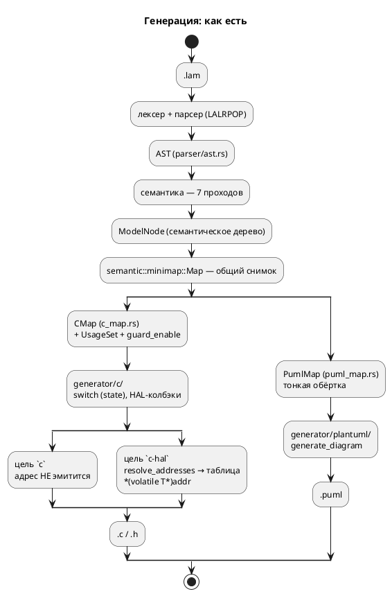
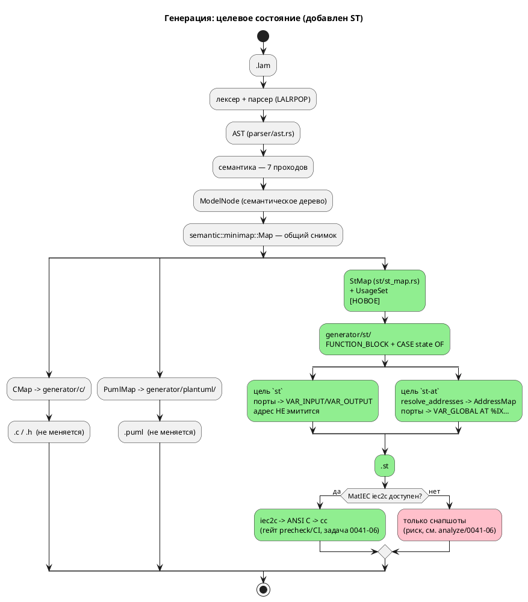

# ADR 0041: Бэкенд генерации в Structured Text (IEC 61131-3)

- **Status:** Accepted
- **Date:** 2026-07-15
- **Authors:** Архитектор + системный аналитик + дизайнер языков программирования
- **Related issues:** [Фича 0041](../features/0041-st-backend.md); потребляет
  `AddressMap` из [ADR 0020](0020-port-address-decl.md); образец «второго
  бэкенда» — [фича 0009](../features/0009-plantuml-generator.md); ядро генерации —
  [фича 0001](../features/0001-core-language-c.md); урок отображения типов —
  [фича 0029](../features/0029-c-type-mapping.md).

## Context

### Что есть сейчас

Слой генерации Lam устроен так (проверено по коду 2026-07-15):

- **`generator/mod.rs:14`** — перечисление `Language` ровно с двумя вариантами:
  `C` и `PlantUML`. Помечено **`#[non_exhaustive]`** (строка 13) с прямым
  комментарием: «список целевых языков будет расширяться, и добавление вариантов
  не должно ломать обратную совместимость (правило 11)». Точка расширения
  спроектирована заранее — эта фича ею и пользуется.
- **`generator/mod.rs:67`** — трейт `Generator` с единственным методом
  `generate(&self, model: &ModelNode, output_path: &str, options: &GenerateOptions)
  -> Result<(), Diagnostic>`. Свободная функция `generate(l, model, path, options)`
  (строка 80) диспетчеризует по `Language` через `match`.
- **`generator/mod.rs:30`** — `GenerateOptions` (тоже `#[non_exhaustive]`):
  `guard_enable`, `hal: bool`, `address_map: HashMap<String, ResolvedAddress>`.
  Поля `hal`/`address_map` заведены фичей 0020-05 ровно для «адрес-потребляющего»
  режима — ST-бэкенд переиспользует их, а не заводит третий канал.
- **Цели CLI** (`bin/lamc.rs:551`, `match options.target.as_str()`): фактически
  **три** — `c-hal`, `c`, `plantuml`. Замечание: сообщение об ошибке (строка ~646)
  говорит «Поддерживается: c, plantuml» — про `c-hal` умалчивает (мелкий дефект,
  правится попутно задачей 0041-01: строка всё равно меняется).
- **Образец второго бэкенда — PlantUML** (`generator/plantuml/mod.rs`, 258 строк):
  структура ровно та, что нужно повторить — `struct Generator {}` + `impl
  AsGenerator`, тонкая обёртка-снимок `PumlMap` над общей `semantic::minimap::Map`
  (`puml_map.rs`, 66 строк), чистая функция `generate_diagram(&map) ->
  Result<String, Diagnostic>` и запись в файл. Юнит-тесты живут прямо в модуле и
  проверяют **подстроки** результата.
- **C-бэкенд** (`generator/c/`, 6248 строк) — тяжёлый образец: `CMap` (`c_map.rs`)
  добавляет к снимку `usage: UsageSet` (фильтрация неиспользуемых элементов) и
  `guard_enable`.

### Как C-бэкенд укладывает FSM (ключ к решению)

Зонд: `lamc compile -t c examples/stacker.lam`. Порождённый C имеет ровно ту
форму, которую естественно повторить в ST:

- **Модель → структура + функции.** `struct StackerLiftController { enum {…} state; }`
  плюс `StackerLiftController_init/_tick/_reset/_is_done(model, main)`.
- **Состояния → `switch (model->state)`** (`c_model.rs:554`) с `case` на состояние.
- **Синтетическое состояние `INIT`** на каждый уровень вложенности — первый такт
  исполняет `enter` стартового состояния и переводит в него.
- **`enter` целевого состояния инлайнится в переход** (проверено:
  `case …LIFT_IDLE: if (main->lift_request) { write_bit(CMD_FORK, 1); state = …LIFT_OPERATING; break; }`
  — тело `enter` состояния `LiftOperating` исполнено **в переходе**).
- **Параллельная композиция `A | B | C`** (`start Stacker = CommandReceiver |
  MovementController | LiftController;`) → под-структуры полями родителя и
  **последовательный вызов их `_tick` в одном такте родителя**, с завершением по
  конъюнкции `_is_done` (проверено, `stacker.c:425-433`).
- **Порты → enum + колбэки HAL** (`read_bit`/`write_bit`/`read_numeric`/
  `write_numeric` в структуре); адрес в цели `c` **не эмитится** — находка 0020.

Поток «как есть» — два потребителя одного семантического дерева:



### Какую проблему решаем

Правило 12 объявляет целью проекта «язык задания и синтеза автоматных моделей
**промышленных систем управления**». При этом ни одна из двух целей генерации не
попадает на реальную платформу отрасли: `c` — прошивка МК (нужен свой HAL,
тулчейн, сборка), `plantuml` — картинка. **Стандартный язык программирования ПЛК
— это IEC 61131-3**, и ST в нём — текстовый язык, в который FSM ложится буквально
один-в-один: `CASE state OF` ≡ уже эмитируемый `switch`. Отсутствие ST-бэкенда —
самый крупный разрыв между заявленной целью проекта и его выходом.

Фича — задел, оставленный фичей 0020: её карточка прямо фиксирует «ST `AT %` — в
рамках фичи ST-бэкенд», а анализ 0020 — «Разблокирует: задел под кандидат
“ST-бэкенд” (`AT %`)».

## Decision Drivers

1. **Профиль проекта (правило 12).** ST — целевой язык ПЛК. Без него `lamc`
   синтезирует «во что угодно, кроме промышленного контроллера».
2. **Аддитивность (правило 11).** `Language` уже `#[non_exhaustive]`; добавление
   варианта не должно менять ни байта вывода целей `c`/`c-hal`/`plantuml` и не
   должно трогать `.lam`. Версия языка не растёт (правило 22).
3. **Не повторить дефекты отображения типов C** (фича 0029). `get_c_type`
   (`generator/c/mod.rs:150`) отображает `Array(size, elem)` → `uint{size}_t`
   (размер путается с разрядностью), `Bit` → `int`, `Rational` → `float` (f32
   против f64 симулятора), а переменная-массив **молча исчезает** из структуры
   **без диагностики**. ST-бэкенд пишется с нуля — обязан сделать это правильно и
   **никогда не терять узел молча** (класс дефектов «тихий пропуск»: фичи 0025,
   0028, 0029).
4. **Потребляемость адреса.** Адрес порта не должен снова стать мёртвыми
   метаданными (находка 0020). `AddressMap` уже есть и разрешён —
   `resolve_addresses` (`address_map.rs:409`).
5. **Проверяемость.** Гейт «сгенерировали и скомпилировали» для C уже работает
   (`precheck.sh` → cmake/ninja). Для ST нужен аналог, иначе фича закрывается
   снапшотами «текст равен тексту», что не доказывает ничего о валидности ST.
6. **Переиспользование, а не копирование.** Снимок `minimap::Map`, `UsageSet`,
   `resolve_addresses`, `Printer` (`generator/indent.rs`) — общие; ST-бэкенд не
   должен форкать обход дерева.

## Вопрос 1. Как FSM ложится на ST

### Option A. `FUNCTION_BLOCK` на модель + `CASE state OF`

Модель → `FUNCTION_BLOCK`; состояния → `CASE` по переменной состояния; композиция
→ экземпляры вложенных FB в `VAR` родителя, вызываемые в его теле. Изоморфно
тому, что уже делает C-бэкенд.

**Pros:**
- **1:1 с существующим C-бэкендом** — тот же обход `minimap::Map`, та же
  синтетическая `INIT`, тот же инлайн `enter` в переход, та же композиция
  «вызвать под-модели последовательно за один такт». Семантика уже отлажена и
  сверена с симулятором (0025-07): ST наследует её, а не изобретает.
- **Такт ПЛК ≡ такт модели.** Модель Lam уже тактовая (`tick`); скан-цикл ПЛК —
  ровно это. `FUNCTION_BLOCK` — единственная конструкция IEC с **сохраняемым
  состоянием между вызовами**, что и требуется для переменной состояния FSM.
- Экземплярность: одна модель — много экземпляров (естественно для `M1 | M2`).
- Читается инженером-наладчиком: `CASE` по состояниям — канонический способ
  писать FSM на ST вручную; вывод не будет «чужим» в проекте ПЛК.
- Поддерживается **всеми** средами (CODESYS/TwinCAT/Beremiz/MatIEC) — это ядро
  языка, а не расширение.

**Cons:**
- Ручное управление переменной состояния (как в C) — нет «встроенной» семантики
  шагов, которую даёт SFC.
- Вложенность FB даёт длинные цепочки квалифицированных имён.

### Option B. SFC (Sequential Function Chart)

Состояния → `STEP`/`TRANSITION` текстового SFC; композиция `|` → расходящиеся
параллельные ветви SFC.

**Pros:**
- Семантически «родная» для FSM конструкция стандарта: шаги, переходы,
  параллельные ветви — прямо то, что моделирует Lam. `M1 | M2` идейно точно
  ложится на simultaneous divergence.
- Графическое представление в среде ПЛК — «бесплатно», перекликается с
  PlantUML-бэкендом (фича 0009).

**Cons:**
- **Семантика не совпадает.** SFC-шаг имеет действия с квалификаторами
  (`N`/`S`/`R`/`P`/`D`…) и активность шага, а Lam оперирует `enter`/`always`/`exit`
  и мгновенным переходом с инлайном `enter` цели. Отображение не тождественно —
  пришлось бы либо менять семантику языка (правило 22 → версия языка растёт;
  фича заявлена аддитивной), либо строить нетривиальную эмуляцию, которую нечем
  проверить.
- **Текстовый SFC поддерживается плохо и по-разному.** Стандарт задаёт текстовую
  форму, но вендоры (CODESYS/TwinCAT) работают с SFC графически и хранят его в
  своих проектных форматах — генерировать переносимый *текст* SFC малополезно.
- Нет изоморфизма с C-бэкендом → второй, независимо отлаживаемый обход дерева и
  второй набор дефектов; сверка ST ↔ C ↔ симулятор становится невозможной.
- Вложенные модели Lam — не то же, что вложенные SFC.

### Option C. Одна `PROGRAM` с плоским `CASE`

Всё дерево моделей уплощается в одну `PROGRAM` с единым `CASE` по композитному
состоянию (декартово произведение либо перенумерация).

**Pros:**
- Простейший вывод: один файл, одна сущность, никакой вложенности имён.
- Нет экземпляров FB → минимум памяти на ПЛК.

**Cons:**
- **Взрыв состояний** на `M1 | M2`: `stacker.lam` — три параллельные модели с
  13 × 4 × 4 состояниями; декартово произведение ≈ 208 `case` вместо 21 в трёх
  блоках.
- Теряется структура модели: имена под-моделей исчезают, отладка на ПЛК
  (наблюдение переменной состояния конкретной под-модели) невозможна.
- `PROGRAM` — единичная сущность; повторное использование модели как компонента в
  чужом проекте ПЛК исключено.
- Расходится с C-бэкендом → см. Cons Option B.

### Decision (вопрос 1)

Принимается **Option A** — `FUNCTION_BLOCK` на модель + `CASE state OF`.

Решающий довод — **изоморфизм с уже работающим C-бэкендом**. Семантика тактов,
`INIT`, инлайна `enter` в переход и параллельной композиции уже реализована,
отлажена и сверена с симулятором (0025-07). Option A переиспользует её обход и
делает возможной **тройную сверку** (симулятор ↔ C ↔ ST) — сильнейший из
доступных способов проверки. Option B требует другой семантики (ломает
аддитивность) и не проверяем; Option C не масштабируется на `stacker.lam` —
основной пример профиля.

**Отображение композиции.**

| Конструкция Lam | C (как есть) | ST (решение) |
|---|---|---|
| `model M { … }` | `struct M { enum state; }` + `M_tick()` | `FUNCTION_BLOCK M` … `END_FUNCTION_BLOCK`, тело = один скан |
| `state S { … }` | `case …_S:` | `<n>: (* S *)` внутри `CASE state OF` |
| стартовое состояние | синтетический `case …_INIT` | синтетический `INIT` (значение 0 — по умолчанию при холодном старте ПЛК) |
| `M1 \| M2` (параллельно) | под-структуры + последовательные `_tick` в одном такте | экземпляры под-FB в `VAR`; последовательные вызовы в одном скане; завершение — конъюнкция `is_done` |
| `M1 + M2` (конкатенация) | последовательные шаги по `state` родителя | шаги `CASE` родителя: пока `NOT M1.is_done` — вызывать `M1`, затем `M2` |
| терминальность | `_is_done()` → `state == …_END` | выход `is_done : BOOL` блока |

Целевой поток:



**EBNF порождаемого подмножества ST** (правило 18 — генерируется код на другом
языке; фиксируем ровно то подмножество IEC 61131-3, которое эмитит бэкенд: всё,
что вне этой грамматики, генератор порождать не вправе):

```plantuml
@startuml
' EBNF: подмножество IEC 61131-3 ST, порождаемое бэкендом 0041
title EBNF порождаемого ST (подмножество IEC 61131-3)

file        = { type_decl } , { global_vars } , { function } ,
              { function_block } , [ configuration ] ;

type_decl   = "TYPE" , type_name , ":" , ( enum_spec | struct_spec ) ,
              ";" , "END_TYPE" ;
enum_spec   = "(" , enum_item , { "," , enum_item } , ")" ;
enum_item   = identifier , [ ":=" , integer ] ;
struct_spec = "STRUCT" , { identifier , ":" , iec_type , ";" } , "END_STRUCT" ;

global_vars = "VAR_GLOBAL" , { located_var } , "END_VAR" ;
located_var = identifier , [ "AT" , direct_addr ] , ":" , iec_type ,
              [ ":=" , literal ] , ";" ;
direct_addr = "%" , ( "I" | "Q" | "M" ) ,
              ( "X" | "B" | "W" | "D" | "L" ) ,
              integer , { "." , integer } ;

function       = "FUNCTION" , identifier , ":" , iec_type ,
                 var_input , { var_block } , stmt_list , "END_FUNCTION" ;

function_block = "FUNCTION_BLOCK" , identifier ,
                 [ var_input ] , [ var_output ] , var_block ,
                 stmt_list , "END_FUNCTION_BLOCK" ;
var_input   = "VAR_INPUT"  , { var_decl } , "END_VAR" ;
var_output  = "VAR_OUTPUT" , { var_decl } , "END_VAR" ;
var_block   = "VAR"        , { var_decl } , "END_VAR" ;
var_decl    = identifier , ":" , iec_type , [ ":=" , literal ] , ";" ;

iec_type    = "BOOL" | "SINT" | "INT" | "DINT" | "LINT"
            | "USINT" | "UINT" | "UDINT" | "ULINT" | "LREAL"
            | array_type | type_name ;
array_type  = "ARRAY" , "[" , integer , ".." , integer , "]" , "OF" , iec_type ;

stmt_list   = { statement } ;
statement   = assign_stmt | if_stmt | case_stmt | while_stmt
            | call_stmt | "RETURN" , ";" | ";" ;
assign_stmt = variable , ":=" , expression , ";" ;
if_stmt     = "IF" , expression , "THEN" , stmt_list ,
              { "ELSIF" , expression , "THEN" , stmt_list } ,
              [ "ELSE" , stmt_list ] , "END_IF" , ";" ;
case_stmt   = "CASE" , expression , "OF" ,
              { case_element } , [ "ELSE" , stmt_list ] , "END_CASE" , ";" ;
case_element= integer , ":" , stmt_list ;
while_stmt  = "WHILE" , expression , "DO" , stmt_list , "END_WHILE" , ";" ;
call_stmt   = identifier , "(" , [ arg_list ] , ")" , ";" ;

expression  = xor_expr , { "OR" , xor_expr } ;
xor_expr    = and_expr , { "XOR" , and_expr } ;
and_expr    = cmp_expr , { "AND" , cmp_expr } ;
cmp_expr    = add_expr , { ( "=" | "<>" | "<" | ">" | "<=" | ">=" ) , add_expr } ;
add_expr    = mul_expr , { ( "+" | "-" ) , mul_expr } ;
mul_expr    = unary_expr , { ( "*" | "/" | "MOD" ) , unary_expr } ;
unary_expr  = [ "NOT" | "-" ] , primary ;
primary     = literal | variable | call_expr | "(" , expression , ")" ;
variable    = identifier , { "." , identifier | "[" , expression , "]" } ;

configuration = "CONFIGURATION" , identifier ,
                "RESOURCE" , identifier , "ON" , identifier ,
                "TASK" , identifier , "(" , task_params , ")" , ";" ,
                "PROGRAM" , identifier , "WITH" , identifier , ":" ,
                identifier , ";" ,
                "END_RESOURCE" , "END_CONFIGURATION" ;
@enduml
```

## Вопрос 2. Отображение типов Lam → типы IEC

Исходные данные: `TypeNode` (`semantic/type_node.rs:496`) — `Bit`, `Bool`,
`Rational`, `Array(u16, Box<TypeNode>)`, `Enum(String)`, `Struct(String)`,
`Integer { bits: u8, signed: bool }`, плюс служебные (`Inference`, `Address`,
`Unsupported`, `Unit`, `Builtin*`).

### Option A. «Как в C» — переиспользовать логику `get_c_type`

**Pros:** нулевая работа; вывод ST согласован с выводом C.

**Cons:** **воспроизводит все три дефекта фичи 0029** — `Array(size, elem)` →
`uint{size}_t` (число элементов вместо разрядности; `[u8; 4]` → `uint4_t`), а сама
переменная-массив **молча исчезает из структуры без диагностики**; `Bit` → `int`;
`Rational` → `float` (f32) против f64 симулятора. Тиражировать известный дефект в
новый бэкенд — прямое нарушение драйвера 3. **Отвергается без дальнейшего
обсуждения.**

### Option B. Прямое отображение на типы IEC + диагностика на непокрытое

`Bit`/`Bool` → `BOOL`; `Integer{bits,signed}` → `USINT/UINT/UDINT/ULINT` и
`SINT/INT/DINT/LINT`; `Rational` → `LREAL`; `Array(N, T)` → `ARRAY [0..N-1] OF T`;
`Enum` → `TYPE … : (…); END_TYPE`; `Struct` → `TYPE … : STRUCT … END_STRUCT;
END_TYPE`. Любой неотображаемый узел → **ошибка** `ST-0xx`, генерация не
продолжается.

**Pros:**
- Каждый тип Lam получает **семантически точный** аналог IEC, а не ближайший
  подходящий: `bit` → `BOOL` (1 бит по смыслу, а не 32-битный знаковый `int`),
  `float` → `LREAL` (f64 — совпадает с симулятором, а не f32).
- `ARRAY [0..N-1] OF T` — **настоящий массив**: размер не путается с разрядностью,
  переменная не исчезает.
- Отказ вместо тихой потери — прямое следствие уроков фич 0025/0028/0029.
- Разбор `TypeNode` без ветки `_` (ADR 0025): единственная вынужденная ветка
  (`TypeNode` помечен `#[non_exhaustive]`, `type_node.rs:495`) возвращает
  **ошибку**, а не `None`, — ровно как `eval::coerce_to_type`.

**Cons:**
- Требует эмиссии `TYPE … END_TYPE` для `enum`/`struct` — новый пласт вывода,
  которого нет ни в одном существующем бэкенде.
- Перечислимые типы (`TYPE … : (A := 0);`) — конструкция 3-й редакции; поддержка
  в MatIEC требует пробы (задача 0041-06).

### Option C. Гибрид: перечисления как `USINT` + константы

`Enum` → `TYPE Name : USINT; END_TYPE` + `VAR_GLOBAL CONSTANT Name_A : USINT := 0;`.

**Pros:** максимально консервативно — работает в любом диалекте и любой редакции.

**Cons:** теряется типобезопасность перечисления (проверка `enum_type_safety_errors`,
`lib.rs:439`, в Lam есть — на ST она бы не транслировалась); вывод менее читаем;
расходится с идиоматикой ST.

### Decision (вопрос 2)

Принимается **Option B**, с **Option C как задокументированным откатом** для
перечислений, если проба 0041-06 покажет, что MatIEC не принимает перечислимые
`TYPE`.

**Таблица отображения** (нормативная; граничные случаи —
[`analyze/0041-02`](../analyze/0041-02-type-mapping.md)):

| `TypeNode` | C (как есть, `get_c_type`) | **ST (решение)** | Комментарий |
|---|---|---|---|
| `Bit` | `int` ← **дефект 0029** | `BOOL` | 1 бит по смыслу |
| `Bool` | `bool` | `BOOL` | |
| `Integer{8,false}` | `uint8_t` | `USINT` | |
| `Integer{16,false}` | `uint16_t` | `UINT` | |
| `Integer{32,false}` | `uint32_t` | `UDINT` | |
| `Integer{64,false}` | `uint64_t` | `ULINT` | |
| `Integer{8,true}` | `int8_t` | `SINT` | |
| `Integer{16,true}` | `int16_t` | `INT` | |
| `Integer{32,true}` | `int32_t` | `DINT` | |
| `Integer{64,true}` | `int64_t` | `LINT` | |
| `Rational` | `float` (f32) ← **дефект 0029** | `LREAL` | f64 — как в симуляторе |
| `Array(N, T)` | `uint{N}_t`, переменная **молча теряется** ← **дефект 0029** | `ARRAY [0..N-1] OF <T>` | настоящий массив |
| `Enum(name)` | `uint{bits}_t` по макс. варианту | `TYPE name : (…); END_TYPE` | откат — Option C |
| `Struct(name)` | `name` | `TYPE name : STRUCT … END_STRUCT; END_TYPE` | |
| `Unit` | `void` | — (процедурный FB) | |
| `Inference`, `Unsupported`, `Address`, `Builtin*` | `None` (тихо) | **ошибка `ST-002`** | никакого тихого пропуска |

**Связь с фичей 0029 — это урок, а не зависимость.** `get_c_type`
(`generator/c/mod.rs:150`) — функция, приватная для C-бэкенда; ST-бэкенд её не
вызывает и не наследует. Общего слоя отображения типов **не заводим**: цели `c` и
`st` имеют разные системы типов, и попытка их обобщить связала бы аддитивную фичу
с незакрытой 0029. Порядок работ фич независим.

### Фрагмент целевого ST (`stacker.lam`, модель `LiftController`)

Исходник (`examples/stacker.lam:355-385`) и уже порождаемый C (`stacker.c:64-114`,
проверено зондом) дают такой целевой ST:

```
FUNCTION_BLOCK StackerLiftController
VAR_INPUT
    lift_request : BOOL;
    lift_op      : BOOL;
    sense_loaded : BOOL;
END_VAR
VAR_OUTPUT
    cmd_fork  : BOOL;
    lift_done : BOOL;
    is_done   : BOOL;
END_VAR
VAR
    state : USINT := 0;   (* 0 = INIT — значение по умолчанию при холодном старте *)
END_VAR

CASE state OF
    0: (* INIT: enter стартового состояния LiftIdle инлайнится в переход *)
        cmd_fork := FALSE;
        state := 1;

    1: (* LiftIdle *)
        IF lift_request THEN
            cmd_fork := TRUE;          (* enter состояния LiftOperating *)
            state := 2;
        END_IF;

    2: (* LiftOperating *)
        IF lift_request AND NOT lift_op AND sense_loaded THEN
            cmd_fork  := FALSE;        (* enter состояния LiftDone *)
            lift_done := TRUE;
            state := 3;
        ELSIF lift_request AND lift_op AND NOT sense_loaded THEN
            cmd_fork  := FALSE;
            lift_done := TRUE;
            state := 3;
        ELSIF NOT lift_request THEN
            cmd_fork := FALSE;         (* enter состояния LiftIdle *)
            state := 1;
        END_IF;

    3: (* LiftDone *)
        IF NOT lift_request THEN
            cmd_fork := FALSE;
            state := 1;
        END_IF;

    4: (* END — терминальное *)
        ;
END_CASE;

is_done := (state = 4);
END_FUNCTION_BLOCK
```

Сверка с C построчно: `case …LIFT_OPERATING` (`stacker.c:82-101`) содержит ровно
те же три `if` в том же порядке с тем же инлайном `enter` — изоморфизм Option A
подтверждён на реальном примере.

Параллельная композиция `start Stacker = CommandReceiver | MovementController |
LiftController;` (`stacker.lam:388`) — прямой аналог `stacker.c:425-433`:

```
FUNCTION_BLOCK Stacker
VAR
    command_receiver0    : StackerCommandReceiver;
    movement_controller1 : StackerMovementController;
    lift_controller2     : StackerLiftController;
    state : USINT := 0;
    (* переменные корневой модели *)
    lift_request : BOOL;
    lift_op      : BOOL;
    lift_done    : BOOL;
    busy         : BOOL;
    tgt_stack    : USINT;
    (* … *)
END_VAR

CASE state OF
    0: (* INIT *)
        state := 1;
    1: (* Stacker: один скан = один такт каждой параллельной модели *)
        command_receiver0(lift_request := lift_request (* … *));
        movement_controller1(lift_request := lift_request (* … *));
        lift_controller2(lift_request := lift_request, lift_op := lift_op,
                         sense_loaded := sense_loaded);
        lift_done := lift_controller2.lift_done;
        (* … обратная запись координационных переменных … *)
        IF command_receiver0.is_done AND movement_controller1.is_done
           AND lift_controller2.is_done THEN
            state := 2;
        END_IF;
    2: (* END *)
        ;
END_CASE;
END_FUNCTION_BLOCK
```

## Вопрос 3. Потребление карты адресов: `AddressMap` → `AT %…`

### Что даёт 0020

`resolve_addresses(model, external) -> AddressResolution` (`address_map.rs:409`)
возвращает `map: HashMap<String, ResolvedAddress>`, где `ResolvedAddress { addr:
i64, bit: Option<i64>, source: AddressSource }` (`address_map.rs:361`). Приоритет
источников — inline < `address` < внешняя карта — уже разрешён. Направление порта
берётся из `VariableNode::Port { direction: PortDirection, .. }`
(`semantic/mod.rs:847-860`; `PortDirection::{In, Out, InOut}`, `ast.rs:181`).

**Импеданс.** Адрес в Lam — **плоский физический** (`0x10000000`,
`elevator.lam:36`; `0x100:0`, `stacker.lam:52`), как указатель для
`*(volatile T*)addr` в `c-hal`. Прямой адрес IEC (`%IX1.0`) — **логическая
иерархическая** локация ввода-вывода, отображаемая на физику **конфигурацией
ПЛК**, а не программой. Это не одно и то же, и честное отображение обязано это
признать.

### Option A. Механическое отображение + отдельная цель `st-at`

`direction` → префикс (`In`→`%I`, `Out`→`%Q`, `InOut`→`%M`); разрядность типа →
размерный префикс (`BOOL`→`X`, 8→`B`, 16→`W`, 32→`D`, 64→`L`); `addr` → номер
локации; `bit` → суффикс `.бит`. Цель `-t st` адрес **не эмитит** (порты —
`VAR_INPUT`/`VAR_OUTPUT`), цель `-t st-at` эмитит `VAR_GLOBAL … AT %…`.

**Pros:**
- **Повторяет уже принятое и закрытое решение 0020-05** — пару `c` / `c-hal`: одна
  цель без адресов (порты через интерфейс), вторая — адрес-потребляющая.
  Архитектура проекта уже это знает; `GenerateOptions { hal, address_map }`
  переиспользуется без изменений.
- Дефолт `-t st` полезен сам по себе: FB с `VAR_INPUT`/`VAR_OUTPUT` — это то, что
  инженер вставит в свой проект ПЛК и **сам** свяжет с локациями через
  конфигурацию среды. Именно так ПЛК-проекты и делаются.
- Диагностики полноты (`SE-052`) переиспользуются как есть: цель `st-at` —
  адрес-потребляющая, как `c-hal`.
- Механическое правило проверяемо и объяснимо.

**Cons:**
- Для крупных плоских адресов результат абсурден физически: `in sensors_1: u8 :=
  268435456` (`0x10000000`) → `AT %IB268435456` — ни один ПЛК столько локаций не
  имеет. **Смягчение:** это дефект **исходной модели** для цели ST, а не
  генератора; `stacker.lam` (`0x100:0` → `%IX256.0`) уже сейчас в разумном
  диапазоне. Правильный путь для `elevator.lam` — внешняя карта `--address-map` с
  ПЛК-адресами (механизм 0020-03 уже есть).
- `InOut` → `%M` — соглашение, а не требование стандарта.

### Option B. Новый синтаксис адреса в `.lam` для ST-локаций

Ввести в язык вторую форму адреса (`address BTN = %IX1.0;`).

**Pros:** ST-адрес выражается точно, без интерпретации.

**Cons:** **меняет язык** → версия языка растёт (правило 22), фича перестаёт быть
аддитивной; вносит вендор-специфику прямо в `.lam`; дублирует `AddressMap` вторым
каналом — ровно то, чего 0020 избегала («связующее звено — единый `AddressMap`»).
Отвергается.

### Option C. Расширить внешнюю `.ld`-карту записями-локациями ST

Разрешить `sensors_1 = %IX1.0;` в файле `--address-map`.

**Pros:** язык не меняется; ST-адреса живут ровно там, где им место — во внешней
карте платформы; «одна модель — много платформ» (0020 это и задумывала).

**Cons:** расширяет формат карты и её парсер (`parse_address_map`, коды
AM-001…006) — это территория фич 0042/0043; тянет вопрос «как ту же запись понимать
в `c-hal`». Отдельная фича.

### Decision (вопрос 3)

Принимается **Option A**: механическое отображение + отдельная цель `-t st-at` по
образцу `c` / `c-hal`. **Option C фиксируется как естественное продолжение** и
выносится в кандидаты (не в эту фичу).

Правило отображения (нормативно; подробно —
[`analyze/0041-05`](../analyze/0041-05-address-at.md)):

| Источник | Правило | Пример (`stacker.lam`) |
|---|---|---|
| `direction: In` | `%I` | `in task_valid: bit := 0x100:0` |
| `direction: Out` | `%Q` | `out cmd_fork: bit := 0x500:0` |
| `direction: InOut` | `%M` | — |
| тип `BOOL` (`Bit`/`Bool`) | размер `X`, требуется `bit` | → `AT %IX256.0 : BOOL;` |
| `Integer{8}` | размер `B` | `in pos_stack: u8 := 0x200:0` → `AT %IB512 : USINT;` |
| `Integer{16}` | `W` | |
| `Integer{32}` | `D` | |
| `Integer{64}` | `L` | |
| `Rational` (`LREAL`) | `L` | |
| `Array`/`Enum`/`Struct` | локация не определена → **ошибка `ST-004`** | |

Граничные случаи (все — диагностика, ни один не «молча»):

- `BOOL`-порт **без** `bit` в `ResolvedAddress` → **`ST-005`** (предупреждение),
  бит принимается за `.0`; в C-бэкенде аналог — `bit = -1` (`c_header.rs:688`).
- Не-`BOOL`-порт **с** `bit` → **`ST-006`** (предупреждение), бит игнорируется
  (байтовая/словная локация бита не имеет).
- Используемый порт без адреса в цели `st-at` → **`SE-052`** (ошибка,
  переиспользуется из 0020-04; в `c-hal` ровно так же).
- Адрес вне диапазона локаций платформы — **не диагностируется**: у компилятора нет
  модели платформы. Фиксируется в документации как ответственность автора карты.

## Вопрос 4. Диалект-совместимость

### Option A. Чистый IEC 61131-3 (3-я редакция), без вендорских расширений

**Pros:** переносимо в принципе; единственный вариант, у которого есть **открытый
валидатор** (MatIEC `iec2c`) → автоматизируемый гейт в CI; не привязывает проект к
коммерческой среде; вывод пригоден как вход для CODESYS/TwinCAT (импорт ST-текста)
при ручной доводке.

**Cons:** «чистого» ПЛК не существует — в реальном проекте всё равно понадобятся
вендорские атрибуты/прагмы; стандарт платный (ISO/IEC 61131-3) → сверять
соответствие можно только через реализации.

### Option B. Диалект CODESYS 3.x (или TwinCAT 3)

**Pros:** крупнейшая доля рынка; вывод сразу пригоден в реальном проекте;
`{attribute}`-прагмы, `METHOD`, `EXTENDS`, `REFERENCE TO` выразительнее.

**Cons:** **непроверяемо в CI** — среда закрытая, GUI-only, лицензируемая (ровно та
же стена, что у плагина IntelliJ: «собрать плагин в CI-среде нельзя — `runIde`
требует GUI», `FEATURES.md`); привязка к вендору противоречит роли Lam как
языка-источника; выбор одного вендора обесценивает вывод для остальных.

### Option C. Пересечение диалектов («что примут все»)

**Pros:** максимальная переносимость на практике.

**Cons:** пересечение **неизвестно и непроверяемо** — чтобы его знать, нужны все
среды; на деле выродится в «то, что мы угадали», без гейта. Хуже Option A: та хотя
бы имеет объективный арбитр.

### Decision (вопрос 4)

Принимается **Option A**: целимся в **чистый IEC 61131-3, а арбитром соответствия
объявляется MatIEC `iec2c`** — «валидный ST» для фичи 0041 операционально
определяется как «принимается `iec2c`, и результат его трансляции компилируется
`cc`». Вендорские диалекты — вне области фичи; при запросе заказчика — отдельная
фича поверх (`--dialect codesys`), т.к. потребует своей, непроверяемой в CI,
стратегии тестирования.

Обоснование: это единственная опция с **объективным, автоматизируемым критерием
истинности**. Проект уже дважды обжигался на непроверяемом выводе (тихие пропуски
0025/0028/0029; невозможность CI-проверки плагина 0022/0023) — новый бэкенд без
гейта повторил бы ошибку в третий раз. Порождаемое подмножество ST при этом
намеренно узкое (см. EBNF выше): `CASE`/`IF`/`WHILE`/присваивания/вызовы FB — ядро
стандарта, поддержанное всеми средами, а не спорная периферия.

**Оговорка (риск).** MatIEC реализует не весь стандарт; его собственное подмножество
**может не совпасть** с 3-й редакцией (в первую очередь — перечислимые `TYPE`).
Поэтому арбитр фиксируется **вместе с пробой 0041-06**: пока проба не пройдена,
выбор арбитра не подтверждён. Если `iec2c` откажется от перечислимых типов —
вступает откат Option C вопроса 2 (`enum` → `USINT` + константы).

## Consequences

### Положительные

- **Профиль проекта закрыт (правило 12):** `lamc` синтезирует в стандартный язык
  ПЛК; `.lam` становится источником для реального промышленного контроллера.
- **Адрес порта дожил до второго потребителя.** 0020 сделала `AddressMap` общим
  слоем; `st-at` подтверждает, что слой спроектирован верно (`c-hal` был первым,
  `st-at` — второй; 0043 будет третьим).
- **Дефекты отображения типов не тиражируются.** ST-бэкенд с первого коммита имеет
  корректные `BOOL`/`LREAL`/`ARRAY [0..N-1] OF T` и отказывает вместо тихой потери
  — эталонная реализация того, к чему 0029 приведёт C.
- **Тройная сверка становится возможной.** Симулятор ↔ C ↔ ST на одной модели —
  сильнейший контроль семантики из доступных проекту (расширение линии 0025-07).
- **Аддитивность доказана конструкцией:** `Language` `#[non_exhaustive]`, целей
  добавляется две новые, существующие три не тронуты.

### Отрицательные / Action items

- **Проверяемость под вопросом до 0041-06.** Гейт `iec2c` не проверен в
  репозитории: MatIEC не пакет Debian (сборка из исходников; bison/flex/gcc) и
  требует полной `CONFIGURATION`, а не голого FB. **Action:** задача 0041-06
  выполняется **сразу после каркаса 0041-01** и является гейтом фичи; при её
  провале фича закрывается на снапшотах, и это фиксируется в отчёте как явное
  ограничение (не замалчивается).
- **Генератор обязан уметь эмитить `CONFIGURATION`.** Следствие требования
  `iec2c`. **Action:** эмиссия `CONFIGURATION`/`RESOURCE`/`TASK`/`PROGRAM` — под
  флагом (`--st-configuration`), т.к. в реальном проекте ПЛК конфигурацию задаёт
  среда, а не импортируемый файл. Уточняется пробой 0041-06.
- **Новый пласт вывода: `TYPE … END_TYPE`.** `enum`/`struct` требуют объявлений
  типов, которых нет ни в одном из существующих бэкендов.
- **Плоские адреса `elevator.lam` дают абсурдные локации** (`%IB268435456`).
  **Action:** в 0041-07 к примеру прикладывается ПЛК-карта
  `examples/elevator.plc.map` (механизм `--address-map` из 0020-03), а ограничение
  документируется.
- **`AT %` не выражается в `.lam`** — только через внешнюю карту. **Action:**
  кандидат в `FEATURES.md` — «`.ld`-карта: записи-локации ST (`%IX1.0`)» (Option C
  вопроса 3). Заводит координатор; в этой фиче не делается.
- **Размер модуля.** `generator/c/` — 6248 строк; ST-бэкенд сопоставим по объёму.
  **Action:** соблюдать лимит ~1000 строк на модуль (`CLAUDE.md`, `docs/CODE.md`) с
  первого коммита — дробить `st/` по логике (`st_map`/`st_type`/`st_model`/
  `st_expr`/`st_decl`), а не повторять путь `validate.rs` (3648 строк, кандидат
  0027).
- **Мелкий дефект CLI попутно.** `bin/lamc.rs` (~строка 646): «Поддерживается: c,
  plantuml» — `c-hal` не упомянут. **Action:** правится в 0041-01 вместе с
  добавлением `st`/`st-at` (строка всё равно меняется).
- **Версия крейта.** `grammar` `0.2.0` → `0.3.0` (минор: новый публичный API
  `Language::ST`, `compile_to_st`, `compile_to_st_at`). **Версия языка остаётся
  0.2.0** — `.lam` не тронут (правило 22).

### Acceptance criteria

1. `lamc compile -t st examples/stacker.lam -o out` порождает `.st`, содержащий
   `FUNCTION_BLOCK` на каждую из четырёх моделей (`Stacker`, `CommandReceiver`,
   `MovementController`, `LiftController`) с `CASE state OF`; вывод целей `c`,
   `c-hal`, `plantuml` для того же файла — **байт-в-байт** как до фичи.
2. Отображение типов соответствует нормативной таблице вопроса 2; в частности
   `var data: [u8; 4];` даёт `data : ARRAY [0..3] OF USINT;` (а **не** исчезает и
   **не** даёт `uint4_t`, как в C — дефект 0029).
3. Неотображаемый узел типа/АСД → **диагностика** `ST-0xx`, а не тихий пропуск
   (проверяется контрпримером).
4. `lamc compile -t st-at --address-map <карта> examples/stacker.lam` размещает
   порты как `VAR_GLOBAL … AT %IX…/%QX…` согласно таблице вопроса 3; используемый
   порт без адреса → `SE-052`.
5. **Гейт проверяемости (0041-06):** `iec2c` принимает порождённый ST для всех
   `examples/*.lam`, и результат его трансляции компилируется `cc` — по образцу
   существующего C-гейта в `precheck.sh`. При недостижимости — задокументированный
   отказ с явным ограничением в отчёте (см. `analyze/0041-06`).
6. Модель `LiftController` из `stacker.lam` в ST и в C имеют **изоморфные** переходы
   (та же последовательность условий, тот же инлайн `enter`) — сверка с зондом C,
   зафиксированным в этом ADR.
7. Ни один модуль `generator/st/` не превышает ~1000 строк (`CLAUDE.md`).
8. Примеры и контрпримеры попали в документацию по языку (правила 15, 16).
