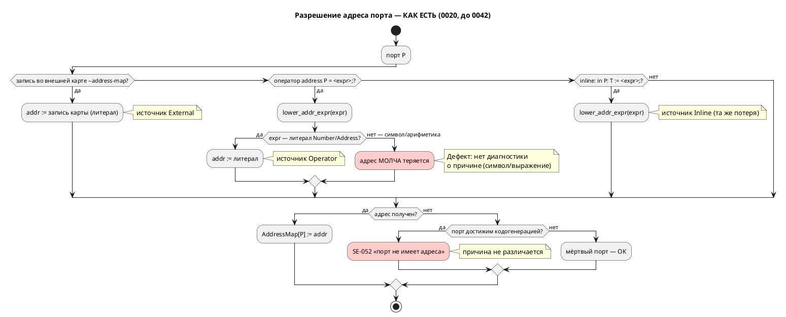
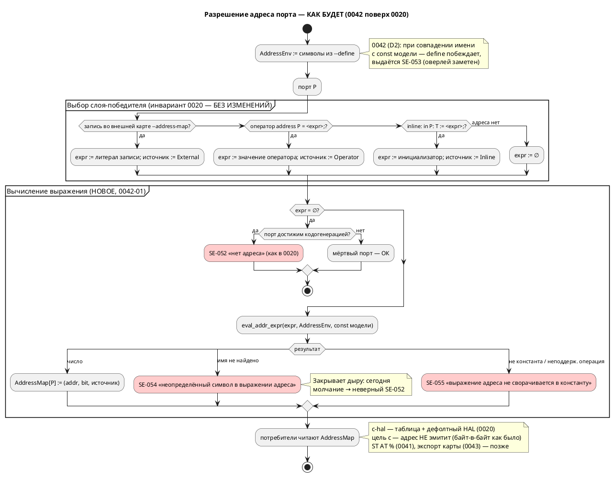

# ADR 0042: Инъекция define'ов для адресов — среда символов адреса (`--define`)

- **Status:** Accepted
- **Date:** 2026-07-15
- **Authors:** Архитектор + дизайнер языков
- **Related issues:** [Фича 0042](../features/0042-address-defines.md); развивает
  [ADR 0020](0020-port-address-decl.md) (слой `AddressMap`, приоритет источников);
  пересекается с [ADR 0041](0041-st-backend.md) и [ADR 0043](0043-address-map-export.md)
  (оба — потребители `AddressMap`)

## Context

ADR 0020 закрепил подсистему привязки портов к адресам: источники наполняют
единый слой **`AddressMap: PortId → Address`**, из которого потребители (сегодня —
цель `c-hal`) эмитят таблицу адресов и дефолтный HAL. Приоритет источников
(**инвариант 0020**, `CLAUDE.md`):

> **inline `:=` < оператор `address Имя = <адрес>;` < внешняя карта `--address-map`**

В Action items ADR 0020 значилось: «**`-D`/инъекция define’ов** … выносятся в
**отдельные фичи**» — с формулировкой «символы `--define BTN_ADDR=0x200000` в
среде констант, потребляемые выражениями адреса (`address BTN = BTN_ADDR;`).
Это не отдельный парсер, а подстановка в окружение констант».

### Находка: «тонкий слой» не подтвердился (проба на коде, 2026-07-15)

Кандидат предполагал, что выражения адреса уже умеют ссылаться на имена, и
`--define` останется тонкой надстройкой. **Проба это опровергла.**

Разрешение адреса выполняет `resolve_addresses`
(`grammar/src/address_map.rs:409`), а понижение выражения в число —
`lower_addr_expr` (`grammar/src/address_map.rs:384`). Последняя принимает
**только литералы**:

```rust
// grammar/src/address_map.rs:384 — фактический код
match expr {
    ExpressionNode::Address(a, b) => Some((*a, Some(*b))),
    ExpressionNode::Number(n) => Some((*n, None)),
    ExpressionNode::Unresolved(ast::Expression::Address(_, a, b)) => Some((*a, Some(*b))),
    ExpressionNode::Unresolved(ast::Expression::Number(_, n)) => Some((*n, None)),
    _ => None,   // ← символ, арифметика, всё остальное — молча «адреса нет»
}
```

Значение оператора `address` хранится как `ExpressionNode::Unresolved(…)`
(`grammar/src/semantic/tree.rs:551‑563`) и **никогда не понижается**
семантикой — вывод типов его не трогает. Результаты проб
(`cargo run --bin lamc -- compile -t c-hal`):

| Проба | Вход | Факт сегодня |
|---|---|---|
| A (эталон) | `address BTN = 0x00100000;` | ✅ адрес попадает в таблицу `*__ADDR` и дефолтный HAL |
| B | `const BTN_ADDR: u32 := 0x00100000; address BTN = BTN_ADDR;` | ❌ **ошибка `SE-052`** «порт не имеет адреса» — символ молча потерян |
| C | `address BTN = NOWHERE_DEFINED;` (цель `c-hal`) | ❌ `SE-052` — **причина в диагностике неверная** (символа не существует, но об этом не сказано) |
| C2 | то же, цель `c` | ⚠️ **компилируется успешно, rc=0** — висячая ссылка не диагностируется вовсе |
| D | `address BTN = 0x00100000 + 4;` | ❌ `SE-052` — свёртки констант нет |

**Вывод.** Выражения адреса **не умеют ссылаться на символы**, а любая
неатомарная форма **молча теряет адрес** — тот же класс дефекта «тихого
пропуска», что дал восемь ошибок в фиче 0025. Поэтому 0042 состоит из **двух**
решений, а не из одного:

1. **Вычисление выражения адреса** — свёртка констант и разрешение символов
   (ядро; отсутствует сегодня).
2. **Источник символов** — откуда берутся имена, в частности из `--define`.

### Поток «как есть»



## Decision Drivers

1. **Не нарушить инвариант приоритета 0020.** `inline < address < внешняя карта`
   зафиксирован в `CLAUDE.md` и охраняется тестами; define не должен стать
   скрытым четвёртым слоем.
2. **CLI не должен менять логику автомата.** Флаг сборки, способный молча
   переопределить `const`, участвующую в переходах, — это дыра в верифицируемости
   (правило 12: язык для промышленных систем управления).
3. **Закрыть тихий пропуск.** Молчаливая потеря адреса недопустима: диагностика
   обязана называть причину (ср. замысел форматтера 0024 и урок 0025).
4. **Обратная совместимость (правило 11).** CLI `lamc` расширяется аддитивно;
   существующие `.lam` и вывод цели `c` — без изменений.
5. **Не плодить второй интерпретатор.** Вычислитель адреса — минимальное
   целочисленное подмножество, а не копия `simulation/src/eval/`.
6. **Симметрия с уже принятыми решениями 0020.** Оверлей платформы главнее
   модели, но **заметен** (предупреждение `SE-050`) — то же поведение ожидается и
   от define'ов.

## Вопрос 1. Место define'ов в приоритете источников адреса

### Option A1. Define — четвёртый источник адреса (выше внешней карты)

`--define BTN=0x200000` напрямую задаёт адрес порта `BTN`, минуя выражения.

**Pros:**
- Прямолинейно: «переопредели адрес одним флагом».

**Cons:**
- **Ломает инвариант 0020** (`CLAUDE.md`): цепочка становится
  `inline < address < карта < define`, все тексты/тесты приоритета — переписывать.
- Дублирует `--address-map`, у которого ровно эта роль (оверлей платформы).
- Порождает неоднозначность: `-D BTN=…` — это адрес порта `BTN` или значение
  символа `BTN`? Имена портов и символов сливаются в одно пространство.

### Option A2. Define — среда символов, ортогональная приоритету (**принято**)

Define не привязывается к порту вообще. Он даёт **значение имени**, которое
может встретиться в выражении адреса — на любом слое. Слой-победитель по-прежнему
выбирается правилом 0020, и лишь **затем** его выражение вычисляется.

**Pros:**
- **Инвариант 0020 сохранён дословно** — define'ы лежат на другой оси
  («чем вычисляется выражение»), а не в цепочке источников.
- Композиция: `-D BASE=0x200000` + `address BTN = BASE + 4;` — модель описывает
  раскладку, платформа даёт базу.
- Имена портов и символов остаются разными пространствами.

**Cons:**
- Бесполезен без вычислителя выражений адреса (которого нет) → объём фичи растёт
  на задачу 0042-01.
- Требует явного ответа: побеждает ли define одноимённую `const` (вопрос 4).

### Option A3. Текстовый препроцессор (подстановка до лексера)

`-D NAME=VALUE` подставляется в текст `.lam` перед разбором, как в C.

**Pros:**
- Знакомая модель; тривиальная реализация.

**Cons:**
- Подстановка бьёт **по всему файлу**, а не только по адресам → драйвер 2 нарушен
  напрямую.
- Ломает позиции (`Location`) → диагностики, LSP и форматтер (0024) поедут.
- Проект сознательно не имеет препроцессора; вводить его ради адресов — тяжело.

## Вопрос 2. Область видимости define'а

### Option B1. Define — константа в общей среде констант языка

Видна любому выражению: условиям переходов, телам блоков, инициализаторам `var`.

**Pros:**
- Максимально гибко; одна среда имён.

**Cons:**
- **CLI получает право молча менять поведение автомата** — `-D LIMIT=5` изменит
  `ref Stop: cnt = LIMIT;`. Для промышленных систем управления (правило 12) это
  недопустимо: верифицированная модель перестаёт быть самодостаточной.
- Меняет семантику разрешения имён языка → серьёзный рост версии языка и объёма
  тестов (все проходы семантики).
- Противоречит названию и мотиву фичи («define'ы **для адресов**»).

### Option B2. Define виден только выражениям адреса (**принято**)

Символы живут в отдельной среде **`AddressEnv`**, к которой обращается только
вычислитель адреса — в двух позициях: значение оператора `address` и
inline-инициализатор порта (напомним находку 0020: инициализатор порта **и есть**
адрес, в C он иначе не используется).

**Pros:**
- Логика автомата **не зависит** от флагов сборки — модель остаётся
  верифицируемой (драйвер 2).
- Минимальная поверхность: не трогает 7 семантических проходов.
- Точная диагностика: имя в выражении адреса ищется в понятном, узком множестве.

**Cons:**
- Один и тот же идентификатор в выражении адреса и в логике может означать
  разное → снимается вопросом 4 (define перекрывает `const` **только** в
  выражениях адреса и **с предупреждением**).
- Не покрывает будущие «платформенные параметры» вне адресов — при появлении
  запроса заводится отдельная фича.

### Option B3. Define виден только явно объявленным `extern const`

Модель декларирует `extern const BTN_ADDR: u32;`, define обязан его заполнить.

**Pros:**
- Максимальная явность: контракт платформы записан в модели.
- Опечатка в `-D` ловится как незаполненный `extern`.

**Cons:**
- **Расширяет грамматику** (`extern const`) → рост версии языка и объёма 0042.
- Требует объявлять каждый символ дважды (в модели и в сборке) — трение против
  мотива «не править модель под платформу».
- Хороший кандидат в **последующую** фичу поверх B2, если явность потребуется.

## Вопрос 3. Типизация значения define

### Option C1. Только целочисленный литерал адреса (**принято**)

Значение — литерал в **той же грамматике, что и запись внешней карты**
(`Address` из `address_map.rs`): `0x…`, десятичное, необязательный `:bit`.
Переиспользуется существующая `parse_address_token`
(`grammar/src/address_map.rs:273`).

**Pros:**
- Ноль нового кода разбора значений; одинаковые правила у `--define` и
  `--address-map` → одна ментальная модель.
- Арифметика остаётся **в модели** (`address BTN = BASE + 4;`), где она видна
  ревьюеру и форматтеру, а не в командной строке.
- Значение всегда вычислено на момент разрешения — нет порядка/циклов между
  define'ами.

**Cons:**
- Нельзя `-D BTN_ADDR="BASE+4"` — вычисляемые наборы придётся раскрывать
  снаружи (shell/CMake).

### Option C2. Значение — произвольное выражение Lam

`-D BTN_ADDR="BASE + 4"` разбирается парсером выражений и вычисляется.

**Pros:**
- Выразительно; наборы define'ов могут ссылаться друг на друга.

**Cons:**
- Требует разрешения **порядка и циклов** между define'ами (`-D A=B`, `-D B=A`)
  → полноценный граф зависимостей ради краевого случая.
- Диагностика с позициями внутри аргумента командной строки — отдельная возня с
  `Location` (у аргумента нет файла).
- Кавычки/экранирование в shell — источник ошибок сборки.

### Option C3. Значение — нетипизированная строка

Хранится как текст, интерпретируется потребителем.

**Pros:**
- Универсально, задел под нечисловые параметры платформы.

**Cons:**
- Адрес обязан быть числом — проверка всё равно нужна, но уезжает вглубь, к
  потребителю → диагностика хуже.
- `AddressMap` типизирован `i64` — строка потребует приведения на каждом стыке.

## Вопрос 4. Конфликт define с одноимённой `const` в исходнике

### Option D1. Ошибка

Любое совпадение имени define и `const` модели → отказ компиляции.

**Pros:**
- Однозначно; невозможен сюрприз.

**Cons:**
- Убивает главный сценарий: `const BTN_ADDR := 0x200000;` как **значение по
  умолчанию**, переопределяемое `-D BTN_ADDR=0x300000` под платформу.
- Асимметрия: у внешней карты (`--address-map`) ровно такое перекрытие —
  **предупреждение `SE-050`**, а не ошибка.

### Option D2. Define побеждает, с предупреждением `SE-053` (**принято**)

В выражениях адреса имя ищется **сначала в `AddressEnv`, затем среди `const`
модели**. Если имя есть в обоих — берётся define, выдаётся предупреждение
`SE-053` с позицией объявления `const`.

**Pros:**
- **Прямая симметрия с `SE-050`** (0020): платформенный слой главнее модели, но
  перекрытие **заметно**. Одно правило на всю подсистему — легко объяснить.
- Работает сценарий «`const` = дефолт, `-D` = оверлей под платформу».
- Перекрытие ограничено выражениями адреса (решение B2) → логика автомата
  по-прежнему неприкосновенна.

**Cons:**
- Предупреждение в штатном сценарии оверлея будет частым → глушится `--quiet`
  (механизм уже есть в `lamc`), как и `SE-050`.

### Option D3. `const` побеждает

Модель главнее командной строки.

**Pros:**
- Модель самодостаточна и неперекрываема.

**Cons:**
- `-D` становится бесполезен ровно там, где нужен (перекрыть дефолт), — остаётся
  лишь для имён, которых в модели нет. Мотив фичи не достигается.
- Противоречит направлению приоритета 0020 (внешнее главнее внутреннего).

## Вопрос 5. Наборы define'ов под платформы

### Option E1. Только флаги командной строки (**принято для ядра 0042**)

`--define NAME=VALUE` (повторяемый), краткая форма `-D NAME=VALUE` и слитная
`-DNAME=VALUE` — по образцу уже существующего `-I` / `-I<путь>`
(`grammar/src/bin/lamc.rs:190‑199`). Роль «файла набора под платформу» уже
закрыта флагом **`--address-map`**, который читает `.ld`-подобный файл.

**Pros:**
- Ноль новых форматов: третий мини-язык (после `.lam` и `.ld`-карты) не заводится.
- Симметрия с `-I` — единый стиль CLI `lamc`.
- Набор под платформу выражается либо `--address-map stm32.map` (готово), либо
  обвязкой сборки (CMake/shell/`make`), где такие наборы и живут.

**Cons:**
- Длинные списки `-D` в командной строке при большом числе символов → лечится
  обвязкой сборки; при реальном запросе заводится фича файла-набора.

### Option E2. Файл-набор нового формата (`--defines platform.def`)

**Pros:**
- Наборы версионируются вместе с проектом; командная строка коротка.

**Cons:**
- **Третий мини-формат** со своим лексером, диагностиками и тестами — ровно то,
  за что ADR 0020 уже платил на `.ld`-карте.
- Пересекается с `--address-map` по назначению → пользователю неочевидно, что
  когда применять.

### Option E3. Переиспользовать формат `.ld`-карты для файла define'ов

`--defines platform.def` читается тем же `parse_address_map`, но записи
кладутся в `AddressEnv`, а не в карту адресов.

**Pros:**
- Парсер и коды `AM-001…006` переиспользуются целиком.

**Cons:**
- Два флага с **одинаковым** синтаксисом и **разной** семантикой (`NAME` — порт
  против `NAME` — символ) — ловушка для пользователя.
- Ценность мала, пока не доказан спрос на файл-наборы.

## Decision

Принимается связка **A2 + B2 + C1 + D2 + E1**:

1. **A2** — define'ы **ортогональны** приоритету источников. Инвариант 0020
   (`inline < address < внешняя карта`) сохраняется **дословно**: сначала правило
   0020 выбирает слой-победитель, и только затем выражение этого слоя
   вычисляется в среде `AddressEnv`.
2. **B2** — define виден **только выражениям адреса** (значение оператора
   `address` и inline-инициализатор порта). Логика автомата от флагов сборки не
   зависит.
3. **C1** — значение define — литерал адреса в грамматике внешней карты
   (`0x…` / десятичное / `:bit`); переиспользуется `parse_address_token`.
4. **D2** — define перекрывает одноимённую `const` **в выражениях адреса**, с
   предупреждением `SE-053` (симметрия с оверлеем карты `SE-050`).
5. **E1** — только флаги CLI; роль файла-набора уже играет `--address-map`.

Плюс — **обязательное ядро (0042-01)**, без которого `--define` нереализуем:
**вычислитель выражений адреса** `eval_addr_expr`. Он заменяет
`lower_addr_expr` и поддерживает строго ограниченное подмножество:

- литералы `Number`, `Address` (`0xADDR:bit`);
- имена → `AddressEnv` → `const` модели (рекурсивно, с защитой от циклов);
- целочисленные операции `+ - * / % << >> & | ^ ~`, унарный `+`/`-`, скобки;
- **всё остальное** (переменные, порты, вызовы функций, вещественные операции,
  блоки) → ошибка **`SE-055`**, а не молчание.

### Целевой поток



### Грамматика аргумента `--define` и разрешения имён

```plantuml
@startebnf
(* аргумент CLI: --define NAME=VALUE | -D NAME=VALUE | -DNAME=VALUE *)
DefineArg   = Name, "=", Address;
Name        = ( letter | "_" ), { letter | digit | "_" };
Address     = ( HexLiteral | DecLiteral ), [ ":", digit, { digit } ];
(* та же продукция Address, что и в записи внешней карты .ld (address_map.rs) *)

(* вычисляемое подмножество выражения адреса — 0042-01 *)
AddrExpr    = AddrTerm, { ( "+" | "-" | "|" | "^" | "<<" | ">>" ), AddrTerm };
AddrTerm    = AddrFactor, { ( "*" | "/" | "%" | "&" ), AddrFactor };
AddrFactor  = Address | Symbol | ( "-" | "+" | "~" ), AddrFactor | "(", AddrExpr, ")";
Symbol      = Name;   (* ищется: AddressEnv (--define), затем const модели *)
@endebnf
```

## Consequences

### Положительные

- **Инвариант 0020 не тронут** — define'ы лежат на ортогональной оси; тексты и
  тесты приоритета источников остаются в силе.
- **Закрыт дефект тихого пропуска**: `address BTN = BTN_ADDR;` и
  `address BTN = 0x100000 + 4;` перестают молча терять адрес; висячий символ
  получает точную диагностику `SE-054` вместо вводящего в заблуждение `SE-052`.
- Реальный платформенный сценарий: один `.lam`, разные `-D` под ревизии; `const`
  в модели служит документированным дефолтом.
- Логика автомата **не зависит** от флагов сборки → верифицируемость модели
  (LTL/Бюхи, `verification/`) сохраняется.
- Задел для 0041 (ST `AT %`) и 0043 (экспорт карты): оба получают уже
  **вычисленные** адреса, не дублируя свёртку.

### Отрицательные / Action items

- **Объём фичи больше кандидата.** «Тонкий слой» оказался слоем поверх
  отсутствующего ядра → задача 0042-01 обязательна.
- **Версия языка растёт: 0.2.0 → 0.3.0** (аддитивно, правило 22). Обоснование —
  `--define` сам по себе CLI, но 0042-01 меняет **семантику языка**: конструкции,
  которые сегодня разбираются и молча теряют смысл, начинают его иметь. Ранее
  валидные программы не ломаются; ранее отвергавшиеся становятся валидными →
  минорный бамп. Крейт `grammar` — минорный бамп по SemVer.
- **`SE-054`/`SE-055` вне цели `c-hal` — предупреждения, а не ошибки.** Иначе
  программы, сегодня успешно собираемые целью `c` (проба C2, rc=0), сломались бы.
  Прецедент задан `SE-052` в 0020 (предупреждение в `c`, ошибка в `c-hal`) —
  следуем ему.
- **Защита от циклов** `const A := B; const B := A;` в вычислителе адреса
  (учёт посещённых имён) → при цикле `SE-055`.
- **`lower_addr_expr` уходит** (`address_map.rs:384`), его вызовы в
  `resolve_model` (`address_map.rs:455‑461`) переключаются на `eval_addr_expr`;
  `resolve_addresses` получает параметр `env: &AddressEnv` → **сигнатура
  публичного API `grammar::resolve_addresses` меняется** (крейт `grammar`,
  минорный бамп; внешних потребителей вне репозитория нет).
- **Конкуренция за `address_map.rs`** с 0041/0043 → рекомендованный порядок
  0042 → 0043 → 0041 (обоснование — в анализе).
- Документация языка (правило 15) и примеры/контрпримеры (правило 16) — после
  реализации, задача 0042-03.

### Acceptance criteria

1. `--define NAME=VALUE`, `-D NAME=VALUE` и `-DNAME=VALUE` разбираются; флаг
   повторяем; без флага поведение `lamc` идентично текущему.
2. `address BTN = BTN_ADDR;` при `-D BTN_ADDR=0x200000` даёт в `c-hal` тот же
   адрес, что и `address BTN = 0x200000;` (сверка вывода).
3. `address BTN = BASE + 4;` при `-D BASE=0x200000` даёт `0x200004`
   (свёртка констант работает).
4. Приоритет 0020 соблюдён: при одновременных `address BTN = BTN_ADDR;`
   (`-D BTN_ADDR=0x200000`) и записи `BTN = 0x300000;` во внешней карте
   побеждает **карта** (`0x300000`) с предупреждением `SE-050`.
5. Define перекрывает одноимённую `const` в выражении адреса → адрес define'а +
   предупреждение `SE-053`; та же `const` в логике автомата **не изменяется**.
6. Неопределённый символ в выражении адреса → `SE-054` (ошибка в `c-hal`,
   предупреждение вне его); неконстантное выражение → `SE-055`.
7. Некорректный аргумент `--define` → `DF-001`/`DF-002`; дубль имени → `DF-003`;
   неиспользованный define → предупреждение `DF-004`.
8. **Цель `c` — байт-в-байт неизменна** при любых `-D` (адрес целью `c` не
   эмитится).
9. Регресс = 0: `cargo test --features lsp -- --test-threads=1` зелёный, включая
   `address_map_tests.rs` и `port_address_completeness_tests.rs`.
