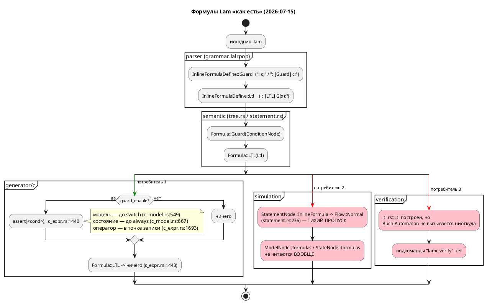
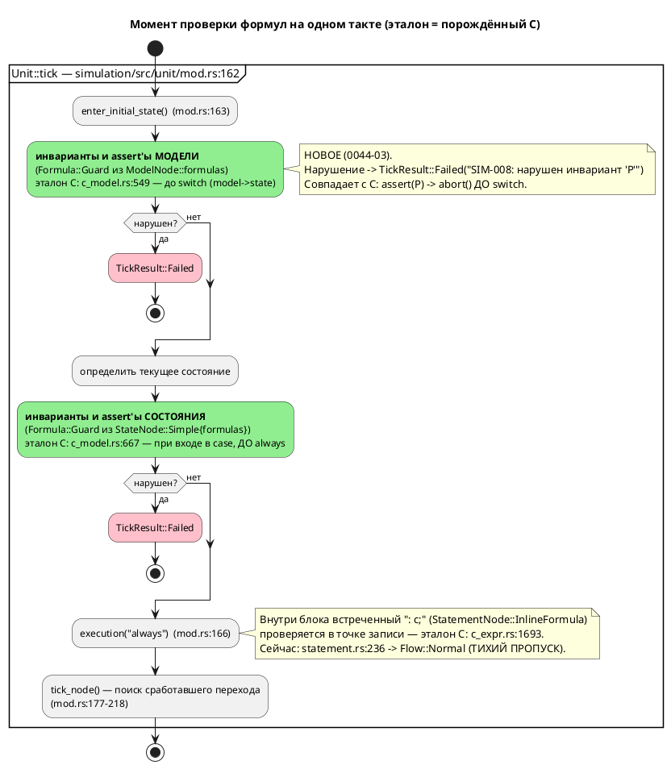

# ADR 0044: Именованный инвариант `invariant` и оживление Guard-формул в симуляторе

- **Status:** Accepted
- **Date:** 2026-07-15
- **Authors:** Архитектор + дизайнер языков программирования + системный аналитик
- **Related issues:** [Фича 0044](../features/0044-sim-assert-invariant.md); связь с
  [ADR 0024](0024-lam-formatter.md) (печать нового узла АСД обязательна),
  [ADR 0025](0025-simulator-expression-eval.md) (семантика вычислений живёт в
  `simulation/src/eval/`; ошибка обязана быть отличима от «условие ложно»),
  [ADR 0019](0019-condition-expression-unification.md) (разделение
  `Condition`/`Expression` — намеренное), [ADR 0020](0020-port-address-decl.md)
  (образец введения жёсткого ключевого слова `address`); фича
  [0010](../features/0010-verification-ltl.md) (LTL/Бюхи, `ГОТОВО`); фича
  [0035](../features/0035-ltl-in-blocks.md) (LTL в блоках кода, `СОЗДАНА`).

## Context

Кандидат в витрине `FEATURES.md` формулировал фичу так: «задел на сближение
крейта `simulation` и верификации: инварианты/ассерты прямо в модели, которые
симулятор проверяет по шагам, а LTL-верификатор — статически. Требует
проработки (может пересекаться с 0010)».

Формулировка предполагает, что конструкций такого рода в языке **нет** и их
нужно изобрести. Проверка кода (2026-07-15, ветка `v2`) показывает, что это
**не так** — и это главный факт, определяющий решение.

### Что в языке есть уже сегодня

| Конструкция | Где разбирается | Куда попадает | Кто потребляет |
|---|---|---|---|
| `: c1, c2;` (краткая) и `: [Guard] c1, c2;` (явная) | `grammar.lalrpop:285–297` (`InlineFormulaDefine`) | `ast::InlineFormulaDefine::Guard` → `semantic::Formula::Guard(ConditionNode)` | **Генератор C** |
| `: [LTL] G(x);` | `grammar.lalrpop:289–291`, `LtlExpr` — `grammar.lalrpop:299–334` | `ast::InlineFormulaDefine::Ltl` → `Formula::LTL(verification::ltl::Ltl)` | **никто** |
| `formula "диалект" { … }` | `grammar.lalrpop:275–283` (`FormulaDefine`) | `ast::ModelElement::Formula` | **никто** (форматтер **отказывает**: `format/mod.rs:343`) |
| `cond Имя = Условие;` | `grammar.lalrpop` (`ConditionDefine`), проход 3 (`tree.rs:379`, `tree.rs:751–754`) | `ModelNode::conditions` | Условия рёбер, генератор C, симулятор |

Inline-формула допустима в **трёх** синтаксических позициях:

- **элемент модели** — `ModelElement::InlineFormula` (`ast.rs:278`, захват в
  `tree.rs:564–582` → `ModelNode::formulas`, `mod.rs:117`);
- **элемент состояния** — `StateElement::InlineFormula` (`ast.rs:328`, захват в
  `tree.rs:1181–1195` → `StateNode::Simple{ formulas }`, `mod.rs:1040`);
- **оператор в блоке кода** — `Statement::InlineFormula` (`ast.rs:1080`,
  разрешение в `statement.rs:256–271` → `StatementNode::InlineFormula(Vec<Formula>)`,
  `mod.rs:783`).

### Что из этого уже работает

**Генератор C уже эмитит `assert()`.** Это не проект — это код:

- `c_expr.rs:1437–1442` — `Formula::Guard(cond)` печатается как
  `assert(<условие>);`;
- `c_source.rs:19` — `#include <assert.h>` эмитится в `.c` **безусловно**;
- `c_model.rs:547–553` — Guard-формулы **модели** проверяются в начале такта,
  **до** `switch (model->state)`;
- `c_model.rs:665–670` — Guard-формулы **состояния** проверяются при входе в
  `case`, **до** `always`-блоков;
- `c_expr.rs:1693–1698` — Guard-формулы **оператора** проверяются в точке записи;
- всё это — под флагом `map.guard_enable()`, которым управляет CLI
  `--guard-enable` / `--guard-disable` (`bin/lamc.rs:169, 208–212, 249`), по
  умолчанию **включено**.

Иначе говоря: **`assert` в языке Lam уже есть — он пишется `: [Guard] условие;`**,
а «выкинуть ассерты из прошивки» уже делается флагом `--guard-disable`. Более
того, семантика «на каждом такте» и «пока мы в этом состоянии» **тоже уже
есть** — это Guard-формула модели и Guard-формула состояния соответственно.
Просто никто никогда не называл это инвариантом, и в языке нет ни слова
«инвариант», ни способа дать инварианту имя.

### Что из этого не работает

1. **Симулятор игнорирует формулы полностью.** `simulation/src/unit/statement.rs:137`
   (`StatementNode::InlineFormula(_) => {}` при сборе локальных переменных) и
   `statement.rs:236` (`StatementNode::InlineFormula(_) => Ok(Flow::Normal)`) —
   формула молча пропускается. `ModelNode::formulas` и `StateNode::formulas`
   симулятором **не читаются вообще** (grep по `simulation/src`: единственные
   упоминания — две строки выше). То есть порождённый C **падает** на нарушенном
   Guard'е, а симулятор той же модели **бодро продолжает** — два потребителя
   одной модели расходятся в поведении, и это ровно тот класс «тихого пропуска»,
   ради которого заводилась фича 0025.
2. **Верификатор LTL не подключён ни к чему.** `verification/buchi.rs`
   (`BuchiAutomaton`, 504 строки) — grep по `grammar/src` и `grammar/tests` не
   находит **ни одной** ссылки на `BuchiAutomaton` вне самого `buchi.rs`.
   Подкоманды `lamc verify` не существует (`bin/lamc.rs`). `Formula::LTL`
   складывается в `ModelNode::formulas` и не читается никем. Фича 0010 закрыта
   как «разбор LTL + структуры данных», а не как работающая проверка.
3. **LTL нечем питать.** `LtlPrimary` (`grammar.lalrpop:330–334`) допускает
   только `true`, `false`, идентификатор и скобки. Атом LTL — это
   `LtlExpr::Atom(Identifier)` (`ast.rs:885`), то есть **голое имя**. Написать
   `G(temperature > 100)` **невозможно**: реляционного условия внутри LTL нет.
   Значит, LTL сегодня может ссылаться только на то, у чего **есть имя**, — а
   именованных булевых обязательств в языке нет.
4. **LTL в блоках кода молча теряется** — `statement.rs:266–269`,
   `// TODO: Реализовать поддержку LTL в блоках кода` → `Ok(StatementNode::InlineFormula(Vec::new()))`.
   Это предмет отдельной фичи **0035**.

### Поток «как есть»



Итог контекста: **проблема фичи 0044 — не отсутствие синтаксиса, а отсутствие
имени и отсутствие двух из трёх потребителей.** Это переопределяет вопрос ADR:
не «какой синтаксис изобрести для assert», а «какое минимальное добавление к
языку закрывает разрыв, не заводя третий синоним уже существующей конструкции».

## Decision Drivers

1. **Не плодить синонимы (главный драйвер).** Фича 0024 уже вынуждена хранить в
   АСД выбор автора между синонимами (`while`/`loop`, `: [Guard] x;` / `: x;` —
   `ast::LoopKeyword`, `Guard::explicit`), потому что канонизировать их запрещено.
   Ввести `assert c;` третьей записью того же `Formula::Guard` — значит выдать
   форматтеру третий синоним и обязать хранить ещё один флаг «как написал автор».
   Цена вечная, польза нулевая.
2. **Симулятор и порождённый C обязаны совпадать.** `conformance_c_tests.rs`
   существует именно для этого. C по нарушенному Guard'у зовёт `assert()` →
   `abort()`. Симулятор обязан остановиться там же, иначе сверка теряет смысл, а
   симулятор перестаёт быть моделью прошивки.
3. **Имя — это не украшение, а контракт.** Без имени (а) диагностика
   нарушения нечитаема («нарушено условие в строке 42»), (б) LTL **физически**
   не может сослаться на обязательство (`LtlExpr::Atom` — голый идентификатор),
   (в) невозможно переиспользовать инвариант в нескольких состояниях.
4. **Обратная совместимость (правило 11).** Любое жёсткое ключевое слово ломает
   модели, где это слово — идентификатор. Цена должна быть измерена, а не
   предположена.
5. **Не расширять зону ответственности верификатора.** 0010 закрыта; оживлять
   `BuchiAutomaton` и заводить `lamc verify` — самостоятельная работа, которую
   нельзя протащить контрабандой внутри 0044.
6. **Правило 22.** Любое расширение синтаксиса → рост версии языка.

## Considered Options

### Option A. Два новых жёстких ключевых слова: `assert <cond>;` и `invariant <имя> = <cond>;`

Ровно то, что предлагал текст кандидата: `assert` — оператор в блоке,
`invariant` — элемент модели.

**Pros:**
- Слова знакомы любому инженеру; читается без обучения.
- `assert` как оператор блока синтаксически привычнее двоеточия.
- Симметрия с C (`assert.h`) очевидна.

**Cons:**
- **`assert c;` — третий синоним `: c;` и `: [Guard] c;`.** Даёт ровно тот же
  `Formula::Guard` и ровно тот же `assert()` в C (`c_expr.rs:1440`). Форматтер
  обязан хранить третий признак формы автора (ADR 0024: синонимы не
  канонизируются) — вечный налог на каждый новый узел.
- Ломает совместимость **двумя** словами вместо одного (правило 11).
- Не решает ни одной из трёх реальных проблем (симулятор молчит, верификатор
  не подключён, у LTL нет атомов) — только добавляет способ записи к уже
  существующему способу записи.
- Слово `assert` в промышленном контроллере провоцирует ожидание `assert.h`,
  тогда как проектное решение (`--guard-disable`) уже другое.

### Option B. Ничего не добавлять в язык: только оживить симулятор на существующих `: [Guard]` / `: [LTL]`

**Pros:**
- Регресс по совместимости — строго ноль; версия языка не растёт (правило 22
  неприменим); ни строчки в `grammar.lalrpop`, `lexer.rs`, `format/`.
- Закрывает драйвер 2 (расхождение симулятора и C) полностью и дёшево.
- Форматтер не трогается вообще — новых узлов АСД нет.

**Cons:**
- **Не даёт имени** → диагностика нарушения указывает только позицию; при
  десятке формул в модели отладка мучительна.
- **Не даёт LTL атомов** → `: [LTL] G(P)` по-прежнему не к чему привязать;
  «сближение симуляции и верификации» — цель кандидата — не наступает.
- `: [Guard] c;` на уровне модели читается как «охранное условие», а не как
  «инвариант, проверяемый каждый такт»; смысл держится на знании кодовой базы,
  а не на тексте программы. Для языка спецификации промышленных систем
  (правило 12) это плохо.
- Слово «инвариант» так и не появляется в языке — кандидат не закрыт, а
  переименован в «починили пропуск».

### Option C (принимается). Одно новое слово `invariant` как **именованное** обязательство; `: [Guard]` официально специфицируется как `assert`; `assert` **не** вводится

Три части:

1. **`assert` не вводится.** Существующая форма `: [Guard] c1, c2;` (и её
   краткий синоним `: c1, c2;`) **специфицируется в документации** как точечная
   проверка — «assert языка Lam». Она уже есть во всех трёх позициях и уже
   эмитит `assert()` в C. Работа здесь — не грамматика, а симулятор + README.
2. **Вводится `invariant Имя = <Condition>;`** — новый элемент модели и элемент
   состояния. Одно жёсткое ключевое слово. Семантически это **сахар**, который
   разворачивается семантическим проходом в уже существующую пару:
   `cond Имя = <Condition>;` + Guard-формула в той же области видимости.
3. **`: [LTL]` остаётся статикой** и не трогается (кроме того, что теперь ему
   есть на что ссылаться: имя инварианта становится атомом LTL).

**Pros:**
- Ровно **одно** новое слово; ноль новых синонимов (`invariant` — не запись
  `assert`, а *именование*, которого раньше не было).
- Сахар разворачивается в существующие узлы → генератор C, `Formula`,
  `ConditionNode` не меняются; вывод для существующих моделей байт-в-байт
  прежний (драйвер 4, прецедент 0020).
- **Даёт LTL атомы** — `invariant Safe = temp <= 100;` + `: [LTL] G(Safe);`
  впервые делает LTL выразимым для реляционных условий. Это и есть «сближение
  симуляции и верификации», которого просил кандидат, — и оно достигается **не**
  трогая `verification/`.
- Диагностика получает имя: «нарушен инвариант `Safe` (SIM-008)».
- Переиспользование: один `invariant` — ссылка из нескольких мест.

**Cons:**
- Одно жёсткое ключевое слово всё же ломает совместимость (правило 11) — цена
  измерена ниже и равна нулю на корпусе.
- Форматтер обязан печатать новый узел (ADR 0024) — обязательная подзадача.
- «Сахар» требует аккуратности: имя инварианта попадает в то же пространство
  имён, что и `cond`, → нужна диагностика коллизии.

### Option D. `invariant` без имени (`invariant <cond>;`) — как в контрактных языках

**Pros:**
- Короче; не занимает пространство имён `cond`.

**Cons:**
- **Не решает главного** — LTL по-прежнему не к чему привязать (драйвер 3), а
  это единственное, чем 0044 оправдывает слово «сближение» в своём названии.
- Становится ровно четвёртым синонимом `: [Guard]` (см. Cons Option A).
- Отвергается по тем же основаниям, что A, но без единственного плюса A
  (привычности `assert`).

## Decision

Принимается **Option C**.

Обоснование сжато: **язык уже умеет `assert`; язык не умеет `invariant`.**
Добавлять надо ровно то, чего нет, и ровно там, где отсутствие мешает. `assert`
как ключевое слово — чистый убыток: третий синоним `Formula::Guard`, налог на
форматтер навсегда, слом совместимости, ноль новой выразительности. `invariant`
как **именованное** обязательство — единственное добавление, которое (а)
неустранимо (имени в языке нет ничем), (б) разблокирует LTL (атомов у него нет
ничем), (в) стоит одно слово.

### Ответ на вопрос «не изобретаем ли мы второй `cond`?»

Честный ответ: **`invariant P = C;` — это в точности `cond P = C;` + `: [Guard] P;`.**
Это не возражение против решения, а его основание. Разница между `cond` и
`invariant` — не в вычислении, а в **модальности**:

| | `cond P = C;` | `invariant P = C;` |
|---|---|---|
| Что это | **определение** имени для условия | **обязательство**: условие обязано быть истинным |
| Когда вычисляется | по требованию, там где `P` упомянуто (`ref S: P;`) | автоматически, каждый такт в своей области |
| Если ложно | переход просто не срабатывает — норма | спецификация нарушена — `assert()` в C, `Failed` в симуляторе |
| Можно не использовать | да, `cond` без ссылок — мёртвый код | нет, смысл именно в автоматической проверке |

То есть `cond` — существительное («вот условие»), `invariant` — утверждение
(«вот условие, и оно всегда выполняется»). Второго `cond` не возникает: возникает
`cond` **плюс обязательство**, и именно так это и реализуется — десахаризацией в
проход 3, а не новым механизмом разрешения имён.

### Синтаксис (EBNF новых и затронутых правил)

```plantuml
@startuml
title Lam 0.3.0 — EBNF: invariant (новое) и существующие формулы (контекст)
hide empty description

' ─────────── НОВОЕ (фича 0044) ───────────
' Одно новое жёсткое ключевое слово: invariant.
' Связка "=" — как в cond/type/enum/model/state (инвариант 0021: ":=" — присваивание).

InvariantDefine = "invariant" , Identifier , "=" , Condition , ";" ;

' Новые позиции: элемент модели и элемент состояния.
' В блоке кода invariant НЕ допускается — там уже есть ": c;" (assert).

ModelElement = Import | TypeDefine | VariableDefine | FunctionDefine
             | Model | StateDefine | FormulaDefine | InlineFormulaDefine
             | ConditionDefine | NamedBlockCodeDefine | EnumDefine
             | StructDefine | AddressDefine
             | InvariantDefine        (* <<< НОВОЕ *)
             | ";" ;

StateElement = NamedBlockCodeDefine | "next" , Identifier , ";"
             | "ref" , Identifier , [ ":" , Condition ] , ";"
             | InlineFormulaDefine
             | InvariantDefine        (* <<< НОВОЕ *)
             | ";" ;

' ─────────── СУЩЕСТВУЮЩЕЕ (не меняется; приведено, чтобы видеть отсутствие дублей) ───────────

(* "assert языка Lam" — уже есть, три позиции, уже эмитит assert() в C *)
InlineFormulaDefine = ":" , Condition , { "," , Condition } , ";"
                    | ":" , "[" , "Guard" , "]" , Condition , { "," , Condition } , ";"
                    | ":" , "[" , "LTL"   , "]" , LtlExpr   , { "," , LtlExpr   } , ";" ;

(* именованное условие — сосед инварианта; НЕ обязательство, а определение *)
ConditionDefine = "cond" , Identifier , "=" , Condition , ";" ;

(* атом LTL — голое имя; именно поэтому инварианту нужно имя *)
LtlPrimary = "true" | "false" | Identifier | "(" , LtlExpr , ")" ;

@enduml
```

### Десахаризация (нормативно)

`invariant P = C;` в области видимости `S` (модель или состояние) **тождественно**
паре, уже выражаемой в языке:

```
cond P = C;      // определение имени (проход 3, tree.rs:751–754)
: [Guard] P;     // обязательство в той же области (Formula::Guard)
```

Из этого следуют три полезных свойства, каждое — бесплатно:

- генератор C менять **не нужно** (`c_model.rs:549`, `c_model.rs:667` уже
  обходят `formulas`);
- `--guard-disable` автоматически распространяется на инварианты;
- `P` становится видимым как `cond` → **атом LTL** (`: [LTL] G(P);`) и
  переиспользуемое условие (`ref Next: P;`).

Реализация десахаризации — семантический проход, **не** переписывание АСД:
форматтер обязан печатать `invariant P = C;` ровно так, как написал автор
(ADR 0024), а не разворачивать в пару.

### Момент проверки на такте

Точки проверки **не изобретаются** — они уже зафиксированы генератором C и
принимаются как эталон, а симулятор приводится к ним:



### Поведение при нарушении в симуляторе

Рассмотрены два поведения:

- **(i) остановка** — `TickResult::Failed(String)`;
- **(ii) запись в трассу и продолжение**.

Принимается **(i) остановка**, по двум независимым основаниям:

1. **Соответствие эталону.** Порождённый C зовёт `assert()` → `abort()`
   (`c_expr.rs:1440`, `c_source.rs:19`). Если симулятор продолжит, он перестанет
   быть моделью прошивки, а `conformance_c_tests.rs` начнёт сверять несравнимое.
2. **Инвариант ADR 0025 (R5).** `TickResult::Failed` заведён ровно затем, чтобы
   недостоверный прогон был **отличим** от честно ложного условия
   (`unit/mod.rs:76–80`). Нарушенный инвариант — определение недостоверного
   прогона: дальнейшая трасса описывает автомат, которого спецификация
   запрещает.

Режим «записать и продолжить» (полезен при отладке) **выносится в кандидаты**
`FEATURES.md` отдельной фичей — он требует канала трасс, которого нет, и не
может быть протащен внутрь 0044 (драйвер 5).

### Что эмитит генератор C

Принимается **сохранение текущего поведения без единой правки эмиссии**:

- `invariant P = C;` разворачивается в `Formula::Guard` → `assert(P_expr);`
  ровно там, где формулы обходятся сегодня;
- флаг `--guard-disable` (`bin/lamc.rs:211`) **уже** является ответом на
  возражение «`assert.h` не место в промышленном контроллере»: он выключает
  всю эмиссию проверок;
- `#include <assert.h>` уже безусловен (`c_source.rs:19`) — не меняется.

Отвергнуты: `#ifdef LAM_ASSERT` (дублирует существующий `--guard-disable` на
другом уровне) и колбэк `Lam_assert_failed()` по образцу HAL 0020 (**правильная**
идея для прошивки, но это смена контракта цели `c` для **уже существующих**
моделей → регресс, правило 11). Оба вынесены в кандидаты.

### Вердикт по пересечениям

**Фича 0010 (LTL/Бюхи, `ГОТОВО`) — 0044 ею НЕ поглощается.** Три довода:

1. **Фактический:** статической проверки не существует. `BuchiAutomaton` не
   вызывается ниоткуда (grep по `grammar/src`, `grammar/tests` — ноль ссылок вне
   `buchi.rs`), подкоманды `lamc verify` нет. Поглощать нечем.
2. **Формальный:** `G(cond)` и инвариант — **разные обязательства**. LTL `G(P)`
   утверждает свойство над **всеми** прогонами и требует model checking;
   инвариант проверяется на **одном конкретном** прогоне симулятора и на
   **реальном железе** (через `assert()` в C). Первое — доказательство, второе —
   наблюдение. Они дополняют друг друга, а не заменяют.
3. **Направление зависимости обратное ожидаемому:** сегодня LTL **невыразим** для
   реляционных условий — `LtlPrimary` принимает только идентификатор
   (`grammar.lalrpop:330–334`). Именно `invariant` даёт LTL атом. 0044 не
   поглощается 0010 — 0044 **делает 0010 применимой**.

**Фича 0035 (LTL в блоках кода, `СОЗДАНА`) — пересечение реальное, но не
поглощение и не зависимость.** Обе фичи правят один `match` в
`semantic/statement.rs:256–271`, но **разные его ветки**: 0035 — ветку
`InlineFormulaDefine::Ltl` (строки 266–269, `TODO` + тихая потеря), 0044 — ветку
`Guard` (строки 258–265, разрешение уже есть) и потребление результата в
симуляторе. Контрактной зависимости нет: 0044 работоспособна при любом статусе
0035, и наоборот. Риск — конфликт правок в одном файле (см. анализ, раздел
рисков).

## Consequences

### Положительные

- Расхождение «C падает — симулятор продолжает» устранено; появляется
  `conformance`-сверка поведения на нарушенной формуле.
- Язык получает слово «инвариант» — для DSL спецификации промышленных систем
  управления (правило 12) это профильная выразительность, а не сахар.
- LTL впервые становится выразимым для реляционных свойств — без единой правки
  в `verification/`.
- Guard-формулы получают спецификацию в README (правила 15, 16): сегодня
  конструкция `: [Guard] c;` работает, эмитит `assert()` и **нигде не описана**.
- Ноль новых синонимов; форматтеру не добавляется ни одного флага «форма автора».

### Отрицательные / Action items

- **Жёсткое ключевое слово `invariant`** ломает модели, где это имя —
  идентификатор (правило 11). Измерено: `grep -rniw "invariant\|assert"` по
  **158** файлам `.lam` корпуса (`examples/`, `grammar/tests/data/`,
  `simulation/tests/data/`) — **ноль** совпадений. Прецедент 0020 (`address`).
  Разбор и обоснование — в анализе.
- **Версия языка `0.2.0` → `0.3.0`** (аддитивно, правило 22) — `grammar/Cargo.toml:3`.
- **Форматтер обязан печатать `InvariantDefine`** (ADR 0024), иначе
  `format_source` начнёт **отказывать**, а `grammar/tests/format_tests.rs`
  завалит сборку на новом непокрытом узле. Отдельная подзадача 0044-05.
- Пространство имён `cond` и `invariant` — общее (следствие десахаризации);
  нужна диагностика коллизии имён.
- Новые диагностики: **SE-053** (коллизия имени инварианта с `cond`/переменной),
  **SE-054** (инвариант ссылается на неизвестное имя), **SIM-008** (нарушение
  инварианта/формулы в симуляторе). Свободны: последний занятый — `SE-052`
  (0020), `SIM-007` (`eval/error.rs:74`).
- В кандидаты `FEATURES.md` (правило 7) выносятся: режим «записать и
  продолжить»; колбэк `Lam_assert_failed()` вместо `assert.h`; `lamc verify`
  (оживление `BuchiAutomaton`); печать `ModelElement::Formula`, на которой
  форматтер отказывает сегодня (`format/mod.rs:343`).

### Acceptance criteria

1. `invariant P = C;` разбирается как элемент модели и как элемент состояния;
   `assert` ключевым словом **не** становится (`grep -w assert` по `lexer.rs`
   `KEYWORDS` — ноль).
2. Семантика разворачивает `invariant P = C;` в `cond P` + `Formula::Guard`;
   имя `P` доступно как атом LTL (`: [LTL] G(P);` строит `Ltl::Atom("P")`) и как
   условие ребра (`ref S: P;`).
3. Симулятор останавливается с `TickResult::Failed`, содержащим **имя**
   инварианта и код `SIM-008`, на первом же нарушении — в трёх позициях
   (модель / состояние / оператор), в точках такта из диаграммы выше.
4. Порождённый C для модели **без** `invariant` — байт-в-байт как до фичи
   (регресс = 0); для модели **с** `invariant` — `assert()` в той же точке, что
   для эквивалентной пары `cond` + `: [Guard]`.
5. `--guard-disable` убирает из C проверки инвариантов наравне с Guard-формулами.
6. `format_source` печатает `invariant` идемпотентно и семантически нейтрально;
   `format_tests.rs` (весь корпус, 158 файлов) зелёный.
7. Версия языка `0.3.0`; README содержит синтаксис, семантику и **примеры с
   контрпримерами** (правила 15, 16).
