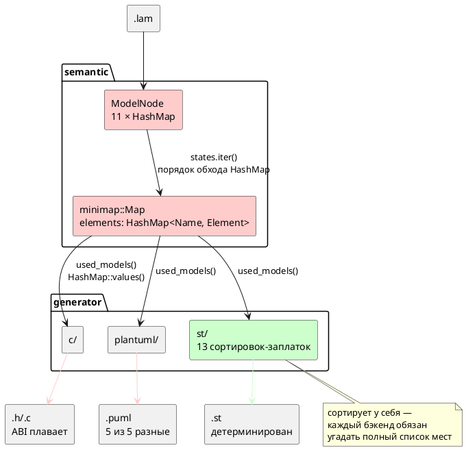

# ADR 0048: Детерминированная генерация кода (единый порядок эмиссии)

- **Status:** Accepted
- **Date:** 2026-07-16
- **Authors:** Архитектор + Лид разработки (решение развилки — заказчик, 2026-07-16)
- **Related issues:** [Фича 0048](../features/0048-deterministic-codegen.md)

## Context

Один и тот же `.lam` компилируется в **разный** код от запуска к запуску. Пробы
2026-07-16 (пять примеров корпуса, по 5 прогонов одного бинарника, сравнение
`.h` по md5) дали **5 уникальных вариантов из 5** для каждого примера — ни один
прогон не совпал с другим. Хуже косметики: 15 прогонов `elevator_mini` дали порту
`CABIN_BUTTON_DC` значение `= 0` в 8 случаях и `= 2` в 7, то есть **плавает ABI**
прошивки.

Причина одна и лежит **не в генераторах**, а в общем слое: словари
семантического дерева (`ModelNode`) и снимка для генераторов (`minimap::Map`) —
`HashMap`, порядок обхода которого рандомизирован (`RandomState`). Генераторы
лишь печатают то, что им выдал обход.

| Место | Что течёт |
|---|---|
| `semantic/minimap.rs:170` | `elements: HashMap<Name, Element>` — контейнер снимка |
| `semantic/minimap.rs:195` | `states.iter()` → `Element::Model.states: Vec<Name>` строится **из порядка обхода `HashMap`**; потребляют все генераторы |
| `semantic/minimap.rs:247-253` | `used_models()` = `elements.values()` — порядок под-моделей; потребляют `c_map.rs:102`, `puml_map.rs:63`, `st_map.rs:106` |
| `semantic/mod.rs:73-115` | 11 полей `ModelNode` — `HashMap`. Порты живут внутри `variables` (`VariableNode::Port`) и наследуют его недетерминизм |
| `generator/c/mod.rs:836` | `topological_sort_models`: `keys` собираются `.keys().cloned()` **без сортировки**, затем DFS `for key in &keys` |

**Почему дефект дожил до 0048.** Недетерминизм осознавался точечно, но не
системно: `c_header.rs:546` сортирует структуры, бэкенд `st` (закрытая
[0041](0041-st-backend.md)) сортирует у себя в **13** местах и потому
детерминирован (проба: 1 уникальный вариант из 5). Но это лечение следствия —
забытая сортировка **не ломает сборку** и не ловится тестом: она проявляется
случайно, раз в несколько прогонов. Докстринг `c/mod.rs:824` прямо закрепил
неверное допущение: «Нет гарантий порядка одноуровневых вершин — нужен только
частичный порядок». Для *корректности* частичного порядка довольно, для
*воспроизводимости* — нет: топологическая сортировка со случайным входом даёт
случайный (хотя и всякий раз корректный) выход.

**Ловушка ABI — не там, где кажется.** Порты **уже** сортируются
(`c_header.rs:261`, `:301-309`) — но **внутри одной модели** и по одному лишь
имени, тогда как номер (`idx`) выдаётся сквозным `enumerate()` по внешнему циклу
`for element in &all_models`, где `all_models = map.using_models()`, то есть
порядок `HashMap::values()`. Межмодельный порядок остаётся случайным → номера
портов сдвигаются целыми блоками. Отсюда правило, которое эта ADR закрепляет:
**локальная сортировка не спасает, если внешний цикл недетерминирован**, а
сортировка по неуникальному ключу лишь маскирует проблему (стабильная `sort_by`
сохраняет для равных ключей исходный — то есть случайный — порядок).

### Поток «как есть»

## Decision Drivers

1. **ABI прошивки обязан быть воспроизводим.** Два бинарника из одного
   исходника должны совпадать побайтно. Сегодня это не так.
2. **Порядок — свойство общего слоя, а не привычка бэкенда.** Каждый новый
   бэкенд (0045 — SystemVerilog, и далее) не должен заново угадывать места
   утечки порядка. Цена бездействия растёт линейно по числу целей.
3. **Дефект обязан ломать сборку.** Забытая сортировка сегодня не ловится ничем;
   нужен гейт, а не дисциплина.
4. **Не плодить зависимости без нужды.** `IndexMap`/`BTreeMap`/`BTreeSet` в
   проекте не используются нигде — прецедента нет.

## Considered Options

### Option A. `BTreeMap` — алфавитный порядок

Заменить `HashMap` на `BTreeMap` в `minimap::Map.elements` и в полях `ModelNode`,
чей обход достигает вывода.

**Pros:**
- `std`, новых зависимостей нет.
- Порядок — **свойство типа контейнера**: обход упорядочен всегда, забыть
  сортировку негде. Лечит причину, а не следствие.
- Ключи (`String`, `Name`) уже уникальны → тотальный порядок без tie-break.
- API `BTreeMap` совместим с `HashMap` по используемым методам
  (`get`/`insert`/`iter`/`values`/`keys`/`entry`/`retain`) → правка механическая,
  а несовместимости ловит компилятор.

**Cons:**
- Вывод **перестаёт соответствовать порядку объявлений** в `.lam`: заголовок
  читается по алфавиту, а не по исходнику.
- `BTreeMap` требует `Ord` на ключе — у `Name` его нет, придётся добавить.
- Вставка/поиск `O(log n)` против `O(1)` — на масштабах модели (десятки-сотни
  элементов) неизмеримо.

### Option B. `IndexMap` — порядок исходника

**Pros:**
- Порядок эмиссии = порядок объявлений в `.lam`; заголовок диффится против
  исходника, номера портов идут «как написано».
- `O(1)` доступ сохраняется.

**Cons:**
- **Новая зависимость** (`indexmap` в проект не подключён).
- Порядок становится свойством **истории вставок**, а не данных: перестановка
  двух проходов семантики молча меняет ABI. Детерминизм есть, но он хрупок и
  никак не выражен в типе.

### Option C. `Vec` + сортировка на эмиссии

**Pros:**
- Без новых типов и зависимостей.
- Точечно, минимальный диф.

**Cons:**
- **Лечит следствие** — ровно тот механизм, что и привёл к 0048: каждый бэкенд
  снова обязан помнить о сортировке, а забытая строка не ломает сборку. `st`
  уже несёт 13 таких заплаток, `c` — 5 частичных, `plantuml` — ноль.
- Потеря `O(1)`-поиска по имени либо дублирование контейнеров.

## Decision

Принимается **Option A (`BTreeMap`)** — решение заказчика от 2026-07-16.

Обоснование выбора: развилка вкусовая (драйвер 2 удовлетворяют и A, и B), и
заказчик предпочёл алфавитный порядок ценой соответствия исходнику. Довод в
пользу A сверх вкуса: `BTreeMap` выражает инвариант **в типе** — упорядоченность
нельзя забыть, тогда как у `IndexMap` она держится на порядке вставок, то есть на
той же дисциплине, ради отказа от которой заводится фича.

Три следствия решения, обязательные к исполнению:

1. **`Name` получает `Ord`/`PartialOrd` по паре `(unique, local)`** — сравниваются
   **оба** поля, поэтому порядок согласован с существующим `Eq` (требование
   `BTreeMap`). Первичный ключ — `unique` (полный путь `Root:Child:State`):
   сортировка по нему группирует элементы по родителям, что читается лучше
   алфавита по локальным именам.
2. **`topological_sort_models` (`c/mod.rs:825`) сортирует вход** — по образцу
   `st/mod.rs:153`, где вход сортируется **перед** `topological_order`.
   Смены типа `by_name` мало: DFS идёт по `keys`, и сортировать надо именно их.
   Докстринг `:824` («нужен только частичный порядок») исправляется — он и есть
   зафиксированное заблуждение.
3. **13 сортировок цели `st` остаются** (решение заказчика). После правки общего
   слоя они избыточны, но безвредны, а неизменность вывода `st` — **бесплатный
   контрольный тест** правки: если `.st` изменился, значит общий слой упорядочен
   не так, как предполагалось.

## Consequences

### Положительные

- Порождённый код воспроизводим побайтно для всех целей, включая будущие
  (0045 и далее) — они получают детерминизм даром, ничего не зная про порядок.
- **Codegen-снапшоты впервые становятся возможны** — разблокируется требование,
  дважды оказавшееся неисполнимым (0026 и T1–T4 тест-плана 0041).
- Дифф `examples/generated/` снова несёт смысл: сегодня он «чистый шум
  перестановки» (рабочее дерево прямо сейчас загрязнено 7 файлами, 178/178 —
  симметрия, характерная для перестановки), и его нельзя читать как регресс.
- Снимается предупреждение из `CLAUDE.md` про недоверие к диффу порождённых файлов.

### Отрицательные / Action items

- **ABI меняется однократно** — номера портов и состояний станут другими для
  всех входов. Это смена ABI (правило 11), но смягчающее обстоятельство решающее:
  сегодня этот ABI **и так** не воспроизводится между двумя сборками — фича не
  ломает стабильность, а **впервые её вводит**. Обосновать в анализе.
- **Порядок вывода перестаёт соответствовать `.lam`** — принятая цена Option A.
- `Name` требует `Ord` — правка `minimap.rs`.
- **Отличить «стало детерминированно» от «сломалось» глазами по диффу нельзя** —
  только живой проверкой (`precheck.sh`, гейты `cc` и `iec2c`).
- **Версия языка не растёт** (правило 22): синтаксис и семантика не меняются,
  правится лишь порядок эмиссии.
- Пересечение по файлам с [0026](0026-c-root-typedef.md) (закрыта) и
  [0027](0027-module-size-split.md) (`c_expr.rs`) — конфликты слияния вероятны.

### Acceptance criteria

1. **Побайтная воспроизводимость.** Для каждого примера `examples/*.lam` и каждой
   цели (`c`, `c-hal`, `plantuml`, `st`) два прогона `lamc compile` дают
   идентичные файлы. Проверяется гейтом, а не глазами (объём 4 карточки).
2. **Гейт в `precheck.sh`** — «два прогона байт-в-байт совпадают» по всему
   корпусу; падает при появлении нового недетерминизма. Именно этого гейта не
   хватало: дефект дожил до 0048, потому что не ломал сборку.
3. **Вывод цели `st` не изменился вовсе** — контрольный тест правки общего слоя
   (сортировки `st` остаются на месте).
4. **Живая проверка зелена** — `precheck.sh` целиком: `cc` собирает порождённый
   C, `iec2c` принимает порождённый ST.
5. **`examples/generated/` перегенерирован** и закоммичен стабильным выводом.
6. **`topological_sort_models` детерминирована**, докстринг `c/mod.rs:824`
   исправлен.
