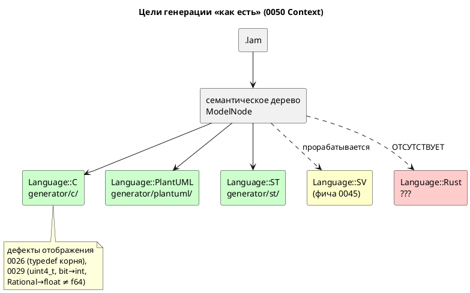
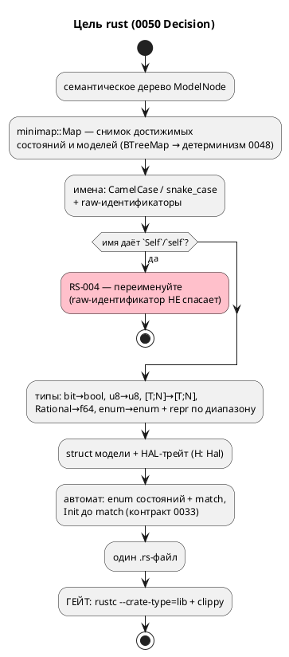

# ADR 0050: Бэкенд генерации в Rust

- **Status:** Accepted
- **Date:** 2026-07-16
- **Authors:** Архитектор + системный аналитик (ключевые развилки «профиль цели»
  и «форма вывода» — решение заказчика 2026-07-16)
- **Related issues:** [Фича 0050](../features/0050-rust-backend.md); наследует
  контракт такта из [ADR 0033](0033-init-tick-alignment.md) (вход в стартовое
  состояние не расходует такт) и принцип «громкий отказ вместо тихого пропуска»
  из [ADR 0025](0025-simulator-expression-eval.md)/[ADR 0028](0028-c-generator-stubs.md);
  повторяет структуру решения соседних бэкендов [0041](0041-st-backend.md) (ST) и
  [0045](0045-sv-backend.md) (SV).

## Context

`generator::Language` (`generator/mod.rs:13`, помечен `#[non_exhaustive]`) имеет
три варианта — `C`, `PlantUML`, `ST`; диспетчер `generate()` выбирает генератор
по варианту, каждый реализует трейт `Generator`. Добавление цели — **аддитивная**
операция: новый вариант + модуль `generator/<lang>/`.

Заказчик запросил (2026-07-16) пятый целевой язык — **Rust**.

**Ниша занята.** Rust на микроконтроллере попадает ровно в контур цели `c`:
прошивка, HAL, жёсткое реальное время. Поэтому первый вопрос ADR — не «как», а
«зачем»: чем цель `rust` отличается от `c`, кроме синтаксиса. Ответ обязан быть
предметным, иначе фича — дубликат.

Предметный ответ есть, и он записан в самом репозитории: у цели `c` **открытые
дефекты отображения**, которые в Rust не воспроизводятся by construction:

| Факт (проверен чтением кода) | Место |
|---|---|
| Для модели без под-моделей typedef корня не эмитится → порождённый C **не компилируется** (8 ошибок `cc`) | фича [0026](../features/0026-c-root-typedef.md) |
| `Array(size, elem)` → `uint{size}_t`, где `size` — **число элементов**: `[u8; 4]` → `uint4_t` (типа не существует) | `generator/c/mod.rs:150`, фича [0029](../features/0029-c-type-mapping.md) |
| `Bit` → `int`; `Rational` → `float` (f32), тогда как симулятор считает в **f64** | там же |
| Порты — `void (*write_bit)(port, bool, void *userdata)` + `void *userdata`: типобезопасности нет | `examples/generated/c/elevator_mini.h` |

В Rust каждый из четырёх пунктов исчезает не «благодаря аккуратности», а
конструктивно: `[u8; 4]` — нативный тип, `bit` — `bool`, `Rational` — `f64`
(совпадает с симулятором → сверка потактовых трасс достижима, чего для `float`
цель `c` не даёт), `userdata` заменяется параметром типа `H: Hal`.

**Что уже готово и переиспользуется** (проверено чтением кода):

| Готово | Место |
|---|---|
| Диспетчер целей + трейт `Generator` + `GenerateOptions` | `generator/mod.rs:95` |
| Печать с отступами (общий слой) | `generator/indent.rs` |
| Снимок достижимых состояний/моделей (`minimap::Map`, `BTreeMap` → детерминизм) | `semantic/minimap.rs`, фича [0048](../features/0048-deterministic-codegen.md) |
| Образец обхода переходов | `generator/c/c_model.rs:430` |
| Контракт такта (INIT не расходует такт) | [ADR 0033](0033-init-tick-alignment.md) |

**Общий слой бэкендов не заводится** — по тому же решению, что и для 0045
(`FEATURES.md`: «0045 каркаса не ждёт»): `Language` уже расширяем, а вычленять
общий каркас на третьем-пятом бэкенде — преждевременное обобщение.

### Ключевые развилки (вынесены заказчику)

Технически Rust допускает несколько несовместимых прочтений цели; выбор —
продуктовое решение, а не техническое:

1. **Профиль:** `no_std`-прошивка (аналог `c`) против хостовой `std`-библиотеки
   против «ядро + `std` по feature».
2. **Форма вывода:** один `.rs` против готового крейта (`Cargo.toml` +
   `src/lib.rs`).

### Поток «как есть»



## Decision Drivers

1. **Профильная цель (правило 12).** Прошивки промышленных систем управления —
   прямое назначение DSL; Rust даёт тот же контур без класса ошибок памяти.
2. **Не дубликат.** Фича обязана давать то, чего цель `c` не даёт; иначе она —
   вторая реализация того же с теми же дефектами.
3. **Проверяемость до разработки** (планка 0045). Порождённый код обязан
   проверяться автоматически, гейтом, а не глазами.
4. **Аддитивность.** Существующие цели и `.lam` не трогаются; версия языка не
   растёт (правило 22).
5. **Соразмерность.** Первый срез обязан быть цельным и завершаемым; расширения
   (MMIO, `std`-слой) строятся поверх.
6. **Честная граница** (наследие 0025/0028): что не транслируется — диагностика,
   а не тихий пропуск.

## Considered Options

### Развилка 1: профиль цели

#### Option A (принимается). `no_std`-прошивка — аналог цели `c`

`#![no_std]`, без `alloc`; порты через HAL-трейт; вывод — библиотечный модуль,
который пользователь подключает в свою прошивку.

**Pros:**
- Прямое попадание в профиль DSL (правило 12) — тот же контур, что у `c`.
- Даёт содержательную дельту к `c` (драйвер 2): нативные типы + отсутствие
  `unsafe` в порождаемом коде.
- Проверено пробой: `no_std` + `f64`-арифметика + все встроенные функции Lam
  (`abs`/`min`/`max`/`clamp`) + `assert!` компилируются **без `libm`**.
- Работает и на хосте: `no_std`-библиотека подключается из `std`-крейта без
  оговорок (обратное неверно).

**Cons:**
- `debug` (встроенная функция Lam) в `no_std` не имеет printf — требуется решение
  (0050-07).
- HAL-трейт нужно спроектировать (в хостовом варианте порты были бы просто
  полями).

#### Option B. Хостовая `std`-библиотека

**Pros:**
- Проще: ни HAL, ни ограничений `no_std`; `debug` → `println!`.

**Cons:**
- **Мимо профиля** (драйвер 1): на МК не поставить, то есть нишу цели `c` не
  закрывает — получается оснастка для тестов, а её роль уже играет крейт
  `simulation`.
- Дельта к `c` теряется: сравнивать не с чем.

#### Option C. Ядро `no_std` + `std`-слой по cargo feature

**Pros:**
- Покрывает оба сценария одним генератором.

**Cons:**
- Требует решить состав feature-флагов **и** владеть `Cargo.toml` (иначе
  feature негде объявить) — тянет за собой развилку 2 в сторону крейта.
- Гейт удваивается: обязаны проверяться обе сборки (`--no-default-features` и
  `--features std`).
- Несоразмерно первому срезу (драйвер 5); `no_std`-ядро (Option A) и так
  подключается из `std`-крейта, то есть выгода мнимая.

### Развилка 2: форма вывода

#### Option A (принимается). Один `.rs`-файл

**Pros:**
- Симметрия с прочими целями (`.h`/`.c`, `.st`, `.puml`) — `examples/generated/`
  и гейт детерминизма 0048 работают без исключений.
- Генератор **не владеет** метаданными пакета (имя, версия, edition,
  зависимости) — их владелец пользователь.
- Гейт прост и быстр: `rustc --crate-type=lib` без сети и без `cargo`.

**Cons:**
- Не собирается «из коробки» — нужен `mod` в крейте пользователя.

#### Option B. Готовый крейт (`Cargo.toml` + `src/lib.rs`)

**Pros:**
- Собирается сразу.

**Cons:**
- Генератор начинает владеть `Cargo.toml`: имя пакета, версия, edition,
  зависимости — вопросы без хорошего умолчания, и каждый становится развилкой.
- Гейт тяжелее (`cargo build`, сеть при зависимостях), ломает симметрию
  `examples/generated/`.

## Decision

Принимаются **Option A по обеим развилкам** — решение заказчика 2026-07-16:
**`no_std`-прошивка**, вывод — **один `.rs`-файл**.

Отсюда вытекает целевая форма (написана руками и **проверена компиляцией** при
проработке — см. «Проверяемость» в карточке фичи):

```rust
#![no_std]

pub enum InBitPort { MotorSensorU, /* … */ }
pub enum OutBitPort { MotorUp, /* … */ }

pub trait Hal {
    fn read_bit(&mut self, port: InBitPort) -> bool;
    fn write_bit(&mut self, port: OutBitPort, value: bool);
}

pub struct ElevatorMini<H: Hal> {
    command: Command,          // enum Lam → enum Rust
    current_floor: u8,         // u8 → u8
    state: RootState,          // состояние → enum, не целое
    motor: MotorState,         // под-модели — поля
    cabin: CabinState,
    hal: H,                    // вместо void *userdata
}

impl<H: Hal> ElevatorMini<H> {
    pub fn tick(&mut self) {
        if self.state == RootState::Init {   // контракт 0033: вход не стоит такта
            self.state = RootState::Main;
        }
        match self.state { /* … */ }
    }
}
```

### Частные решения (следствия принятых опций)

| Вопрос | Решение | Основание |
|---|---|---|
| Состояния | `enum` + `match` | тип, а не «целое с константами»; исчерпывающий `match` проверяется компилятором |
| Такт | `Init` диспетчеризуется **до** `match` | контракт [ADR 0033](0033-init-tick-alignment.md) — сдвиг тактов 0 |
| `bit` | `bool` | точное соответствие (в `c` — `int`, дефект 0029) |
| `Rational` | `f64` | совпадает с симулятором → сверка трасс достижима (в `c` — `float`) |
| `[T; N]` | `[T; N]` | нативно (в `c` — `uint4_t`, дефект 0029) |
| `enum` Lam | `enum` + `#[repr(uN)]`, **разрядность по диапазону вариантов** | проба: `#[repr(u8)] Idle = 670` отвергается; тот же урок, что у ST |
| Порты | HAL-трейт, `H: Hal` | заменяет `void *userdata`; типобезопасно |
| Guard-формулы (0044) | `assert!` | проба: `assert!` в `core`, `no_std` её не теряет |
| Карта адресов (0020) | **не потребляется** | порты идут через HAL — режим `c`, а не `c-hal` |
| `unsafe` | **не эмитится** | вся дельта к `c` в этом; `#![forbid(unsafe_code)]` — кандидат в 0050-02 |

### Целевой поток (правило 18)



## Consequences

### Положительные

- Пятый целевой язык; контур безопасных прошивок закрыт.
- **Дефекты отображения цели `c` (0026, 0029) в цели `rust` отсутствуют
  конструктивно**; `Rational` → `f64` впервые делает достижимой потактовую сверку
  вещественных с симулятором (у `c` — `float`, точность не совпадает).
- Гейт **бесплатен**: `rustc`/`clippy` уже зависимости проекта. Риск «инструмент
  не проверен» (главный у 0041) отсутствует.
- Порождаемый код без `unsafe` — класс дефектов памяти не воспроизводится.

### Отрицательные / Action items

- **A1. Калька с C не проходит гейт.** Проба: `-D warnings` падает на `dead_code`
  (варианты `End`/`Tick`, которые C эмитит всегда, а модель не конструирует).
  Решить в 0050-02: (а) не эмитить недостижимые варианты; (б) `#[allow(dead_code)]`
  на state-enum; (в) гейт без `-D warnings`. Предпочтение — (а), но требует
  анализа достижимости; (б) — глушение линта, применять только с обоснованием.
- **A2. `Self`/`self` в имени** состояния или модели непредставим: raw-идентификатор
  запрещён отдельным правилом языка («`Self` cannot be a raw identifier»).
  Диагностика `RS-004` (0050-04), не тихое переименование.
- **A3. Разрядность `#[repr]`** считается по диапазону вариантов, а не берётся
  `u8` (проба: `Idle = 670` из `elevator.lam:121` в `u8` не влезает).
- **A4. `debug` в `no_std`** printf не имеет — решение в 0050-07 (метод HAL /
  отбрасывание с диагностикой). Тихо ронять **нельзя** (наследие 0035).
- **A5. `extern fn`** — форма (метод HAL против `extern "C"`) решается в 0050-07;
  затрагивает 3 примера корпуса.
- **A6. Ловушки стандартной библиотеки нет** (в отличие от 0041, где `Concat`
  ломал ST): проба показала, что `Box`/`Option` как имена принимаются. Отдельная
  задача не заводится.
- **A7. Версия языка не растёт** (правило 22): синтаксис не тронут, цель
  аддитивна (прецеденты `lamc fmt` 0024, `lamc verify` 0049).
- **A8. Кандидаты-расширения** (вносит координатор, правило 7): (1) MMIO-режим
  `rust-hal` (потребление карты адресов 0020 по образцу `c-hal`); (2) `std`-слой
  по cargo feature (отвергнутый Option C развилки 1); (3) генерация тестбенча и
  потактовая сверка с симулятором по образцу 0045-07; (4) `#![no_main]`/точка
  входа прошивки.

### Acceptance criteria

1. `lamc compile -t rust <file>` порождает `.rs` для всего корпуса `examples/`
   (кроме случаев с заявленной диагностикой).
2. **Гейт зелёный:** порождённый `.rs` принимается `rustc --crate-type=lib` и
   `clippy` на политике, зафиксированной решением A1 (`precheck.sh` + CI).
3. Флагман `elevator_mini.lam` порождает компилируемый модуль с HAL-трейтом и
   параллельной композицией `Cabin | Motor`.
4. Отображение типов: `bit` → `bool`, `[u8; 4]` → `[u8; 4]`, `u8` → `u8`,
   `Rational` → `f64`, `enum` → `enum` с `repr` по диапазону — тесты на каждый.
5. Имя, дающее `Self`/`self`, даёт `RS-004`; прочие коллизии решаются
   CamelCase/raw-идентификатором — тесты на пример и контрпример.
6. Непереводимая конструкция даёт **диагностику**, а не тихий пропуск (`debug`,
   `extern fn`, `inout` — по решениям 0050-05/07).
7. Контракт [0033](0033-init-tick-alignment.md): вход в стартовое состояние не
   расходует такт — потактовая сверка с симулятором на флагмане.
8. Генерация **детерминирована** (гейт 0048: два прогона → `diff -r` пуст).
9. Цели `c`/`c-hal`/`plantuml`/`st` **байт-в-байт неизменны**; версия языка не
   изменена.
10. `./scripts/precheck.sh` зелёный; `unsafe` в порождённом коде отсутствует.
