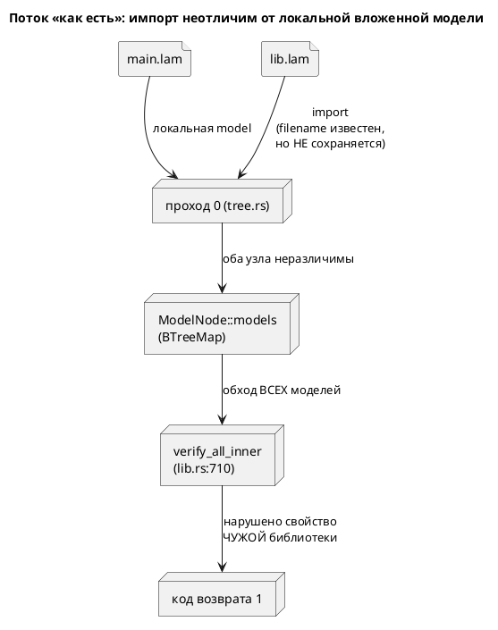

# ADR 0051: Область проверки `lamc verify` (`--scope`)

- **Status:** Accepted
- **Date:** 2026-07-16
- **Authors:** Архитектор + Аналитик
- **Related issues:** [Фича 0051](../features/0051-verify-scope.md); продолжает
  [ADR 0049](0049-model-checking-ltl.md) (открытый вопрос 2 стадии тестирования)

## Context

Фича 0049 дала `lamc verify` с кодом возврата `0`/`1` и заявила его пригодным
для CI. `verify_all_inner` (`lib.rs:710`) рекурсивно обходит `ModelNode::models`
и проверяет формулы **каждой** модели дерева.

Проблема в том, что `models` содержит **и импортированные модели**: `import
"lib.lam";`, `import "lib.lam" as X;` и `import { A as B } from "lib.lam";`
кладут узел в тот же `BTreeMap`, что и локальная вложенная `model` (`tree.rs:179,
203, 248`). На уровне дерева это буквально одна сущность — импорт проверяется на
конфликт имён тем же кодом SE-006, что и локальная модель.

Следствие: нарушенное свойство чужой библиотеки роняет сборку импортёра. Автор
`main.lam` не писал `: [LTL]` библиотеки, не вправе её чинить, а вердикт получает
как свой. Это ровно тот класс «инструмент отвечает не на заданный вопрос»,
который 0049 закрывала правкой области формулы (0049-06).

**Признака происхождения в дереве нет вообще.** Установлено чтением кода:

- `ModelNode` (`semantic/mod.rs:67-126`) — среди полей нет ни пути файла, ни
  флага импорта.
- `Location::Source(u64, usize, usize)` (`diagnostics.rs:369`) **имеет** поле
  `file_no`, но оно везде жёстко `0`: импортируемые файлы разбираются как
  `parse(&content, 0)` (`tree.rs:172, 196, 220`), корневой — тоже
  (`lamc.rs:589`). Механизм есть, данных в нём нет.
- Имя файла известно только внутри прохода 0: `read_import_file` возвращает
  `(content, filename)` (`import.rs:39`), но наружу не сохраняется — служит для
  детекта циклов и вывода имени модели.
- AST-узел импорта в дерево не переносится: `ModelElement::Import`
  обрабатывается и выбрасывается (`tree.rs:144`).

## Decision Drivers

1. **Отвечать на заданный вопрос.** Пользователь спросил про `main.lam` —
   вердикт обязан быть про `main.lam`. Тот же принцип, что в 0049-06.
2. **Не потерять полезное поведение.** Проверка импортов осмысленна (сборка
   целиком); её нужно оставить доступной, а не выкинуть.
3. **Обратная совместимость (правило 11).** Смена умолчания меняет код возврата
   на существующих файлах — требуется обоснование.
4. **Честность вместо тишины** (наследие 0025/0035/0049): пропущенные модели
   нельзя молча не проверить — пользователь обязан знать, что область сужена.
5. **Соразмерность признака.** Признак происхождения нужен верификации; тащить
   ради него настоящий `file_no` через LSP и вывод диагностик — несоразмерно.

## Considered Options

### Option A. Поле `origin` в `ModelNode` + флаг `--scope file|all`

Происхождение как данные узла: `origin: ModelOrigin { Local, Imported }`,
заполняется в трёх точках прохода 0, где имя файла уже под рукой.

**Pros:**
- Признак явный, а не выведенный из побочности.
- Заполняется там, где данные есть; `ModelNode` собирается через
  `..Default::default()` (`tree.rs:99`) → прочие точки сборки не ломаются.
- Пригодится за пределами 0051 (диагностики «ошибка в импортированной модели»).

**Cons:**
- `ModelNode` растёт на поле.
- Для `Rename` (`import { A as B }`) узел разделяется по `Rc` (`tree.rs:248`) —
  признак нужно ставить на узел импортируемого дерева, а не на клон-ссылку.

### Option B. Настоящий `file_no` в `Location`

Реестр файлов (id → путь), `parse(&content, next_file_no)` вместо `0`.

**Pros:**
- Чинит заодно **реальный дефект**: сегодня позиции диагностик из импортов
  указывают в текст корневого файла.
- Признак «модель из другого файла» получается бесплатно.

**Cons:**
- Трогает `lamc`, LSP и все рендереры диагностик (резолвить id → путь, читать
  нужный исходник) — несоразмерно задаче «сузить область verify».
- Дефект позиций самостоятелен и заслуживает своей фичи, а не довеска к этой.

### Option C. Суррогатный признак: `upper == None`

Импортируемое дерево строится с `upper: None` (`tree.rs:177, 201`), локальная
вложенная получает `Some(Weak)` (`tree.rs:129`).

**Pros:**
- Ноль изменений в структурах данных.

**Cons:**
- Это **баг-как-фича**: опора на то, что `upper` забыли переустановить. Любая
  правка `tree.rs` молча сломает область проверки.
- Для `Rename` **не работает**: `Rc::clone` сохраняет `upper` на корень
  импортированного файла, чей `Rc` дропается → висячий `Weak`, и
  `upper.upgrade() == None` срабатывает случайно, по другой причине.
- Отвергнут: цена ошибки — молча не проверенная модель.

## Decision

Принимается **Option A**: поле `origin` в `ModelNode` + флаг `--scope file|all`.

Option B решает более крупную и **другую** задачу (позиции диагностик в
импортах); заводится **кандидатом в фичи**, здесь не делается. Option C отвергнут:
признак, полученный из недосмотра, — это тихий отказ в будущем.

**Умолчание — `file`** (модели своего файла). Смена умолчания обоснована
(правило 11): нынешнее поведение не контракт, а следствие того, что область никто
не задавал; `lamc verify` появился фичей 0049, закрытой в этом же цикле, внешних
потребителей у кода возврата ещё нет. `--scope all` сохраняет прежнее поведение
дословно.

**Сужение — не тишина.** При `--scope file` пропущенные модели **перечисляются**
в выводе («не проверено: N моделей из импортов; `--scope all` — проверить их
тоже»). Молча не проверить — ровно тот дефект, который закрывала 0035.

## Consequences

### Положительные

- Вердикт `lamc verify main.lam` относится к `main.lam`; CI импортёра не краснеет
  на чужой библиотеке.
- В дереве появляется честный признак происхождения — пригодится диагностикам.
- Прежнее поведение доступно одним флагом.

### Отрицательные / Action items

- `ModelNode` растёт на поле. Принято: альтернатива (суррогат) хуже.
- **A1.** Позиции диагностик из импортированных файлов указывают в текст
  корневого (`file_no` ≡ 0) — **самостоятельный дефект**, вскрытый этим ADR.
  Завести кандидатом в фичи; здесь **не** чинить.
- **A2.** `--property "φ"` проверяется против корневой модели и области не
  касается — поведение 0049 сохраняется.

### Acceptance criteria

1. `lamc verify` на файле с импортом, где нарушено свойство **импортированной**
   модели, даёт код возврата `0` (умолчание) и `1` при `--scope all`.
2. Свойства **локальных** вложенных моделей проверяются при любой области:
   сужение не должно задеть вложенную `model` своего файла.
3. Пропущенные модели перечисляются в выводе, а не пропускаются молча.
4. Признак `origin` верен для всех трёх форм импорта (`Plain`, `GlobalSymbol`,
   `Rename`) — включая `Rename`, где узел разделяется по `Rc`.
5. Негодное значение `--scope` — ошибка, а не молчаливое умолчание.
6. Регрессий нет: `precheck.sh` зелёный, вывод генераторов и версия языка не
   меняются (грамматика не трогается).
