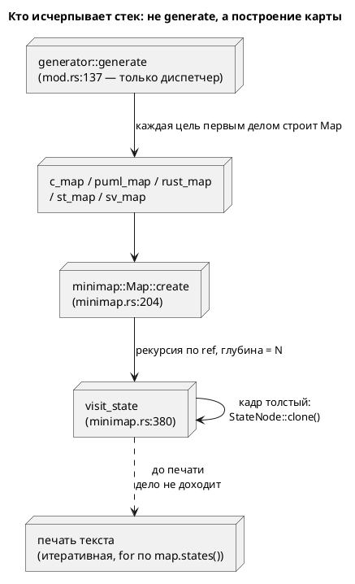

# ADR 0052: Итеративные обходы — снятие потолка стека

- **Status:** Accepted
- **Date:** 2026-07-16
- **Authors:** Архитектор + Аналитик
- **Related issues:** [Фича 0052](../features/0052-verify-iterative-traversal.md);
  вырос из открытого вопроса 3 стадии тестирования [фичи 0049](0049-model-checking-ltl.md)

## Context

Кандидат заводился как «итеративные обходы в `verification/`»: карточка 0049
фиксировала замер «3000 состояний — норма, 20000 — падение». **Зонд опроверг
постановку.** Замеры на модели-цепочке `S0 → S1 → … → S(N-1)` (каждое состояние
ссылается на следующее через `ref`), основной поток:

| Слой | debug | release |
|---|---|---|
| `parse` + `semantic::construct_model` (включая освобождение дерева) | >20000 — потолка не найдено | — |
| **`lamc compile` — все 5 целей** (`c`/`plantuml`/`rust`/`st`/`sv`) | **2500…2800** | **7000…8000** |
| `lamc verify` (обходы `verification/`) | 14000…16000 | **>20000 — потолка не найдено** |

Выводы, переворачивающие исходную постановку:

1. **Самый низкий потолок — не в верификации, а в генерации.** `lamc compile`
   умирает на модели, которую `lamc verify` проверяет без труда. Чинить только
   `verification/` значило бы поднять потолок с 16000 до бесконечности там, где
   пользователь и так не жалуется, оставив невозможной **компиляцию** модели на
   3000 состояний.
2. **В release-сборке потолка верификации не нашли вовсе** (20000 проходит).
   То есть у ветки `verification/` практическая срочность близка к нулю — она
   остаётся в объёме ради однородности, а не ради спасения пользователя.

**Виновник найден и он один на все цели** — `semantic/minimap.rs:380`:

```rust
fn visit_state(state: &StateNode, model: Rc<RefCell<ModelNode>>, used: &mut BTreeMap<Name, Element>) {
    …
    for ref_name in ref_names {
        if let Some(rc) = model.borrow().search_state(&ref_name.local) {
            let next = rc.borrow().clone();      // minimap.rs:411 — ПОЛНЫЙ клон StateNode в кадре
            visit_state(&next, model.clone(), used);   // minimap.rs:412 — глубина = N
        }
    }
}
```

Функция общая: её зовёт `Map::create` (`minimap.rs:204`), а карту первым делом
строит **каждый** генератор — `c_map.rs:53`, `puml_map.rs:27`, `rust_map.rs:42`,
`st_map.rs:59`, `sv_map.rs:54`. Отсюда и совпадение порога у всех целей:
`generator::generate` (`generator/mod.rs:137`) сам не рекурсирует, а падение
происходит **до** печати текста. Обходы состояний в самих генераторах итеративны
(`for` по `map.states()`) и ни при чём.

Почему порог так низок (~2500, а не десятки тысяч) — **толщина кадра**: в кадре
живёт `rc.borrow().clone()`, полная копия `StateNode` по значению, плюс
`Vec<Name>` и клоны `Rc`.

**Защита от циклов есть, от глубины — нет** (`minimap.rs:390`): `used` прерывает
повторный вход, но на ациклической цепочке из N **различных** состояний каждый
ключ новый — ранний выход не срабатывает ни разу. Ограничителя глубины
(`MAX_CALL_DEPTH`, `stacker`, `recursion_limit`) в крейте нет.



## Decision Drivers

1. **Отказ без диагностики.** Переполнение стека — `SIGABRT` без строки, без
   позиции, без кода. Пользователь видит «fatal runtime error», а не «модель
   слишком велика». Это худший вид отказа в проекте, где принцип — «громкий
   отказ» (0025/0035/0049).
2. **Чинить надо там, где потолок ниже** (зонд): генерация, а не верификация.
3. **Соразмерность.** Обход `visit_state` — предпорядок без работы после
   рекурсивного вызова, поэтому перевод в явный список задач механичен.
4. **Не менять наблюдаемое** (гейт 0048): порядок эмиссии — свойство типа
   контейнера (`BTreeMap`), и правка обхода не вправе его тронуть.

## Considered Options

### Option A. Итеративный обход (явный worklist) в `visit_state` + nested-DFS

**Pros:**
- Убирает потолок **совсем**, а не отодвигает: глубина уходит в кучу.
- `visit_state` — предпорядок: после рекурсивных вызовов работы нет, возврата
  никто не читает (`-> ()`) → перевод механичен, риск низок.
- Заодно снимает толстый кадр (`StateNode::clone` на кадр).

**Cons:**
- Порядок обхода нужно сохранить осознанно (см. Decision).

### Option B. Ограничитель глубины + диагностика

Считать глубину, на пороге — `Diagnostic` («модель слишком велика»).

**Pros:**
- Дёшево; отказ становится громким и объяснимым.

**Cons:**
- Потолок **остаётся**, просто получает вывеску. Модель на 3000 состояний
  по-прежнему не компилируется — а она законна.
- Порог зависит от профиля сборки (debug 2500 против release 7500) и от ОС →
  константа будет либо душить release, либо не спасать debug.
- Годится как **дополнение**, а не замена.

### Option C. Растить стек (`stacker`, отдельный поток с большим стеком)

**Pros:**
- Правка в одну строку.

**Cons:**
- Внешняя зависимость (`stacker`) либо поток с гигабайтным стеком ради обхода
  списка — лечение симптома.
- Потолок остаётся, просто выше; на модели вдвое больше вернётся тот же `SIGABRT`.

## Decision

Принимается **Option A**, порядок работ — от низкого потолка к высокому:

1. **`minimap::visit_state` → итеративный** (задача 0052-01). Это и есть фикс
   компиляции: одна функция чинит **все пять** целей, потому что карту строят все.
2. **`verification/check.rs::{outer_dfs, inner_dfs}` → итеративные** (задача
   0052-02). Срочности нет (в release потолка не нашли), но фича охватывает класс
   дефекта целиком — решение заказчика 2026-07-16.

`buchi.rs::expand` (GPVW) **остаётся рекурсивным**: его глубина — по размеру
**формулы**, а не модели. Формулы пишет человек; десятки тысяч вложенных
операторов — не сценарий. Правка без повода дороже пользы, а риск сломать
условие принятия (капкан фикса 0010-01) реален. Фиксируется явно, чтобы
«итеративные обходы» не поняли как «переписать всё подряд».

Option B **не принимается даже как дополнение**: после Option A потолка нет, и
ограничитель нечему ограничивать.

**Порядок обхода сохраняется** (Decision Driver 4): дети кладутся в worklist в
обратном порядке, чтобы `pop()` отдавал их в том же порядке, что рекурсия. По
существу порядок не наблюдаем (`used` — `BTreeMap`, содержимое от порядка вставки
не зависит: страж `contains_key` даёт «первый выиграл», а вставляемый элемент
определяется самим состоянием), но сохранение порядка делает правку проверяемой
диффом вывода, а не рассуждением. Гарантия — гейт детерминизма 0048.

## Consequences

### Положительные

- Модель любого размера компилируется и верифицируется; потолок исчезает, а не
  отодвигается.
- Кадр перестаёт нести `StateNode::clone` — обход дешевеет и по времени.
- Один фикс лечит пять целей сразу.

### Отрицательные / Action items

- **A1.** `expand` (GPVW) остаётся рекурсивным осознанно — глубина по формуле.
  Если появится генератор формул (не человек), вернуться к вопросу.
- **A2.** Замеры сняты на модели-цепочке (глубина = N). Ширина (много рёбер из
  одного состояния) стек не растит — проверять не требуется.
- **A3.** Потолок был **не в том слое**, где его искала карточка 0049. Урок:
  «замер показал 3000» без указания слоя — это не замер. Отражено в тест-плане:
  проверка обязана называть слой.

### Acceptance criteria

1. `lamc compile` (цели `c`, `plantuml`, `rust`, `st`, `sv`) на модели из 20000
   состояний завершается успешно в **debug**-сборке (прежде — `SIGABRT` на 2800).
2. `lamc verify` на той же модели завершается успешно в debug (прежде — на 16000).
3. Вывод генераторов на корпусе `examples/` **не изменился** ни байтом
   (codegen-снапшоты + гейт детерминизма 0048).
4. Регрессий нет: `precheck.sh` зелёный.
5. Тест-сторож фиксирует слой: падение обязано быть отнесено к генерации либо к
   верификации, а не к «обходам вообще».
