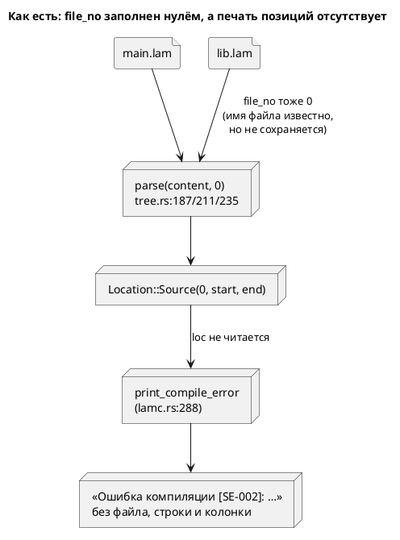

# ADR 0053: Позиции в диагностиках и настоящий `file_no`

- **Status:** Accepted
- **Date:** 2026-07-16
- **Authors:** Архитектор + Аналитик
- **Related issues:** [Фича 0053](../features/0053-diagnostics-file-id.md);
  вырос из action item A1 [ADR 0051](0051-verify-scope.md)

## Context

Кандидат заводился так: «`Location::Source` несёт `file_no`, но он везде равен
нулю, поэтому ошибка в `lib.lam` показывает позицию в тексте `main.lam`».

**Зонд показал, что дефект латентен, а настоящая боль — другая.** Факты:

- `print_compile_error` (`bin/lamc.rs:288`) печатает **только код и сообщение**.
  Ни `diag.loc`, ни строки, ни колонки там нет — как и во всех прочих ветках
  (`:622`, `:635`, `:673`) и в `simulation` (`format_diagnostics`).
- `Location::filename()` и `try_file_no()` (`diagnostics.rs:423`, `:432`) в
  продуктовом коде **не вызывает никто** — только тесты, причём
  `parser_tests.rs:944` прямо утверждает `loc.filename() == "0"`.
- LSP `grammar_diagnostic_to_lsp` (`lsp.rs:224`) `file_no` **отбрасывает**
  (`Location::Source(_, start, end)`) и мапит смещение в текст текущего
  документа. Но и там дефект не всплывает: `collect_diagnostics` зовёт
  `construct_model(&ast, None, &[])` — с **пустыми** путями поиска, то есть
  импорты в редакторе не разрешаются вовсе.

Проба (ошибка `ref Nowhere;` внутри импортированного файла против такой же в
своём файле) даёт **дословно один и тот же** вывод:

```text
Ошибка компиляции [SE-002]: Ссылка 'Nowhere' не найдена
```

Отсюда постановка: чинить надо **печать позиций**, а `file_no` сделать настоящим
как **механизм под ней** — иначе он останется декоративным.



## Decision Drivers

1. **Диагностика без позиции — половина диагностики.** Пользователь знает *что*
   не так, но не знает *где*; в проекте с импортами — даже не знает, в каком
   файле.
2. **Механизм обязан иметь потребителя.** Урок 0049/0010-01: код без потребителя
   молча гниёт. `file_no` пролежал нулём именно потому, что его никто не читал.
3. **Соразмерность правки.** `construct_model` зовут **183** места, `compile_to_*`
   — 36 тестов плюс doc-примеры: менять их сигнатуры ради печати нельзя.
4. **Честность вместо суррогата** (прецедент 0051): признак берётся из данных, а
   не угадывается.

## Considered Options

### Option A. Реестр файлов + путь в `Diagnostic`, печать в `lamc`

`FileTable { paths }` раздаёт `file_no` при разборе каждого файла; `Diagnostic`
получает поле `file: Option<String>`, которое **заполняется по `file_no` через
реестр** там, где реестр ещё жив (внутри `compile_to_*`). `lamc` печатает
`путь:строка:колонка`.

**Pros:**
- `file_no` становится **настоящим и востребованным**: реестр читают ради пути.
- Сигнатуры `construct_model` и `compile_to_*` **не меняются**: реестр живёт
  внутри, наружу выходит уже разрешённый путь. 183 + 36 вызовов не тронуты.
- Настоящих литералов `Diagnostic` в коде всего **13** — поле добавляется дёшево
  (остальные ~40 совпадений `Diagnostic {` — это типы возврата функций).
- Диагностика самодостаточна: несёт всё нужное для печати.

**Cons:**
- `Diagnostic` растёт на поле.
- Путь дублируется в каждой диагностике (строка на ошибку — цена ничтожна).

### Option B. Протащить `&mut FileTable` в публичный API

`compile_to_*` получают реестр параметром; `lamc` владеет им и печатает.

**Pros:**
- Реестр доступен и при успехе.

**Cons:**
- 7 сигнатур × (36 тестов + 7 doc-примеров + 7 мест в `lamc`) — ~50 правок ради
  печати. Нарушает драйвер 3.
- Реестр — деталь компиляции; выносить его в API значит просить каждого
  потребителя знать о нём.

### Option C. Штамповать путь в точке импорта, `file_no` не трогать

В `tree.rs` при ошибке из импорта дописать путь в диагностику — реестр не нужен.

**Pros:**
- Самая дешёвая правка.

**Cons:**
- `file_no` остаётся декоративным — то есть кандидат «настоящий `file_no`»
  **не закрыт**, а замаскирован. Это ровно суррогат, который отверг ADR 0051.
- Заказчик выбрал «позиции **и** настоящий `file_no`» (2026-07-16).

## Decision

Принимается **Option A**.

**Реестр `FileTable` живёт внутри компиляции и наружу не выходит.** Границей
служит `Diagnostic::file`: путь разрешается по `file_no` там, где реестр ещё жив,
и дальше диагностика самодостаточна. Так `file_no` получает потребителя (драйвер
2), а публичный API не растёт (драйвер 3).

**Печать позиции — обязанность `lamc`, а не библиотеки**: библиотека возвращает
данные (путь + смещения), CLI решает, как их показать. Строка и колонка считаются
из текста файла, который CLI читает по пути.

**LSP в объём не входит** (решение заказчика): там нужна многофайловость —
`grammar_diagnostic_to_lsp` принимает один `source: &str`, а `collect_diagnostics`
не разрешает импорты вовсе. Это самостоятельная фича; заводится кандидатом.

**Формат — `путь:строка:колонка`**, как у `rustc`/`gcc`: он машиночитаем и
кликабелен в редакторах. Нумерация строк и колонок — **с единицы** (позиции
внутри `Location` остаются байтовыми смещениями с нуля).

## Consequences

### Положительные

- Пользователь видит, **где** ошибка, и отличает свой файл от импортированного.
- `file_no` перестаёт быть декоративным: у него появился потребитель.
- Реестр — задел для будущей многофайловости LSP (кандидат ниже).

### Отрицательные / Action items

- **A1.** `Location::filename()` возвращает `format!("{}", file_no)` — то есть
  строку `"0"`, а не путь; имя вводит в заблуждение. Тест
  `parser_tests.rs:944` прямо на это опирается. Переименование/удаление — вне
  объёма (тронет тесты, пользы для пользователя нет); зафиксировано здесь.
- **A2.** `simulation` печатает диагностики без позиций так же (`format_diagnostics`).
  Вне объёма: фича про `lamc`; кандидат.
- **A3.** LSP остаётся однофайловым — кандидат в фичи.

### Acceptance criteria

1. Ошибка в своём файле печатается как `путь:строка:колонка: …`, строка и
   колонка указывают на объявление.
2. Ошибка внутри импортированного файла печатается с путём **этого** файла, а не
   корневого (сегодня они неотличимы).
3. Вложенный импорт (`main → lib → deep`) называет **`deep.lam`**.
4. Диагностика без файловой позиции (`Location::Codegen`/`Implicit`) печатается
   как прежде — без выдуманных координат.
5. `file_no` реален: разные файлы получают разные идентификаторы, и путь
   разрешается **через реестр**, а не угадыванием.
6. Регрессий нет: `precheck.sh` зелёный; версия языка и вывод генераторов не
   меняются.
