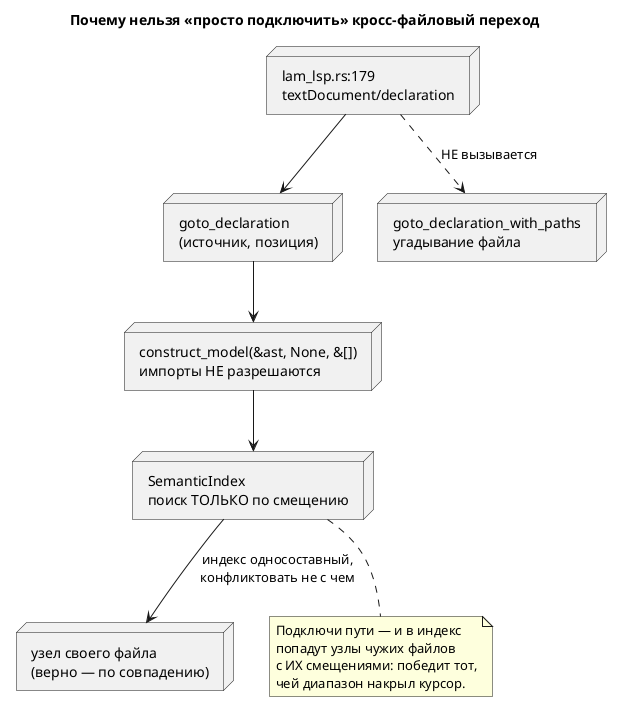

# ADR 0056: Кросс-файловый переход к декларации — точный путь вместо угадывания

- **Status:** Accepted
- **Date:** 2026-07-16
- **Authors:** Архитектор + Аналитик
- **Related issues:** [Фича 0056](../features/0056-lsp-goto-exact-file.md);
  кандидат из [ADR 0055](0055-lsp-multifile.md) (action item A2)

## Context

Кандидат звучал так: «`goto_declaration_with_paths` **угадывает** файл по имени
модели (`to_snake_case` + перебор `search_paths`), хотя реестр 0053 даёт точный
путь». Зонды показали, что угадывание — **третья** по важности проблема из трёх.

### 1. Кросс-файловый переход не подключён к серверу

`lam_lsp.rs:179` обрабатывает `textDocument/declaration` так:

```rust
let result = grammar::lsp::goto_declaration(text, position)  // однофайловый вариант
```

`goto_declaration_with_paths` не вызывает **никто**, кроме тестов
(`lsp_tests.rs`), и все они передают `&[]`. То есть:

- у пользователя переход в импортированный файл не работает **вообще**;
- ветка угадывания (`for dir in search_paths`) **никогда не исполнялась** — ни в
  продукте, ни в тестах.

Это ровно тот класс, что дал дефект затравки 0010 (`build_buchi` принимал не тот
язык, прожив в зелёном CI): **код без потребителя молча гниёт**.

### 2. Индекс LSP слеп к файлам — и это опаснее угадывания

`SemanticIndex::node_at_offset(offset)` (`semantic/index.rs:194`) ищет запись
**только по смещению**. Индекс строится по всему дереву — включая
импортированные модели, чьи смещения относятся к **их** файлам.

Зонд (`import "helper.lam"; start Main = Helper;`, курсор на `Helper`, смещение
34):

```text
УЗЕЛ: name=speed kind=Variable loc=Source(0, 19, 37)
```

Вернулся `speed` — переменная **из `helper.lam`**: её смещения там (19..37)
перекрыли смещение курсора здесь. Не «не тот файл найден», а **не тот узел**.
Отсюда и мусорный диапазон перехода.

### 3. `FileTable::default()` сталкивает первый импорт с корнем

```rust
pub fn add(&mut self, path: &str) -> u64 {
    …
    self.paths.push(path.to_string());
    (self.paths.len() - 1) as u64      // при пустом реестре → 0
}
```

`FileTable::default()` создаёт **пустой** реестр, поэтому первый
зарегистрированный импорт получает номер `0` — тот же, что корень у
`FileTable::new(root)`. Это дефект **закрытой 0053**; вынесен в фикс
[0053-01](../fixes/0053-01-file-table-default-collision.md).

### Почему дефекты 2 и 3 сегодня не видны

`goto_declaration` (`lsp.rs:549`) и `hover_info` (`lsp.rs:969`) строят модель
**без путей поиска** (`&[]`) и без пути документа, поэтому импорты в них не
разрешаются, а индекс содержит только свой файл. Дефекты **латентны** — и
**подключение кросс-файлового перехода их активирует**.



## Decision Drivers

1. **Порядок работ задан зависимостью дефектов.** Подключение перехода без
   файлоосознанного индекса даёт **не тот узел** — регресс hover и перехода.
2. **Точный путь уже есть.** Реестр 0053 отдаёт путь по `file_no`; угадывание и
   переразбор файла не нужны.
3. **Не чинить чужой дефект молча.** Столкновение номеров — дефект закрытой
   0053, ему полагается свой фикс (правило 17), а не растворение в этой фиче.
4. **Код без потребителя гниёт** (урок 0010/0049): подключение к серверу —
   часть фичи, иначе проверять будет нечего.

## Considered Options

### Option A. Индекс → точный путь → подключение (принято)

Три задачи в жёстком порядке: (1) индекс различает файлы; (2) переход берёт путь
из реестра вместо угадывания; (3) сервер зовёт кросс-файловый вариант.

**Pros:**
- Каждый шаг проверяем отдельно; регресса hover не будет.
- Угадывание и переразбор файла удаляются целиком (~35 строк).
- Порядок отражает зависимость дефектов, а не удобство.

**Cons:**
- Три задачи вместо одной; фикс 0053-01 обязателен раньше всех.

### Option B. Только заменить угадывание на реестр

**Pros:**
- Малый диффф; закрывает букву кандидата.

**Cons:**
- **Не работает**: сервер эту функцию не зовёт — пользователь не увидит ничего.
- Индекс останется файлослепым.
- Отвергнут: это правка ради строчки в бэклоге.

### Option C. Подключить сервер, индекс не трогать

**Cons:**
- Активирует латентный дефект 2: переход и hover начнут возвращать узлы чужих
  файлов. Хуже, чем сейчас.

## Decision

Принимается **Option A** с порядком: фикс `0053-01` → `0056-01` (индекс) →
`0056-02` (точный путь) → `0056-03` (подключение).

> ⚠️ **Дополнено при реализации (решение заказчика, 2026-07-17): задача
> `0056-04`.** Этот ADR исходил из того, что курсор на `Helper` возвращает **не
> тот узел** (`speed` из чужого файла) — и, значит, достаточно научить индекс
> различать файлы. Зонды реализации показали, что **нужного узла не существует
> вовсе**: ссылки на модель систематически не несут позиций
> (`Extend::Model(Rc)`, `ConditionNode::Model(Rc)` — оба без `Location`), потому
> что разрешение их стирает. Следствие: критерии **A1/A2 недостижимы** тремя
> задачами выше, а кросс-файловая ветка не могла сработать **никогда** — не
> только «её не звал сервер».
>
> Заказчик выбрал **чинить причину**: позиция — свойство ссылки. Заведена задача
> [0056-04](../development/0056-04-model-reference-location.md); порядок стал
> `0053-01` → `0056-01` → **`0056-04`** → `0056-02` → `0056-03`.
>
> Урок для будущих ADR: «вернулся не тот узел» и «узла нет» — **разные** диагнозы,
> и зонд, показывающий первое, второго не исключает.

**Индекс становится файлоосознанным**: запись индекса хранит `file_no`, а
`node_at_offset` ищет среди записей **своего** файла. Альтернатива — строить
индекс только по корневой модели — отвергнута: кросс-файловому переходу нужны
узлы импортированных моделей, просто адресуемые по паре `(file_no, offset)`, а не
по одному смещению.

**Путь берётся из реестра** (`FileTable::path(file_no)`), а `to_snake_case` и
переразбор файла **удаляются**. Угадывание не просто лишнее — оно **неверно**:
`import "engine.lam" as Motor;` даёт модель `Motor`, а файл называется
`engine.lam`; кандидаты `motor.lam`/`motor.lam` не совпадут никогда.

**Диапазон в чужом файле** считается по его тексту, прочитанному по пути из
реестра, — тем же приёмом, что `position_prefix` (фича 0054).

## Consequences

### Положительные

- Переход в импортированный файл работает в редакторе — впервые.
- Удаляется угадывание (`to_snake_case`, перебор кандидатов, переразбор файла).
- Индекс перестаёт путать файлы — это чинит и hover при многофайловости.

### Отрицательные / Action items

- **A1.** Фикс `0053-01` обязателен до `0056-01`: без него `file_no` импорта
  равен нулю, и файлоосознанный индекс не различит файлы.
- **A2.** `hover_info` строит модель без путей (`&[]`) — импорты в подсказке не
  разрешаются. Вне объёма (другой сценарий), кандидат.
- **A3.** LSP не читает `initializationOptions` — аналог `-I` в редакторе задать
  нечем (кандидат из 0055 сохраняется). Переход найдёт лишь то, что разрешает
  неявный путь (каталог документа).
- **A4.** `Location::uri` для своего файла возвращается пустым (`String::new()`),
  а URI подставляет вызывающий. Оставлено как есть — менять контракт незачем.

### Acceptance criteria

1. Курсор на имени модели из `import` → переход открывает **тот** файл и то
   место, где модель объявлена.
2. Алиас (`import "engine.lam" as Motor;`) работает — угадывание бы не нашло.
3. Узел под курсором принадлежит **текущему** файлу: зонд-регресс (`speed` из
   `helper.lam`) не воспроизводится.
4. Переход внутри своего файла не изменился.
5. `to_snake_case` и переразбор файла в `lsp.rs` **удалены**.
6. Сервер зовёт кросс-файловый вариант (иначе проверять нечего).
7. Регрессий нет: `precheck.sh` зелёный; версия языка не меняется.
