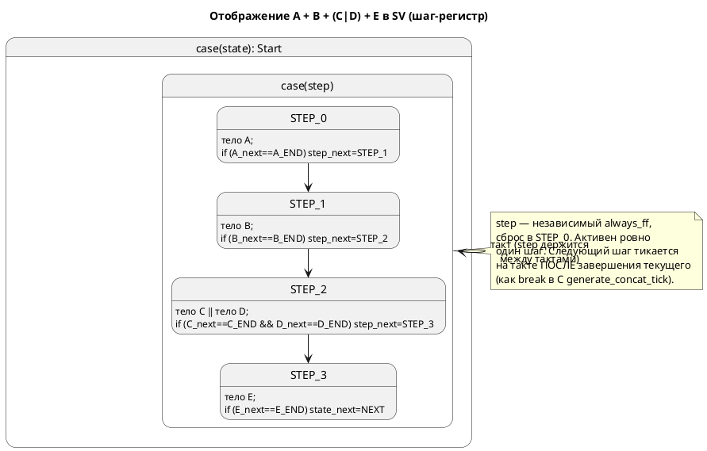

# ADR 0057: Последовательная композиция (`+`) в цели SystemVerilog

- **Status:** Accepted
- **Date:** 2026-07-17
- **Authors:** архитектор, инженер генератора SV
- **Related issues:** [Фича 0057](../features/0057-sv-sequential-composition.md); опирается на [ADR 0045](0045-sv-backend.md) (вопрос 3, часть 2 — Option A′), контракт [ADR 0033](0033-init-tick-alignment.md) (вход в стартовое состояние не расходует такт)

## Context

ADR 0045 ввёл SV-бэкенд и **уже принял** отображение композиции (Option A′): один
`module` на корневую модель, регистры состояний под-моделей — независимые
`always_ff`, комбинационная логика инлайнится в один `always_comb` в порядке
вызова `_tick` C-бэкендом. Таблица отображения ADR 0045 прямо описала и
последовательную композицию:

> `M1 + M2` → шаги `case` родителя: пока `!m1_is_done` — логика `M1`, затем `M2`.

Однако задача 0045-06 реализовала только `Parallel`, а `Concatenation` оставила
диагностикой `SV-002` (`sv_fsm.rs::emit_extend`, ветка `StateExtend::Concatenation`).
Эта ADR **не пересматривает** решение 0045, а **фиксирует конкретный механизм**
реализации отложенного `+`, включая тонкие места тайминга — ровно там, где жил
дефект SV-`|` (см. CLAUDE.md: «`always_comb` читает `_next`, а не регистр»).

**Эталон поведения** — не текст, а трасса: C-генератор `generate_concat_tick`
(`c_model.rs:562-705`) и симулятор `Unit::Sequential` (`unit/mod.rs`,
`tick_sequential`). Оба реализуют одну операционную семантику: активен один шаг;
при его завершении индекс продвигается; следующий шаг исполняется **на следующем
такте** (в C — `break` после смены `start_state`).

## Decision Drivers

1. **Потактовая сверка с симулятором/C.** Гейт verilator/yosys докажет валидность,
   но НЕ верность (урок 0045/0050). Механизм обязан давать трассу, совпадающую с
   симулятором на каждом такте — это главный критерий.
2. **Переиспользование машинерии SV.** `emit_model_body` (рекурсивный инлайн
   под-модели), построение done-выражения и `end_variant` из ветки `Parallel`,
   аппарат `Reg`/`emit_signals`/сброс в `emit_ff` — уже есть.
3. **Никакой тишины на вложенности.** У цели `c` вложенная `+` внутри шага (`RS-021`)
   молча пропускается — автомат стоит. SV обязан либо поддержать вложение, либо
   дать явную диагностику (правило 15).
4. **Детерминизм (0048).** Порядок эмиссии шагов и enum — свойство контейнера,
   не строки на эмиссии.
5. **Аддитивность (правило 11), язык неизменен (правило 22).** `SV-002` →
   поддержано; `+` в языке уже есть, версия не растёт.

## Considered Options

### Option A. Регистр шага + инлайн активного шага в `emit_extend`

Каждой цепочке `Concatenation` — независимый регистр `<state>_step`
(`typedef enum logic [w:0] { STEP_0..STEP_N }`, `always_ff`, сброс `STEP_0`). В
`always_comb`, внутри `case`-ветви родительского состояния — `case (<step>)`, где
каждый `STEP_i` инлайнит **только** тело шага `i`:
- шаг-`Model` → `emit_model_body(item)`;
- шаг-`Parallel` → существующая ветка `Parallel`;
- шаг-`Concatenation` (вложенная `+`) → рекурсия (свой регистр шага).

Done-выражение шага строится как в `Parallel` (`_state_next == _END`,
для `Parallel` — конъюнкция ветвей). При завершении: не последний шаг →
`<step>_next = STEP_{i+1}`; последний → **переход родителя** (общий хвост
`emit_extend`). Тайминг активации совпадает с C: смена `<step>_next` в такте T →
шаг `i+1` исполняется с такта T+1, когда регистр защёлкнулся; под-автомат шага
`i+1` держится на своём старте (значение сброса), поэтому его тело/`enter`
исполнятся естественно первым же тактом активности — без явного `_init`.

**Pros:** прямой перенос C-эталона и ветки `Parallel`; корректный тайминг
(регистр разрывает такт там же, где `break` в C); переиспользует `emit_model_body`
и done-логику; композируется с `Parallel` и с вложенной `+`.
**Cons:** вводит служебный регистр шага (состояние, которого нет в модели) — не
должен утечь в выход/`is_done`; длинная комбинационная цепь растёт с длиной
цепочки (тот же класс, что у `Parallel`; документируется).

### Option B. Десахаризация в синтетическую модель `Step0..StepN`

Семантика уже умеет разворачивать `A + B` в синтетическую модель со состояниями
`Step0=A {next Step1}`, … (`semantic/extend.rs::compact_implement`). Идея: подать
SV эту модель как обычную под-модель — переходы шагов выпадут из штатного
`emit_model_body` + `emit_transitions`, отдельный регистр шага не нужен.

**Pros:** нет новой логики регистра шага; `+` = обычный FSM.
**Cons:** синтетический `next` между шагами в текущей десахаризации **безусловен**
→ продвигался бы каждый такт (неверный тайминг), пока не переписать его на охрану
по `is_done` шага. Вдобавок SV-минимап несёт именно `StateExtend::Concatenation`
(его и отвергает `emit_extend`), а не десахаризованную модель, — то есть путь B
потребовал бы менять слой семантики/минимапа под одну цель. Поведенческий эталон
(C) идёт **явным** путём, а не через Step-модель. Риск разъехаться с трассой.

### Option C. Модуль на шаг, структурная инстанциация + `enable`

Каждый шаг — отдельный `module`, инстанс на уровне модуля, активация сигналом
`enable`.

**Cons:** отвергается по тем же причинам, что Option B′/C′ в ADR 0045: места
вызова процедурные (`always_comb`), а регистрация связей вводит лишний такт
задержки → другое поведение, чем у C/симулятора. Сверка невозможна.

## Decision

Принимается **Option A** — согласуется с уже принятым Option A′ (ADR 0045) и с
поведенческим эталоном C. Механизм фиксируется так:

1. **Регистр шага** на каждую `Concatenation` (ключ — уникальное имя несущего
   состояния): `typedef enum logic [w:0] { <STATE>_STEP_0 … }`, независимый
   `always_ff`, сброс в `STEP_0`. Учитывается в `Fsm::build`/`emit_signals`/
   `emit_ff` наравне с регистрами уровней.
2. **Инлайн активного шага** в `always_comb`: `case (<step>) STEP_i: <тело шага i>`.
   Тело шага строится существующими средствами (`emit_model_body` / ветка
   `Parallel` / рекурсия для вложенной `+`).
3. **Продвижение** по done-выражению шага (на `_next`, как в `Parallel`): не
   последний → `<step>_next = STEP_{i+1}`; последний → переход родителя (общий
   хвост `emit_extend`).
4. **Тайминг** активации следующего шага — «такт после» (совпадает с C `break`);
   `enter` стартового состояния шага исполняется первым тактом активности через
   штатный `emit_model_body` (контракт 0033 — вход не стоит такта).
5. **Вложенность** (`+` в `+`, `+` в `|`, `|` в `+`) покрывается рекурсией; там,
   где реализация не покрывает случай, — **явная диагностика** `SV-002` (или
   выделенный код, пиннится в 0057-03), не тишина.

## Consequences

### Положительные
- `extend_complex` и произвольные модели с `+` транслируются в валидный,
  синтезируемый SystemVerilog.
- Выигрыш параллелизма Option A′ сохраняется: регистры шага и состояний —
  независимые триггеры, такт по-прежнему один.
- Прямое переиспользование C-эталона и ветки `Parallel`; минимальная новая логика.

### Отрицательные / Action items
- Служебный регистр шага — состояние вне модели; проследить, что он не попадает в
  выходные порты и не искажает `is_done` (задача 0057-01).
- Длинная комбинационная цепь на длинных цепочках `+` (потолок частоты) —
  документируется, как и у `Parallel`.
- Вложенные формы композиции требуют явного покрытия или диагностики (0057-03).

### Acceptance criteria
1. Потактовая трасса порождённого SV совпадает с трассой симулятора на
   `extend_complex` (`A → B → (C|D) → E`) и на минимальном `A + B` (глубина 1) —
   `conformance_sv_tests.rs`.
2. `verilator --lint-only -Wall` **и** `yosys synth -top` принимают вывод;
   `extend_complex` входит в `SV_TRANSLATABLE`.
3. Вложенная композиция либо транслируется корректно, либо даёт явную
   диагностику `SV-0xx` (никакой тишины; проверяется контр-примером).
4. Гейт воспроизводимости (0048) зелёный: два прогона `-t sv` байт-в-байт равны.
5. Язык не изменён; существующие `.sv` (`stacker`, `elevator_mini`) байт-в-байт
   неизменны.

## Приложение: схема шаг-машины (Option A)

