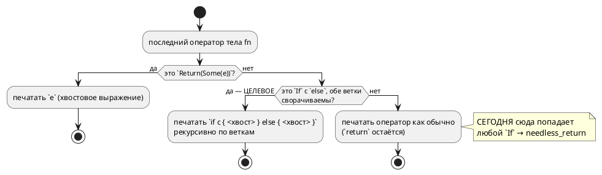

# ADR 0058: Хвостовой разворот `return` в цели `rust` — заход в завершающий `if/else`

- **Status:** Accepted
- **Date:** 2026-07-17
- **Authors:** Архитектор + Лид разработки
- **Related issues:** [Фича 0058](../features/0058-rust-tail-return-if-else.md); наследует политику линтов [ADR 0050](./0050-rust-backend.md) (вариант (а): `-D warnings`, не глушить)

## Context

Цель `-t rust` сворачивает **завершающий** `return x;` в хвостовое выражение
(`rust_func.rs::print_body_with_tail`): в Lam возврат всегда явный, в Rust идиома —
хвостовое выражение, и `clippy -D warnings` на `return x;` последним оператором даёт
`needless_return`, то есть **отказ гейта**.

Разворот **не заходит внутрь завершающего `if/else`**. Механизм (прочитан в коде):
`print_body_with_tail` передаёт в `rust_stmt::print_block` колбэк-`TailPrinter`,
который `print_block` применяет **только к последнему оператору** (`idx == last_idx`),
а сам колбэк разбирает **ровно один** вид узла:

```rust
let StatementNode::Return(Some(expr)) = stmt else {
    return Ok(false);            // ← любой другой узел печатается как обычно
};
```

Если последний оператор — `StatementNode::If { … }`, колбэк возвращает `Ok(false)`,
`if` печатается дословно, `return`'ы внутри веток остаются, и гейт падает.

**Пробы 2026-07-17** (обе на минимальной модели, `clippy-driver --edition 2021
--crate-type=lib -D warnings`, та же форма обёртки, что в `precheck.sh`):

| Форма тела `fn pick(a, b) -> u8` | Порождённый Rust | clippy |
|---|---|---|
| `if a > b { return a; } else { return b; }` | `if a > b { return a; } else { return b; }` | **ОТВЕРГ**: `error: unneeded `return` statement` (`needless_return`) |
| `if a > b { return a; } return b;` | `if a > b { return a; } b` | **принял** (по этой причине; см. «Отрицательные») |

То есть дефект — **в развороте хвоста, а не в языке**: одна и та же функция,
записанная двумя эквивалентными способами, даёт в одном случае отказ гейта, а в
другом — чистый идиоматичный Rust.

Ситуация обходится авторской правкой `.lam` (записать ранним выходом), поэтому это
дефект **качества трансляции**, а не блокер: неверного кода цель не порождает —
она порождает код, который **громко** отвергается гейтом.

⚠️ Дефект был **скрыт пропуском** `comprehensive` в гейте цели `rust` и обнажился,
когда [0030](./0030-comprehensive-example-fix.md) сняла пропуск: пропуск, объявленный
ради одной причины (`absurd_extreme_comparisons`), прятал вторую.

### Поток «как есть» и целевой



## Decision Drivers

1. **Политика линтов уже принята и менять её нельзя.** ADR 0050 выбрал вариант (а):
   `-D warnings` и **не эмитить** то, на что линт ругается, вместо `#[allow]`.
   Обоснование там же: сторож должен остаться живым, а глушение линта видимостью или
   атрибутом — способ потерять сторожа (прецедент: `pub enum` глушит `dead_code`).
2. **Одинаковый текст на входе — одинаковое качество на выходе.** Автор `.lam` не
   обязан знать, что ранний выход транслируется лучше, чем `if/else`. Сегодня выбор
   формы записи определяет, пройдёт ли гейт.
3. **Не сломать то, что работает.** Корпус (`examples/`) сегодня гейт проходит;
   генерация детерминирована (фича [0048](./0048-deterministic-codegen.md)), поэтому
   любое изменение вывода видно в диффе `examples/generated/` и обязано быть
   осознанным.
4. **Ошибаться в сторону громкого отказа.** Если свернуть нельзя — нужно оставить
   сегодняшнее поведение (отказ гейта), а не выдумывать трансляцию: отказ виден, а
   тихо неверный код — нет (урок 0045/0050: гейт доказывает компилируемость, но не
   верность).

## Considered Options

### Option A. Рекурсивный хвостовой разворот (заход в `if/else`)

Колбэк хвоста становится **рекурсивным печатником хвостовой позиции**:
`Return(Some(e))` → `e`; `If { cond, then_, Some(else_) }`, у которого **обе** ветки
сворачиваемы, → `if cond { <хвост then_> } else { <хвост else_> }`; всё прочее —
как сегодня. Цепочка `else if` покрывается той же рекурсией (`else_` = `If`).

**Pros:**
- Лечит причину, названную кандидатом («дефект в развороте хвоста»).
- Обе формы записи дают одинаково идиоматичный вывод (драйвер 2).
- Консервативна: несворачиваемое остаётся как есть (драйвер 4).
- Корпус не задет: разворот срабатывает только там, где сегодня **отказ гейта**
  (проверяется криптерием A2 — побайтовая неизменность `examples/generated/rust`).

**Cons:**
- Нужен предикат «сворачиваемо» рядом с печатником — два места, которые обязаны
  согласовываться (риск R-1 анализа; в проекте есть прецедент такой пары:
  `function_needs` / `rust_expr::call`).
- `if` без `else` и смешанные ветки не лечатся — остаются отказом гейта.

### Option B. `#[allow(clippy::needless_return)]` на функции

**Pros:**
- Две строки правки.

**Cons:**
- **Прямо противоречит принятому ADR 0050** (вариант (а)): глушит сторожа вместо
  того, чтобы не эмитить то, на что он ругается.
- Заглушка на всю функцию скрыла бы и **будущие** `needless_return` в ней.

### Option C. Оставить как есть; лечить авторской правкой `.lam`

**Pros:**
- Ноль правок; обход известен и работает.

**Cons:**
- Качество вывода зависит от формы записи входа (нарушен драйвер 2).
- Ловушка воспроизводима: следующий автор напишет `if/else` и упрётся в гейт, текст
  которого (`unneeded return`) указывает на **порождённый** код, а не на его `.lam`.

### Option D. Снимать `return` во всех хвостовых позициях любого узла (`loop`, `match`, блоки)

**Pros:**
- Максимальная общность.

**Cons:**
- Объём и риск несоизмеримы поводу: в корпусе нет ни одного такого хвоста, кроме
  `if/else`; проба, обосновывающая остальные узлы, отсутствует — то есть решение
  принималось бы умозрительно.
- `loop`/`for` в хвостовой позиции значения не дают — сворачивать там нечего.

## Decision

Принимается **Option A**.

Она лечит названную причину, не трогает принятую политику линтов и **не может
сломать работающий вывод**: разворот срабатывает ровно в той форме, которую гейт
сегодня **отвергает**, — значит, ни одна проходящая гейт модель не меняет вывода.
Это же даёт дешёвый и жёсткий критерий приёмки: `examples/generated/rust` обязан
остаться **побайтово** прежним (детерминизм гарантирован фичей 0048).

Option D отклонена как умозрительная (нет пробы, нет случая в корпусе); при
появлении случая заводится отдельная фича. Option B противоречит ADR 0050.
Option C оставляет ловушку на следующего автора.

**Правило сворачивания (нормативно):**

1. `Return(Some(e))` в хвостовой позиции → печатается `e` (как сегодня).
2. `If { cond, then_, Some(else_) }` в хвостовой позиции сворачивается **тогда и
   только тогда**, когда сворачиваемы **обе** ветки (рекурсивно по этому же
   правилу).
3. `If` **без** `else` — не сворачивается (не выражение: значение ветки-пропуска не
   определено).
4. Любой другой узел — не сворачивается.
5. Несворачиваемое печатается **как сегодня** (`return` остаётся) — то есть
   поведение не регрессирует, а отказ гейта остаётся громким.

**Язык не меняется** — версия языка не растёт (правило 22); правка касается только
печати цели `rust`.

## Consequences

### Положительные

- `if/else` с `return` в обеих ветках транслируется в идиоматичный
  `if c { a } else { b }` и проходит гейт.
- Цепочка `else if` покрывается той же рекурсией без отдельного кода.
- Форма записи входа перестаёт влиять на проходимость гейта.

### Отрицательные / Action items

- **A-1. Предикат и печатник обязаны согласовываться.** Решение «сворачиваемо ли»
  должно приниматься **в одном месте**; печатник не вправе принимать его повторно
  (иначе класс «две функции разошлись молча» — прецедент `function_needs` /
  `rust_expr::call`). Разбор — задача 0058-01.
- **A-2. `if` без `else` и смешанные ветки не лечатся** — остаются отказом гейта.
  Это осознанно (драйвер 4): у ветки-пропуска нет значения. Если случай встретится
  в корпусе — заводить отдельную фичу, а не расширять эту.
- **A-3. Скобки.** Хвостовое выражение ветки печатается через `unwrap_outer`
  (`unused_parens` ругается на `if c { (a) }`), а условие `if` — через него же (одна
  из трёх позиций, где линт на скобки срабатывает; см. `CLAUDE.md`, цель `rust`).
  Пропустив это, получим отказ гейта **по другому линту**.
- **A-4. Вторая находка пробы — вне объёма 0058.** Проба формы 2 показала, что
  минимальная модель **без портов** гейт всё равно не проходит:
  `pub fn new() -> Self` без аргументов даёт `clippy::new_without_default`. Корпус
  этого не ловит, потому что **у каждого** его примера есть порты (→ `new(hal: H)`,
  аргумент есть → линт молчит), а `new()` под-модели **приватен** (линт срабатывает
  только на публичных). Класс — ровно как у [0026](./0026-c-root-typedef.md): дыра
  не в коде, а в покрытии. Заведено **кандидатом** в `FEATURES.md` (правило 7), в
  объём 0058 **не берётся**: другой механизм, другое лечение.

### Acceptance criteria

1. **A1.** Проба формы 1 (`if a > b { return a; } else { return b; }`) даёт
   `if a > b { a } else { b }`, и `clippy -D warnings` её **принимает**.
2. **A2.** `examples/generated/rust/*.rs` **побайтово не меняются** (`git diff`
   пуст): правка не задевает ни одну проходящую гейт модель. Опора — детерминизм
   генерации (фича 0048).
3. **A3.** `if` в хвосте **без** `else` печатается как сегодня (`return` внутри
   остаётся) — сторож правила 3.
4. **A4.** Смешанный случай (одна ветка завершается `return`, другая — нет) не
   сворачивается; вывод как сегодня — сторож правила 2.
5. **A5.** Цепочка `if / else if / else` с `return` во всех ветках сворачивается
   целиком и принимается clippy.
6. **A6.** Гейт цели `rust` в `precheck.sh` (rustc + clippy по всему корпусу) —
   зелёный.
7. **A7.** Потактовая сверка `simulation/tests/conformance_rust_tests.rs` не
   меняет вердиктов: разворот — **синтаксический**, поведение обязано остаться
   прежним.
