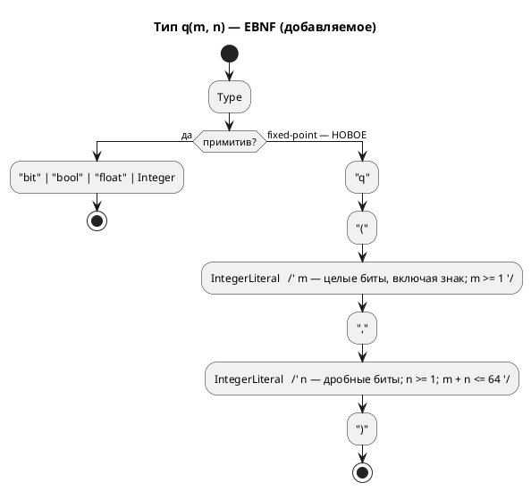

# ADR 0061: Fixed-point Q(m.n) как тип языка

- **Status:** Accepted
- **Date:** 2026-07-17
- **Authors:** Архитектор + Дизайнер языка
- **Related issues:** [Фича 0061](../features/0061-fixed-point-type.md); исполняет отложенное решение [ADR 0045](./0045-sv-backend.md) (вопрос 4, **Option R-B вынесен в кандидаты**)

## Context

Цель `sv` запрещает вещественный тип диагностикой **`SV-003`**: в синтезируемом
RTL плавающей точки нет, а `real` пригоден только для симуляции (yosys его
отвергает — проверено 0045). ADR 0045 рассмотрел **Option R-B** (`Rational` →
Q(m.n)) и **отверг его как решение бэкенда**, вынеся в кандидаты с точной
формулировкой причины:

> «**Язык не выражает формат.** Q(m.n) требует выбора разрядности целой и дробной
> части, правил округления и насыщения — у `float` в Lam этих параметров нет.
> Генератор был бы вынужден **угадать** (например, Q16.16) — то есть молча
> изменить численную семантику модели: симулятор считает в f64, RTL считал бы в
> Q16.16 с иным округлением → сверка с симулятором провалится **не из-за дефекта,
> а by design**.»

Фича 0061 закрывает именно этот пробел: даёт языку **выразить формат**.

### Замер сегодняшнего состояния (пробы 2026-07-17)

`var t: float := 1.5; t := t + 0.25;`

| Цель | Результат |
|---|---|
| `c` | `double t;` |
| `st` | `t : LREAL := 1.5;` |
| `rust` | `t: f64,` |
| `sv` | **`SV-003`** (громкий отказ с подсказкой «используйте целочисленный тип либо цель `c`/`rust`») |

Три программные цели **согласованы на 64 битах** — следствие решения заказчика
`--float-width=64` (фича [0029](./0029-c-type-mapping.md)); симулятор тоже f64.
То есть сегодня `float` **непротиворечив везде, кроме `sv`**, где он честно
запрещён.

⚠️ **Пользователя у фичи сегодня нет:** `grep` по `examples/` даёт **0**
вхождений `float` (подтверждает замер ADR 0045). Фича добавляет **возможность**,
а не чинит боль.

### Ловушка, обнаруженная проработкой: `>>` отрицательного в C — implementation-defined

Q-арифметика строится на сдвигах. **C11 6.5.7p5**: если левый операнд `>>` имеет
**знаковый** тип и **отрицательное** значение, результат
**implementation-defined**. Проба на этой машине (clang) даёт арифметический сдвиг
(`(-6) >> 1 = -3`, `Q8.8: -1.5*2.0 → -768` — верно), но это **выбор компилятора, а
не гарантия языка**. Цель `c` обязана эмитить код, не опирающийся на
неопределённость, — иначе численная семантика поедет **на чужом компиляторе**, то
есть у пользователя и молча.

⚠️ Смежно: у цели `st` сдвиг ещё хуже — `SHL`/`SHR` в IEC 61131-3 определены на
**битовых строках**, а арифметика на битовых строках **запрещена** (`CLAUDE.md`,
цель `st`); оператора `<<` нет вовсе. То есть Q-арифметика в ST потребует
преобразований в месте операции — как уже сделано для `&`/`|`.

## Decision Drivers

1. **Численная семантика обязана совпадать у симулятора и ВСЕХ целей — побитово.**
   Иначе сверка проваливается by design (ровно довод, по которому 0045 отвергла
   R-B). Это главный драйвер: fixed-point без него бессмыслен.
2. **Формат задаёт автор, а не генератор.** Угадывание = молчаливое изменение
   семантики.
3. **Округление и переполнение — часть формата, а не деталь реализации.** Если их
   не зафиксировать нормативно, четыре цели догадаются по-разному (прецедент,
   доказанный при [0060](./0060-enum-width-shared-layer.md): пустое перечисление
   дало **четыре** разных ответа).
4. **Не платить за то, чем не пользуются.** Пользователя нет (0 `float` в
   корпусе) — значит цена ошибки в дизайне выше цены отсрочки.

## Considered Options

### Option A. Новый примитив языка `q(m, n)`; `float` не трогаем

`var t: q(8, 8) := 1.5;` — **знаковый**, `m` — целые биты **включая знак**, `n` —
дробные, полная ширина `W = m + n`. Псевдонимы работают штатно
(`type Temp = q(8, 8);` — механизм `Type::Alias` уже есть).

**Pros:**
- Формат выражен явно (драйвер 2); ширина **выводима** и не содержит скрытого бита
  — в отличие от классической записи Q(m.n) с подразумеваемым знаковым битом.
- `float` остаётся как есть: программные цели не трогаются, сверка f64 не рушится.
- `q` — **отдельный тип**, а не «режим `float`»: у них разная арифметика, и
  смешивать их в одном имени значило бы врать.
- Ортогонален целям: `sv` получает синтезируемую дробную арифметику, не теряя
  `SV-003` для `float`.

**Cons:**
- Растёт язык: новый примитив + правила арифметики + приведения.
- Работа в **шести** местах (язык, симулятор, 4 цели) — иначе тип полу-мёртв.

### Option B. Формат — параметр цели (`--fixed-width=16.16`)

**Pros:** ноль изменений языка.

**Cons:**
- **Нарушает драйвер 2 и принцип проекта**: CLI не должен менять логику автомата
  (прямо записан в `CLAUDE.md` по фиче 0042 про `--define`). Одна и та же модель
  считала бы по-разному в зависимости от флага сборки — то есть семантика уехала бы
  из текста модели в командную строку.
- Ровно то «угадывание», которое отверг ADR 0045, только руками пользователя.

### Option C. `float` с атрибутом формата (`var t: float<8,8>`)

**Pros:** не плодит имён типов.

**Cons:**
- `float<8,8>` **не float**: другая арифметика, другое округление, другой диапазон.
  Одно имя для двух семантик — источник ровно тех тихих расхождений, против
  которых фича и заводится.
- Модель, где часть `float` «с атрибутом», а часть без, читается неоднозначно.

### Option D. Не делать; оставить `SV-003` (статус-кво)

**Pros:**
- Цена нулевая; обход есть — целочисленная арифметика с ручным масштабированием
  (именно так корпус и написан: 0 `float`).

**Cons:**
- Регуляторы (ПИД и т. п.) на FPGA без дробной арифметики выражаются вручную и
  **молча** — масштаб живёт в голове автора, а не в типе.
- Не закрывает отложенное решение 0045.

## Decision

Принимается **Option A** — с **нормативной** численной семантикой (без неё фича
не имеет смысла, драйвер 1).

**Нормативные правила (обязательны для симулятора и всех целей — побитово):**

1. **Тип:** `q(m, n)` — знаковый, дополнительный код; `m` — целые биты **включая
   знаковый**, `n` — дробные; полная ширина `W = m + n`; `m ≥ 1`, `n ≥ 1`,
   `W ≤ 64`. Представимое значение — `v · 2⁻ⁿ`, где `v : int W`.
2. **Литерал:** вещественный литерал, присваиваемый `q(m, n)`, переводится **на
   этапе компиляции** и точно; непредставимый в формате литерал → **ошибка**, а не
   тихое округление (драйвер 3).
3. **`+`, `−`:** сложение представлений; переполнение — **как у целых типов
   языка** (перенос, wraparound). Насыщение — **не** в этой фиче (кандидат).
4. **`*`:** промежуточное произведение шириной `2W` (точное), затем сдвиг на `n`
   вправо. **Округление — floor (к −∞)**, то есть арифметический сдвиг: самый
   дешёвый в аппаратуре и однозначный.
5. **`/`:** делимое расширяется до `2W` и сдвигается влево на `n`, затем целочисленное
   деление. ⚠️ Синтезируется в **аппаратный делитель** — смежно с кандидатом
   `SV-009`.
6. **Приведения:** `q(m,n)` ↔ целые и `q(m,n)` ↔ `float` — **только явные**.
   Неявное смешение в одном выражении → ошибка: смешение — главный источник тихой
   потери точности.
7. **Цель `c` НЕ вправе опираться на `>>` знакового отрицательного** (C11 6.5.7p5:
   implementation-defined). Требуется эмиссия, определённая стандартом (деление на
   `2ⁿ` с известным поведением либо работа через беззнаковое представление). Проба
   на clang даёт «правильный» результат — это **не** гарантия.
8. **`float` не меняется** — `SV-003` остаётся в силе для него.

**Версия языка:** язык меняется, но подъёма **нет** — правило 22 (решение
заказчика 2026-07-15): версия `0.3.0` уже поднята фичей 0029 и **не выпущена**
(`CHANGES.md` — раздел «Не выпущено»), поэтому 0061 вносит изменения **в уже
поднятую** версию. Обязанность обосновать изменение языка правилом 22 сохраняется
и исполнена этим ADR.

**Правило 18:** фича меняет синтаксис → EBNF-диаграмма обязательна.

## Consequences

### Положительные

- Синтезируемая дробная арифметика в цели `sv`; отложенное решение 0045 закрыто.
- Формат — в тексте модели, а не в голове автора и не в флаге сборки.
- Семантика нормативна → сверка возможна **по построению**, а не «by design
  провалена».

### Отрицательные / Action items

- **A-1. Шесть мест или ничего.** Тип обязан появиться в языке, симуляторе и
  **всех четырёх** целях одновременно; иначе `q` — полу-мёртвый тип, а модель с ним
  перестаёт быть переносимой. Это и определяет размер фичи.
- **A-2. Сверка — не «после», а «вместе»** (уроки 0045/0050). Требуется **побитовая**
  потактовая сверка `q`-арифметики симулятора со **всеми** целями. Гейт целевого
  языка тут бесполезен: неверная Q-арифметика компилируется и синтезируется.
- **A-3. Ловушка C11 6.5.7p5** (правило 7) — сторожем обязан быть тест, а не вера в
  clang.
- **A-4. `st`: сдвигов над числами нет** — `SHL`/`SHR` только над битовыми
  строками, арифметика над ними запрещена, `<<` не существует. Понадобится
  преобразование в месте операции (как уже сделано для `&`/`|`) — объём задачи 0061-04.
- **A-5. Насыщение (saturation) — вне объёма** (правило 3: wraparound). Для
  регуляторов оно обычно нужнее переноса → **кандидат**.
- **A-6. Пользователя нет** (0 `float` в корпусе, драйвер 4). Приоритет — **Tier 3**;
  фича не должна опережать в очереди дефекты. Первая же реальная модель с
  регулятором обязана быть заведена как пример **вместе** с фичей — иначе доказывать
  верность будет не на чем (класс «дыра в покрытии», уроки 0026/0060).

### Acceptance criteria

1. **A1.** `var t: q(8,8) := 1.5;` разбирается; `q(0,8)`, `q(8,0)`, `q(40,40)` →
   ошибки (границы правила 1).
2. **A2.** Непредставимый литерал (`q(8,8) := 0.001`) → **ошибка**, не тихое
   округление.
3. **A3.** Цель `sv` порождает `logic signed [W-1:0]`, модуль **синтезируется**
   (yosys) и проходит verilator — то есть `SV-003` для `q` **не** срабатывает.
4. **A4.** Побитовая потактовая сверка `q`-арифметики: симулятор = `c` = `rust` =
   `st` = `sv` на **каждом** такте, включая **отрицательные** значения и
   `*`-округление к −∞.
5. **A5.** Цель `c` не содержит `>>` над знаковым отрицательным (правило 7) —
   проверяется грепом порождённого кода **и** тестом на значениях.
6. **A6.** Неявное смешение `q` с `float`/целым → ошибка (правило 6).
7. **A7.** `float` не изменился: `SV-003` в силе, `c` → `double`, `st` → `LREAL`,
   `rust` → `f64`.
8. **A8.** Корпус (0 `float`) — вывод всех целей **побайтово прежний**.
9. **A9.** Пример с реальной дробной моделью заведён и проходит сценарный гейт
   достижимости (фича 0030).
10. **A10.** Версия языка **не поднята** (правило 22 — цикл 0.3.0 не выпущен);
    README документирует `q(m,n)` с примерами (правила 8, 15, 16).
