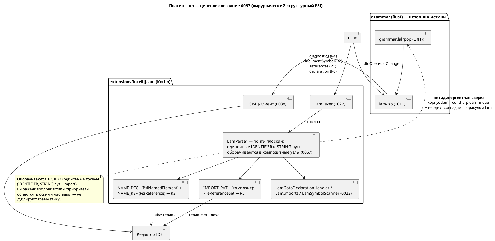

# ADR 0067: Rename и PsiReference для import в плагине IntelliJ

- **Status:** Accepted
- **Date:** 2026-07-23
- **Authors:** Архитектор + Системный аналитик
- **Related issues:** [Фича 0067](../features/0067-intellij-rename-psi-import.md);
  прямое продолжение [ADR 0040](0040-intellij-psi-parser.md) (гибрид Option C —
  тонкий структурный PSI + LSP4IJ) в части его контрольной точки «после закрытия
  0038»; опирается на [ADR 0023](0023-intellij-navigation-include.md) (плоский
  `LamParser`, навигация), [ADR 0022](0022-intellij-syntax-highlight.md) (лексер,
  автономность) и закрытую фичу [0038](../features/0038-intellij-semantic-tokens.md)
  (LSP4IJ вживую).

## Context

### Что решаем

Фича 0067 — **остаток отменённой 0040**: две из шести её возможностей, которые
путь LSP4IJ (0038) **не** закрывает даже принципиально:

- **R5** — настоящий `PsiReference` для путей `import`, то есть не только
  Ctrl+Click к файлу (это уже есть в 0023 через `GotoDeclarationHandler`), но и
  **автообновление строки-пути при переименовании/перемещении файла** средствами
  рефакторинга IDEA. LSP даёт лишь `documentLink` — переход, но не ссылку.
- **R3** — нативный **rename** имён Lam (`model`/`state`/`start`/`type`/`enum`/
  `cond`/`var`/`const`/`fn`/порт/алиас `import`) как штатный рефакторинг IDEA
  (диалог, превью, конфликты, Undo). LSP-`rename` через `WorkspaceEdit` не
  интегрируется с рефакторингом платформы в полном объёме.

Контрольная точка ADR 0040 (переоценить остаток R1/R3/R5 **после** закрытия 0038)
исполнена: 0038 закрыта, LSP4IJ вживую даёт R2 (структура файла), R4 (инспекции),
R6 (кросс-файловый переход) и частично R1 (`references`, если реализован в
сервере). Собственную, не заменимую LSP-путём ценность сохраняют **ровно R3 и
R5** — это и есть объём 0067. Заказчик принял решение **делать** фичу (а не
отменять её в пользу LSP), поэтому предложение об `ОТМЕНЕ` из ADR 0040 снимается.

### Проба, определяющая архитектуру (2026-07-23)

ADR 0040 утверждал (со слов итога 0023), что «`PsiReference` не привязывается к
листовым токенам» и потому R5/R3 требуют структурного PSI. Это утверждение
**никогда не проверялось пробой** (анализ 0040 это отмечает), а проект знает цену
выводам «по документам, а не зондом» (уроки 0025, 0038, 0055).

**Проведён зонд** (throwaway, удалён после замера; окружение сборки —
`./gradlew --offline test`, headless `BasePlatformTestCase`, baseline зелёный):
на строку-путь `import` навешивалась настоящая файловая ссылка через
`PsiReferenceContributor` + `PsiReferenceProvider` + `FileReferenceSet` на
**текущем плоском PSI** (листовые `LeafPsiElement`).

**Результат — ссылка НЕ привязывается:** `myFixture.getReferenceAtCaretPosition()`
на строке-пути вернул `null`. Причина установлена: `LeafPsiElement.getReferences()`
**не опрашивает** `ReferenceProvidersRegistry` — контрибьюторные ссылки платформа
запрашивает только у элементов, реализующих `ContributedReferenceHost`, либо у
**композитных** узлов (их `getReferences()` идёт через `SharedPsiElementImplUtil`,
который опрашивает реестр). Лист — ни то, ни другое.

**Вывод пробы (фундамент решения):** R5 требует, чтобы строка-путь `import` была
**композитным PSI-узлом**, а не листом. Аналитическое утверждение 0040
подтверждено **эмпирически**; при этом механизм `FileReferenceSet` +
`PsiReferenceProvider` признан рабочим — не хватает лишь узла-носителя. То же
относится к R3: `PsiNamedElement`/`PsiReference` невозможны на листьях.

### Что есть сегодня (по коду)

- Плоский `LamParser` (24 строки): все токены — листья под корнем `FILE`;
  `LamParserDefinition.createElement` — фактически не вызывается.
- `LamImports` (резолв пути `import` → файл), `LamGotoDeclarationHandler`
  (Ctrl+Click), `LamSymbolScanner` (токенная эвристика деклараций одного файла).
- 47 тестов 0022/0023 зелёные; плагин v0.5.0, платформа IC 2024.2.5, LSP4IJ
  0.20.1, JDK 21. Плагин собирается и тестируется **локально** headless
  (`./gradlew --offline test`), но **не в CI** (`ci.yml` — только `cargo`);
  `runIde` требует GUI.

## Decision Drivers

1. **Минимальная площадь структурного PSI.** Проба доказала: композитный узел
   нужен. Но чем меньше грамматики продублировано в Kotlin, тем ниже риск
   молчаливого расхождения с LALRPOP (прецедент 0025 — 8 дефектов при зелёных
   тестах). Дублировать только формы, несущие ссылки/имена.
2. **Единственный источник истины по языку** (наследие ADR 0040). Смысл —
   в `semantic/`; инспекции/структура/кросс-файловость берутся у `lam-lsp`, не
   переписываются на Kotlin.
3. **Обратная совместимость 0022/0023** (правило 11). 47 тестов обязаны остаться
   зелёными **без правки ожиданий**; `findElementAt` по-прежнему отдаёт лист с
   типом `IDENTIFIER`/`STRING`.
4. **Автономность** (наследие 0022/0023). R3/R5 работают офлайн, в Community, без
   `lam-lsp`; LSP лишь добавляет R2/R4/R6.
5. **Проверяемость.** Baseline зелёный headless (`./gradlew --offline test`
   работает — установлено пробой); максимум критериев кладём на
   `BasePlatformTestCase`, визуальный остаток (диалог rename, арбитраж) —
   в `runIde` (как 0022/0023).
6. **Язык не меняется.** Фича редакторная: синтаксис/семантика/версия языка не
   трогаются (правило 22 неприменим). Растёт версия **плагина** (минор —
   аддитивные возможности).

## Considered Options

### Option A. Полный декларативный структурный PSI (исходный план 0040-01)

Парсер строит узлы всех деклараций (`MODEL_DECL`/`STATE_DECL`/`TYPE_DECL`/…) с
дочерним `NAME_ID` и непрозрачными телами-блоками; восстановление после ошибки по
границам `;`/`}`/ключевым словам.

**Pros:**
- Задел под Structure View, свёртку кода, `FormattingModelBuilder` (путь 0039).
- Естественная область видимости имён (декларация как контейнер).

**Cons:**
- Существенная **вторая реализация грамматики** (границы блоков, вложенность
  составных состояний `M1 + M2`, порты, `enum`-тела) — площадь расхождения велика.
- Форма дерева меняется радикально → максимальный риск регресса 47 тестов
  (родительские цепочки `LamImports`/`LamSymbolScanner`).
- Объёмнее необходимого для R3/R5: ни rename, ни ссылка на файл **не требуют**
  знать границы тел.

### Option B. Хирургическое оборачивание одиночных токенов (рекомендуемая)

Парсер остаётся почти плоским, но **оборачивает в композитные узлы ровно те
токены, что несут ссылки/имена**:

- строку-путь `import` → узел `IMPORT_PATH` (носитель `FileReferenceSet` → R5);
- идентификатор-**декларацию** → `NAME_DECL`, реализующий `PsiNamedElement`;
- идентификатор-**использование** → `NAME_REF`, несущий `PsiReference`,
  резолвящийся к `NAME_DECL` в том же файле (R3, попутно нативный find usages R1).

Решение «декларация/использование/путь import» принимает парсер из **того же
токенного контекста**, что уже кодирует `LamSymbolScanner` (форма `kw <Id>`,
правило `Import`) — новой грамматики выражений/типов не появляется. Всё
остальное — плоские листья.

**Pros:**
- **Минимальная площадь дублирования** — только формы `kw <Id>` и путь `import`,
  ровно то, что уже дублирует сканер 0023, но теперь механически сверяется.
- **Round-trip тривиально сохранён:** композит группирует те же листья, текст не
  теряется по построению.
- Регресс-риск низкий: `findElementAt` отдаёт **лист** (тип `IDENTIFIER`/`STRING`
  прежний), меняется лишь родитель — обращения `sourceElement.node.elementType`
  в `LamGotoDeclarationHandler` не задеты; `LamImports.isImportPathElement`
  переносится с эвристики `prevSibling` на «мой родитель — `IMPORT_PATH`».
- `FileReferenceSet`/`PsiReferenceProvider` из пробы переиспользуются как есть.

**Cons:**
- Нет задела под Structure View/formatting (их даёт LSP; путь 0039 уже закрыт
  LSP4IJ).
- Область видимости имён задаётся не деревом, а резолвером `NAME_REF` (файловый
  скоуп) — приемлемо, т.к. кросс-файловость принята от 0038.
- Всё равно нужна антидивергентная сверка (узкая).

### Option C. Отказ от фичи (LSP-путь достаточен)

Признать, что `documentLink` (переход к файлу) и LSP-`rename` покрывают
потребность, и предложить `ОТМЕНУ` (правило контрольной точки ADR 0040).

**Pros:**
- Ноль второй реализации грамматики.

**Cons:**
- Не даёт **ни** rename-on-move для `import` (R5), **ни** нативного рефакторинга
  rename с превью/конфликтами (R3) — обе возможности принципиально вне LSP-пути.
- Противоречит решению заказчика делать фичу.

## Decision

Принимается **Option B — хирургическое оборачивание одиночных токенов**.

Обоснование: проба доказала необходимость композитного узла, но **не** полного
структурного дерева. R3 и R5 требуют носителей ссылок/имён — и только их. Option B
даёт эти носители минимальной ценой: продублирована лишь связка `kw <Id>` и путь
`import` (уже фактически продублированная сканером 0023), выражения/условия/типы/
приоритеты — инварианты `CLAUDE.md` — **не** трогаются и остаются плоскими
листьями. Это переводит главный риск (расхождение второй грамматики, 0025) из
«большой площади» в «узкую, механически сверяемую полосу».

Механизм по возможностям:

| # | Возможность | Реализация 0067 (Option B) |
|---|---|---|
| R5 | `PsiReference` для `import` | узел `IMPORT_PATH`; `LamImportReferenceProvider` (из пробы) строит `FileReferenceSet` (start = 1, после кавычки); `bindToElement`/`handleElementRename` дают rename-on-move; резолв пути — существующий `LamImports` |
| R3 | нативный rename | `NAME_DECL : PsiNamedElement` (`getName`/`setName`/`getNameIdentifier`); `NAME_REF : PsiReferenceBase` резолвится к `NAME_DECL` в файле; `NamesValidator` берёт ключевые слова из `LamLexer` (сторож `LamKeywordSyncTest`); конфликт → штатное предупреждение IDEA; область — файл |

Антидивергентная сверка (обязательна, аналог `format_tests.rs`): тест
`LamPsiCorpusTest` (`BasePlatformTestCase`) проходит по **всему** корпусу `.lam`
(`examples/**`, `grammar/tests/data/**`, включая `semantic/invalid/` как
синтаксически валидные) и требует (а) round-trip PSI байт-в-байт; (б) отсутствие
`PsiErrorElement` там, где `lamc`-оракул разобрал успешно. Оракул —
версионируемый артефакт `psi-oracle.txt`, порождаемый прогоном `lamc` по корпусу;
его отсутствие/устаревание **валит** тест (не пропуск). При Option B тест почти
тривиален (структура не разбирается), но остаётся сторожем от регресса при любом
будущем углублении PSI.

Арбитраж с LSP4IJ (наследие 0040-05, правило «PSI молчит там, где отвечает LSP»):
R3/R5 (rename, ссылки, find usages) остаются за PSI **даже** при живой
LSP-сессии; навигация к декларации и диагностика уступают LSP. Мягкая деградация:
без `lam-lsp` работают подсветка, навигация, rename, find usages в файле; гаснут
только R2/R4/R6.

Option A отвергается как несущий тот же риск, что и отменённый Option A ADR 0040,
без выгоды для R3/R5. Option C отвергается решением заказчика делать фичу.

## Consequences

### Положительные

- **R5 и R3 достижимы минимальной структурной правкой**, доказанной пробой, без
  переписывания парсера на полноценное дерево.
- Семантика Lam остаётся в одном месте; инспекции/структура/кросс-файловость —
  из `lam-lsp` (0038), а не kotlin-имитация.
- Площадь дублирования грамматики сведена к `kw <Id>` и пути `import`; сверяется
  `LamPsiCorpusTest`.
- Логика пробы (`FileReferenceSet` + провайдер) переиспользуется в разработке —
  задел не выброшен.

### Отрицательные / Action items

- **Регресс-риск 47 тестов 0022/0023** — держится требованием «зелёные без правки
  ожиданий»; перенос `LamImports`/`LamSymbolScanner`/`LamGotoDeclarationHandler`
  на новую форму дерева — часть разработки (не менять наблюдаемое поведение).
- **Оракул `psi-oracle.txt`** — обязательный версионируемый артефакт; порождение
  прогоном `lamc` (скрипт), рассинхрон состава → провал теста.
- **Проверяемость ограничена:** диалог rename, превью, конфликт и арбитраж
  PSI↔LSP проверяются визуально (`runIde`) — остаются в остаточных пунктах, как
  A11 у 0022/0023; плагин не собирается в CI.
- **Запись в `CLAUDE.md` при закрытии** (по образцу форматтера 0024): «добавляешь
  узел, несущий имя/ссылку, — оборачивай его в композит и покрой
  `LamPsiCorpusTest`».
- Версия плагина растёт (минор, аддитивно); версия языка — нет.

### Декомпозиция (стадия разработки)

- **0067-01** — R5: узел `IMPORT_PATH`, `LamImportReferenceContributor`/
  `Provider` (`FileReferenceSet`), перенос `LamImports.isImportPathElement` на
  родителя; тесты `LamImportPsiReferenceTest` (resolve + rename-on-move +
  контрпример formula-строки).
- **0067-02** — R3: `NAME_DECL`/`NAME_REF`, `PsiNamedElement`/`PsiReferenceBase`,
  `NamesValidator`; тесты `LamRenameTest` (все виды имён, комментарии/строки не
  задеты, Undo, конфликт).
- **0067-03** — антидивергенция + регресс: `LamPsiCorpusTest`, скрипт-оракул,
  зелёные 47 тестов 0022/0023, арбитраж с LSP4IJ.

## Acceptance criteria

1. **R5:** во всех формах (`import "P";`, `import "P" as X;`, `import * as X from
   "P";`, `import { A as C } from "P";`) путь несёт `PsiReference`:
   `reference.resolve()` → `PsiFile`; `renameElement(psiFile, "T.lam")` обновляет
   путь в `.lam`; битый путь → `resolve()==null` без исключений; строка в
   `formula` ссылки не несёт.
2. **R3:** `renameElementAtCaret` переименовывает декларацию и её использования в
   файле для всех видов имён; идентичные подстроки в комментариях/строках не
   задеты; Undo возвращает текст байт-в-байт; конфликт имён — штатное
   предупреждение IDEA.
3. **Антидивергенция:** `LamPsiCorpusTest` зелёный по всему корпусу (round-trip +
   вердикт == оракул); отсутствие оракула валит тест.
4. **Регресс:** `./gradlew --offline test` зелёный; все тесты 0022/0023 проходят
   без изменения ожиданий; Plugin Verifier — Compatible на текущем спреде IC;
   `until-build` пуст.
5. **R2/R4/R6** закрыты фичей 0038 — в 0067 не реализуются (ссылка на 0038).
6. Версия языка не поднята; версия плагина — минорный бамп.
