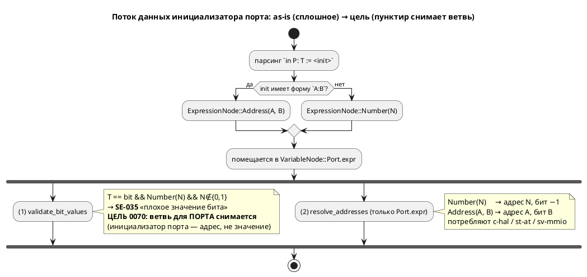

# ADR 0070: Инициализатор порта — это адрес, а не значение (SE-035 снимается с портов)

- **Status:** Accepted
- **Date:** 2026-07-20
- **Authors:** Дизайнер языка + Архитектор
- **Related issues:** [Фича 0070](../features/0070-port-initializer-address-role.md); опирается на модель адреса [ADR 0020](./0020-port-address-decl.md); смежно [фикс 0020-01](../fixes/0020-01-port-bit-out-of-range.md)/[фича 0098](../features/0098-port-bit-range-safe-hal.md) (диапазон бита); вскрыто при закрытой [0042](../features/0042-address-defines.md)

## Context

`in BTN: bit := 0x00100000;` даёт **`SE-035`** «переменная `BTN` имеет тип bit, но
инициализирована значением 1048576 (допустимые: 0 или 1)». Автор писал **адрес**,
а диагностика говорит про **значение**.

### Механизм (снят зондом + разведкой кода, 2026-07-20)

Инициализатор порта кладётся в поле `VariableNode::Port.expr` — **то же** поле,
что у `Simple`/`Const` (`semantic/tree.rs:459`). Это поле читают **два независимых
потребителя**:

1. **Проверка значения бита** — `validate/enums.rs:17` `check_bit_variable_value`:
   если тип `bit` и `expr == ExpressionNode::Number(n)` при `n∉{0,1}` → `SE-035`.
   Матч по `Number` группирует `Simple|Const|Port` **одинаково** (`enums.rs:50`) —
   **порт не отличается**. Выполняется для **всех** целей в `validate_model`.
2. **Разрешение адреса** — `address_map/resolve.rs:186` читает `expr` **только** у
   `VariableNode::Port` и вычисляет из него inline-адрес (приоритет inline <
   `address` < карта, ADR 0020). Потребляют лишь `c-hal`/`st-at`/`sv-mmio`.

Развилка — в **парсинге**: `0x100` → `ExpressionNode::Number` (ловится SE-035);
`0x100:3` → `ExpressionNode::Address(addr,bit)` (SE-035 матчит только `Number` →
проходит). Поэтому рабочая форма всюду — `адрес:бит` (весь `stacker.lam`).

### Замер (зонд 2026-07-20)

| Форма (порт) | Сейчас |
|---|---|
| `bit := 0x100:0` | ✅ адрес 0x100, бит 0 |
| `bit := 0x100` (голый) | ❌ **SE-035** «значением 256» |
| `u8 := 0x100` (голый) | ✅ принят (SE-035 только для `bit`) — **асимметрия** |
| `bit := 1` (голый) | ✅ принят, но c-hal даёт **адрес 0x1, бит −1** — не «значение 1» |

Два следствия замера: (1) **асимметрия** — `u8`-порт голый адрес принимает,
`bit`-порт нет; (2) **ловушка** — на `bit`-порту `:= 0`/`:= 1` **молча** суть
адреса 0/1, а `:= 2…`/`:= 0xADDR` отвергаются как «плохой бит»; черта 0/1 к
адресу отношения не имеет. В корпусе `out ready: bit := 0;` (`regulator`,
`pid_regulator`, `float_regulator`) читается человеком как «начальное значение», а
компилятором — как «адрес 0».

## Decision Drivers

1. **Семантика поля уже определена ADR 0020:** инициализатор порта — это **адрес**
   (комментарий поля `mod.rs:883` — «Адрес порта»). Проверять его как **значение**
   типа — категориальная ошибка.
2. **Единообразие типов.** `u8 := 0xADDR` работает, `bit := 0xADDR` — нет. Один и
   тот же смысл (адрес) не должен зависеть от типа порта.
3. **Обратная совместимость и корпус.** Правка не должна ломать `stacker` (форма
   `addr:бит`) и три регулятора (`bit := 0`).
4. **Не расширять объём.** Позиция бита у bit-порта (голый адрес → бит −1) —
   смежная проблема (0098), решать её здесь — раздувание.

## Considered Options

### Option A. Инициализатор порта — адрес; `SE-035` снимается с портов

`check_bit_variable_value` перестаёт применяться к `VariableNode::Port` (проверка
остаётся для `Simple`/`Const`). `bit := 0xADDR` валиден (адрес, бит −1) — как
`u8 := 0xADDR`.

**Pros:**
- Устраняет **и** асимметрию u8/bit, **и** ловушку «0/1 — молча адрес».
- **Минимально** (один матч-арм в `enums.rs`), принципиально (поле = адрес).
- **Обратно совместимо** (правило 11): множество принятых программ только
  расширяется; `bit := 0/1` — прежний смысл (адрес 0/1); `addr:бит` не тронут;
  корпус (`stacker`, 3 регулятора) компилируется как прежде.

**Cons:**
- `bit := 0xADDR` без бита даёт бит −1 — для однобитного порта это неполно, но
  диагностика этого — отдельный кандидат (не хуже сегодняшнего `bit := 1`).

### Option B. Адрес + требовать позицию бита у bit-порта

Снять `SE-035`, но завести новую диагностику: у `bit`-порта адрес **обязан** иметь
позицию (`0xADDR:бит`).

**Pros:**
- Корректнее для MMIO: однобитный порт нуждается в бите.

**Cons:**
- **Ломает 3 примера корпуса** (`out ready: bit := 0;` → потребуют `:0` либо
  станут без адреса) — правка корпуса и рябь в `examples_scenario_tests`.
- Больше объём; смешивает 0070 с темой позиции бита (0098).

### Option C. Только переформулировать текст `SE-035` на портах

Оставить отказ `bit := 0xADDR`, но на порту писать «для адреса используйте
`0xADDR:бит`».

**Pros:**
- Наименьший объём.

**Cons:**
- **Не чинит** ни асимметрию u8/bit, ни ловушку «0/1 — молча адрес» — только
  документирует ошибку. Категориальная ошибка (значение vs адрес) остаётся.

## Decision

Принимается **Option A** (решение заказчика 2026-07-20). Инициализатор порта
семантически — **адрес** (ADR 0020), поэтому проверка его как **значения бита**
(`SE-035`) с портов снимается. Это устраняет асимметрию u8/bit и ловушку «0/1
молча адрес» минимальной правкой, ничего не ломая в корпусе. Позиция бита у
bit-порта (голый адрес → бит −1) — **отдельный кандидат**, здесь не решается
(driver 4).

## Consequences

### Положительные

- `bit := 0xADDR` валиден на всех целях (как `u8 := 0xADDR`); категориальная
  ошибка «адрес проверяется как значение» устранена.
- Корпус не тронут; `addr:бит` и оператор `address` не тронуты.

### Отрицательные / Action items

- **0070-01:** в `validate/enums.rs::validate_bit_values` вывести
  `VariableNode::Port` из-под `check_bit_variable_value` (проверка остаётся для
  `Simple`/`Const`). Тесты — примеры/контрпримеры (правило 16).
- **Кандидат (вынести):** голый адрес на `bit`-порту даёт бит −1 (нет позиции) —
  завести диагностику/умолчание отдельной фичей (смежно 0098). Ловушка
  «`bit := 0/1` — молча адрес, а не значение» — та же тема.
- **Версия языка НЕ поднимается** (обоснование — в анализе): снятие ошибочно
  применяемой диагностики, а не смена семантики порта (та задана 0020);
  прецедент — 0098 (добавила `SE-060` без подъёма версии).

### Acceptance criteria

1. `in BTN: bit := 0x00100000;` компилируется на **всех** целях (нет `SE-035`);
   у `c-hal` адрес разрешается (бит −1).
2. Контрпример: `var flag: bit := 5;` (**не** порт) — по-прежнему `SE-035`.
3. `bit := 0`/`bit := 1` на порту — валидны (адрес 0/1), как прежде.
4. Форма `addr:бит` и оператор `address` — вывод байт-в-байт прежний.
5. Корпус (`stacker`, 3 регулятора, весь `examples/`) — `precheck.sh` зелёный,
   вывод генераторов не изменён.
