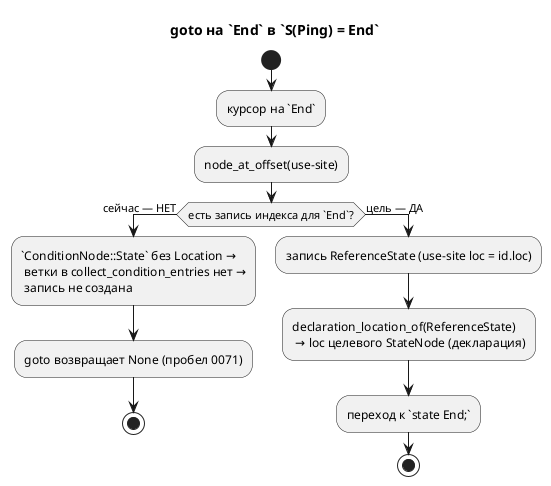

# ADR 0071: Переход на имя состояния в условии — `ConditionNode::State` несёт use-site

- **Status:** Accepted
- **Date:** 2026-07-20
- **Authors:** Архитектор + Дизайнер LSP
- **Related issues:** [Фича 0071](../features/0071-lsp-goto-state-name.md); **прямое продолжение** [фичи 0056](../features/0056-lsp-goto-exact-file.md) (задача [0056-04](../development/0056-04-model-reference-location.md), её граница строки 98–100)

## Context

`goto declaration` на имени состояния в условии `ref Stop: S(Ping) = End;` (курсор
на `End`) **не срабатывает**. Фича 0056 починила ровно этот класс для ссылок на
**модель** (`ConditionNode::Model`/`Extend::Model` получили use-site `Location`,
заведён вид узла `ReferenceModel`), но явно оставила границей ссылку на
**состояние** (0056-04, строки 98–100): «`ConditionNode::State(Rc)` позиции
по-прежнему не несёт».

### Механизм пробела (разведка кода 2026-07-20)

`End` в `S(Ping) = End` — плоский идентификатор, разрешаемый в
`semantic/condition.rs:185` (`ast::Condition::Variable(id)`) по порядку поиска
var → cond → **model** → **state** → enum-variant. Соседние ветки несут use-site
`id.loc`, а ветка состояния — **нет**:

```rust
} else if let Some(model) = model.borrow().search_model(&name) {
    return Ok(ConditionNode::Model(model.clone(), id.loc));   // 0056: позиция есть
} else if let Some(state) = model.borrow().search_state(&name) {
    return Ok(ConditionNode::State(state.clone()));           // 0071: id.loc ОТБРОШЕН
```

Следствия (полный аналог 0056):
- `ConditionNode::State(Rc<RefCell<StateNode>>)` (`mod.rs:1320`) — **без**
  `Location` (у `Model`/`Variable` — есть).
- В `SemanticIndex::collect_condition_entries` (`index.rs:587`) ветки для
  `ConditionNode::State` **нет** — узел падает в `_ => {}` (`index.rs:670`), в
  индекс не попадает, курсор не находит ничего.
- Нет вида узла `SemanticNodeKind::ReferenceState` и арма
  `declaration_location_of` (`lsp/goto.rs:159`).

**Отличие от 0056-04 (упрощение):** там позиция ссылки на модель **уничтожалась**
при разрешении через промежуточный `ExpressionNode`, и пришлось разворачивать АСД
напрямую. Здесь `id.loc` **уже под рукой** в точке создания — протаскивать ничего
не нужно.



## Decision Drivers

1. **Прецедент задан 0056.** Приём (второе поле-позиция, ручной `PartialEq`,
   `Reference*`-вид узла, арм goto) уже применён к модели; повторение — наименьший
   риск и наибольшая согласованность.
2. **Позиция обязана быть невидимой для равенства.** `ConditionNode` сравнивается
   транзитивно через `ModelNode::PartialEq` (`mod.rs:286`); use-site в равенстве
   расщепил бы две ссылки на одно состояние в разные узлы → поехал бы кодоген
   (урок 0056-04, п. 2).
3. **Язык не меняется.** Правка — LSP/индекс + внутреннее поле АСД, которое
   генераторы игнорируют. Вывод целей обязан остаться байт-в-байт.

## Considered Options

### Option A. Use-site `Location` на `ConditionNode::State` (аналог 0056)

`State(Rc)` → `State(Rc, Location)`; `condition.rs:195` передаёт `id.loc`; ручной
`PartialEq` игнорирует позицию (`State(a, _)`); новый `SemanticNodeKind::
ReferenceState` + ветка `collect_condition_entries` + арм `declaration_location_of`
(зеркало резолвера состояния `goto.rs:167-172`).

**Pros:**
- Согласовано с 0056 (один приём на модель и состояние).
- Позиция уже доступна — правка меньше, чем у 0056-04.
- Кодоген неизменен (поле игнорируется `PartialEq` и генераторами).

**Cons:**
- Кортеж `ConditionNode::State` растёт → ~10 match-мест правятся (компилятор
  заставит — безопасно).

### Option B. Отдельное хранилище позиций use-site (карта `Rc → Location`)

Не менять вариант, вести побочную карту позиций.

**Pros:**
- `ConditionNode::State` не трогается.

**Cons:**
- **Против прецедента 0056** (тот выбрал поле в узле, отвергнув «сырое АСД рядом»).
- Карта по `Rc`-адресу хрупка (клонирование, перестроение); два use-site одного
  состояния неразличимы.

### Option C. Переиспользовать вид узла `Reference` (ref-ребро) для состояния-в-условии

Эмитить существующий `SemanticNodeKind::Reference` вместо нового `ReferenceState`.

**Pros:**
- Ни нового вида узла, ни арма goto (резолвер `Reference` уже ищет состояние).

**Cons:**
- Смешивает **два разных use-site** (цель `ref`-перехода и имя в условии) под
  одним видом — 0056 сознательно развёл `Model`/`ReferenceModel`; ломает
  симметрию и затрудняет будущую диагностику/подсветку по виду.

## Decision

Принимается **Option A** — прямое повторение приёма 0056 для состояния. Позиция
доступна в точке создания (`id.loc`), поэтому правка сводится к трём ходам
(поле + `PartialEq` + передача `id.loc`) плюс индекс/goto-ветки, зеркальные
`ReferenceModel`. Отдельный вид `ReferenceState` (не переиспользование
`Reference`) — ради симметрии с 0056 (use-site ≠ ребро перехода).

## Consequences

### Положительные

- goto на имени состояния в условии (`S(Ping) = End`, курсор на `End`) открывает
  декларацию состояния — впервые.
- Приём един для ссылок на модель и состояние; будущая ссылка (кандидат —
  `ConditionNode::State` в других формах) идёт тем же путём.

### Отрицательные / Action items

- **0071-01:** поле `Location` на `ConditionNode::State`; ручной `PartialEq`
  игнорирует его; `condition.rs:195` (+ `rebuild_condition`) передаёт `id.loc`;
  обновить ~10 match-мест (генераторы/валидатор/lower_float); `ReferenceState` +
  ветка `collect_condition_entries` + арм `declaration_location_of`; тест в
  `lsp_tests.rs`/`lsp_goto_tests.rs`.
- **Версия языка НЕ поднимается** — синтаксис и семантика языка не меняются
  (внутреннее поле АСД + LSP); вывод генераторов байт-в-байт неизменен.

### Acceptance criteria

1. goto на `End` в `ref Stop: S(Ping) = End;` возвращает диапазон декларации
   состояния (зонд захватывает фактическую строку — «сперва зонд»).
2. Существующие goto (модель `S(Helper)`, `ref`-ребро, переменная условия) — без
   регресса.
3. Вывод генераторов на корпусе **байт-в-байт неизменен** (гейт детерминизма
   0048 + ручной `PartialEq`, игнорирующий позицию).
4. `precheck.sh` зелёный, включая тесты под `--features lsp`.
