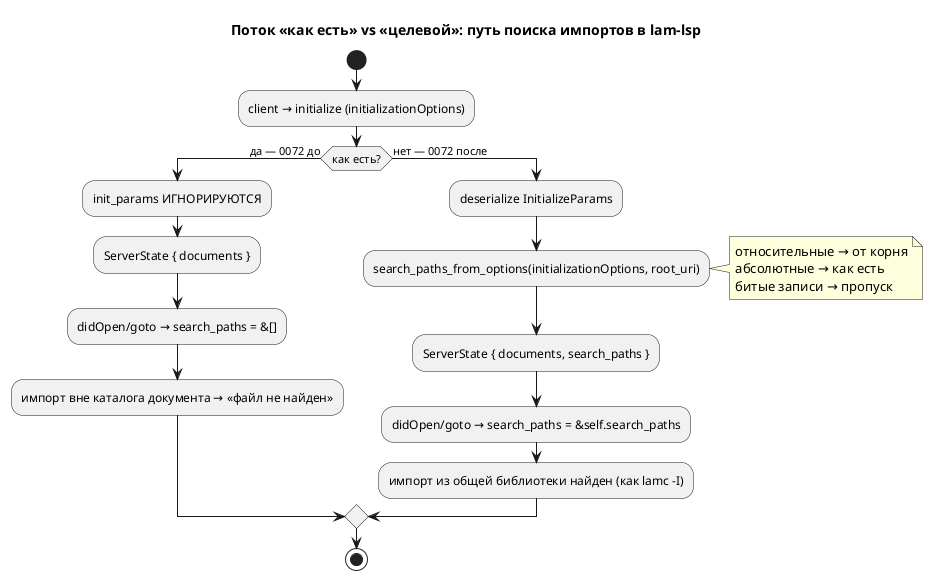

# ADR 0072: LSP не читает initializationOptions (пути поиска импортов)

- **Status:** Accepted
- **Date:** 2026-07-21
- **Authors:** Архитектор + Аналитик
- **Related issues:** [Фича 0072](../features/0072-lsp-initialization-options.md); продолжает [0055](../features/0055-lsp-multifile.md) (неявный путь = каталог документа), [0056](../features/0056-lsp-goto-exact-file.md) (goto по путям).

## Context

`bin/lam_lsp.rs` при инициализации берёт пару `(init_id, _init_params)` и параметры
клиента **игнорирует** (`initialize_start()`). Во все точки ядра, разрешающие
импорты, сервер передаёт **пустой** список путей поиска:

- `collect_diagnostics_at(&path, &text, &[])` — `didOpen`/`didChange`;
- `goto_declaration_at(&path, text, position, &[])` — переход к декларации.

Обе функции ядра уже принимают `search_paths: &[String]` (это аналог `-I` у
`lamc`), но сервер туда нечего не кладёт. Работает **только** неявный путь —
каталог открытого документа (фича 0055).

**Следствие (боль пользователя).** Модель, чьи импорты лежат в **общей
библиотеке вне каталога документа**, в редакторе не собирается: `lam-lsp` даёт
«файл не найден», хотя `lamc -I lib` ту же модель компилирует. Аналога `-I` в
редакторе задать **нечем** — вскрыто закрытой 0055 (A3), задокументировано в
README (⚠ «Аналога `-I` в редакторе пока нет»).

Канал для настройки в LSP штатный — `InitializeParams.initializationOptions`:
клиент (Zed и др.) передаёт туда произвольный JSON из своих настроек. Сервер его
просто не читает.



## Decision Drivers

1. **Паритет с `lamc -I`.** Редактор обязан разрешать импорты так же, как CLI, —
   иначе диагностика редактора расходится со сборкой (ложные «файл не найден»).
2. **Тестируемость.** Бинарник `lam_lsp.rs` юнит-тестами не покрыть; логика
   разбора настроек должна жить в библиотеке `grammar::lsp` (прецеденты:
   `PortNames::from_model` 0079, `split_include_dirs` 0043 — «вынос в библиотеку
   ради тестируемости»).
3. **Устойчивость к плохому конфигу.** Некорректная запись в `initializationOptions`
   (не массив, не строка) **не должна ронять сервер** — молча пропускается.
4. **Аддитивность (правило 11).** Где импорт уже разрешался (каталог документа),
   он обязан разрешаться и после: новые пути **добавляются**, поведение по
   умолчанию (пустой `searchPaths`) байт-в-байт прежнее.

## Considered Options

### Option A. Читать `searchPaths` из `initializationOptions`, логику — в библиотеку

Новая `grammar::lsp::search_paths_from_options(options: Option<&Value>, root:
Option<&str>) -> Vec<String>`: читает `options["searchPaths"]` как массив строк;
относительный путь разрешает от корня рабочей области (`root_uri`), абсолютный —
как есть; не-строки и не-массив пропускает. Бинарник десериализует
`InitializeParams`, зовёт функцию, кладёт результат в `ServerState.search_paths`,
прокидывает в оба потребителя.

**Pros:**
- Точный аналог `-I`; ядро уже готово принять пути.
- Логика чистая и юнит-тестируемая (библиотека), бинарник — тонкая обвязка.
- Устойчивость к плохому конфигу выражается прямо в функции.
- Относительные пути от корня рабочей области предсказуемы (CWD сервера редактор
  не гарантирует).

**Cons:**
- Аддитивный публичный API → минорный бамп крейта `grammar`.
- Нужно выбрать имя ключа и зафиксировать его контрактом (README).

### Option B. Разобрать всё в бинарнике, без библиотечной функции

**Pros:**
- Без бампа публичного API.

**Cons:**
- Разбор не покрыть юнит-тестами (бинарник); нарушает прецедент проекта
  «логика — в библиотеку ради тестируемости».
- Устойчивость к плохому конфигу проверить нечем.

### Option C. Читать пути из переменной окружения / файла конфигурации рядом с проектом

**Pros:**
- Не зависит от возможностей клиента.

**Cons:**
- Дублирует штатный канал LSP (`initializationOptions`), заводит **свой** формат
  конфигурации — источник дрейфа с `lamc -I`.
- Zed и прочие клиенты уже умеют передавать `initializationOptions` из настроек.

## Decision

Принимается **Option A**. Штатный канал LSP + библиотечная функция даёт паритет с
`-I`, тестируемость и устойчивость при минимальной правке. Контракт:

```json
{
  "lsp": {
    "lam-lsp": {
      "initialization_options": {
        "searchPaths": ["lib", "../shared"]
      }
    }
  }
}
```

- Ключ — **`searchPaths`** (camelCase, конвенция JSON LSP), массив строк.
- **Относительный** путь разрешается от **корня рабочей области** (`root_uri`
  из `InitializeParams`); при отсутствии корня — остаётся как есть (CWD сервера,
  как `-I` у `lamc`).
- **Абсолютный** путь — как есть.
- **Порядок** сохраняется (как `-I`: одноимённый файл из `searchPaths`
  перекрывает локальный — поведение ядра 0055, не меняется).
- Битая запись (не массив / элемент не строка) — молча пропускается; отсутствие
  `initializationOptions` или ключа → пустой список (прежнее поведение).

Язык **не меняется** — это интеграция редактора и конфигурация инструмента, не
синтаксис/семантика. Версия языка `0.3.0` без изменений. Крейт `grammar` —
минорный бамп `0.7.0 → 0.8.0` (аддитивный публичный API `search_paths_from_options`).

## Consequences

### Положительные

- `lam-lsp` разрешает импорты из общей библиотеки, как `lamc -I lib` — ложные
  «файл не найден» в редакторе устранены.
- Разбор настроек юнит-тестируем; бинарник остаётся тонким.
- Плохой конфиг сервер не роняет.

### Отрицательные / Action items

- Публичный контракт ключа `searchPaths` — задокументировать в README (раздел
  «Настройка в Zed») и снять ⚠-оговорку «Аналога `-I` в редакторе пока нет».
- Относительность путей завязана на `root_uri`; single-file без рабочей области
  использует CWD сервера — документировать.
- Ручная проверка в редакторе не автоматизируется (Actions заблокирован по
  биллингу; прецедент 0090) — закрытие по локальным тестам + инспекции обвязки.

### Acceptance criteria

1. `grammar::lsp::search_paths_from_options` читает массив `searchPaths`,
   разрешает относительные от переданного корня, абсолютные оставляет, битые
   записи пропускает — покрыто юнит-тестами.
2. `lam_lsp.rs` десериализует `InitializeParams`, зовёт функцию, хранит пути в
   `ServerState` и передаёт их в `collect_diagnostics_at` и `goto_declaration_at`.
3. Отсутствие `initializationOptions` даёт **прежнее** поведение (пустой список)
   — регрессия 0055/0056 не задета.
4. README описывает контракт `searchPaths`; ⚠-оговорка снята.
5. `./scripts/precheck.sh` зелёный (в т.ч. тесты под `--features lsp`).
