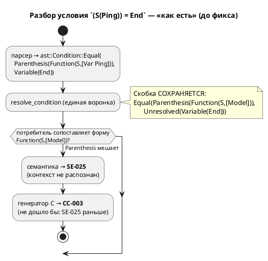
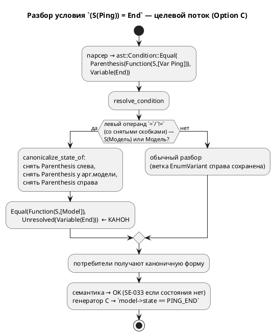

# ADR 0074: Скобочная форма `S(Модель) = Состояние` — канонизация в единой воронке разбора условий

- **Status:** Accepted
- **Date:** 2026-07-20
- **Authors:** Архитектор + Аналитик + Дизайнер языка
- **Related issues:** [Фича 0074](../features/0074-parenthesised-state-of.md); наследует находку [фичи 0047](../features/0047-c-state-of-model.md); опирается на инвариант `resolve_state_references` (`CLAUDE.md`).

## Context

Встроенная `S(Модель)` даёт **текущее состояние** модели; сравнение
`S(Ping) = End` — штатная конструкция языка (фича 0047, цель `c`). Но **скобки
вокруг операндов** ломают её:

| Форма | Результат (до фикса) |
|---|---|
| `S(Ping) = End` | ✅ работает |
| `(S(Ping)) = End` | ❌ `SE-025` «Неразрешённое условие» |
| `S((Ping)) = End` | ❌ `SE-025` |
| `S(Ping) = (End)` | ❌ `SE-025` (найдено пробой 0074 — карточка называла лишь первые две) |

Причина — распознавание паттерна `S(Модель) = Состояние` идёт **сопоставлением
формы** сразу в нескольких потребителях, и обёртка `ConditionNode::Parenthesis`
рвёт сопоставление:

- **семантика** (`validate/common.rs`): спецслучай ищет `Function(S, [Model])`
  как контекст правого операнда; при `Parenthesis(Function(…))` контекст не
  совпадает → имя состояния остаётся неразрешённым → `SE-025`;
- **генератор C** (`c_expr/condition.rs::state_of_model`): та же форма ищется
  для эмиссии `model->state == …`; при обёртке `Parenthesis` не совпадает →
  ушло бы в `CC-003`.

Ключевой факт архитектуры (проба 0074): **все** потребители получают
`ConditionNode` из **одной** функции — `semantic::condition::resolve_condition`.
Ref-условия рёбер разрешаются ею на проходе 6 (`reference.rs`), именованные
`cond` — через `extract_conditions`, LTL/Guard — через `tree.rs`. То есть точка,
где скобочная обёртка рождается в семантическом дереве, **единственна**.

## Decision Drivers

1. **Единство поведения между целями.** Скобки должны быть прозрачны везде,
   где конструкция вообще поддерживается, а не почини́ться в одной цели.
2. **Неизменность вывода корпуса (детерминизм 0048).** Правка не имеет права
   сдвинуть ни байта в `examples/generated/` — иначе дифф перестанет нести смысл.
3. **Не сломать инвариант `resolve_state_references`** (`CLAUDE.md`): имя
   состояния-аргумента обязано остаться `Unresolved` — его разрешает потребитель
   в области видимости модели-аргумента.
4. **Минимум точек правки** — чтобы новый потребитель `ConditionNode` не забыл
   развернуть скобки и не воскресил дефект.

## Considered Options

### Option A. Разворачивать скобки у каждого потребителя (семантика + все генераторы + симулятор)

**Pros:**
- Прямое следование тексту карточки («лечение в семантике… разворачивать
  `Parenthesis` перед сопоставлением контекста»).

**Cons:**
- N точек правки (validate, C, rust, st, sv, plantuml, симулятор) — ровно тот
  класс дублирования, что дал расхождения в фичах 0060/0050. Новый потребитель
  забудет развернуть → дефект вернётся молча (драйвер 4).
- Часть правок — мёртвый код: цели `rust`/`st`/`sv` паттерн `S(…)` **не
  поддерживают вовсе** (RS-020/ST-011/SV-002) независимо от скобок.

### Option B. Глобально снимать все `Parenthesis` в `resolve_condition`

**Pros:**
- Одна точка; скобки исчезают из семантического дерева совсем.

**Cons:**
- **Ломает драйвер 2 и семантику вывода.** Генераторы печатают `Parenthesis`
  как `(…)`, сохраняя группировку операндов; в цели `rust` приоритеты иначе
  расходятся с C (`CLAUDE.md`). Снятие скобок у `(a + b) * c` изменит вывод и
  может изменить смысл порождённого кода. Недопустимо.

### Option C. Канонизировать **только паттерн `S(Модель)`** в `resolve_condition`

Снять прозрачные скобки в трёх позициях паттерна — и только в них: (1) вокруг
всего `S(…)` слева от `=`/`!=`; (2) вокруг модели-аргумента внутри `S(…)`;
(3) вокруг имени состояния справа. Все прочие скобки сохраняются.

**Pros:**
- **Одна точка** (единая воронка) чинит семантику, **все** генераторы и
  симулятор разом (драйвер 1, 4).
- Вывод корпуса **байт-в-байт неизменен**: существующие формы бесскобочны, снятие
  для них тождественно (драйвер 2, доказано пробой).
- Инвариант `resolve_state_references` цел: правая часть остаётся `Unresolved`
  (драйвер 3) — канонизация лишь снимает обёртку, разрешение по-прежнему у
  потребителя.
- Скобки паттерна не несут ни группировки, ни вывода (левая часть эмитится как
  `model->state == X`), поэтому их снятие ничего не теряет.

**Cons:**
- Требует предиката «это `S(Модель)`?», дублирующего распознавание генератора C
  (`state_of_model`). Мал и локализован; расхождение маловероятно (обе проверки —
  `Builtin("S")` либо `Model`).

## Decision

Принимается **Option C**. Канонизация паттерна `S(Модель) = Состояние` живёт в
`semantic::condition::resolve_condition` — единственной воронке, через которую
условие любого потребителя проходит ровно один раз. Скобки снимаются точечно
(три позиции паттерна), всё остальное дерево условий сохраняется дословно.

Текст карточки «лечение в семантике» **уточнён**: не «у сопоставителя
контекста в `validate.rs`», а **раньше** — при построении `ConditionNode`. Так
чинится не только `validate` (`SE-025`), но и генератор C (который иначе дал бы
`CC-003`), одним изменением. Спецслучай `validate/common.rs` **не трогается**:
он теперь получает уже каноничную форму.

## Consequences

### Положительные

- Скобки стали **полностью прозрачны** в паттерне `S(…)`: все формы дают вывод,
  **байт-в-байт равный** каноничной `S(Ping) = End` (доказано на цели `c`).
- Правка аддитивна: ни один существующий пример не изменил вывод.
- Побочно чинится и **краткая форма** `(Ping) = End` (модель как условие в
  скобках) — тем же предикатом.

### Отрицательные / Action items

- Сторожевой тест `parenthesised_state_of_is_rejected_by_semantics`
  (`c_state_ref_tests.rs`) **инвертируется**: он фиксировал границу «семантика
  отвергает» и обязан упасть — заменяется на положительный (формы дают тот же C).
- Предикат `is_state_of` дублирует распознавание `state_of_model` генератора C.
  Задокументировано перекрёстной ссылкой; сведение в общий слой — не в объёме
  (кандидат, если появится третий распознаватель).
- Цели `rust`/`st`/`sv` паттерн `S(…)` по-прежнему **не поддерживают** — это
  предсуществующее ограничение, не относящееся к скобкам; фикс лишь уравнял
  скобочные формы с бесскобочной (обе одинаково не транслируются).

### Acceptance criteria

1. `(S(Ping)) = End`, `S((Ping)) = End`, `S(Ping) = (End)` и произвольная
   вложенность скобок компилируются целью `c` в C, **байт-в-байт равный** выводу
   `S(Ping) = End`; порождённый C компилируется `cc`.
2. `!=` ведёт себя так же, как `=` (`S(Ping) != End` и его скобочные формы).
3. `(S(Ping)) = NoSuch` даёт **`SE-033`** (состояния нет), а не `SE-025`.
4. Вывод всего корпуса `examples/generated/` **байт-в-байт неизменен**
   (гейт детерминизма `precheck.sh` зелёный).
5. Инвариант `resolve_state_references` цел: тест
   `reference_model_compiles_and_translates_state_ref` зелёный.
6. Версия языка **не** поднимается: снятие ошибочной диагностики на форме,
   которую язык и так подразумевает валидной (прецедент 0070).
