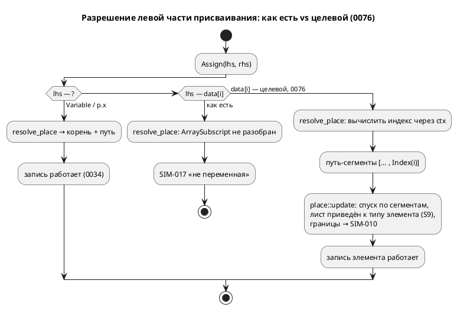

# ADR 0076: Симулятор не исполняет массивы вовсе

- **Status:** Accepted
- **Date:** 2026-07-21
- **Authors:** Архитектор + Аналитик
- **Related issues:** [Фича 0076](../features/0076-sim-arrays.md); смежна [0078](../features/0078-bit-array-semantics.md) (семантика `[bit;N]`); продолжает [0034](../features/0034-sim-struct-types.md) (place/update структур), [0025](../features/0025-simulator-expression-eval.md) (семантика вычислений).

## Context

Симулятор не исполняет массивы, хотя `Value::Array(Vec<Value>)` в ядре **уже
есть** и **чтение** элемента (`data[i]`) работает. Два пробела:

1. **Запись** `data[i] := 7;` → **`SIM-017`** «присваивание не в переменную …».
   `resolve_place` (`unit/statement.rs`) раскладывает левую часть в корень + путь
   **имён полей** (`Vec<String>`) и не разбирает `ArraySubscript`; `place::update`
   (`eval/place.rs`) ходит только по строковому пути полей — индекса не знает.
2. **Скалярный инициализатор** `var data: [u8;4] := 0;` кладёт в переменную
   **скаляр** `Number(0)` (в `coerce_initial` нет ветки `TypeNode::Array`), после
   чего чтение `data[0]` даёт **`SIM-010`** «переменная не является массивом» —
   диагностика обманчива (массив объявлен, но стал скаляром).

Следствие: сверка симулятора с C по массивам (T18 плана 0029) **недостижима**;
ограничение закреплено сторожем `a9_bit_and_array_conformance_gap`
(`conformance_c_tests.rs`), который падёт, когда препятствие исчезнет.

**Эталон — генератор C** (после 0029 корректен): `[u8;4]` → `uint8_t data[4]`,
доступ/запись `data[i]`. ⚠️ Важно: `u8` разрешается в `TypeNode::Integer{bits:8}`
(**скаляр**), а не в `[bit;8]`, поэтому элемент `[u8;4]` — чистый скаляр, и к
двойственности `[bit;N]` (0078) отношения не имеет. ⚠️ **C сам отвергает
скалярный инициализатор массива** (`c_model.rs`: «скалярный инициализатор массива
не выразим в C», CC-017) — то есть п. 2 не имеет определённого эталона и является
вопросом семантики (0078), а не конформанса.

## Decision Drivers

1. **Паритет с C.** Наблюдаемое поведение симулятора обязано совпадать с
   порождённым C потактово (урок 0045/0050) — иначе симулятор врёт про массивы.
2. **Единый механизм place.** Запись поля структуры (0034) и элемента массива —
   один рекурсивный спуск по «месту», а не два параллельных пути (риск расхождения).
3. **Не решать семантику языка в симуляторе.** Скалярный инициализатор массива и
   `[bit;N]` — вопросы языка (0078), у которых нет эталона (C отвергает scalar-init).
   Их сюда **не тянуть**.
4. **`deny(wildcard_enum_match_arm)` в `eval/`.** Новую ветку `Value::Array`/сегмент
   индекса компилятор заставит перечислить явно — механизм 0025/0034 работает.

## Considered Options

### Option A. Обобщить «место» сегментами `{Field|Index}`; scalar-init → 0078

`PlaceSegment { Field(String), Index(usize) }`. `resolve_place` разбирает
`ArraySubscript` (вычисляя индекс через `ctx`), `place::update` ходит по сегментам,
лист приводится к **объявленному типу элемента** (тип протаскивается вниз).
`coerce_initial` получает ветку `TypeNode::Array` → `coerce_to_type_with`
(поэлементно + длина) для списочного `{…}`; скаляр-init остаётся как есть (0078).
Сверка `[u8;N]` с C; сторож снят.

**Pros:**
- Единый механизм place со структурами (0034); чтение уже готово.
- Строго в объёме «настоящих массивов»; 0078 не задета → **независимость**.
- Лист приводится к типу элемента (S9) — паритет усечения с C.

**Cons:**
- Меняет сигнатуру `place::update` (+ тип цели для приведения листа) — правка
  вызывающего и тестов 0034.

### Option B. Точечный разбор `data[i] :=` в `exec_expression`, без общего place

**Pros:** меньше правок сигнатур.

**Cons:**
- Второй путь записи мимо `place::update` — прямое нарушение драйвера 2 (расхождение
  со структурами); `data[i].field` пришлось бы городить отдельно.

### Option C. Заодно определить скалярный инициализатор массива (реплика скаляра)

**Pros:** «чинит» и п. 2.

**Cons:**
- **Определяет семантику языка** без эталона (C scalar-init отвергает) — прямое
  нарушение драйвера 3 и вторжение в объём 0078.

## Decision

Принимается **Option A**. Единый механизм place, строго «настоящие массивы»
(`[T;N]`, элемент — скаляр/структура), scalar-init и `[bit;N]` оставлены 0078.

- **Запись:** `PlaceSegment{Field(String), Index(usize)}`; `resolve_place` →
  `Result<Option<&VarNode>, Diagnostic>` с сегментами (вычисляет индекс через ctx;
  не-целый индекс/выход за `usize` → `SIM-010`). `place::update(value, ty:
  Option<&TypeNode>, path: &[PlaceSegment], new, structs)` — спуск по сегментам,
  границы → `SIM-010` (новые `EvalError::IndexOfNonArray`/`ArrayIndexOutOfBounds`),
  лист приводится к типу элемента/поля. Структурный путь 0034 сохранён.
- **Инициализатор:** `coerce_initial` — ветка `TypeNode::Array` →
  `coerce_to_type_with(value, ty, structs).unwrap_or(value)` (список приводится
  поэлементно + длина; скаляр-init не приводится → остаётся как есть, 0078).
- **Сверка:** отдельный конформанс-тест `array_element_matches_generated_c`
  (наблюдение `data[i]` — поле-массив C печатается поэлементно, симулятор
  индексирует `Value::Array`); сторож `a9_bit_and_array_conformance_gap`
  перенастроен из «ожидания SIM-017» в положительную сверку.

**Обратная совместимость (правило 11):** корпус массивы не симулирует (примеров с
`[T;N]` в `examples/` нет), поэтому вывод генераторов и трассы существующих
примеров **байт-в-байт неизменны**. Изменение **аддитивно**: раньше запись
падала `SIM-017` — теперь работает.

**Язык не меняется:** семантика массивов задана эталоном C; симулятор к ней
приводится. Версия языка `0.3.0` без изменений. Крейт `simulation` — минорный бамп
`0.3.0 → 0.4.0` (поведение симулятора расширено).

## Consequences

### Положительные

- Симулятор исполняет массивы (чтение + запись + список-init), сверен с C.
- Единый механизм place со структурами — расхождению неоткуда взяться.
- 0078 разблокирована для отдельного решения (`[bit;N]`, scalar-init) — но **не**
  заблокирована этой фичей.

### Отрицательные / Action items

- Сигнатура `place::update` изменена — обновить вызывающего и тесты 0034.
- Скалярный инициализатор массива и `[bit;N]` остаются нерешёнными (0078) —
  задокументировать границу в карточке/CLAUDE.md.
- `T18` плана 0029 снят с блокировки — расширить сверку на `[u8;N]` (сделано здесь).

### Acceptance criteria

1. `data[i] := v` исполняется: чтение возвращает записанное; вне границ → `SIM-010`
   (не `SIM-017`); лист усечён по типу элемента (как поле структуры, T22 0034).
2. Список-инициализатор `{…}`/`[…]` даёт `Value::Array` с поэлементным приведением
   и проверкой длины.
3. Значения совпадают с порождённым C потактово (`array_element_matches_generated_c`).
4. Структуры (0034) не регрессируют: тесты `place`/`access`/conformance зелены.
5. Сторож `a9_bit_and_array_conformance_gap` перенастроен (не «ожидание SIM-017»).
6. Скаляр-init массива и `[bit;N]` **вне объёма** (0078) — явно.
7. `./scripts/precheck.sh` зелёный.
