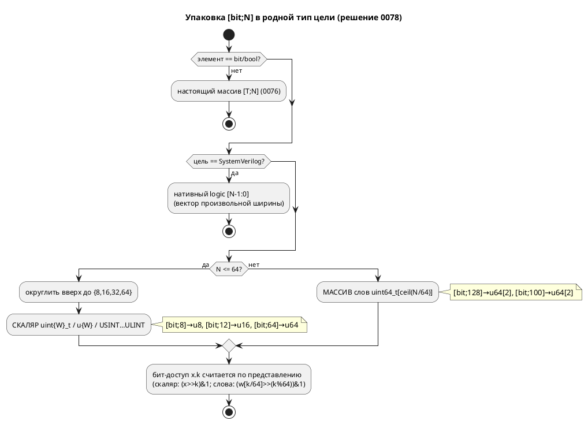

# ADR 0078: Семантика `[bit;N]` — упакованный бит-вектор в родных типах

- **Status:** Accepted
- **Date:** 2026-07-22
- **Authors:** Архитектор + Заказчик
- **Related issues:** [Фича 0078](../features/0078-bit-array-semantics.md); смежна [0076](../features/0076-sim-arrays.md) (настоящие массивы `[T;N]`), [0029](../features/0029-c-type-mapping.md) (отображение типов C), [0061](../features/0061-fixed-point-type.md)/[0060](../features/0060-enum-width-shared-layer.md) (образец «единый слой на все цели»).

## Context

На вопрос «что такое `[bit;8]`» проект давал **пять** несогласованных ответов
(разведка 0078):

| Потребитель | `[bit;8]` | Путь |
|---|---|---|
| C-генератор | **скаляр** `uint8_t` | `generator/c/mod.rs:216,314` (`bit_vector_type`) |
| Rust | **массив** `[bool; 8]` | `generator/rust/rust_type.rs:88` |
| ST | **массив** `ARRAY [0..7] OF BOOL` | `generator/st/st_type.rs:73` |
| SV | **массив** `logic name [0:7]` | `generator/sv/sv_type.rs:180` |
| Симулятор | **массив** `Value::Array` из 8 значений | `eval/mod.rs:146` (`coerce_array`) |

Плюс расхождение внутри системы типов: `[bit;N]` → `Array(N, Bit)`, а встроенный
`u8` → `Integer{8}` (скаляр); числовой литерал (`infer_int_type`) → `Array(N, Bit)`.
Бит-доступ `x.k` в симуляторе работает **только** на скаляре `Value::Number`
(`eval/access.rs:55` → `BitOfNonInteger` на `Array`). Референс-модель
`const MATRIX: u8 := {…}` (`lib.rs:1165`) сталкивает три трактовки в одной строке:
тип-скаляр, init-список, доступ-скаляр.

**Решение заказчика (эта фича) снимает неоднозначность:** `[T;N]` — массив из N
элементов T; **особый случай T ∈ {`bit`, `bool`}** — массив **упаковывается в
родные беззнаковые типы целевого языка**. C уже так делает; остальные приводятся
к нему.

## Decision Drivers

1. **Одна семантика вместо пяти.** `[bit;N]` обязан значить одно и то же во всех
   целях и симуляторе — иначе симулятор врёт про то, что синтезируется.
2. **Паритет с C-эталоном и идиомой корпуса.** Корпус пишет регистры как `u8`/
   `[bit;32]` — упакованные числа, а не N отдельных `bool`. C уже это отражает.
3. **Правило упаковки — в одном месте.** Округление вверх и разбиение на слова
   повторяются во всех целях; разъехавшись, дадут разный тип для одного текста
   (образец единого слоя — `enum_facts` 0060, `extract_type`).
4. **Аддитивность (правило 11).** Корпус использует `u8` (уже скаляр) и одно
   `[bit;32]` (уже скаляр в C) — вывод цели C неизменен; меняется лишь rust/st/sv
   на `extend_complex` (там `[bit;32]` станет `u32` вместо `[bool;32]`) — это
   **исправление**, а не регресс.

## Considered Options

Развилку «скаляр vs массив» заказчик разрешил в пользу **упакованного скаляра**
(с расширением на слова для N > 64). Полное сравнение объёма — в переписке фичи;
здесь фиксируется принятое.

### Option A. Упакованный бит-вектор в родных типах (принято)

`Array(N, Bit)` — канонический **упакованный N-битный вектор** (не N элементов).
Каждая цель отображает его через **единое правило упаковки**
(`semantic::bit_vector`):

- **N ≤ 64** → скаляр ширины `round_up(N) ∈ {8,16,32,64}` (`[bit;12]`→16,
  `[bit;3]`→8).
- **N > 64** → массив `uint64_t[⌈N/64⌉]` (`[bit;128]`→`u64[2]`, `[bit;100]`→`u64[2]`).
- **SV** — нативный `logic [N-1:0]` при **любом** N (вектор произвольной ширины;
  массив слов ему не нужен).
- Бит-доступ/запись `x.k` (и `x[k]` на бит-векторе) — по представлению: скаляр —
  сдвиг/маска; слова — выбор слова `k/64` и бит `k%64`; SV — нативный `x[k]`.

**Pros:** одна семантика; паритет с C и корпусом; `u8` ≡ `[bit;8]`; правило в
одном слое; вывод C неизменен.

**Cons:** N > 64 требует представления «массив слов» и в симуляторе (`Value::Number`
= i64 не вмещает > 64 бит) — новый код, хоть корпус его почти не трогает.

### Option B. `[bit;N]` — настоящий массив из N бит (отвергнуто)

`[bit;N]` ≠ `uN`; доступ `x[k]`, список-init `{…}`.

**Cons:** строго больше работы (переписать C на массивы, бит-доступ по массиву в
симуляторе, миграция `[bit;32]`→`u32` в корпусе), две конфликтующие концепции,
имя `u8` двусмысленно. Противоречит C-эталону и идиоме регистров.

## Decision

Принимается **Option A**. `Array(N, Bit)` (и `Array(N, Bool)`) — **упакованный
бит-вектор**; литерал и встроенный `uN` дают эквивалентное упакованное
представление.

- **Единый слой** `grammar/src/semantic/bit_vector.rs`:
  - `pub fn is_bit_vector(ty: &TypeNode) -> Option<u16>` — `Some(N)` для
    `Array(N, Bit|Bool)`, иначе `None` (дискриминатор `elem`).
  - `pub enum BitVectorLayout { Scalar { width: u16 }, Words { count: u16 } }` и
    `pub fn layout(n: u16) -> BitVectorLayout`: `Scalar{round_up(n)}` при `n ≤ 64`
    (`round_up`: 8/16/32/64), иначе `Words{ ceil(n/64) }`.
  - `pub fn bit_slot(k: u32) -> (u16 word, u32 offset)` = `(k/64, k%64)` — для
    доступа к биту в представлении слов.
- **Цели** потребляют слой:
  - **C** (`c/mod.rs`): `bit_vector_type` → `uint{round_up(N)}_t` (N ≤ 64) либо
    `uint64_t name[⌈N/64⌉]` (N > 64, через `map_typed_variable`); `CC-014` снят для
    N > 64 (остаётся только для реально невыразимого — нет такого при слоях).
  - **Rust** (`rust_type.rs`): `u{round_up(N)}` либо `[u64; ⌈N/64⌉]`.
  - **ST** (`st_type.rs`): `USINT/UINT/UDINT/ULINT` (round_up) либо
    `ARRAY [0..count-1] OF ULINT`.
  - **SV** (`sv_type.rs`): нативный `logic [N-1:0]` (любой N).
- **Симулятор** (`eval/mod.rs`, `eval/access.rs`): `Array(N, Bit)` приводится к
  `Value::Number` (N ≤ 64, битовый паттерн в i64) либо `Value::Array` из
  `⌈N/64⌉` слов-`Number` (N > 64). Бит-доступ `x.k`/`x[k]` — по слою `bit_slot`.
- **Бит-доступ в кодогене** каждой цели для случая слов использует `bit_slot`
  (индекс слова + смещение). Для N ≤ 64 путь прежний (сдвиг/маска на скаляре).
- **Корпус:** референс `MATRIX: u8 := {…}` (`lib.rs`) приводится к скалярному
  инициализатору; `extend_complex` `[bit;32]` — уже упакован (C неизменен).

**Обратная совместимость (правило 11):** цель **C байт-в-байт неизменна** (корпус
= `u8`/`[bit;32]`, оба уже скаляры). Меняется вывод **rust/st/sv** только на
`extend_complex` (`[bit;32]` → упакованный `u32`/`UDINT`/`logic[31:0]` вместо
массива `bool`) — это исправление к общей семантике, сверяется. Версия языка
**0.3.0 → 0.4.0** (семантика типа `[bit;N]` уточнена — правило 22). Крейты
`grammar`/`simulation` — минорный бамп.

## Consequences

### Положительные

- `[bit;N]` значит одно во всех целях и симуляторе; `u8` ≡ `[bit;8]`.
- Правило упаковки — в одном слое (расхождению неоткуда взяться).
- N > 64 (`[bit;128]`) впервые выразим (был `CC-014`); сверяется.
- Референс-модель `SRC` (не компилировалась целью C, фича 0075) разблокируется.

### Отрицательные / Action items

- Симулятор получает представление «массив слов» для N > 64 — новый код + сверка.
- Бит-доступ в каждой цели должен уметь путь «слова» — иначе `x.k` при N > 64
  молча неверен.
- Обновить тесты, фиксировавшие `Array(8,Bit)`-как-массив (rust/st/sv/sim).

### Acceptance criteria

1. `[bit;N]` (N ≤ 64) во всех целях и симуляторе — упакованный скаляр `round_up(N)`;
   `[bit;8]` и `u8` дают идентичный вывод.
2. `[bit;N]` (N > 64) → `uint64_t[⌈N/64⌉]` (C/rust/st), нативный `logic[N-1:0]` (SV),
   `Value::Array` слов (симулятор); `CC-014` для N > 64 снят.
3. Бит-доступ/запись `x.k` и `x[k]` верны для скаляра и для слов — потактовая
   сверка симулятор↔C.
4. Правило упаковки — в `semantic::bit_vector`, единственный источник; цели его
   зовут.
5. Цель C — байт-в-байт неизменна на корпусе; rust/st/sv меняются только на
   `extend_complex` (сверх-семантически корректно, компилируется/синтезируется).
6. Референс `MATRIX := {…}` починен; `SRC` компилируется целью C.
7. Версия языка `0.4.0`; `./scripts/precheck.sh` зелёный.
