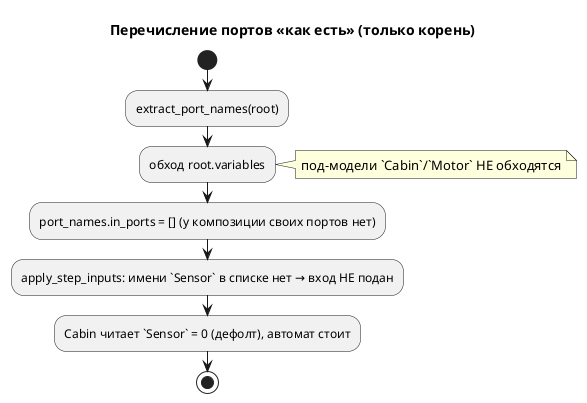
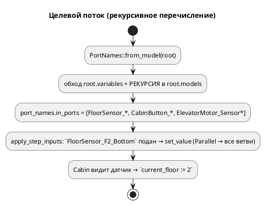

# ADR 0079: Порты под-модели композиции — перечислять рекурсивно

- **Status:** Accepted
- **Date:** 2026-07-20
- **Authors:** Архитектор + Аналитик
- **Related issues:** [Фича 0079](../features/0079-sim-composition-ports.md); выявлено при [0030](0030-comprehensive-example-fix.md); симптом `SIM-009` замаскирован [0086](0086-sim-var-without-initializer.md).

## Context

`elevator_mini.lam` (`start Main = Cabin | Motor`) объявляет порты **внутри
под-моделей** (`Cabin`: `FloorSensor_*`, `CabinButton_*`; `Motor`:
`ElevatorMotor_*`). Симулятор их **не драйвил**: поданный из sim-файла вход не
доходил до под-модели, модель «не реагировала на датчики».

Диагностика (пробы):

- **Чтение** порта под-модели работает: `Unit::get_value` на `Parallel` обходит
  **все** ветви (`units.iter().find_map(...)`), находит `Sensor` у `Cabin`.
- **Драйв** не доходит: `apply_step_inputs` подаёт вход по имени из
  `port_names.in_ports`, а `extract_port_names` собирал порты **только с корневой
  модели** — под-модели композиции не перечислялись. Имени в списке нет → вход не
  подаётся.
- Историческое `SIM-009` («порт не найден») замаскировано **0086**: порт без
  значения теперь читается нулём, а не падает. Симптом исчез, но порт остался
  «немым» — подать вход было нечем.

## Decision Drivers

1. **Композиция драйвится**: вход, поданный на порт под-модели, доходит до неё.
2. **Не сломать существующие sim-файлы** (`stacker_*.json`): порядок портов
   индексируется позиционно.
3. **Тестируемость**: регрессия гейтится `cargo test`, не только ручным прогоном.

## Decision

`extract_port_names` собирает порты **рекурсивно**, включая под-модели композиции
(`ModelNode::models`). Логика вынесена в библиотеку как `PortNames::from_model`
(было в `bin/simulation.rs` — не тестируемо). Одноимённые порты разных под-моделей
дедуплицируются (плоское пространство имён; ср. 0084 для карты адресов).

Драйв/чтение уже корректны: `set_value`/`get_value` на `Parallel` адресуют все
ветви — правки не требуют. Достаточно **перечислить** порт, и он становится
драйвим.

⚠️ **`stacker` не задет:** его порты объявлены на **корне** (под-модели
`CommandReceiver`/`MovementController`/`LiftController` своих портов не имеют),
поэтому рекурсия его перечисление не меняет — позиционные индексы sim-файлов
целы.

Побочно исправлен **`scripts/run_simulations.sh`**: сопоставление sim-файла с
моделью брало префикс до **первого** `_` (`${base%%_*}`), ломаясь на именах с
подчёркиванием (`elevator_mini_floor2` → `elevator` вместо `elevator_mini`).
Теперь берётся **самый длинный** префикс с существующим `.lam`.

## Consequences

### Положительные

- Композиции с портами под-моделей драйвятся; `elevator_mini` реагирует на
  датчики (`elevator_mini_floor2.json`: `FloorSensor_F2_Bottom` → `current_floor
  = 2`).
- Порты под-моделей отображаются в трассе.
- `PortNames::from_model` тестируема и переиспользуема.

### Отрицательные / Action items

- `elevator_mini` — **реактивный** автомат: без входов стоит в `Idle` и не
  завершается. В `examples_scenario_tests` остаётся **исключением** (как
  `stacker`), причина переписана с «ВРЕМЕННО: SIM-009» на «реактивный, сценарии
  извне».
- Плоское пространство имён портов (одноимённые в разных под-моделях делят
  значение) — задокументировано; строгая квалификация — 0084.

### Acceptance criteria

1. Порт под-модели композиции перечисляется (`PortNames::from_model`).
2. Поданный вход доходит: `elevator_mini_floor2.json` → `current_floor = 2`
   (guard-проверка, `run_simulations.sh`).
3. `stacker_*.json` проходят без изменений (порядок портов цел).
4. `precheck.sh` зелёный; вывод корпуса неизменен.
5. Версия языка не меняется (дефект симулятора/инструмента).
