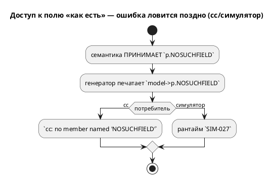
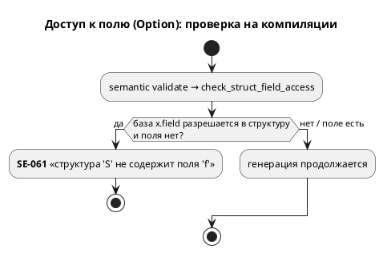

# ADR 0080: Дефекты генератора C по структурам — валидный C и компайл-тайм проверка поля

- **Status:** Accepted
- **Date:** 2026-07-20
- **Authors:** Архитектор + Аналитик
- **Related issues:** [Фича 0080](../features/0080-c-struct-defects.md); наследует находки [0034](0034-sim-struct-types.md); класс «тихая потеря/неверный вывод» (ср. [0028](0028-c-generator-stubs.md)).

## Context

Три независимых дефекта работы генератора C со структурами (каждый — проба):

1. **Инициализатор структурной переменной** `var p: Point := {1,2};` печатался как
   `model->p = {1, 2};` — **невалидный C** (`cc: expected expression`): фигурный
   инициализатор допустим только в **объявлении**, не в присваивании.
2. **Используемая структурная константа** `const c: Coord := {…};` эмитилась
   макросом `#define CONST_C {…}`, и доступ `c.x` разворачивался в `{…}.x` —
   снова невалидный C. (Неиспользуемая — отфильтровывалась, поэтому `extend_complex`
   компилировался: его `c` не используется как структура.)
3. **Существование поля не проверялось**: `p.NOSUCHFIELD` печаталось молча в
   `model->p.NOSUCHFIELD`. Ошибку ловил лишь `cc` («no member named …») — поздно
   и невнятно; симулятор — на исполнении (`SIM-027`).

## Decision Drivers

1. **Валидный C** для конструкций, которые язык принимает (дефекты 1, 2).
2. **Ранняя, внятная диагностика** вместо ошибки downstream (дефект 3) — прецедент
   0028 (диагностика вместо тихого пропуска).
3. **Неизменность вывода корпуса** (детерминизм 0048): в корпусе нет ни
   используемой структурной константы, ни `var struct := {…}`, ни неверного
   доступа к полю — правки обязаны быть аддитивными.
4. **Консервативность проверки поля**: ложное срабатывание хуже пропуска
   (`cc`/симулятор остаются страховкой).

## Decision

Приняты точечные исправления, каждое локализовано:

1. **Дефект 1** (`c_blocks::generate_scalar_init`): структурная переменная
   присваивается **составным литералом** `model->p = (Point){1, 2};`.
2. **Дефект 2** (`c_decl.rs`): структурная константа эмитится как
   `static const {Type} CONST_{name} = {…};`, а не `#define`. Скаляр/массив —
   прежним `#define` (массив с полевым/индексным доступом — территория 0078).
3. **Дефект 3** (`semantic/validate/member_access.rs`, `SE-061`): новый проход
   `check_struct_field_access` обходит инициализаторы, условия, тела блоков
   (модели и состояний), тела функций, условия `ref` и на каждом `x.field`
   (где `x` **надёжно** разрешается в структуру) проверяет наличие поля.
   Неразрешимую базу пропускает (консервативно).

## Consequences

### Положительные

- `var struct := {…}` и используемые структурные константы дают **компилируемый**
  C (сверено `cc`).
- Неверный доступ к полю — компайл-тайм `SE-061`, единый для всех целей, до
  генерации. Симулятор ловил то же на исполнении раньше — теперь до неё дело не
  доходит.
- Вывод корпуса `examples/generated/` **байт-в-байт неизменен** (аддитивно).

### Отрицательные / Action items

- `SE-061` **опережает** рантайм `SIM-027` для статически разрешимых случаев:
  тест 0034 `unknown_field_read_is_diagnostic` перенастроен на компайл-тайм
  (переименован `…_se061_at_compile_time`); механизм `SIM-027` остаётся под
  юнит-тестами `eval/{access,place}.rs` для базы, статически не разрешимой.
- Массивные константы (`#define X {…}`, `X[i]` невалиден) — **тот же класс**, но
  вне объёма 0080 (территория 0078).
- Вынос `generate_scalar_init` в `c_blocks.rs` (лимит размера `c_model`).

### Acceptance criteria

1. `var p: Point := {1,2}` → `model->p = (Point){1,2};`; `cc` компилирует.
2. Используемая `const c: Coord := {…}` → `static const Coord … = {…};`; `cc`
   компилирует; доступ `c.x` валиден.
3. `p.NOSUCHFIELD` → `SE-061` на этапе семантики; валидное поле не отвергается.
4. Вывод корпуса **байт-в-байт неизменен**; `precheck.sh` зелёный.
5. Версия языка **не** поднимается (исправление вывода + новая диагностика на
   уже-невалидную программу; грамматика не менялась).
