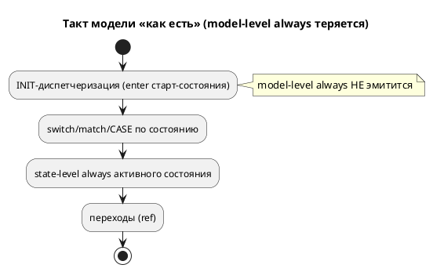
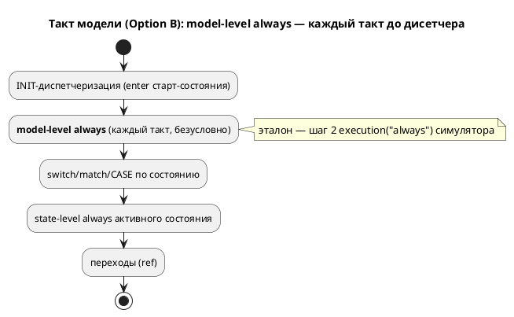

# ADR 0083: Тело `always` на уровне модели — исполнять каждый такт во всех целях

- **Status:** Accepted
- **Date:** 2026-07-20
- **Authors:** Архитектор + Аналитик + Дизайнер языка (решение направления — заказчик)
- **Related issues:** [Фича 0083](../features/0083-model-always-block-c.md); класс дефекта — «тихая потеря конструкции» (ср. [0028](0028-c-generator-stubs.md)); опирается на контракт такта [ADR 0033](0033-init-tick-alignment.md).

## Context

Именованный блок `always { … }` **грамматически допустим и как элемент
состояния, и как элемент модели** (`grammar.lalrpop`: `NamedBlockCodeDefine`
входит в `ModelElement` **и** в `StateElement`). Но model-level `always` (вне
состояния) на модели, имеющей **свои состояния**, **молча теряется**:

- **все цели кода** (`c`/`rust`/`st`/`sv`) эмитят только *state-level*
  именованные блоки;
- **симулятор** тоже не исполняет его: `builder.rs` строил
  `Unit::Node { executions: HashMap::new() }` — unit-level блоки не грузились.

Проба: `model Counter { var n; always { n := n+1; } start Run { ref Done: n>2; }
state Done; } start Entry = Counter;` — `n` не растёт ни в одной цели, переход
`n>2` не срабатывает, автомат стоит. Эталона, исполняющего конструкцию, **нет
вовсе** — значит вопрос не «C догнать до симулятора», а выбор направления.

⚠️ На **композите** (`Root = M`, `M1|M2`) model-level `always` уже работает — но
как тело **синтетического** состояния композиции (`case ROOT`), а не как «блок
модели». Дефект специфичен для модели со своими состояниями.

## Decision Drivers

1. **Никакой тихой потери** — либо исполнять, либо явно диагностировать (прецедент 0028).
2. **Эталон — симулятор**, и потактовая сверка заводится **вместе** с поведением
   (урок 0045/0050: гейт компиляции не доказывает верность).
3. **Единообразие семантики** между целями, где конструкция вообще есть.
4. **Неизменность вывода корпуса** (детерминизм 0048): в корпусе model-level
   `always` нет, правка обязана быть аддитивной.

## Considered Options

### Option A. Диагностика (отвергнуть model-level `always`)

**Pros:** мал, безопасен, закрывает тихую потерю одной проверкой.

**Cons:** убирает грамматически допустимую и полезную конструкцию (фоновое
действие каждый такт); эталона нет, но семантика **очевидна** и реализуема.

### Option B. Реализовать семантику во всех целях + симуляторе

Model-level `always` исполняется **каждый такт до диспетчеризации состояния**,
безусловно по состоянию — в симуляторе (эталон), `c`, `rust`, `st`, `sv`.

**Pros:** добавляет реальную возможность языка; единообразно; закрывает тихую
потерю исполнением; сверяется потактово.

**Cons:** дороже (симулятор + 4 цели + сверка); нужно определить точку
исполнения и порядок относительно state-level `always`.

## Decision

Принимается **Option B** (решение заказчика 2026-07-20). Семантика:

> **Model-level `always` исполняется КАЖДЫЙ такт, безусловно по текущему
> состоянию, ДО диспетчеризации состояния** (и, следовательно, до state-level
> `always` активного состояния и до переходов).

Эталон — шаг 2 `execution("always")` симулятора (unit-level блоки), который и так
вызывается каждый такт до `tick_node`; он лишь **наполняется** из
`model.named_blocks` (прежде пустой `executions`). Точка исполнения в целях —
между INIT-диспетчеризацией и диспетчером состояния (`switch`/`match`/`CASE`/
`unique case`), безусловно.

Объём — **`always`**. Model-level `enter`/`exit` в объём не входят: их семантика
(вход/выход модели) сложнее и в корпусе не встречается; хелперы принимают любой
`block_name`, но вызывается только `"always"` — расширение аддитивно.

## Consequences

### Положительные

- Model-level `always` исполняется во всех целях и потактово сверен с симулятором
  (цель `c`, `conformance_c_tests::model_level_always_matches_generated_c`).
- Вывод корпуса `examples/generated/` **байт-в-байт неизменен** (в корпусе
  конструкции нет — правка аддитивна).
- Эмиссия переиспользует существующий печатник блоков (`generate_code_block`/
  `print_statement`), различаясь лишь источником списка (модель, а не состояние).

### Отрицательные / Action items

- **Лимит размера модуля:** добавление в `c_model`/`rust_model`/`sv_fsm` вынудило
  вынести помощники именованных блоков в новые модули `c_blocks.rs`/
  `rust_blocks.rs`/`sv_blocks.rs` (штатное давление правила размера); baseline
  `c_model` 1084→1075, `rust_model` 1349→1345.
- **Гейт компиляции rust/st/sv:** корпус конструкции не содержит, поэтому
  компиляция вывода проверяется прямо в codegen-тестах (`model_always_tests.rs`
  зовёт `rustc -D warnings`/`iec2c`/`verilator --lint` с мягким пропуском).
- Model-level `enter`/`exit` остаются вне объёма — если понадобятся, заводятся
  отдельной фичей (механизм уже принимает любой `block_name`).

### Acceptance criteria

1. Простая модель со своими состояниями и `always { n := n+1; }` вне состояния:
   `n` растёт каждый такт во всех целях; потактовая трасса симулятора и C
   совпадает (1,2,3,4).
2. Вывод корпуса `examples/generated/` **байт-в-байт неизменен**.
3. Порождённые `rust`/`st`/`sv` **компилируются** (`rustc`/`iec2c`/`verilator`).
4. `always` эмитится **до** диспетчеризации состояния во всех целях
   (структурный тест).
5. Версия языка **не** поднимается: снятие тихой потери грамматически уже
   допустимой конструкции (семантика симулятора/генерации, не грамматика).
