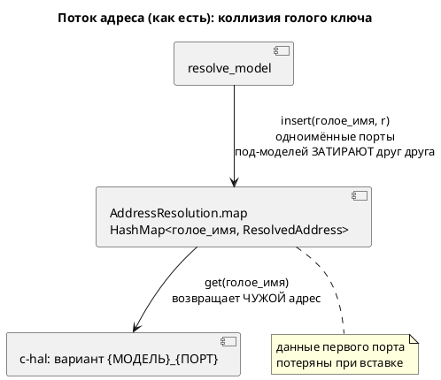

# ADR 0084: Ключ карты адресов — квалифицированный (модель + порт)

- **Status:** Accepted
- **Date:** 2026-07-22
- **Authors:** Архитектор + Аналитик
- **Related issues:** [Фича 0084](../features/0084-address-map-qualified-key.md); латентный дефект ядра [0020](0020-port-address-decl.md), выявлен при [0043](0043-address-map-export.md); родственно [0079](../features/0079-sim-composition-ports.md) (плоское пространство имён портов)

## Context

`AddressResolution.map` — `HashMap<String, ResolvedAddress>` по **голому** имени
порта (`resolve_model`: `out.map.insert(name.clone(), r)`). Потребитель `c-hal`
(`c_hal.rs`) строит для каждого порта под-модели **квалифицированный** enum-вариант
`{МОДЕЛЬ_UNIQUE}_{ПОРТ}`, но адрес берёт по голому имени: `addr_map.get(port_name)`.

**Следствие:** два порта с **одинаковым голым именем** в разных под-моделях делят
один ключ карты — при вставке побеждает последний, адрес первого **теряется
безвозвратно** (данных в карте уже нет — никаким lookup их не вернуть). В корпусе
дефект **замаскирован**: авторы вручную префиксуют имена (`CabinButton_DC`), и все
адресованные порты корпуса лежат на **корне** (`stacker`, `extend_complex`), где
коллизии голых имён нет.

Карту по голому ключу читают **четыре** потребителя, и не только `c-hal`:
`st-at` (`address_of(port)`), `sv-mmio` (итерация по ключу как имени регистра),
экспорт `map`/`json` (0043, ключ = имя порта в выгрузке). Плюс внешняя `.ld`-карта
(`external_by_name` по голому имени) и диагностики `SE-051`/`SE-050`/`SE-052`.

Фикс задевает `c-hal` — поэтому [0043](0043-address-map-export.md) плоский ключ
экспорта **не чинила**, отложив в эту фичу.

## Decision Drivers

1. **Корректность.** Одноимённые порты разных под-моделей обязаны получать
   **каждый свой** адрес; потеря данных при вставке недопустима.
2. **Аддитивность (правило 11).** Все адресованные порты корпуса — на корне;
   вывод всех целей (`c-hal`/`st-at`/`sv-mmio`) и экспорта (`map`/`json`) обязан
   остаться **байт-в-байт** прежним.
3. **Согласие продюсера и потребителя.** Ключ строится в двух местах
   (`resolve_model` над `ModelNode` и `c-hal` над `minimap::Name`) — они обязаны
   давать **идентичную** строку, иначе lookup промахнётся молча.
4. **Публичные форматы неизменны.** `.ld`-формат и `json`-контракт 0043
   пользователь видит **по голому имени порта**; квалификация ключа не должна
   протечь в выгрузку.

## Considered Options

### Option A. Квалифицированный ключ карты + голое имя в `ResolvedAddress`

Ключ `map` — `qualified_port_key(model_unique, port)` (уникальный путь модели +
голое имя). `ResolvedAddress` получает поле `name` (голое имя порта) для
потребителей, которым нужно **пользовательское** имя (`sv-mmio`, экспорт). Продюсер
и все потребители строят ключ **одним хелвером**; согласие `model_unique`
гарантировано тем, что `Name.unique()` (minimap) и `unique_model_name(ModelNode)`
дают одну строку (обе из общего обхода `upper`).

**Pros:**
- Устраняет потерю данных: каждый `(модель, порт)` — своя запись (драйвер 1).
- Аддитивно для корпуса: корневой порт → `qualified(RootUnique, port)`, адрес тот
  же; выгрузка идёт по `resolved.name` (голое) → байт-в-байт (драйверы 2, 4).
- Согласие ключа — в одном хелвере (драйвер 3).

**Cons:**
- Инвазивно: правятся продюсер, 4 потребителя, `SE-051`, публичный тип
  `ResolvedAddress` (+поле → минорный бамп API).
- Внешняя `.ld` по голому имени: запись `X` применяется ко **всем** портам с
  голым `X` (документируется; для плоского формата иначе нельзя).

### Option B. Оставить ключ голым, чинить только `c-hal` lookup

**Pros:**
- Минимальная правка `c-hal`.

**Cons:**
- **Неосуществимо:** данные первого одноимённого порта уже потеряны при вставке в
  `map` — восстановить lookup-ом нечего. Не решает драйвер 1.

### Option C. Квалифицировать **все** форматы (и `.ld`/`json` по квалиф. ключу)

**Pros:**
- Единый ключ везде, внешняя карта адресует порт под-модели точно.

**Cons:**
- Ломает публичный `.ld`-формат и `json`-контракт 0043 (круговой рейс, format_version)
  — нарушение драйвера 4 без нужды: адрес под-модели в корпусе не встречается.
- Ломает аддитивность (драйвер 2): выгрузка корпуса изменилась бы.

## Decision

Принимается **Option A**. Внутренний ключ `map` — квалифицированный
(`qualified_port_key`), `ResolvedAddress` несёт голое `name`; продюсер и потребители
строят ключ одним хелвером. Публичные форматы (`.ld`, `json`, регистры `sv-mmio`,
`AT %` в `st-at`) остаются **по голому имени** через `resolved.name` — драйверы 2 и
4 соблюдены. Внешняя `.ld` продолжает адресовать по голому имени (для плоского
формата иное невозможно; документируется). Квалифицировать выгрузку (Option C) не
требуется — адресованных портов под-моделей в корпусе нет, а ломать публичный
контракт ради невстречающегося случая противоречит правилу 11.

## Consequences

### Положительные

- Латентный дефект ядра 0020 закрыт: одноимённые порты под-моделей получают
  каждый свой адрес в `c-hal` (доказывается conformance-тестом с реальной
  коллизией).
- Экспорт `json`/`map` при коллизии теперь способен перечислить **оба** порта
  (плоский формат всё ещё сводит их к одному ключу — граница, документируется),
  тогда как прежде терялась запись **до** экспорта.

### Отрицательные / Action items

- Публичный тип `ResolvedAddress` пополняется полем `name` — минорный бамп крейта
  `grammar`; все места построения `ResolvedAddress` (продюсер) обновляются.
- Согласие `model_unique` продюсера и потребителя — критический инвариант;
  охраняется conformance-тестом (коллизия) + неизменностью корпуса.
- Плоский `.ld`/`json` ключ при коллизии голых имён остаётся ограничением формата
  (побеждает последний в выгрузке) — **документируется**, не является целью 0084
  (её цель — `c-hal`).

### Acceptance criteria

1. Две под-модели с одноимёнными адресованными портами → в `c-hal` каждый порт
   получает **свой** адрес (conformance-тест на реальной коллизии; прежде —
   один общий).
2. Вывод корпуса для `c-hal`/`st-at`/`sv-mmio` и экспорт `map`/`json` — байт-в-байт
   прежние (гейт воспроизводимости `precheck.sh` + `diff examples/generated/`).
3. `ResolvedAddress.name` = голое имя; выгрузка и регистры `sv-mmio` идут по нему.
4. `SE-051`/`SE-050`/`SE-052` и круговой рейс `.ld` (R4 0043) работают как прежде.
5. Язык `.lam` не меняется (правило 22 — версия языка не поднимается); крейт
   `grammar` — минорный бамп (аддитивное поле публичного типа).
