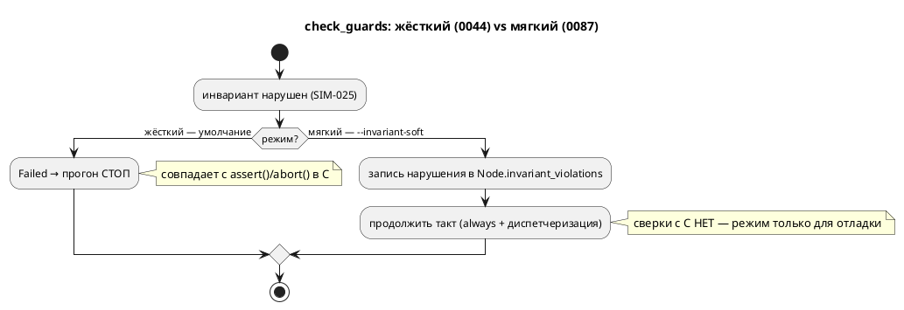

# ADR 0087: Мягкий режим инвариантов симулятора (записать и продолжить)

- **Status:** Accepted
- **Date:** 2026-07-22
- **Authors:** Архитектор + Аналитик
- **Related issues:** [Фича 0087](../features/0087-invariant-soft-mode.md); продолжение [0044](0044-sim-assert-invariant.md) (инварианты в симуляторе, `SIM-025`)

## Context

Ядро [0044](0044-sim-assert-invariant.md) при нарушении инварианта (`invariant Имя
= C;`, Guard-формула) **останавливает** прогон: `Unit::check_guards` возвращает
`TickResult::Failed("нарушен инвариант… (SIM-025)")`, и `runner` завершает симуляцию
`RunResult::EvalFailed`. Так и задумано: это совпадает с порождённым C, где
`assert()` → `abort()`, — иначе потактовая **сверка** симулятора с C сравнивала бы
несравнимое (симулятор идёт дальше, C уже упал).

Но для **отладки** останов на первом же нарушении неудобен: инженер хочет увидеть,
**когда и сколько раз** инвариант нарушается по ходу прогона, не правя модель под
каждый прогон. Такой «мягкий» режим осмыслен **ровно там, где сверки с C нет** — то
есть это отдельная возможность симулятора, не затрагивающая C-конформность.

## Decision Drivers

1. **C-конформность неприкосновенна.** Жёсткий режим (0044) — умолчание и
   **не меняется**: потактовые сверки с C и весь корпус идут через него.
2. **Мягкий режим завершает такт, а не обрывает его.** «Продолжить прогон» значит
   выполнить `always` и диспетчеризацию состояния (иначе состояние не сменится, и
   на следующем такте инвариант снова ложен → **ливлок**). Значит решение hard/soft
   принимается **внутри** такта.
3. **Композиция.** Инварианты проверяет **каждый** дочерний `Node` в своём `tick`;
   нарушения обязаны **всплыть** к `runner` из всего дерева `Unit`.
4. **Не тихо.** Нарушения в мягком режиме печатаются и дают **ненулевой** код
   возврата (это находки, а не «прогон прошёл»). Правило проекта: не молчать.

## Considered Options

### Option A. `tick_soft` + запись в узел + рекурсивный слив в `runner`

`Unit::tick` остаётся жёстким; логика выносится в `tick_mode(soft)`, добавляется
`tick_soft`. Флаг `soft` протаскивается через `tick_node`/`tick_parallel`/
`tick_sequential` в `check_guards`. При нарушении в мягком режиме `check_guards`
пишет строку в новое поле `UnitKind::Node::invariant_violations` и возвращает `None`
(такт продолжается). `runner` после каждого такта сливает нарушения
`take_invariant_violations` (рекурсивно по дереву — **зеркало** существующего
`take_last_transitions`) и тегирует номером шага.

**Pros:**
- Решение hard/soft — внутри такта (драйвер 2); жёсткий путь байт-в-байт прежний
  (драйвер 1).
- Всплытие из композиции — уже существующим паттерном рекурсивного слива
  (драйвер 3).
- Номер шага знает `runner` (он ведёт цикл) — тег ставится там, где есть контекст.

**Cons:**
- Публичное поле `TickResult` не меняется, но добавляется вариант `RunResult` и
  поле `Node` — минорный бамп API `simulation`.
- `soft` протаскивается через 4 приватных метода (механически).

### Option B. Проверять инварианты в `runner` **после** такта (в тик не лезть)

`runner` в мягком режиме выключает in-tick проверку и сам вычисляет предикаты
инвариантов после каждого такта.

**Pros:**
- Тик не трогается.

**Cons:**
- `runner` не имеет доступа к предикатам вложенных `Node` (`Guards` живут в узле,
  композиция скрыта за `Rc<RefCell<Unit>>`) — пришлось бы дублировать обход дерева
  и логику `check_guards`. Дублирование = дрейф (два разных ответа на один вопрос).
- Точки проверки инвариантов (до `always`, эталон C) размылись бы.

### Option C. Единый `Rc<RefCell<Vec>>`-сток, прокинутый в каждый узел на сборке

**Pros:**
- Один сток на всё дерево.

**Cons:**
- Плуминг через `build`/`build_impl`/`build_node` во все узлы ради редкого режима;
  у композитов контексты **раздельные** (каждый `Node` — свой `ModelNodeContext`),
  общего места нет — пришлось бы заводить его специально. Тяжелее A при той же цели.

## Decision

Принимается **Option A**. `Unit::tick` (жёсткий) — неизменный публичный контракт,
через него идут все сверки с C и корпус. Логика — в `tick_mode(&mut self, soft:
bool)`; `tick = tick_mode(false)`, новый `tick_soft = tick_mode(true)`. `soft`
протаскивается в `check_guards`; при нарушении мягкий режим пишет в
`Node.invariant_violations` и **продолжает** такт, жёсткий — `Failed` (как 0044).
**Ошибка вычисления** самого условия (`SIM-0xx`) — всегда `Failed` в обоих режимах
(это не «нарушение инварианта», а недостоверность прогона, драйвер 1/R15 0044).
`runner` сливает нарушения `take_invariant_violations` (рекурсивно, зеркало
`take_last_transitions`), тегирует шагом, возвращает
`RunResult::CompletedWithInvariantViolations`; CLI-флаг `--invariant-soft` печатает
их и даёт ненулевой код (драйвер 4).

## Consequences

### Положительные

- Отладочный режим: полный список нарушений с номерами шагов за один прогон, без
  правки модели.
- Жёсткий режим и C-конформность не тронуты (умолчание).

### Отрицательные / Action items

- API `simulation`: новое поле `UnitKind::Node`, новый метод `Unit::tick_soft`/
  `take_invariant_violations`, новый вариант `RunResult` → минорный бамп крейта.
- Все места построения `UnitKind::Node` (builder, state_io, viewport, tests)
  получают новое поле (`Default`).
- Флудинг: инвариант, ложный каждый такт, даёт запись на каждый шаг — это и есть
  отладочная ценность (когда/сколько раз); бюджет шагов ограничивает объём.

### Acceptance criteria

1. Модель с нарушаемым инвариантом: **жёсткий** режим (умолчание) — стоп на первом
   нарушении (`SIM-025`, как 0044); **мягкий** (`--invariant-soft`) — прогон идёт
   до конца, все нарушения записаны с номерами шагов.
2. Ошибка вычисления условия инварианта — `Failed` в **обоих** режимах (не
   заглушается мягким режимом).
3. Мягкий режим печатает нарушения и даёт ненулевой код возврата при их наличии;
   без нарушений — код 0.
4. Жёсткий режим байт-в-байт прежний: корпус, потактовые сверки с C, все тесты 0044
   зелёные без правок утверждений.
5. Язык `.lam` не меняется (правило 22 — версия языка не растёт); крейт
   `simulation` — минорный бамп.
