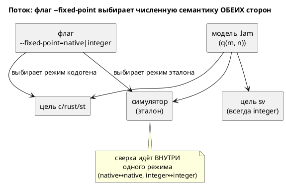

# ADR 0096: Q-арифметика через нативный float и флаг генерации (embedded ↔ float)

- **Status:** Accepted (утверждён заказчиком 2026-07-19 — вопросы 1–4 подтверждены;
  прямо пересматривает ADR 0061 Option B/драйвер-принцип 0042)
- **Date:** 2026-07-19
- **Authors:** Архитектор + Дизайнер языка
- **Related issues:** [Фича 0096](../features/0096-fixed-point-native-float.md);
  **пересматривает** [ADR 0061](./0061-fixed-point-type.md) (Option B, драйвер 1)

## Context

Фича [0061](../features/0061-fixed-point-type.md) дала языку тип `q(m, n)` и
реализовала его как **целочисленную** Q-арифметику во всех пяти реализациях
(симулятор + `c`/`rust`/`st`/`sv`), **побитово** согласованную. Это было
**главным** решением ADR 0061 (драйвер 1): без побитового совпадения сверка
проваливается by design, и fixed-point теряет смысл. ADR 0061 при этом **явно
отверг Option B** — «формат/режим как параметр цели» — по принципу «CLI не должен
менять логику автомата» (записан по фиче 0042 про `--define`).

Запрос заказчика (2026-07-19), уточнённый: сделать работу с плавающей точкой
**прозрачной**. Автор пишет `float`, а представление выбирается при компиляции —
**глобальным параметром точности** файла и **целью**:

- **Глобальная Q-точность** `(m, n)` задаётся при компиляции (например `10.22`).
  Везде, где нужен `float`, подставляется `q(m, n)`.
- **`sv`** (нативного `float` нет — сегодня `SV-003`): `float` → `q(m, n)`
  **автоматически** при заданной точности → **`SV-003` для `float` снимается**,
  вещественные модели становятся синтезируемыми **без ручного** переписывания в
  `q`. Именно это закрывает изначальную боль (0045: «RTL не выражает дробь»).
- **`c`/`rust`/`st`** (нативный `float` есть — `double`/`f64`/`LREAL`, все
  64-битные, следствие `--float-width=64` фичи 0029): по умолчанию **нативный**
  `float`; целочисленный Q-путь (та же глобальная точность) — **только по флагу**
  явного использования Q (embedded без FPU).

Тип `q(m, n)` из 0061 **остаётся** для точного формата в самом типе; `float` —
«прозрачный» путь, чьё представление задаёт флаг и цель.

⚠️ Без заданной точности `sv` для `float` **остаётся `SV-003`**: угадывать формат
(Q16.16) генератору **нельзя** — это ровно тот довод, по которому 0045 и 0061
отвергли автоугадывание. Флаг и есть требуемый ADR 0061 «выбор формата автором».

### Сила, которую нельзя обойти: сверка требует общего эталона

`double` (даже 64-битный) считает **иначе**, чем Q-целые: нет floor-к-−∞ у `*`,
нет wraparound, диапазон не ограничен `m`. Значит трасса `float`-режима **не**
совпадёт с трассой `integer`-режима — это **две разные численные семантики**.
Если оставить симулятор односемантичным (только Q-целые, как в 0061), то
`float`-режим целей **нечем верифицировать** — ровно тот провал, ради избегания
которого 0061 и держала единый Q. Поэтому флаг обязан переключать **обе** стороны:
и цель, и эталон-симулятор.

## Decision Drivers

1. **Спрос заказчика против инварианта 0061.** Заказчик прямо просит нативный
   float + флаг; ADR 0061 прямо это отверг. Разрешение конфликта — суть этого ADR.
2. **Побитовая сверка обязана уцелеть** (унаследовано от 0061, драйвер 1). Любой
   режим, у которого нет эталона в симуляторе, — молчаливо неверный код.
3. **CLI не должен менять логику автомата** (принцип 0042). Флаг, меняющий
   **численную** семантику, этот принцип задевает — надо либо обосновать
   исключение, либо ограничить область флага.
4. **Embedded без FPU обязан получить целочисленный путь** — иначе фича бесполезна
   для своей главной аудитории (микроконтроллеры), а именно они мотивируют 0061.
5. **`float`-режим не должен молча терять смысл формата** `m`/`n` (диапазон,
   округление) без явного решения (иначе `q(8,8)` и `q(16,16)` неотличимы).

## Considered Options

### Option A. Прозрачный `float`: глобальная Q-точность (флаг) + двухрежимный симулятор

Автор пишет `float`; представление выбирается флагами генерации, а **симулятор
умеет оба**. `--float-as-q=m.n` задаёт глобальную точность: `sv` подставляет
`q(m, n)` вместо `SV-003`; `c`/`rust`/`st` остаются native, а с `--float-embedded`
идут в целочисленный Q(m, n). Симулятор считает `float` как `f64` **или** как
`q(m, n)` — по режиму сверяемой цели. Сверка — **внутри** режима.

**Pros:**
- Даёт заказчику ровно запрошенное; embedded сохраняет целочисленный путь.
- **Драйвер 2 уцелел:** у каждого режима есть эталон в симуляторе → сверка
  возможна by construction, а не «by design провалена».
- Разделение честное: `native` и `integer` — **разные** модели, автор выбирает
  явно; неоднозначности «одно имя — две семантики» нет (в отличие от 0061 Option C).

**Cons:**
- **Задевает драйвер 3** (принцип 0042): одна модель считает по-разному от флага
  сборки. Смягчение: флаг выбирает **профиль исполнения** (FPU vs без FPU), а не
  прячет семантику в CLI молча — оба режима документированы и оба сверяются.
- **Двойная работа сверки:** conformance-наборы нужны для **обоих** режимов ×
  каждая цель.
- Симулятор перестаёт быть единственным эталоном — он теперь **двухрежимный**.

### Option B. Всегда native для float-целей (без флага), sv — integer

**Pros:** нет флага (драйвер 3 не задет).

**Cons:**
- **Убивает embedded** (драйвер 4): `c-hal` для МК без FPU получил бы `double` —
  именно то, ради ухода от чего заведена 0061. Неприемлемо.

### Option C. Статус-кво (0061, только integer)

**Pros:** ничего не менять; инвариант 0061 цел.

**Cons:**
- Отклоняет прямой запрос заказчика (драйвер 1). Требует явного «нет».

### Option D. `native`-режим эмулирует формат `q` в float (округление/диапазон)

`double`-путь воспроизводит floor-к-−∞ и wraparound `q` поверх `f64`.

**Pros:** трассы `native` и `integer` совпали бы → один эталон.

**Cons:**
- Дорого и противоречиво: эмулировать целочисленный wraparound в `double` —
  это и есть Q-арифметика, только медленнее и без выигрыша FPU. Смысл флага
  (нативная скорость/точность) теряется. Отвергается.

## Decision

Предлагается **Option A** — при условии утверждения заказчиком, поскольку он
**сознательно пересматривает** ADR 0061 (драйвер 1 сохраняется, драйвер-принцип
0042 — ослабляется явно и обоснованно).

**Нормативные положения (проект решения, на утверждение):**

1. **Глобальная Q-точность — флаг CLI** `--float-as-q=<m>.<n>` (свойство
   **генерации**, как `--float-width` 0029, а не языка → версия не растёт,
   правило 22). Прагма-в-файле отклонена: она меняла бы **язык** (рост версии) и
   привязывала бы формат к тексту, тогда как заказчик задаёт его «при компиляции».
   ✅ **Подтверждено заказчиком 2026-07-19** (вопрос 1 карточки — «да»).
2. **`float` без флага — прежнее поведение** (обратная совместимость): `c` →
   `double`, `rust` → `f64`, `st` → `LREAL`, **`sv` → `SV-003`**. Корпус
   байт-в-байт неизменен (0 `float`). ✅ **Подтверждено заказчиком 2026-07-19**
   (вопрос 2 — «да»): без точности угадывать формат нельзя, флаг = выбор автором.
3. **`sv` + `--float-as-q=m.n`:** каждый `float` → `q(m, n)` (Q-путь 0061-04);
   `SV-003` для `float` **снимается**. Это и есть цель фичи.
4. **`c`/`rust`/`st` + `--float-as-q=m.n`:** по умолчанию **всё ещё нативный**
   `float` (точность влияет только на `sv`). Целочисленный Q-путь включается
   **вторым** флагом `--float-embedded`: тогда `float` → `q(m, n)` целочисленно
   (путь 0061-03). Без него — native. ✅ **Подтверждено заказчиком 2026-07-19**
   (вопрос 3 — «второй флаг»): `--float-as-q` не переключает `c`/`rust`/`st`
   молча, Q-путь для них — явный opt-in.
5. **Симулятор двухрежимен по `float`:** считает `float` либо как `f64` (native),
   либо как `q(m, n)` (когда цель сверки в Q-режиме). Режим прокидывается в
   `eval`. Иначе `sv`/embedded-путь **нечем** верифицировать (драйвер 2).
   ✅ **Подтверждено заказчиком 2026-07-19** (вопрос 4 — «да»).
6. **native-`float` и Q-`float` — РАЗНЫЕ численные семантики** (округление,
   диапазон). Сверка побитовая **внутри** режима: native↔native (биты f64),
   Q↔Q (repr). Автору сообщается (док), что флаг меняет **модель**, а не только код.
7. **Явный `q(m, n)` (0061) не тронут:** он всегда целочисленный Q во всех целях
   (включая `sv` без флага). `--float-as-q` управляет **только** типом `float`.
8. **Версия языка не меняется** (флаги — свойство генерации; `float`/`q`
   синтаксически прежние).

## Consequences

### Положительные

- Заказчик получает нативный float для FPU-целей и целочисленный путь для embedded.
- Побитовая сверка сохранена **в каждом режиме** (драйвер 2).
- Явный выбор семантики автором — без тихого расхождения.

### Отрицательные / Action items

- **A-1. Двухрежимный симулятор.** `eval::fixed` обязан считать `q` и как repr, и
  как `f64` — режим прокидывается в вычислитель. Наибольший риск: рассинхрон
  режимов эталона и цели даст молчаливо неверную сверку.
- **A-2. Сверка ×2.** Каждый `conformance_{c,rust,st}` — в обоих режимах.
- **A-3. Принцип 0042 ослаблен** — задокументировать в `CLAUDE.md`, что
  `--fixed-point` — **сознательное** исключение (профиль FPU/embedded), в отличие
  от `--define`, который логику НЕ меняет.
- **A-4. `sv` асимметрична** — предупреждение вместо тихого игнорирования флага.
- **A-5. Смешение `q`/`float` (`SE-059`)** в `native`-режиме, возможно, стоит
  ослабить (в `f64` они однотипны) — решить в анализе; по умолчанию **оставить**
  запрет (меньше сюрпризов).

### Acceptance criteria

1. **A1.** Без флагов: `c`→`double`, `rust`→`f64`, `st`→`LREAL`, `sv`→`SV-003`;
   корпус `examples/generated` **байт-в-байт** прежний.
2. **A2.** `--float-as-q=10.22` + цель `sv`: каждый `float` → `q(10, 22)`
   (`logic signed [31:0]`), модуль **синтезируется** (verilator+yosys); `SV-003`
   для `float` **не** срабатывает.
3. **A3.** `--float-as-q=10.22` + `c`/`rust`/`st` **без** `--float-embedded`:
   вывод **всё ещё** нативный (`double`/`f64`/`LREAL`) — точность влияет лишь на `sv`.
4. **A4.** `--float-as-q=10.22 --float-embedded` + `c`/`rust`/`st`: `float` →
   `q(10, 22)` целочисленно; **побитовая** сверка с симулятором в Q-режиме.
5. **A5.** Симулятор двухрежимен: `float` считается как `f64` (native) либо
   `q(m, n)`; сверка `sv`↔Q-симулятор **побитовая** (repr).
6. **A6.** Явный `q(m, n)` (0061) не зависит от флагов — всегда целочисленный Q.
7. **A7.** `CLAUDE.md` фиксирует: `--float-as-q`/`--float-embedded` **сознательно**
   меняют численную семантику (профиль FPU/embedded/RTL), в отличие от `--define`
   (0042), который логику НЕ меняет.
8. **A8.** README документирует прозрачный `float` с примерами (правила 8, 15, 16).
