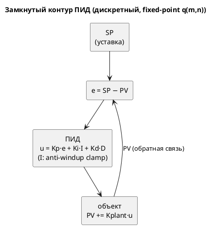

# ADR 0097: Пример ПИД-регулятора на языке Lam (fixed-point)

- **Status:** Proposed (на утверждение заказчиком)
- **Date:** 2026-07-19
- **Authors:** Архитектор + Дизайнер языка
- **Related issues:** [Фича 0097](../features/0097-pid-regulator-example.md);
  строится на [ADR 0061](./0061-fixed-point-type.md) (тип `q(m, n)`); расширяет
  пропорциональный `examples/regulator.lam` (задача 0061-05)

## Context

Фича [0061](../features/0061-fixed-point-type.md) дала языку дробный тип
`q(m, n)` с нормативной арифметикой, а её задача 0061-05 — пример
**пропорционального** (P) регулятора. Запрос заказчика: канонический **ПИД**
(P + I + D) регулятор — самый распространённый закон управления в
промышленности, естественный «флагманский» пример fixed-point на реальной задаче.

Цель ADR — не просто «написать пример», а **обосновать** его теоретически:
корректно дискретизировать непрерывный ПИД, выбрать fixed-point формат, учесть
квантование и переполнение (в семантике 0061 — **wraparound**, не насыщение).

### Теоретическое обоснование

**1. Непрерывный ПИД.** Закон управления по рассогласованию `e(t) = SP − PV(t)`
(SP — уставка, PV — измеряемая величина):

```
u(t) = Kp·e(t) + Ki·∫₀ᵗ e(τ)dτ + Kd·de(t)/dt
```

- **P** (`Kp·e`) — реакция на текущую ошибку; один P даёт статическую ошибку
  (не дотягивает до SP под нагрузкой).
- **I** (`Ki·∫e`) — накопление ошибки; **устраняет статическую ошибку**, но
  склонно к перерегулированию и **интегральному насыщению (windup)**.
- **D** (`Kd·de/dt`) — реакция на скорость изменения; **демпфирует**
  перерегулирование, но усиливает шум.

**2. Дискретизация (позиционная форма).** Такт Lam = шаг дискретизации `Ts`
(единичный). Интеграл — сумма прямоугольников, производная — разность назад:

```
e[k]  = SP − PV[k]
I[k]  = I[k−1] + e[k]                    (∫ ≈ Σ e·Ts, Ts = 1)
D[k]  = e[k] − e[k−1]                    (de/dt ≈ Δe/Ts)
u[k]  = Kp·e[k] + Ki·I[k] + Kd·D[k]
```

Позиционная форма выбрана над инкрементной (`Δu`) ради **наглядности**: все три
вклада видны явно.

**3. Fixed-point квантование и устойчивость.** В `q(m, n)` величины квантованы с
шагом `2⁻ⁿ`. Квантование вносит два эффекта, которые пример обязан учесть:

- **Предельный цикл (limit cycle):** вблизи SP ошибка `e` меньше шага
  квантования, и регулятор «дребезжит» вокруг уставки. Критерий завершения обязан
  иметь `eps` **больше** шага квантования — иначе прогон не завершится (провал
  гейта 0030).
- **Устойчивость:** дискретный ПИД устойчив при достаточно малых `Kp`/`Ki`/`Kd`
  относительно динамики объекта. Пример подбирает коэффициенты так, чтобы прогон
  сходился **монотонно-затухающе** за конечный бюджет (без раскачки).

**4. Anti-windup — ОБЯЗАТЕЛЕН при wraparound.** Арифметика 0061 — **перенос**
(wraparound), а не насыщение (правило 3 ADR 0061; насыщение — отложенный кандидат
A-5). Интеграл `I` монотонно растёт до устранения ошибки; без ограничения он
**переполнит** `q(m, n)` и молча «перевернётся» (`+127 → −128`) — регулятор станет
неустойчивым. Поэтому интеграл **ограничивается** (clamp) в `[−Imax, +Imax]` через
`q`-сравнения — стандартный **anti-windup**. Насыщения-оператора в языке нет,
поэтому clamp пишется условием.

**5. Объект управления (plant).** Гейт 0030 требует прогон **без внешних входов**,
поэтому «измерение» PV эволюционирует **внутри** модели — простейший объект
первого порядка (интегрирующее звено):

```
PV[k+1] = PV[k] + Kplant·u[k]
```

Это замыкает контур: регулятор влияет на PV, PV возвращается в ошибку. Прогон
самодостаточен и завершается при сходимости.



## Decision Drivers

1. **Теоретическая корректность.** Пример — **правильный** ПИД, а не «похожий»:
   дискретизация, знаки, anti-windup — по учебнику.
2. **Проходимость всех гейтов** (урок 0030): осуществимость доказывается **всеми**
   гейтами корпуса (`c`/`st`/`rust`/`sv`) + сценарным, а не только симулятором.
3. **Завершаемость при квантовании:** сходимость за конечный бюджет, `eps` > шага
   квантования (иначе предельный цикл не даст терминироваться).
4. **Наглядность:** учебный пример — явные P/I/D вклады, читаемые имена, формулы
   в комментариях.
5. **Язык не расширять:** пример пользуется только тем, что уже есть (0061).
   Нехватку (насыщение) — обойти в модели и зафиксировать кандидатом.

## Considered Options

### Option A. Позиционный ПИД с явным anti-windup, `q(8, 8)`, объект 1-го порядка

Полный ПИД по разделу «Теория»; интеграл ограничен clamp; объект `PV += Kplant·u`;
завершение по `|e| < eps`. Обёртка под-моделью (цель `c`) + порт `ready` (цель
`rust`).

**Pros:**
- Теоретически корректный полный ПИД (все три составляющие).
- Anti-windup делает поведение устойчивым в wraparound-семантике 0061.
- Самодостаточный прогон (объект внутри) → проходит гейт 0030.
- Наглядно: P/I/D вклады видны построчно.

**Cons:**
- Сложнее пропорционального 0061-05 (больше переменных/состояний).
- Подбор коэффициентов под сходимость-за-бюджет — ручной (замером).

### Option B. Инкрементная (скоростная) форма `Δu`

**Pros:** естественный anti-windup (нет явного накопителя), безударное включение.

**Cons:** менее нагляден (вклады P/I/D не видны прямо) — хуже для учебного примера;
требует хранить два прошлых значения ошибки.

### Option C. Без anti-windup (чистый позиционный ПИД)

**Pros:** короче.

**Cons:** **некорректен в семантике 0061** — интеграл переполнит `q` с wraparound,
регулятор неустойчив, прогон не сойдётся. Противоречит драйверам 1 и 3.

### Option D. Расширить язык оператором насыщения ради чистого ПИД

**Pros:** anti-windup стал бы одной операцией.

**Cons:** нарушает драйвер 5 — «пример» не должен тянуть изменение языка.
Насыщение — отдельный кандидат (A-5 ADR 0061), заводится своей фичей.

## Decision

Предлагается **Option A** — позиционный дискретный ПИД с явным anti-windup, формат
`q(8, 8)` (уточняется замером сходимости), объект первого порядка внутри модели.

**Нормативные положения примера (проект):**

1. **Структура:** уставка `SP`, измерение `PV`, ошибка `e`, интеграл `I`, прошлая
   ошибка `e_prev`; коэффициенты `Kp`/`Ki`/`Kd`/`Kplant` — типа `q`.
2. **Закон (такт состояния `Control`):** `e = SP − PV; I = clamp(I + e); D = e −
   e_prev; u = Kp·e + Ki·I + Kd·D; PV = PV + Kplant·u; e_prev = e`.
3. **Anti-windup:** `I` ограничен `[−Imax, Imax]` условиями (`q`-сравнения), не
   оператором (насыщения в языке нет).
4. **Завершение:** `|e| < eps` (`eps` > 2⁻ⁿ) → `Settled` → `Done` (порт `ready`).
5. **Все гейты + сценарный контракт** (`examples_scenario_tests`): цепочка
   `Control → Settled → Done`, бюджет с запасом, `must_terminate`.
6. **Язык не меняется.** Если clamp невыразим удобно — фиксируем кандидат на
   насыщение, компилятор не правим.

**Правило 18:** синтаксис язык не меняет (пример) → EBNF не требуется.

## Consequences

### Положительные

- Канонический эталонный потребитель fixed-point; язык показан на реальной задаче.
- Anti-windup документирует важный практический нюанс fixed-point управления.

### Отрицательные / Action items

- **A-1. Подбор коэффициентов — итеративный** (замером в симуляторе): устойчивость
  + завершение-за-бюджет + `eps` > квантования.
- **A-2. Все гейты** (урок 0030): проверить `c`/`st`/`rust`/`sv`, не только сим.
- **A-3. Возможен предельный цикл** — если не сойдётся, увеличить `eps` или
  подстроить `Kd`. Задокументировать выбор.
- **A-4. Кандидат на насыщение** (A-5 ADR 0061) — пример подтверждает спрос:
  anti-windup руками громоздок; насыщающий оператор/тип упростил бы.

### Acceptance criteria

1. **A1.** `examples/pid_regulator.lam` — корректный позиционный ПИД с anti-windup;
   P/I/D вклады явны и прокомментированы формулами.
2. **A2.** Прогон **без входов** сходится к `SP` и завершается
   (`Control → Settled → Done`) за конечный бюджет — `examples_scenario_tests`.
3. **A3.** Проходит **все** гейты корпуса: `c` (cmake+ninja), `st` (iec2c),
   `rust` (rustc+clippy `-D warnings`), `sv` (verilator+yosys).
4. **A4.** Интеграл **не переполняется** (anti-windup работает) — наблюдаемо в
   трассе симулятора.
5. **A5.** README/шапка примера объясняют закон ПИД, дискретизацию и anti-windup.
6. **A6.** Компилятор **не изменён** (диффа в `grammar/`/`simulation/src` нет).
