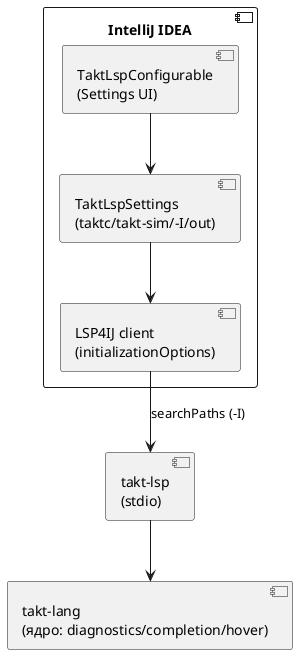

# ADR 0125: Плагин IntelliJ Takt: LSP-проверка, автодополнение, документация и настройки инструментов

- **Status:** Accepted
- **Date:** 2026-07-25
- **Authors:** Архитектор
- **Related issues:** [Фича 0125](../features/0125-intellij-takt-lsp-tooling.md); опирается на ADR [0038](0038-intellij-semantic-tokens.md) (LSP4IJ) и механизм 0072 (`searchPaths`)

## Context

Плагин `extensions/intellij-takt` уже поднимает готовый LSP-сервер `takt-lsp`
через LSP4IJ (фича 0038): фабрика `TaktLspServerFactory` +
`TaktLspConnectionProvider` запускают бинарник по stdio, `languageMapping`
сопоставляет язык Takt серверу. Сам сервер (`takt-lang/src/lsp/`) **уже**
реализует и анонсирует в `initialize` нужные возможности:
`text_document_sync` → `publishDiagnostics` (валидация), `completion_provider`
(автодополнение), `hover_provider` (документация), плюс goto/formatting/
semantic-tokens. LSP4IJ включает соответствующие UI-фичи по объявленным
capabilities сервера. **То есть сам LSP-сервер под три требования дописывать не
нужно** — работа лежит на стороне плагина и его настроек.

Два пробела текущего состояния:

1. **Настройки плагина скудны.** `TaktLspSettings`/`TaktLspConfigurable` хранят
   **только** путь к `takt-lsp`. Путей к компилятору `taktc`, симулятору
   `takt-sim`, дополнительных параметров компилятора (каталоги `-I`) и выходной
   директории — **нет**. Разработчику неоткуда задать, где искать импортируемые
   библиотеки и куда генерировать код.

2. **`initializationOptions` серверу не передаются.** `TaktLspConnectionProvider`
   поднимает процесс, но клиент LSP4IJ не отдаёт серверу
   `initializationOptions.searchPaths`, хотя сервер их **умеет** читать (0072,
   `init_options::search_paths_from_options`). Поэтому диагностика/автодополнение/
   переход находят импорт **только** в каталоге документа — импорт из общей
   библиотеки (аналог `taktc -I lib`) в редакторе не разрешается.

Задача — довести настройки до уровня прочих плагинов подобных утилит и связать
каталоги `-I` из настроек с уже существующим механизмом `searchPaths` сервера.

## Decision Drivers

1. **Не дублировать семантику (драйвер 2 ADR 0038).** Проверка/дополнение/hover —
   единый источник `takt-lang`; плагин не должен реализовывать их на Kotlin.
2. **Переиспользовать готовый механизм.** `searchPaths` в
   `initializationOptions` уже поддержан сервером (0072) — прокидка `-I` не
   требует правок сервера.
3. **Аддитивность (правило 11).** Пустые новые настройки ⇒ поведение прежнее
   (пустой `searchPaths` ≡ прежний `&[]`); плагин без LSP4IJ грузится как раньше.
4. **Соответствие ожиданиям пользователя.** «Настройки как у других подобных
   утилит»: пути к инструментам, доп. параметры, выходной каталог — привычный
   набор.

## Considered Options

### Option A. `-I` через `initializationOptions.searchPaths`; пути к инструментам — в настройках

Каталоги `-I` из настроек плагин отдаёт серверу как
`initializationOptions.searchPaths` (переопределив получение init-options в
клиенте LSP4IJ). Пути к `taktc`/`takt-sim` и выходная директория **хранятся** в
настройках (задел под будущие действия компиляции/симуляции), но действий запуска
эта фича не вводит. diagnostics/complete/hover — уже от сервера через LSP4IJ.

**Pros:**
- Ни строки правок в LSP-сервере: `searchPaths` уже читается (0072).
- Аддитивно и совместимо: пустые значения ≡ прежнее поведение.
- Минимальный, проверяемый объём; чётко ложится на требования заказчика.

**Cons:**
- Пути `taktc`/`takt-sim` пока «мёртвые» (хранятся, но не задействованы до
  фичи-преемника с действиями запуска) — нужно честно это назвать.

### Option B. `-I` аргументами командной строки бинарнику `takt-lsp`

Передавать `-I dir` как argv процессу `takt-lsp`.

**Pros:**
- Симметрично с `taktc -I`.

**Cons:**
- Сервер **не разбирает** argv для путей поиска — пришлось бы **дописывать
   сервер** в обход уже готового `initializationOptions` (0072), плодя второй
   механизм того же назначения. Нарушает драйвер 2.

### Option C. Ввести полноценные действия «Compile»/«Simulate» (Run Configurations) в этой же фиче

Кроме настроек — кнопки/конфигурации запуска `taktc`/`takt-sim` из IDE.

**Pros:**
- Сразу задействует пути к инструментам.

**Cons:**
- Существенно больший объём (Run Configuration API, парсинг вывода в проблемы,
   консоль), верифицируемый только запуском IDE. Раздувает фичу и смешивает две
   темы (LSP-редактирование vs выполнение). Лучше отдельной фичей-преемником.

## Decision

Принимается **Option A**. Она закрывает все три требования проверки/дополнения/
документации за счёт уже готового сервера, добавляет ожидаемый набор настроек и
связывает `-I` с импорт-резолвингом через существующий `searchPaths` — без правок
LSP-сервера и без раздувания объёма. Действия запуска компилятора/симулятора
(Option C) выносятся в **отдельную фичу-преемника** (пути к `taktc`/`takt-sim` и
выходная директория заводятся уже сейчас как задел, что честно фиксируется в
карточке и отчёте).

## Consequences

### Положительные

- Разработчик Takt получает в IntelliJ проверку файла, автодополнение и hover
  «из коробки», плюс разрешение импортов из общих библиотек через настройку `-I`.
- Ноль правок в LSP-сервере; единый источник семантики сохранён.
- Совместимо: без LSP4IJ и с пустыми настройками поведение прежнее.

### Отрицательные / Action items

- **A-1.** Расширить `TaktLspSettings.State` полями: `taktcPath`, `taktSimPath`,
  `includeDirs` (список каталогов `-I`), `outputDir`. Отразить в
  `TaktLspConfigurable` (Swing-панель без UI-DSL, как сейчас).
- **A-2.** Отдать `initializationOptions = { "searchPaths": [<includeDirs>] }`
  серверу из клиента LSP4IJ (переопределить `getInitializationOptions`/
  соответствующий хук клиента). Относительные пути — от корня проекта (сервер
  сам разрешит их от `root_uri`, 0072).
- **A-3.** Проверить, что LSP4IJ 0.20.1 прокидывает diagnostics/completion/hover
  в UI при объявленных capabilities; если для какой-то из фич нужна явная точка
  расширения в `takt-lsp4ij.xml` — добавить её.
- **A-4.** Тесты плагина (JUnit, `./gradlew --offline test`): сериализация новых
  полей `TaktLspSettings`, сборка `searchPaths` из `includeDirs`. Верификация
  UI (реальный запуск IDE) — вручную заказчиком (в `precheck.sh` плагин не
  собирается — только локально, как отмечено в CLAUDE.md про 0067).
- **A-5.** Пути `taktc`/`takt-sim`/`outputDir` в этой фиче **хранятся, но не
  исполняются** — действия запуска выносятся в фичу-преемника; зафиксировать это
  в отчёте, чтобы «мёртвая» настройка не читалась как недоделка.

### Acceptance criteria

1. В настройках плагина (Settings → Tools → Takt Language Server) есть поля пути
   к `taktc`, `takt-sim`, список каталогов `-I` и выходная директория; значения
   сохраняются (`PersistentStateComponent`) и восстанавливаются.
2. Каталоги `-I` из настроек доходят до сервера как
   `initializationOptions.searchPaths`; импорт из указанной библиотеки
   разрешается в редакторе (проверка/дополнение/переход его находят).
3. Проверка корректности файла (диагностики), автодополнение и hover-документация
   отображаются в редакторе через LSP4IJ.
4. Пустые настройки ⇒ поведение плагина прежнее (аддитивность); тесты плагина
   зелены (`./gradlew --offline test`).
