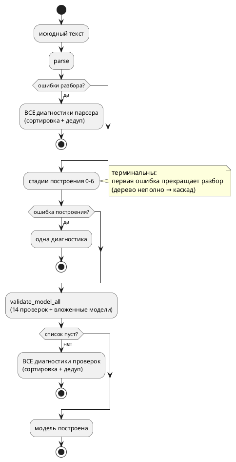

# ADR 0130: Накопление диагностик — несколько ошибок за прогон

- **Status:** Accepted
- **Date:** 2026-07-27
- **Authors:** Системный аналитик, архитектор, лид разработки
- **Related issues:** [Фича 0130](../features/0130-diagnostics-batch.md);
  опирается на [ADR 0053](0053-diagnostics-file-id.md) (реестр файлов, новый вход
  рядом со старым), [ADR 0048](0048-deterministic-codegen.md) (детерминированный
  порядок — свойство контейнера, а не строки на выдаче)

## Context

`taktc` сообщает **одну** ошибку за прогон: первая же прекращает работу.
Пользователь повторяет цикл «правка → компиляция» столько раз, сколько в файле
ошибок.

### Замеры (зонды 2026-07-27)

**F1. Парсер уже накапливает — и это теряется на стыке.** Файл с тремя
синтаксическими ошибками даёт `parse` → `Err(Vec<Diagnostic>)` из **трёх**
записей, каждая с точной позицией и без каскадного шума:

```
SY-002 нераспознанный токен ';' @ Source(0, 27, 28)
SY-002 нераспознанный токен ';' @ Source(0, 61, 62)
SY-002 нераспознанный токен '}' @ Source(0, 84, 85)
```

А `lib.rs::parse_and_construct` берёт из них первую:
`ds.into_iter().next().unwrap()`. То есть две трети готового результата
выбрасываются **уже после** того, как работа сделана.

**F2. CLI и редактор расходятся.** `lsp/diagnostics.rs` синтаксические ошибки
**перечисляет все** (цикл по `errors`), а семантическую отдаёт одну. Значит на
одном и том же файле редактор подчёркивает три ошибки, а `taktc` печатает одну —
при том что оба зовут один и тот же `parse`.

**F3. Семантика терминальна по построению.** `construct_model_with_files` — это
восемь шагов подряд, каждый через `?`:

```rust
let model = construct_model_stage0(…)?;   // … stage1 … stage6
validate_model(model.clone())?;
```

`validate_model` внутри — **14 независимых проверок**, тоже через `?`, плюс
рекурсия по вложенным моделям.

**F4. Часть семантических диагностик не имеет позиции.** `SE-003`
(«Идентификатор не найден в области видимости») строится через
`Diagnostic::from(&str)`, у которого `loc: Default::default()` = `Source(0,0,0)`
→ пользователь видит `файл:1:1`. Проба:

```
sem4.takt:1:1: Ошибка компиляции [SE-003]: Идентификатор 'unknown_one' не найден
```

При этом позиция **под рукой**: узел АСД `Expression::Variable(id)` несёт
`id.loc`, а конструктор с позицией существует — `Diagnostic::error(loc, msg)`.
Таких мест в семантике 16 (`Diagnostic::from`).

**F5. Порядок выдачи не текстовый.** Словари `ModelNode` — `BTreeMap` (фича
0048), поэтому состояния обходятся по алфавиту: в файле, где ошибка есть и в
`S`, и в `Done`, сообщается про `Done` — он раньше по алфавиту, хотя ниже по
тексту.

### Почему F4 меняет постановку задачи

Пять ошибок, каждая с координатой `1:1`, — не пятикратная польза, а пять
одинаково бесполезных строк: пользователь не знает, куда смотреть, и вынужден
искать вручную. Пока диагностика одна, отсутствие позиции терпимо (ошибка в
файле одна, найдётся); стоит выдать пачку — и позиция становится обязательной.
То есть простановка позиций не «смежное улучшение», а **предпосылка** ценности
этой фичи.

## Decision Drivers

1. **Цикл правок дорог.** Каждая скрытая ошибка — лишний прогон компилятора.
2. **Готовое не выбрасывать.** Парсер уже нашёл все ошибки; терять их на стыке —
   худший вид потери: работа сделана, результат выкинут.
3. **Ложная ошибка хуже молчания.** Продолжать разбор по неполному дереву — путь
   к каскаду сообщений о следствиях, а не о причинах. Пользователь тратит время
   на ошибки, которых нет.
4. **Совместимость.** `construct_model` зовётся **183 раза** (тесты, симулятор,
   LSP, генераторы). Менять его сигнатуру — значит править всё; прецедент 0053
   показал, как этого избежать (новый вход рядом со старым).
5. **Детерминизм.** Порядок диагностик обязан быть воспроизводимым, иначе диффы
   вывода и тесты поплывут (урок 0048).

## Considered Options

### Option A. Полное накопление во всех стадиях с восстановлением

Каждая стадия построения (0–6) вместо `?` копит ошибки и продолжает, помечая
неудавшиеся узлы как неразрешённые.

**Pros:**
- Максимум ошибок за прогон.

**Cons:**
- Дерево после ошибки **неполно**, и последующие стадии видят дыры: вывод типов
  над неразрешённым выражением даст ошибку о следствии. Драйвер 3 нарушается
  напрямую.
- Правка в самом дорогом месте ядра (`tree.rs` — 1842 строки, в реестре
  размеров), с риском задеть семь проходов сразу.
- Ценность неочевидна: типичная ошибка в теле блока (`SE-003`) сегодня и так
  находится — вопрос лишь в том, что вместе с ней не показываются другие.

### Option B. Накапливать там, где это безопасно: стык парсера и `validate`

1. **Не терять диагностики парсера**: `parse_and_construct` отдаёт весь `Vec`,
   а не первую запись.
2. **`validate_model` собирает все** свои проверки: они идут по **готовому**
   дереву и независимы друг от друга.
3. Стадии построения 0–6 остаются терминальными.
4. Выдача сортируется по `(файл, смещение)` и дедуплицируется.
5. Позиции проставляются там, где их нет (F4).

**Pros:**
- Каждая ошибка в выдаче — про **причину**, а не про следствие: дерево, по
  которому идёт `validate`, построено целиком.
- Пункт 1 бесплатен по риску и немедленно устраняет расхождение CLI ↔ редактор
  (F2).
- Правка локальна: `lib.rs`, `validate/mod.rs`, новый вход рядом со старым.
- Детерминизм достигается сортировкой на выдаче поверх и без того
  детерминированного обхода (0048).

**Cons:**
- Две ошибки **в телах блоков** по-прежнему покажутся по одной: стадии
  построения не накапливают.
- Появляется второй публичный вход (`…_all`), то есть два способа сделать одно.

### Option C. Option B + восстановление на границе элемента модели

Дополнительно: стадия разрешения тел ловит ошибку каждого элемента (состояния,
функции, блока) отдельно, помечает его неразрешённым и продолжает с соседним.

**Pros:**
- Покрывает самый частый случай — несколько ошибок в разных телах.

**Cons:**
- Требует ответа на вопрос «что такое частично построенная модель» для **всех**
  потребителей: генераторы, симулятор, верификация получают дерево с дырами.
  Сегодня инвариант простой — модель либо построена, либо ошибка; ломать его
  ради диагностики рискованно.
- Ошибка в теле часто делает бессмысленным вывод типов ниже по тексту —
  вероятность каскада выше, чем в Option B.

### Option D. Оставить ядро, накапливать в CLI

**Pros:**
- Ядро не трогается.

**Cons:**
- Технически невозможно: `construct_model` отдаёт **одну** ошибку, CLI нечего
  накапливать. Собирать ошибки повторными прогонами (правь-и-повтори за
  пользователя) — это уже не диагностика, а угадывание.

## Decision

Принимается **Option B**.

1. **Диагностики парсера доходят до пользователя целиком.** `parse_and_construct`
   перестаёт брать первую; CLI печатает все. Это устраняет и расхождение с
   редактором (F2).
2. **`validate_model` накапливает.** Новый вход `validate_model_all(model) ->
   Vec<Diagnostic>` собирает результаты всех 14 проверок и рекурсии по вложенным
   моделям; прежний `validate_model` сохраняется и выражается через новый (первая
   диагностика), чтобы 183 существующих вызова не правились (приём 0053).
3. **Стадии построения 0–6 остаются терминальными** — сознательно (драйвер 3).
   Первая ошибка построения прекращает разбор, и в выдачу попадает она одна.
   Это ограничение **называется** в документации, а не умалчивается.
4. **Выдача упорядочена и дедуплицирована**: сортировка по `(file_no, start)`,
   удаление точных повторов `(позиция, код, сообщение)`. Порядок — текстовый, а
   не алфавитный по имени состояния (F5).
5. **Позиции проставляются** там, где сегодня их нет и где узел АСД её несёт
   (F4). Без этого пачка ошибок указывает в `1:1` и пользы не даёт.



### Декомпозиция (правило 2)

| Подзадача | Содержание |
|---|---|
| `0130-01` | диагностики парсера доходят целиком; общий слой сортировки и дедупликации; CLI печатает все |
| `0130-02` | `validate_model_all` — накопление 14 проверок и рекурсии; LSP и CLI потребляют |
| `0130-03` | позиции у семантических диагностик, которые теперь видны пачкой |

## Consequences

### Положительные

- Синтаксические ошибки перестают теряться: пользователь видит столько, сколько
  нашёл парсер (замер F1 — три из трёх вместо одной из трёх).
- CLI и редактор отвечают одинаково — расхождение F2 закрыто.
- Ошибки проверок (`validate`) выдаются пачкой, и каждая — про причину: дерево
  на этом шаге построено целиком.
- Порядок выдачи — текстовый и воспроизводимый.

### Отрицательные / Action items

- **Ошибки стадий построения по-прежнему по одной.** Это осознанная граница
  (драйвер 3); снятие — отдельная фича (Option C), и она обязана сперва
  ответить, что такое частично построенная модель для генераторов и симулятора.
- Появляется второй вход валидации; чтобы «два способа» не разъехались, старый
  обязан быть **выражен через новый**, а не написан заново.
- Тесты, ожидающие ровно одну диагностику, могут потребовать правки: там, где
  проверялось «ошибка такая-то», теперь список. Правка ожидаемая и механическая.

### Acceptance criteria

1. Файл с тремя синтаксическими ошибками даёт `taktc` **три** сообщения (замер
   F1), каждое со своей позицией; редактор даёт те же три.
2. Файл с несколькими ошибками уровня `validate` даёт все эти ошибки за один
   прогон.
3. Порядок сообщений — по возрастанию позиции в тексте; повторы отсутствуют.
4. Диагностики, ставшие видимыми пачкой, несут **реальную** позицию (не `1:1`).
5. `construct_model` и прочие существующие входы сохраняют сигнатуры; 183 вызова
   не правятся.
6. Код возврата `taktc` при ошибках прежний (≠ 0); при отсутствии ошибок вывод
   генераторов на корпусе `examples/` байт-в-байт неизменен.
7. `./scripts/precheck.sh` зелёный.
