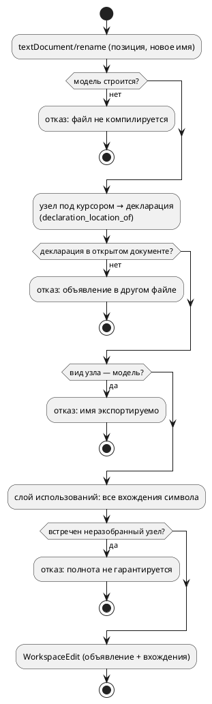

# ADR 0131: LSP — `definition`, `references` и `rename`

- **Status:** Accepted
- **Date:** 2026-07-27
- **Authors:** Системный аналитик, архитектор, лид разработки
- **Related issues:** [Фича 0131](../features/0131-lsp-definition-references-rename.md);
  опирается на [ADR 0056](0056-lsp-goto-exact-file.md) (индекс адресует пару
  `(file_no, offset)`), [ADR 0072](0072-lsp-initialization-options.md)
  (`searchPaths`), [ADR 0125](0125-intellij-takt-lsp-tooling.md) (rename в плагине
  IntelliJ сделан **вне** сервера)

## Context

Языковой сервер `takt-lsp` объявляет `completion`, `hover`, `declaration`,
`documentSymbol`, `semanticTokens`, `formatting`. Трёх ходовых возможностей нет:

- **`textDocument/definition`.** В редакторах, где «Go to Definition» (F12) идёт
  через `definitionProvider` (VS Code — основной случай), переход **не работает
  вовсе**: реализован только `declaration`, который F12 не обслуживает. Для
  языка без раздельных объявления и определения (в Takt объявление переменной,
  состояния, функции — оно же определение) это чистая потеря.
- **`textDocument/references`.** «Найти все использования» недоступно.
- **`textDocument/rename`.** Переименование недоступно; плагин IntelliJ
  (фича 0125) делает его **сам**, собственным PSI — та же работа написана дважды.

### Что уже есть

`SemanticIndex` (фича 0056) собирает записи `(start, end, SemanticNodeRef)` из
семантического дерева и умеет находить **наиболее конкретный** узел по паре
`(file_no, offset)`. Вид узла (`SemanticNodeKind`) различает **объявление**
(`Variable`, `State`, `Model`, …) и **использование** (`Reference`,
`ReferenceCondition`, `ReferenceModel`, `ReferenceState`). Функция
`goto::declaration_location_of` уже переводит любое использование в позицию его
объявления — это готовая воронка «использование → декларация».

### Что индекс НЕ содержит (замер, зонд 2026-07-27)

Ключевой факт, определяющий цену фичи. Зонд строил индекс по модели с
использованиями переменной в теле функции, в блоках `enter`/`always` и в условии
ребра, а затем перебирал **все** смещения текста. Из 17 записей индекса в телах
блоков и функций не оказалось **ни одной**:

| Место использования `speed` | В индексе |
|---|---|
| условие ребра `ref Done: speed > 10;` | **да** (`ReferenceCondition`) |
| правая часть `cond Fast = speed > 3;` | **да** (`ReferenceCondition`) |
| `enter { speed := bump(speed); }` | **нет** |
| `always { speed := speed + 1; }` | **нет** |
| тело `fn bump(x) { return x + speed; }` | **нет** |

Причина конструктивная, а не пропуск сбора: обход тел в индексе **есть**
(`collect_named_block_entries` → `collect_statement_entries`), но он добавляет
записи только для **неразрешённых** узлов (`StatementNode::Unresolved`,
`ExpressionNode::Unresolved`). В успешно построенной модели тела **разрешены**, а
разрешённые узлы позиции не несут: `ExpressionNode::Variable` — это
`Rc<RefCell<VariableNode>>` без `Location`, и место, где имя было написано,
теряется при понижении. То есть у сервера сегодня **нет** позиций большинства
использований, а «найти все использования» и «переименовать» — ровно о них.

Условия рёбер уцелели по другой причине: они хранятся как
`Condition::Unresolved(ast::Condition)` — инвариант проекта (ref-рёбра не
разрешаются), поэтому АСД с позициями там жив.

### Почему это важнее, чем кажется

`references` с неполным покрытием — неудобство. `rename` с неполным покрытием —
**порча программы**: переименуются объявление и условия рёбер, а тела блоков
останутся со старым именем, и файл перестанет компилироваться (в лучшем случае)
либо начнёт ссылаться на другую переменную (в худшем — если старое имя в области
видимости тоже существует). Поэтому архитектура обязана дать не «сколько
получится», а **полноту либо честный отказ**.

## Decision Drivers

1. **F12 обязан работать.** Самая дешёвая часть фичи закрывает самую частую боль.
2. **Полнота или отказ.** Частичное переименование недопустимо: молча испорченный
   исходник хуже отсутствующей возможности. Отказ должен приходить **до** правки
   (`prepareRename`), а не после.
3. **Одна воронка «использование → декларация».** `definition`, `references` и
   `rename` обязаны отвечать согласованно. Разъехавшись, они дадут переход в одно
   место, а переименование — в другом (прецеденты проекта: `is_state_of` ↔
   `state_of_model`, `function_needs` ↔ печатник).
4. **Не ломать ядро семантики.** Позиции использований нужны LSP; кодогенерации,
   симулятору и верификации они не нужны. Правка, добавляющая поле во все узлы
   выражений, задевает `PartialEq` (прецедент 0056: равенство обязано позицию
   игнорировать) и потому дорога и рискованна.
5. **Область видимости, а не текст.** Одноимённые символы разных моделей —
   норма (зонд: `speed` объявлена и в `Helper`, и в `Main`). Совпадение имён не
   означает совпадение символов.

## Considered Options

### Option A. Только `definition` (алиас `declaration`)

**Pros:**
- Несколько строк; F12 чинится немедленно.
- Нулевой риск: воронка та же, что у `declaration`.

**Cons:**
- Две трети фичи не сделаны; `references`/`rename` остаются за бортом, дубль
  работы в плагине IntelliJ сохраняется.

### Option B. Позиции использований — отдельным слоем поверх АСД

`definition` — алиас `declaration`. Для `references`/`rename` заводится **слой
использований**: обход **сырого АСД** (тот же `ast`, из которого строится модель)
собирает позиции всех вхождений идентификаторов, а принадлежность символу
решается **семантикой** — по модели-владельцу и той же функции
`declaration_location_of`, что обслуживает переход. АСД позиции не теряет: их
теряет понижение, а АСД остаётся нетронутым.

**Pros:**
- Позиции полны: тела блоков, тела функций, условия — всё, что написал автор.
- Ядро семантики не трогается вовсе; `PartialEq`, кодоген, симулятор не задеты.
- Сопоставление идёт через **уже существующую** воронку декларации — согласие
  трёх методов по построению (драйвер 3).
- Слой пригоден и для будущего (подсветка вхождений `documentHighlight`,
  иерархия вызовов).

**Cons:**
- Требуется второй обход АСД (по образцу `semantic::unused`, `validate::*`) —
  новый модуль, который придётся поддерживать при добавлении узлов языка.
- Область видимости внутри тел (локальные переменные блока, параметры функции)
  разрешается обходом самостоятельно — это логика, а не перенос строк.

### Option C. Позиции использований — в семантических узлах (по образцу 0056)

Добавить `Location` в `ExpressionNode::Variable`/`Call`, `ConditionNode::Variable`
и прочие ссылочные узлы, как 0056 сделала для `Extend::Model`.

**Pros:**
- Индекс получает использования «даром»: сбор уже написан, включится сам.
- Один источник позиций и для семантики, и для LSP.

**Cons:**
- Правка ядра в десятках мест построения; каждое забытое место — тихая дыра в
  покрытии, то есть ровно тот класс дефекта, что чинила 0056.
- `PartialEq` узлов обязан позицию игнорировать — иначе два вхождения одной
  переменной станут разными узлами и **поедет кодоген** (0056 уже наступала на
  это с `ModelNode::PartialEq`). Ручные реализации равенства для узлов выражений
  — большая и опасная работа.
- Цена платится всеми потребителями ядра ради одного (LSP).

### Option D. Текстовый поиск идентификатора

**Pros:**
- Тривиально; работает и там, где модель не строится.

**Cons:**
- Не различает области видимости: `speed` из `Helper` и `speed` из `Main`
  неразличимы, переименование испортит обе.
- Ловит комментарии и строковые литералы.
- Прямо противоречит драйверу 2: полнота мнимая, ошибки молчаливые.

### Область `rename`: сопутствующая развилка

Отдельно от способа получить позиции стоит вопрос **границ** переименования.
Единица компиляции — открытый документ плюс импортируемые им файлы; импортёры
открытого документа серверу **не видны** (рабочая область не индексируется).
Видимость в языке направлена вниз: файл видит то, что импортировал, и не видит
тех, кто импортировал его. Отсюда:

- символ, объявленный **в открытом документе**, используется только в нём же —
  переименование замкнуто и безопасно;
- символ, объявленный **в импортированном файле**, может использоваться в других,
  сервером не прочитанных файлах — полнота недостижима;
- имя **модели верхнего уровня** экспортируемо (`import { Helper as H }`,
  `start Main = Helper;` в чужом файле) — то же ограничение.

## Decision

Принимается **Option B** с ограничением области `rename`.

1. **`definition` — алиас `declaration`.** Обе возможности отвечает одна функция
   `goto_declaration_at`; `definitionProvider` объявляется в `ServerCapabilities`.
   Для Takt объявление и определение — одно и то же, поэтому разделять нечего.
2. **`references` — поверх нового слоя использований.** Слой обходит сырой АСД,
   собирая позиции вхождений; символ вхождения определяется семантикой (модель-
   владелец + `declaration_location_of`). Совпадение символа — по **позиции
   объявления** (`Location::Source(file_no, start, end)`), а не по имени: это
   единственный признак, устойчивый к одноимённым символам разных моделей.
   Ответ включает объявление (клиент управляет этим через
   `context.includeDeclaration`).
3. **`rename` — только для символа, объявленного в открытом документе.** Иначе
   `prepareRename` отвечает отказом с сообщением («объявление в файле `X`;
   переименование затронуло бы файлы вне рабочего набора»). Отказ приходит **до**
   правки. Дополнительно отказ даётся для имён **моделей** (экспортируемы) и для
   новых имён, не проходящих правило идентификатора языка либо совпадающих с
   ключевым словом.
4. **Полнота — обязанность, а не свойство.** `rename` строит `WorkspaceEdit`
   ровно из того множества, что вернул бы `references`; если слой использований
   встретил узел, который он **не умеет** разобрать (новый узел языка), он обязан
   сообщить об этом отказом всей операции, а не молча пропустить вхождение.
   Механика — по образцу форматтера (`format_source` отказывает на непокрытом
   узле, а не теряет кусок исходника).

### Декомпозиция (правило 2)

| Подзадача | Содержание |
|---|---|
| `0131-01` | `definition` как алиас `declaration` (capability + обработчик + тесты) |
| `0131-02` | слой использований над АСД + `references` |
| `0131-03` | `rename` и `prepareRename` поверх слоя использований |

Подзадачи идут строго по возрастанию цены: каждая ценна сама по себе, и
остановка после любой оставляет сервер в согласованном состоянии.

## Consequences

### Положительные

- F12 начинает работать в VS Code и прочих клиентах на `definitionProvider`.
- «Найти использования» покрывает **тела блоков и функций** — то, чего индекс не
  видел вовсе.
- Три метода отвечают согласованно: у них одна воронка декларации.
- Плагину IntelliJ появляется, на что перейти, — дубль rename можно снять
  отдельной фичей (кандидат).
- Ядро семантики не тронуто: кодоген, симулятор и верификация побитово прежние.

### Отрицательные / Action items

- Появляется **второй** обход АСД, который обязан знать все узлы языка. Правило
  «добавляешь узел АСД — добавь его в обход использований» пополняет список
  сопровождения (сегодня в нём форматтер и `eval`). Механическая защита —
  исчерпывающий `match` без `_ =>` в слое использований (по образцу `eval`,
  фича 0093), чтобы новый узел валил сборку, а не покрытие.
- `rename` сознательно ограничен открытым документом: переименовать символ
  библиотеки из файла-потребителя нельзя. Снятие ограничения требует индексации
  рабочей области — отдельная фича (кандидат).
- Тесты LSP живут под `#[cfg(feature = "lsp")]` и обычной `cargo build` не
  видны — ловит только `precheck.sh`.

### Acceptance criteria

1. `definitionProvider`, `referencesProvider`, `renameProvider` (с
   `prepareProvider`) объявлены в `ServerCapabilities`; сервер отвечает на
   `textDocument/definition`, `references`, `prepareRename`, `rename`.
2. `definition` и `declaration` на одной позиции дают **одинаковый** результат
   (тест-сторож: расхождение = отказ сборки).
3. `references` для переменной, используемой в условии ребра, в `enter`, в
   `always` и в теле функции, возвращает **все** эти вхождения; одноимённая
   переменная другой модели в ответ **не** попадает (тест на разделение
   областей видимости).
4. `rename` переименовывает объявление и все вхождения; результат применённых
   правок **компилируется** и даёт вывод цели `c`, совпадающий с выводом
   исходного текста с точностью до переименованного идентификатора (сторож
   полноты).
5. `prepareRename` отказывает: (а) на символе, объявленном в импортированном
   файле; (б) на имени модели; (в) при новом имени, не являющемся идентификатором
   или совпадающем с ключевым словом.
6. Вывод генераторов на корпусе `examples/` байт-в-байт неизменен (фича не
   трогает ядро).
7. `./scripts/precheck.sh` зелёный.
