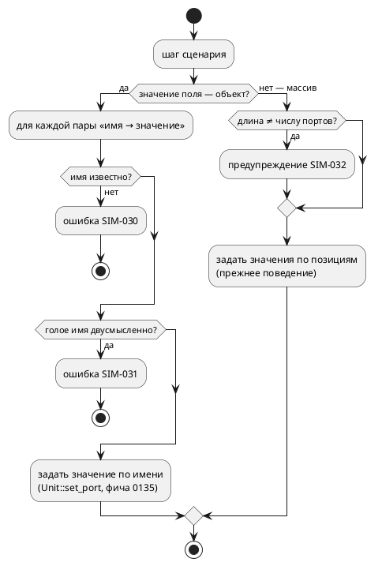

# ADR 0132: Именованные порты в сценариях симулятора

- **Status:** Accepted
- **Date:** 2026-07-27
- **Authors:** Системный аналитик, архитектор, лид разработки
- **Related issues:** [Фича 0132](../features/0132-sim-named-port-scenarios.md);
  опирается на [ADR 0135](0135-sim-qualified-port-names.md) (квалифицированное
  имя `Модель::порт`), [ADR 0079](0079-sim-composition-ports.md) (порты
  под-моделей перечисляются рекурсивно)

## Context

Шаг сценария симуляции задаётся **позиционным массивом** значений портов:

```json
{ "in_ports": [0, 0, 0, 1, 0, 0, 3, 7, 5, 0, 1],
  "guard": { "out": [1, null, null, null, null, null] } }
```

Что означает `3` на седьмом месте, из файла узнать нельзя. У
`examples/simulations/elevator_mini_floor2.json` таких чисел **сорок**, и
единственное содержательное значение — единица на 25-й позиции.

### Замер: позиция определяется алфавитом имён, а не порядком объявления

`PortNames::from_model` сортирует имена (`v.sort(); v.dedup()`). То есть индекс в
массиве — это место имени в **алфавитном** списке всех портов модели и её
под-моделей.

### Замер: добавление порта тихо меняет смысл сценария (проба 2026-07-27)

В `examples/elevator_mini.takt` добавлен один входной порт `AAA_probe` — имя,
попадающее в начало алфавита. Сценарий `elevator_mini_floor2.json` не менялся.

| | до | после |
|---|---|---|
| единица массива пришлась на | `FloorSensor_F2_Bottom` | `FloorSensor_F1_Top` |
| смысл шага | «датчик этажа 2 активен» | «верхний датчик этажа 1 активен» |
| результат | сценарий проходит | `Guard шага 1: vars[current_floor]: ожидалось 2, получено 1` |

Сдвинулся **весь** массив, и шаг стал описывать другое физическое событие.
Заметить это удалось лишь потому, что у шага был `guard`; без него прогон
завершился бы «успешно», проверяя не то, что написано в комментарии `_step`.

Переименование порта даёт тот же эффект — оно меняет место имени в алфавите.

### Замер: рассогласование длины не диагностируется

`apply_step_inputs` берёт имя через `self.port_names.in_ports.get(i)`: лишний
элемент массива молча отбрасывается, недостающий — просто не задаётся. Ни
предупреждения, ни ошибки. То же в `check_guard` для `out`/`inout`.

### Что уже сделано по-другому

`guard.vars` адресуется **по имени** (`HashMap<String, Value>`) и уже принимает
квалифицированную форму `Модель::порт` (фича 0135). То есть в одном и том же
файле половина шага пишется именами, половина — позициями.

## Decision Drivers

1. **Сценарий — спецификация, а не дамп.** Его пишет и читает человек: «нажата
   кнопка 3-го этажа» должно быть видно в тексте, а не вычисляться подсчётом
   запятых.
2. **Тихое изменение смысла недопустимо.** Правка модели, не трогающая сценарий,
   не должна менять то, что сценарий проверяет (замер выше).
3. **Совместимость.** Позиционная форма используется всем корпусом
   `examples/simulations/` и гейтом `run_simulations.sh`; ломать её нельзя
   (правило 11).
4. **Однозначность имени.** Одноимённые порты разных под-моделей существуют;
   имя в сценарии обязано указывать ровно на одно значение — иначе именование
   унаследует ту же неоднозначность, что и плоское чтение до 0135.
5. **Согласованность с уже сделанным.** `guard.vars` именует значения; новая
   форма обязана именовать так же, а не по-своему.

## Considered Options

### Option A. Объектная форма рядом с позиционной

`in_ports`, `inout`, `guard.out`, `guard.inout` принимают **либо** массив (как
сейчас), **либо** объект `{"FloorSensor_F2_Bottom": 1}`.

**Pros:**
- Аддитивно: корпус и гейт не трогаются, старые файлы работают дословно.
- Именованный шаг устойчив к добавлению и переименованию портов: неизвестное имя
  становится **ошибкой**, а не тихим сдвигом.
- Совпадает с уже существующей формой `guard.vars` — файл перестаёт быть
  наполовину именованным, наполовину позиционным.
- В объекте перечисляются **только значимые** порты: сорок нулей исчезают.

**Cons:**
- Две формы одного и того же — их придётся описывать и поддерживать.
- Не чинит позиционную форму саму по себе: пока она есть, ею можно
  воспользоваться и получить прежний сдвиг.

### Option B. Заменить позиционную форму объектной

**Pros:**
- Одна форма, нечего путать.

**Cons:**
- Ломает весь корпус сценариев и гейт `run_simulations.sh` — прямое нарушение
  правила 11 без необходимости.
- Полезность фичи не требует разрушения: та же цель достигается Option A.

### Option C. Позиционная форма плюс заголовок с именами

В начале файла перечисляются имена, дальше — массивы значений (как CSV с
шапкой).

**Pros:**
- Компактно для длинных однородных сценариев.

**Cons:**
- Читателю всё равно приходится считать столбцы, просто теперь по шапке.
- Заголовок сам становится источником рассогласования: он может разойтись с
  моделью, и это ещё одно место, где ошибка молчит.

### Option D. Оставить как есть, добавить только проверку длины

**Pros:**
- Дёшево; ловит часть случаев (недостающий/лишний элемент).

**Cons:**
- Не ловит главное — **сдвиг при неизменной длине** (замер: добавили порт,
  длина массива стала на единицу меньше нужной… и да, длина изменилась бы, но
  переименование порта сдвигает массив **без** изменения длины).
- Читаемость не улучшается вовсе.

## Decision

Принимается **Option A** с диагностиками.

1. **Объектная форма** принимается везде, где сегодня массив значений портов:
   `in_ports`, `inout`, `guard.out`, `guard.inout`. Ключ — имя порта, значение —
   то же, что в массиве. Позиционная форма сохраняется без изменений.
2. **Имя разрешается так же, как в `guard.vars`** — голое либо квалифицированное
   `Модель::порт` (фича 0135). Один механизм на весь файл.
3. **Неизвестное имя — ошибка**, а не тихий пропуск: `SIM-030`. Это и есть
   главная ценность формы — правка модели, забывшая сценарий, становится
   видимой.
4. **Двусмысленное голое имя — ошибка** `SIM-031`: если имя объявлено
   несколькими моделями (`PortNames::ambiguous`), сценарий обязан
   квалифицировать. Молча взять первую ветвь значило бы вернуть ту самую
   неоднозначность, которую закрыла 0135.
5. **Рассогласование длины позиционного массива — предупреждение** `SIM-032`
   (не ошибка: корпус может опираться на нынешнее поведение, а ломать гейт
   фича не должна). Предупреждение печатается один раз на шаг.
6. **Смешение форм в одном поле невозможно** по построению (значение — либо
   массив, либо объект); смешение **между** полями допустимо: `in_ports` может
   быть объектом, а `guard.out` — массивом.



### Декомпозиция (правило 2)

| Подзадача | Содержание |
|---|---|
| `0132-01` | объектная форма в `in_ports`/`inout` + диагностики `SIM-030`/`SIM-031` |
| `0132-02` | объектная форма в `guard.out`/`guard.inout`; предупреждение `SIM-032` |
| `0132-03` | перевод корпуса `examples/simulations/` на именованную форму + раздел `book/` |

## Consequences

### Положительные

- Сценарий читается как спецификация: `{"FloorSensor_F2_Bottom": 1}` вместо
  сорока чисел.
- Правка модели больше не меняет смысл сценария молча: несуществующее имя —
  ошибка с кодом.
- Файл перестаёт быть наполовину именованным: `guard.vars` и порты адресуются
  одинаково.
- Корпус переводится на новую форму (задача 0132-03) — то есть форма
  проверяется реальными сценариями, а не только тестами.

### Отрицательные / Action items

- **Две формы сосуществуют.** Позиционная остаётся допустимой, и ею можно
  получить прежний сдвиг. Признавать её устаревшей — отдельное решение
  заказчика; сегодня она нужна корпусу и гейту.
- Предупреждение `SIM-032` может «зашуметь» на существующих сценариях, если те
  опираются на неполные массивы. Проверяется прогоном `run_simulations.sh`; если
  шум есть — это находка, а не повод отключить проверку.
- Документирование (правило 24): раздел `book/` о симуляции обязан описать обе
  формы и назвать риск позиционной.

### Acceptance criteria

1. `in_ports`/`inout`, заданные объектом, задают значения именованных портов;
   позиционная форма работает дословно как прежде.
2. `guard.out`/`guard.inout` принимают объект; проверка идёт по именам.
3. Неизвестное имя порта → `SIM-030` с указанием имени; прогон завершается
   ошибкой.
4. Голое имя, объявленное несколькими моделями, → `SIM-031`; квалифицированное
   `Модель::порт` работает.
5. Позиционный массив неверной длины → предупреждение `SIM-032` (прогон
   продолжается).
6. Корпус `examples/simulations/` переведён на именованную форму, и
   `./scripts/run_simulations.sh` проходит с прежними результатами.
7. `./scripts/precheck.sh` зелёный.
