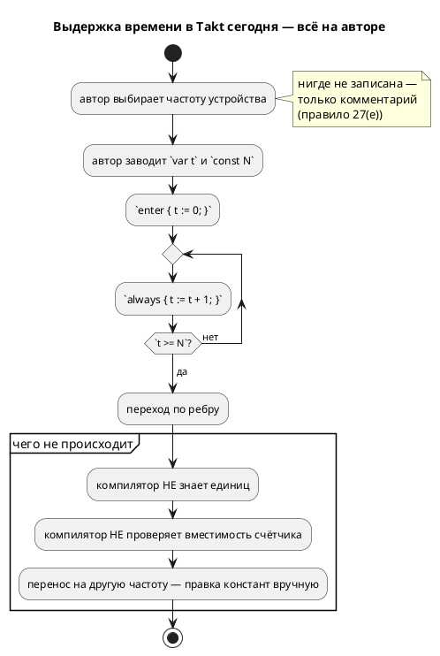
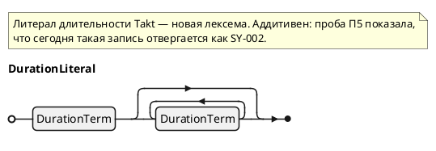

# ADR 0134: Модель времени в языке: литерал длительности, внешний источник времени и частота такта

- **Status:** Accepted
- **Date:** 2026-07-27
- **Authors:** Архитектор + Системный аналитик + Дизайнер языка
- **Related issues:** [Фича 0134](../features/0134-language-time-model.md); опирается на
  [ADR 0127](0127-int-overflow-semantics.md) (обёртка беззнакового определена),
  [ADR 0096](0096-fixed-point-native-float.md) (прецедент осознанного исключения из
  принципа «CLI не меняет логику»), [ADR 0061](0061-fixed-point-type.md) (прецедент
  «непредставимый литерал — ошибка, а не округление»)

## Context

Своих средств выражения времени у Takt нет: физическая длительность моделируется
ручным счётчиком тактов, а частота живёт в комментарии — этого прямо **требует**
правило 27(е) свода. Сравнительный анализ ([`docs/DIFF.md`](../DIFF.md), разделы
10.4 и 11.6) показывает, что так устроены лишь **четыре языка из 26** (Takt, SMC,
StateSmith, Ragel), и называет это разрывом № 1 из 15.

Довод «Takt порождает синтезируемый RTL, значит времени быть не может» отчёт
опровергает: SpinalHDL порождает такой же RTL и принимает `Timeout(3 ms)`, VHDL и
SystemVerilog вводят частоту параметром (`generic CLK_HZ`), у Clash период такта
входит в тип домена.

### Поток «как есть»

### Что проверено пробами при подготовке этого ADR

Решение опирается не на память, а на пробы (инструменты — `iec2c` MatIEC,
`yosys` 0.67, `verilator` 5.050, `taktc` из рабочего дерева):

| № | Проба | Результат |
|---|---|---|
| **П1** | `FUNCTION_BLOCK` с экземпляром `TON`, `PT := T#3s`, чтение `.Q` → `iec2c` | **Принято** (`rc = 0`). Штатный таймер IEC цели `st` доступен. |
| **П2** | Откуда `TON` берёт время | Из глобали `extern TIME __CURRENT_TIME;` (`iec_std_lib.h:55`), то есть **источник внешний и подменяемый**. В харнессе сверки `conformance_st_tests.rs` эта глобаль **уже объявлена** (`TIME __CURRENT_TIME;`) и просто стоит в нуле. |
| **П3** | Прогон `TON` под **инжектированным** временем (1 с на такт) | Детерминирован: дверь открылась на такте 1 (t = 1 с), закрылась на такте 4 (t = 4 с) — ровно `START + 3s`. **Потактовая сверка цели `st` с таймером сохранима.** |
| **П4** | `#3ms` внутри `always_ff` → `yosys synth` и `verilator --lint-only -Wall` | **Оба гейта принимают молча**: yosys синтезирует модуль (2 ячейки), проигнорировав задержку; verilator не говорит ни слова. Физическое время в RTL — ловушка ровно того класса, который проект ловит сверками. |
| **П5** | `var x := 3s;` сегодняшним `taktc` | `SY-002` «нераспознанный токен `'s'`». Литерал длительности **аддитивен**: он занимает синтаксис, который сегодня отвергается. |

П3 важнее прочего: отчёт `DIFF.md` (11.6.2) утверждал, что `TON` в цели `st`
**уничтожает** потактовую эквивалентность целей. Проба показывает, что это верно
лишь для часов реального мира; при инжектированном источнике времени трасса
воспроизводима, и конфликт снимается не выбором «`TON` или сверка», а **общим
правилом: источник времени — внешний и подменяемый, как и такт**.

П4 — зеркальный вывод для цели `sv`: физического времени в RTL быть не должно
**потому, что оба гейта его не ловят**.

## Decision Drivers

1. **Тактирование внешнее — язык не завязывается на значение частоты** (решение
   заказчика). Модель тактируется снаружи; при потактовой отладке частоты может не
   быть вовсе. Значит частота — **не** обязательная часть модели времени, а
   параметр одного из профилей.
2. **Механизм включается только при использовании** (решение заказчика; правило 11).
   Модель без времени обязана давать **байт-в-байт** прежний вывод во всех целях.
3. **Пересчёт — в одном слое** (T1 отчёта). Прецеденты: `enum_facts`, `bit_vector`,
   `lower_float`. Разъехавшись, цели дадут разные длительности — класс дефекта,
   который проект ловит сверками.
4. **Непредставимое — ошибка компиляции, а не округление** (T2; решение
   заказчика). Прецедент — `SE-058` для fixed-point.
5. **Потактовая сверка целей — главный гейт качества проекта** (уроки 0045/0050) и
   обязана пережить введение времени.
6. **Источник времени переопределяется в целевом коде** (решение заказчика): по
   умолчанию — библиотечная функция, но пользователь вправе подставить свою.
7. **Обёртка беззнакового определена** ([ADR 0127](0127-int-overflow-semantics.md)),
   поэтому «истекло ли» через **разность** счётчиков корректно при переполнении.
   Это и была настоящая причина зависимости 0134 → 0127.

## Considered Options

### Option A. Оставить как есть (M1 отчёта)

**Pros:**
- Ноль работы и ноль риска.

**Cons:**
- Разрыв № 1 остаётся открытым; непереносимость между частотами.
- Ничего не проверяется; правило 27(е) продолжает требовать комментария вместо
  языковой конструкции.

### Option B. Компилятор пересчитывает длительность в такты (M2, рекомендация отчёта)

Литерал `3s` + частота (`--tick-hz`, `clock 1kHz;`) → константа тактов.

**Pros:**
- Минимальное изменение семантики; работает на всех целях без рантайма.
- Проверки на компиляции; прямые прецеденты (SpinalHDL, VHDL/SV, Chisel, Clash).

**Cons:**
- **Противоречит драйверу 1**: частота становится обязательной, а при потактовой
  отладке её нет.
- На ПЛК точность плывёт вместе с временем цикла, хотя среда исполнения знает
  настоящее время и штатный `TON` (П1) его даёт.

### Option H. Гибрид: внешний источник времени + профиль тактов там, где источника нет — **выбрано**

Время получается **функцией** («сколько прошло от запуска модели»), как такт —
снаружи. Там, где источника времени нет (голое железо, RTL), тот же литерал
пересчитывается в такты по **явно** заданной частоте.

**Pros:**
- Удовлетворяет всем семи драйверам.
- На ПЛК даёт штатный `TON` (П1) **без** потери сверки (П3).
- В цели `sv` не соблазняет физическим временем (П4).
- Частота нужна только там, где она действительно есть.

**Cons:**
- Два профиля вместо одного — различие обязано быть видно в диагностике,
  документации и трассе; сверка ведётся **внутри** профиля.

### Option D. Таймер как объект языка (M3)

**Pros:**
- Отменяемые тайм-ауты, несколько таймеров в состоянии, прямая трансляция в `TON`.

**Cons:**
- Новая сущность с жизненным циклом и ресурсом на экземпляр.
- Отчёт рекомендует её **после** ядра — здесь она преждевременна.

### Option E. Часы и инварианты локаций (M5, UPPAAL)

**Pros:**
- Доказательство временных свойств — уникальное сочетание с синтезом.

**Cons:**
- Объём уровня «второй верификатор» (зоновая абстракция, DBM).
- Для синтеза всё равно нужна база Option H. Браться раньше — доказывать свойства
  языка, на котором ещё нельзя записать выдержку.

## Decision

Принимается **Option H** в объёме **B + B′ + C** (литерал длительности, частота как
свойство модели, декларативные `after`/`every`) — решение заказчика от 2026-07-27.
Ниже — нормативные правила; они обязательны для стадии анализа и разработки.

### Правило 1. Механизм включается по факту использования

Модель, не содержащая ни литерала длительности, ни `after`/`every`, порождает
**байт-в-байт прежний** код во всех семи целях: не появляется ни полей, ни
колбэков, ни параметров, ни констант, ни служебных входов. Проверяется гейтом
неизменности корпуса `examples/`.

### Правило 2. Источник времени — внешний и подменяемый

Время приходит в модель извне — как и такт. Каждая цель получает его своим
штатным способом:

| Цель | Источник времени (профиль «часы») | Переопределение пользователем |
|---|---|---|
| `c` | указатель `uint64_t (*now_ms)(void *userdata)` в структуре модели — рядом с `read_*`/`write_*` | подставить свой колбэк (штатный механизм цели) |
| `c-hal` | то же + **дефолтная реализация** библиотечными часами (`clock_gettime(CLOCK_MONOTONIC)`) | заменить реализацию или колбэк |
| `rust` | метод трейта `Hal::now_ms(&mut self) -> u64` | реализовать трейт по-своему (в `no_std` библиотечных часов нет — тела по умолчанию не будет) |
| `st` / `st-at` | штатный `TON` поверх `__CURRENT_TIME` среды исполнения (П1, П2) | свойство среды ПЛК |
| `sv` / `sv-mmio` | служебный вход `time_ms` — как `clk`/`rst_n`/`en` | подать свой счётчик |
| симулятор | виртуальные часы (детерминированные, правило 9) | сценарий/флаг |

**Физическое время в RTL запрещено:** `#delay`/`$time` не эмитируются никогда —
проба П4 показала, что **оба** гейта цели `sv` пропускают их молча.

### Правило 3. Два профиля времени; профиль выбирает наличие частоты

- **Профиль «часы»** (умолчание) — длительность сравнивается с показаниями
  источника времени; частота **не нужна**, и модель остаётся годной для потактовой
  отладки (драйвер 1). Квант — **1 мс** (ограничение реализации источника).
- **Профиль «такты»** — включается **объявлением частоты**: `clock 1kHz;` в модели
  (B′) либо флагом `--tick-hz=N` (флаг переопределяет объявление, как `--float-as-q`
  переопределяет представление `float`). Длительность пересчитывается в число
  тактов; источник времени не нужен. Квант — период такта.

Иных способов выбора профиля нет: **частота задана → такты; не задана → часы**.

### Правило 4. Литерал длительности

Слитная запись «число + единица», составные формы допускаются:

Единица примыкает к числу **без пробела** (форма `3 s` отвергнута: `s`, `m`, `h` —
законные имена переменных, и отдельный токен потребовал бы контекстных ключевых
слов). Дробный литерал (`1.5s`) и экспонента (`1e3ms`) — **лексическая ошибка**:
дробная длительность выражается меньшей единицей.

Каноническое внутреннее представление — **целое число наносекунд** (`i64`, запас
±292 года). Единицы `ns`/`us` разрешены лексически всегда; представима ли такая
длительность — решает профиль (правило 6).

### Правило 5. `duration` — отдельный тип, а не число

Тип длительности не смешивается с числовыми: `duration ± duration`,
`duration × целое` и сравнения `duration` с `duration` разрешены; `t + 1` при
`t: duration` — ошибка. Так единица не теряется по дороге (тот же принцип, что у
`q(m, n)`: формат — часть типа). Объявления — `const DWELL := 3s;`,
`var left: duration := 0s;`.

### Правило 6. Непредставимая длительность — ошибка компиляции

Округления нет нигде (драйвер 4). Новые диагностики:

- **`SE-063`** — длительность непредставима в выбранном профиле: мельче кванта
  (`500us` в профиле «часы») либо не кратна периоду такта (`500ms` при 3 Гц =
  1.5 такта);
- **`SE-064`** — длительность не помещается в счётчик выбранной разрядности;
- **`SE-065`** — смешение `duration` с числом в выражении.

Коды целевых слоёв (`sv`/`st`/`rust`) назначаются на стадии анализа; свободны
`SV-015+`, `ST-015+`, `RS-023+`, `SIM-033+`.

### Правило 7. Пересчёт — в одном слое

«Длительность → миллисекунды» и «длительность → такты» вычисляет **общий
семантический слой** (`semantic::duration`), одинаково для всех целей и для
симулятора. Ни один генератор своей арифметики времени не заводит (драйвер 3;
прецеденты `enum_facts`, `bit_vector`, `lower_float`).

### Правило 8. Разрядность счётчика выбирает компилятор; сравнение — через разность

Счётчик времени объявляет компилятор, выбирая разрядность по максимуму заявленных
длительностей (T7 отчёта); «истекло ли» вычисляется как `now - t0 >= D` в
**беззнаковой** арифметике, обёртка которой нормирована
[ADR 0127](0127-int-overflow-semantics.md). Так переполнение счётчика не ломает
выдержки короче полупериода счётчика; выдержки длиннее отсекает `SE-064`.

### Правило 9. Сверка — внутри профиля, по инжектированному времени

Симулятор ведёт **модельное** время (мс) и остаётся детерминированным: время
задаётся сценарием (поле шага) либо флагом «мс на такт». Драйверы сверок подают
целям **то же самое** время: `c`/`rust` — через колбэк, `st` — записью в
`__CURRENT_TIME` (П2: глобаль уже объявлена в харнессе), `sv` — входом `time_ms`.
Потактовая эквивалентность целей сохраняется (П3) — это **отличие принятого
решения от прогноза отчёта**, считавшего `TON` несовместимым со сверкой.

### Правило 10. Точность ограничена тактом, и это документируется

Выдержка срабатывает на **первом такте, на котором интервал истёк**: «не раньше
заданного, точность — один такт». Формулировка попадает в раздел `book/` и в блок
«Частые ошибки» (правило 26 свода).

### Правило 11. Фактически заложенное — печатается

`taktc` печатает сводку по каждой длительности: `DWELL = 3s → 3000 мс (профиль
«часы»)` либо `DWELL = 3s → 3000 тактов (профиль «такты», 1 кГц)`. Глушится
`--quiet`; дублируется комментарием в порождённом коде (T3 отчёта).

### Правило 12. `after` / `every` — сахар над правилами 2–8

`ref Leaving: after 3s;` и `every 100ms { … }` разворачиваются в тот же механизм и
своей семантики времени не вводят. Скрытое состояние (счётчик или метка времени)
**обязано** быть видимо в трассе симулятора — иначе отладка модели становится
гаданием.

### Правило 13. Флаг частоты — второе осознанное исключение из принципа «CLI не меняет логику»

`--tick-hz` меняет численный результат так же, как `--float-as-q` (действие A-7
[фичи 0096](../features/0096-fixed-point-native-float.md)), и должен быть **явно
назван** исключением в документации, а не протащен молча. Исключение уже, чем у
0096: в профиле «часы» флага нет вовсе. Принцип «CLI не меняет автомат» остаётся в
силе для `--define` (0042).

## Consequences

### Положительные

- Закрывается разрыв № 1 из 15 отчёта `DIFF.md`; Takt перестаёт быть одним из
  четырёх языков поля без средств выражения времени.
- Длительность переносится между устройствами: смена частоты — правка одного
  объявления, а не ревизия констант по всей модели.
- Цель `st` получает **штатный** `TON` (решение заказчика (б)) — и, вопреки
  прогнозу отчёта, **без** потери потактовой сверки (П3).
- Цель `sv` конструктивно защищена от `#delay`/`$time`, которые оба её гейта
  пропускают молча (П4).
- Правило 27(е) свода («такт — не единица физической величины») перестаёт быть
  обходным путём: язык получает средство, которого правилу не хватало.

### Отрицательные / Action items

- **A-1. Два профиля — двойная поверхность проверки.** Каждая сверка и каждый
  пример существуют в профиле; тест-план обязан покрыть оба и завести **сторож
  различия** профилей (по образцу `float_native_and_q_modes_differ` фичи 0096).
- **A-2. Разбор новых флагов — в библиотеку, не в `bin/taktc.rs`.** Файл пришпилен
  реестром размеров (1926 строк, расти не имеет права) — прецедент 0043.
- **A-3. Новый узел АСД валит сборку в трёх местах — по замыслу:** печать
  форматтера (`format/`), обход использований (`semantic/usages/walk.rs`,
  `deny(wildcard_enum_match_arm)`) и вычислитель симулятора (`eval/`). Все три
  обязаны быть закрыты в рамках фичи.
- **A-4. Правило 27(е) свода пересматривается** — его текст описывает обходной
  путь, который фича снимает.
- **A-5. Документирование (правило 24) — большой объём:** новый языковой раздел
  `book/` (литерал, профили, `after`/`every`, точность, «Частые ошибки») плюс
  записи в приложение «Ошибки и предупреждения» для `SE-063…065`.
- **A-6. Версия языка растёт** (правило 22) — конструкция и тип новые.
- **A-7. Дефолтный источник времени `c-hal` тянет `<time.h>`** — на голом железе
  его нет; там штатный путь — профиль «такты» либо свой колбэк. Это должно быть
  сказано в документации, а не обнаружено пользователем на линковке.
- **A-8. Кандидат-преемник:** таймер-объект (Option D) — отменяемые тайм-ауты и
  несколько таймеров в состоянии; заводится отдельной фичей после закрытия 0134.
- **A-9. Порт типа `duration` в этой фиче запрещён** (физического порта времени не
  бывает); понадобится — отдельной фичей.

### Acceptance criteria

1. Модель без конструкций времени даёт **байт-в-байт** прежний вывод во всех семи
   целях (гейт неизменности корпуса `examples/`).
2. `3s`, `500ms`, `1m30s` разбираются; `1.5s`, `1e3ms`, `3 s` отвергаются с
   диагностикой, а не молча.
3. `500us` в профиле «часы» и `500ms` при 3 Гц в профиле «такты» дают **`SE-063`**;
   длительность сверх разрядности счётчика — **`SE-064`**; `t + 1` при
   `t: duration` — **`SE-065`**.
4. Пересчёт длительности живёт в одном модуле; ни один генератор не содержит своей
   арифметики времени (проверяется чтением кода при ревью).
5. Потактовая сверка с симулятором зелена для `c`, `rust`, `sv` **и `st`** при
   инжектированном источнике времени — в обоих профилях.
6. Порождённый `sv` не содержит `#`-задержек и `$time` (греп-сторож — по образцу
   `generated_c_fixed_has_no_right_shift` фичи 0061: значенческий тест такое не
   ловит).
7. `taktc` печатает фактически заложенную длительность; `--quiet` её глушит.
8. `after 3s` даёт ту же трассу, что развёрнутый вручную счётчик с той же
   длительностью (эквивалентность сахара — тест).
9. Скрытое состояние `after`/`every` видно в трассе симулятора.
10. Раздел `book/` написан, примеры проходят гейт компиляции и симуляции (фича
    0133), версия языка поднята, правило 27(е) свода пересмотрено.
